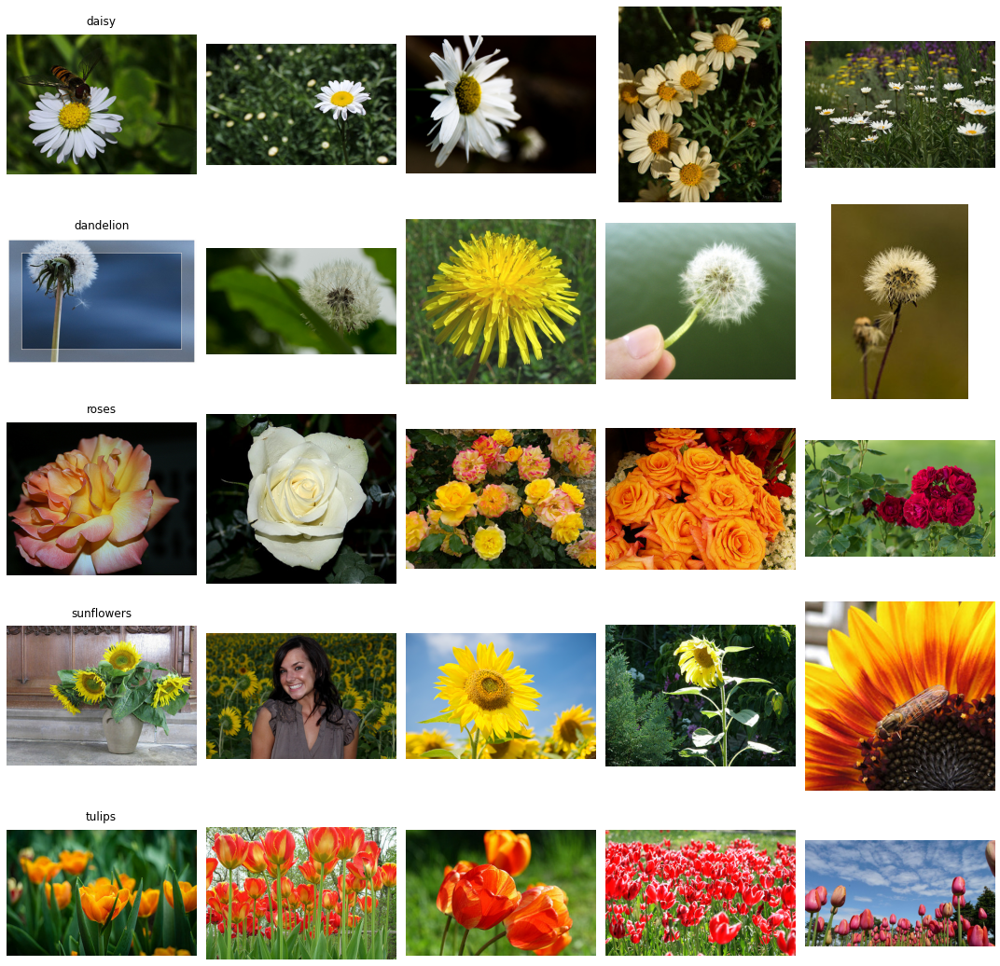
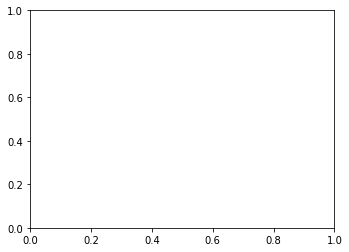
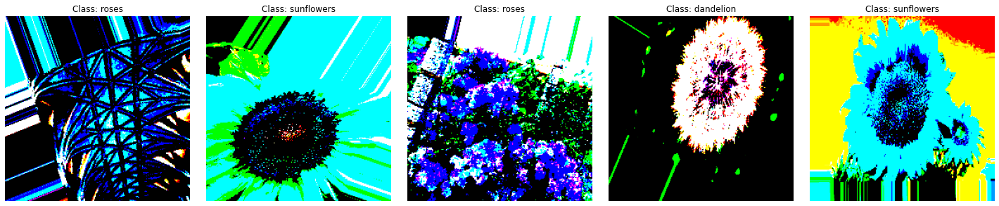
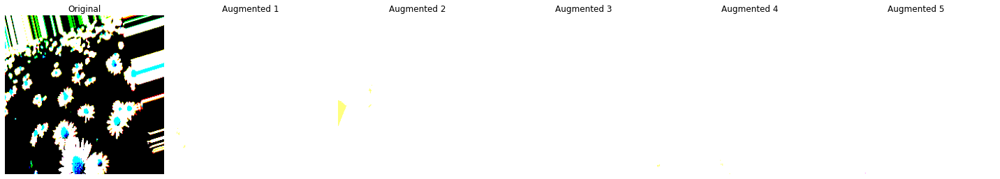
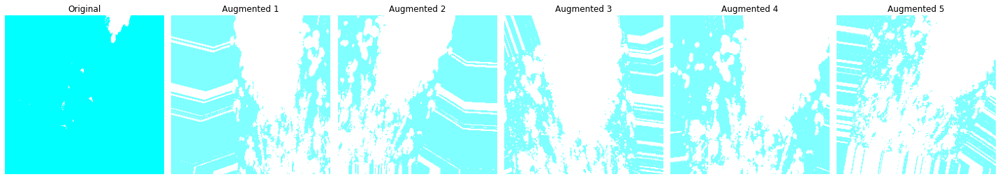
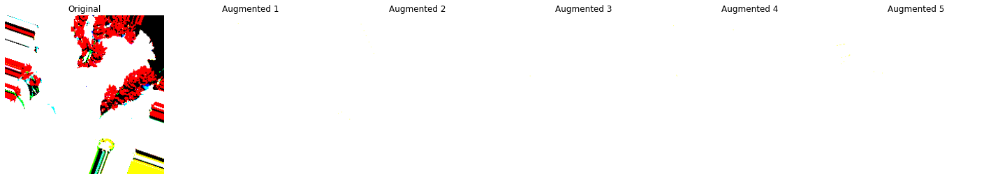
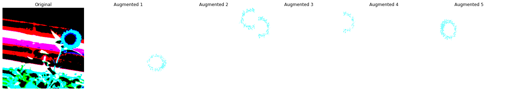
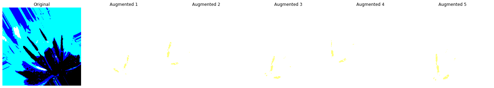
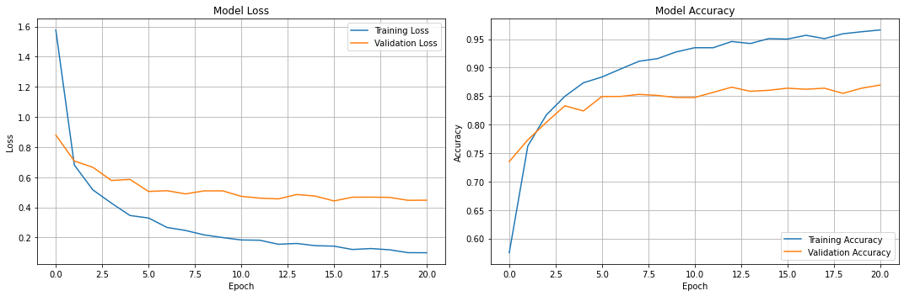

# 프로젝트명: 꽃향기

프로젝트 목차: 
1. Data Preparation
2. CV model setting
3. Traning & Result analysis (Case 1. 기본모델)
4. Traning & Result analysis (Case 2. Data 조정)
5. Traning & Result analysis (Case 3. 추출층 가중치 동결 해졔)
6. Traning & Result analysis (Case 4. 학습률 손실)
7. Traning & Result analysis (Case 5. 가중치 손실)
8. 결과 요약

# 1. Data Prepration


```python
import math
import matplotlib.pyplot as plt
import numpy as np
import os
import pathlib
import PIL
import PIL.Image
import shutil
from sklearn.metrics import classification_report, confusion_matrix
from sklearn.model_selection import train_test_split
import seaborn as sns

import tensorflow as tf
import tensorflow_addons as tfa
import tensorflow_datasets as tfds
from tensorflow.keras.applications import VGG16
from tensorflow.keras.applications.vgg16 import preprocess_input
from tensorflow.keras.callbacks import (
    ModelCheckpoint,     # 모델 저장
    EarlyStopping,      # 조기 종료
    ReduceLROnPlateau,  # 학습률 조정
    TensorBoard,        # 텐서보드 로깅
    CSVLogger,          # CSV 파일로 로그 저장
    LearningRateScheduler # 학습률 스케쥴로 사용
)
from tensorflow.keras.layers import Dense, GlobalAveragePooling2D
from tensorflow.keras.metrics import CategoricalAccuracy, TopKCategoricalAccuracy
from tensorflow.keras.models import Model
from tensorflow.keras.optimizers import Adam
from tensorflow.keras.preprocessing.image import ImageDataGenerator
from tensorflow.keras.preprocessing.image import load_img, img_to_array
from tensorflow.keras.regularizers import l2
```


```python
# aiffel 디렉토리 경로 설정
base_dir = '/aiffel/aiffel/'
dataset_url = "https://storage.googleapis.com/download.tensorflow.org/example_images/flower_photos.tgz"

# 데이터 다운로드 및 저장
data_dir = tf.keras.utils.get_file(origin=dataset_url,
                                  fname='flower_photos',
                                  cache_dir=base_dir,  # aiffel 디렉토리에 저장
                                  untar=True)
data_dir = pathlib.Path(data_dir)

# 저장된 경로 확인
print(f"데이터가 저장된 경로: {data_dir}")

# 디렉토리 구조 확인
print("\n폴더 구조:")
for item in data_dir.glob('*'):
    if item.is_dir():
        print(f"클래스: {item.name}")
        print(f"이미지 개수: {len(list(item.glob('*')))}개")

# 이미지 개수
image_count = len(list(data_dir.glob('*/*.jpg')))
print(f"총 이미지 개수: {image_count}")
```

    데이터가 저장된 경로: /aiffel/aiffel/datasets/flower_photos
    
    폴더 구조:
    클래스: dandelion
    이미지 개수: 898개
    클래스: sunflowers
    이미지 개수: 699개
    클래스: daisy
    이미지 개수: 633개
    클래스: tulips
    이미지 개수: 799개
    클래스: roses
    이미지 개수: 641개
    총 이미지 개수: 3670


```python
# 이미지 시각화

def display_sample_images(data_dir, n_samples=5):
    # 클래스 목록 가져오기 (정렬된 상태로)
    classes = sorted([item.name for item in data_dir.glob('*') if item.is_dir()])
    n_classes = len(classes)
    
    # figure 크기 설정
    plt.figure(figsize=(15, 3*n_classes))
    
    # 각 클래스별로 이미지 표시
    for idx, class_name in enumerate(classes):
        class_path = data_dir / class_name
        image_files = list(class_path.glob('*'))[:n_samples]
        
        for i, image_path in enumerate(image_files):
            # 이미지 로드
            img = plt.imread(image_path)
            
            # subplot 위치 계산 (1부터 시작하도록 보장)
            subplot_idx = idx * n_samples + i + 1
            
            # subplot이 유효한 범위 내에 있는지 확인
            if subplot_idx <= n_classes * n_samples:
                plt.subplot(n_classes, n_samples, subplot_idx)
                plt.imshow(img)
                plt.axis('off')
                
                # 첫 번째 열에만 클래스 이름 표시
                if i == 0:
                    plt.title(f'{class_name}', pad=10)
    
    plt.tight_layout()
    plt.show()

# 데이터셋 경로 확인 및 시각화
print(f"데이터 경로: {data_dir}")
display_sample_images(data_dir)

# 클래스별 이미지 개수 출력
for item in sorted(data_dir.glob('*')):
    if item.is_dir():
        print(f"{item.name}: {len(list(item.glob('*')))}개 이미지")
```

    데이터 경로: /aiffel/aiffel/datasets/flower_photos


    

    


    daisy: 633개 이미지
    dandelion: 898개 이미지
    roses: 641개 이미지
    sunflowers: 699개 이미지
    tulips: 799개 이미지


```python
# 데이터 세트 전처리
datagen = ImageDataGenerator(
    rescale=1./255,
    validation_split=0.2
)
```


```python
# 데이터 세트 만들기

def split_dataset(source_dir, train_dir, valid_dir, test_dir, train_size=0.7, valid_size=0.15, test_size=0.15, random_state=42):
    print(f"\n===== 데이터 분할 시작 =====")
    print(f"분할 비율: 훈련={train_size*100}%, 검증={valid_size*100}%, 테스트={test_size*100}%")
    
    # 비율 검사
    if round(train_size + valid_size + test_size, 5) != 1.0:
        raise ValueError("train_size, valid_size, test_size의 합이 1이 되어야 합니다.")
    
    # 대상 디렉토리 생성
    os.makedirs(train_dir, exist_ok=True)
    os.makedirs(valid_dir, exist_ok=True)
    os.makedirs(test_dir, exist_ok=True)
    
    dataset_stats = {'train': {}, 'valid': {}, 'test': {}}
    
    # 숨김 파일과 디렉토리 제외
    for class_name in os.listdir(source_dir):
        # .으로 시작하는 숨김 파일/폴더 무시
        if class_name.startswith('.'):
            continue
            
        class_dir = os.path.join(source_dir, class_name)
        if not os.path.isdir(class_dir):
            continue
            
        # 클래스별 디렉토리 생성
        os.makedirs(os.path.join(train_dir, class_name), exist_ok=True)
        os.makedirs(os.path.join(valid_dir, class_name), exist_ok=True)
        os.makedirs(os.path.join(test_dir, class_name), exist_ok=True)
        
        # 이미지 파일 목록 가져오기 (숨김 파일 제외)
        files = [f for f in os.listdir(class_dir) 
                if f.lower().endswith(('.jpg', '.jpeg', '.png', '.gif'))
                and not f.startswith('.')]  # 숨김 파일 제외
        
        # 먼저 테스트셋 분리
        train_valid_files, test_files = train_test_split(
            files,
            test_size=test_size,
            random_state=random_state
        )
        
        # 남은 데이터를 훈련셋과 검증셋으로 분할
        # valid_size를 남은 비율에 맞게 조정
        remaining_valid_ratio = valid_size / (train_size + valid_size)
        train_files, valid_files = train_test_split(
            train_valid_files,
            test_size=remaining_valid_ratio,
            random_state=random_state
        )
        
        # 파일 복사 함수
        def copy_files(file_list, target_dir):
            for f in file_list:
                src = os.path.join(source_dir, class_name, f)
                dst = os.path.join(target_dir, class_name, f)
                shutil.copy2(src, dst)
        
        # 파일 복사 실행
        copy_files(train_files, train_dir)
        copy_files(valid_files, valid_dir)
        copy_files(test_files, test_dir)
        
        # 통계 저장
        dataset_stats['train'][class_name] = len(train_files)
        dataset_stats['valid'][class_name] = len(valid_files)
        dataset_stats['test'][class_name] = len(test_files)
        
        print(f"\n클래스 {class_name}:")
        print(f"  - 전체 이미지: {len(files)}개")
        print(f"  - 훈련 이미지: {len(train_files)}개 ({len(train_files)/len(files)*100:.1f}%)")
        print(f"  - 검증 이미지: {len(valid_files)}개 ({len(valid_files)/len(files)*100:.1f}%)")
        print(f"  - 테스트 이미지: {len(test_files)}개 ({len(test_files)/len(files)*100:.1f}%)")
    
   
    # 전체 통계 출력
    print("\n===== 최종 데이터 분할 결과 =====")
    total_train = sum(dataset_stats['train'].values())
    total_valid = sum(dataset_stats['valid'].values())
    total_test = sum(dataset_stats['test'].values())
    total_images = total_train + total_valid + total_test
    
    print(f"전체 이미지 수: {total_images}개")
    print(f"훈련셋: {total_train}개 ({total_train/total_images*100:.1f}%)")
    print(f"검증셋: {total_valid}개 ({total_valid/total_images*100:.1f}%)")
    print(f"테스트셋: {total_test}개 ({total_test/total_images*100:.1f}%)")
    
    return dataset_stats

  
# 경로 설정
source_directory = '/aiffel/aiffel/datasets/flower_photos'
train_directory = '/aiffel/aiffel/datasets/flower_photos_split/train'
valid_directory = '/aiffel/aiffel/datasets/flower_photos_split/valid'
test_directory = '/aiffel/aiffel/datasets/flower_photos_split/test' 

# 데이터 분할 실행
stats = split_dataset(source_directory, train_directory, valid_directory, test_directory)

# 클래스 정보 출력
print("훈련 데이터 클래스:", train_generator.class_indices)
print("검증 데이터 클래스:", valid_generator.class_indices)
print("테스트 데이터 클래스:", test_generator.class_indices)

# 2. 모든 데이터셋에서 동일한 클래스가 있는지 확인
train_classes = set(train_generator.class_indices.keys())
valid_classes = set(valid_generator.class_indices.keys())
test_classes = set(test_generator.class_indices.keys())

print("\n공통 클래스:", train_classes.intersection(valid_classes, test_classes))
print("클래스 수:", len(train_classes.intersection(valid_classes, test_classes)))

```

    
    ===== 데이터 분할 시작 =====
    분할 비율: 훈련=70.0%, 검증=15.0%, 테스트=15.0%
    
    클래스 dandelion:
      - 전체 이미지: 898개
      - 훈련 이미지: 628개 (69.9%)
      - 검증 이미지: 135개 (15.0%)
      - 테스트 이미지: 135개 (15.0%)
    
    클래스 sunflowers:
      - 전체 이미지: 699개
      - 훈련 이미지: 489개 (70.0%)
      - 검증 이미지: 105개 (15.0%)
      - 테스트 이미지: 105개 (15.0%)
    
    클래스 daisy:
      - 전체 이미지: 633개
      - 훈련 이미지: 443개 (70.0%)
      - 검증 이미지: 95개 (15.0%)
      - 테스트 이미지: 95개 (15.0%)
    
    클래스 tulips:
      - 전체 이미지: 799개
      - 훈련 이미지: 559개 (70.0%)
      - 검증 이미지: 120개 (15.0%)
      - 테스트 이미지: 120개 (15.0%)
    
    클래스 roses:
      - 전체 이미지: 641개
      - 훈련 이미지: 448개 (69.9%)
      - 검증 이미지: 96개 (15.0%)
      - 테스트 이미지: 97개 (15.1%)
    
    ===== 최종 데이터 분할 결과 =====
    전체 이미지 수: 3670개
    훈련셋: 2567개 (69.9%)
    검증셋: 551개 (15.0%)
    테스트셋: 552개 (15.0%)
    훈련 데이터 클래스: {'.ipynb_checkpoints': 0, 'daisy': 1, 'dandelion': 2, 'roses': 3, 'sunflowers': 4, 'tulips': 5}
    검증 데이터 클래스: {'.ipynb_checkpoints': 0, 'daisy': 1, 'dandelion': 2, 'roses': 3, 'sunflowers': 4, 'tulips': 5}
    테스트 데이터 클래스: {'.ipynb_checkpoints': 0, 'daisy': 1, 'dandelion': 2, 'roses': 3, 'sunflowers': 4, 'tulips': 5}
    
    공통 클래스: {'sunflowers', 'daisy', 'dandelion', 'tulips', 'roses', '.ipynb_checkpoints'}
    클래스 수: 6


```python
# 데이터 제너레이터 설정

## 경로 정의
train_dir = '/aiffel/aiffel/datasets/flower_photos_split/train'
valid_dir = '/aiffel/aiffel/datasets/flower_photos_split/valid'
test_dir = '/aiffel/aiffel/datasets/flower_photos_split/test'

## .ipynb_checkpoints 폴더 제거
for dir_path in [train_dir, valid_dir, test_dir]:
    checkpoint_path = os.path.join(dir_path, '.ipynb_checkpoints')
    if os.path.exists(checkpoint_path):
        shutil.rmtree(checkpoint_path)

## 데이터 제너레이터 설정        
train_datagen = ImageDataGenerator(
    preprocessing_function=preprocess_input,
    rotation_range=20,
    width_shift_range=0.2,
    height_shift_range=0.2,
    horizontal_flip=True
)

valid_datagen = ImageDataGenerator(
    preprocessing_function=preprocess_input
)

test_datagen = ImageDataGenerator(
    preprocessing_function=preprocess_input
)

# 2. 데이터 로드 및 클래스 확인
train_generator = train_datagen.flow_from_directory(
    directory='/aiffel/aiffel/datasets/flower_photos_split/train',
    target_size=(224, 224),
    batch_size=32,
    class_mode='categorical',
    shuffle=True
)

valid_generator = valid_datagen.flow_from_directory(
    directory='/aiffel/aiffel/datasets/flower_photos_split/valid',
    target_size=(224, 224),
    batch_size=32,
    class_mode='categorical',
    shuffle=False
)

test_generator = test_datagen.flow_from_directory(
    directory='/aiffel/aiffel/datasets/flower_photos_split/test',
    target_size=(224, 224),
    batch_size=32,
    class_mode='categorical',
    shuffle=False
)

# 3. 클래스 수 확인
print("훈련 데이터 클래스:", train_generator.class_indices)
print("검증 데이터 클래스:", valid_generator.class_indices)
print("테스트 데이터 클래스:", test_generator.class_indices)

num_classes = len(train_generator.class_indices)
print("클래스 수:", num_classes)
```

    Found 2567 images belonging to 5 classes.
    Found 551 images belonging to 5 classes.
    Found 552 images belonging to 5 classes.
    훈련 데이터 클래스: {'daisy': 0, 'dandelion': 1, 'roses': 2, 'sunflowers': 3, 'tulips': 4}
    검증 데이터 클래스: {'daisy': 0, 'dandelion': 1, 'roses': 2, 'sunflowers': 3, 'tulips': 4}
    테스트 데이터 클래스: {'daisy': 0, 'dandelion': 1, 'roses': 2, 'sunflowers': 3, 'tulips': 4}
    클래스 수: 5


# 2. CV model setting


```python
# 모델 생성
def create_model(num_classes):
    base_model = VGG16(weights='imagenet', include_top=False, input_shape=(224, 224, 3))
    x = base_model.output
    x = GlobalAveragePooling2D()(x)
    x = Dense(512, activation='relu')(x)
    predictions = Dense(num_classes, activation='softmax')(x)
    
    model = Model(inputs=base_model.input, outputs=predictions)
    
    # 기본 모델 가중치 고정
    for layer in base_model.layers:
        layer.trainable = False
    
    return model

# 모델 생성 및 컴파일
model = create_model(num_classes)
model.compile(
    optimizer=Adam(learning_rate=0.0001),
    loss='categorical_crossentropy',
    metrics=['accuracy']
)

# 모델 구조 확인
model.summary()

# 체크포인트와 로그를 저장할 디렉토리 생성
checkpoint_path = "model_checkpoints"
log_path = "training_logs"
os.makedirs(checkpoint_path, exist_ok=True)
os.makedirs(log_path, exist_ok=True)

# 콜백 정의
callbacks = [
    # 모델 체크포인트 저장
    ModelCheckpoint(
        filepath=os.path.join(checkpoint_path, 'best_model.h5'),
        monitor='val_accuracy',    # 검증 정확도 모니터링
        save_best_only=True,      # 가장 좋은 성능의 모델만 저장
        mode='max',               # 정확도는 높을수록 좋음
        verbose=1
    ),
    
    # 조기 종료
    EarlyStopping(
        monitor='val_loss',       # 검증 손실 모니터링
        patience=5,               # 5번의 에포크 동안 개선이 없으면 중지
        restore_best_weights=True,# 가장 좋은 가중치로 복원
        verbose=1
    ),
    
    # 학습률 감소
    #ReduceLROnPlateau(
        #monitor='val_loss',       # 검증 손실 모니터링
        #factor=0.2,              # 학습률을 20%로 감소
        #patience=3,              # 3번의 에포크 동안 개선이 없으면 감소
        #min_lr=1e-6,            # 최소 학습률
        #verbose=1
    #),
    
    # 텐서보드 로깅
    TensorBoard(
        log_dir=os.path.join(log_path, 'tensorboard_logs'),
        histogram_freq=1,
        write_graph=True,
        update_freq='epoch'
    ),
    
    # CSV 로깅
    CSVLogger(
        os.path.join(log_path, 'training_logs.csv'),
        append=False             # 새로운 파일 생성
    )
]

# 텐서보드 실행 방법 출력
print("\n텐서보드 실행 방법:")
print("터미널에서 다음 명령어 실행:")
print(f"tensorboard --logdir={log_path}")

# 저장된 로그 파일 경로 출력
print("\n저장된 파일 위치:")
print(f"체크포인트: {checkpoint_path}")
print(f"로그 파일: {log_path}")
```

    Model: "model_11"
    _________________________________________________________________
    Layer (type)                 Output Shape              Param #   
    =================================================================
    input_14 (InputLayer)        [(None, 224, 224, 3)]     0         
    _________________________________________________________________
    block1_conv1 (Conv2D)        (None, 224, 224, 64)      1792      
    _________________________________________________________________
    block1_conv2 (Conv2D)        (None, 224, 224, 64)      36928     
    _________________________________________________________________
    block1_pool (MaxPooling2D)   (None, 112, 112, 64)      0         
    _________________________________________________________________
    block2_conv1 (Conv2D)        (None, 112, 112, 128)     73856     
    _________________________________________________________________
    block2_conv2 (Conv2D)        (None, 112, 112, 128)     147584    
    _________________________________________________________________
    block2_pool (MaxPooling2D)   (None, 56, 56, 128)       0         
    _________________________________________________________________
    block3_conv1 (Conv2D)        (None, 56, 56, 256)       295168    
    _________________________________________________________________
    block3_conv2 (Conv2D)        (None, 56, 56, 256)       590080    
    _________________________________________________________________
    block3_conv3 (Conv2D)        (None, 56, 56, 256)       590080    
    _________________________________________________________________
    block3_pool (MaxPooling2D)   (None, 28, 28, 256)       0         
    _________________________________________________________________
    block4_conv1 (Conv2D)        (None, 28, 28, 512)       1180160   
    _________________________________________________________________
    block4_conv2 (Conv2D)        (None, 28, 28, 512)       2359808   
    _________________________________________________________________
    block4_conv3 (Conv2D)        (None, 28, 28, 512)       2359808   
    _________________________________________________________________
    block4_pool (MaxPooling2D)   (None, 14, 14, 512)       0         
    _________________________________________________________________
    block5_conv1 (Conv2D)        (None, 14, 14, 512)       2359808   
    _________________________________________________________________
    block5_conv2 (Conv2D)        (None, 14, 14, 512)       2359808   
    _________________________________________________________________
    block5_conv3 (Conv2D)        (None, 14, 14, 512)       2359808   
    _________________________________________________________________
    block5_pool (MaxPooling2D)   (None, 7, 7, 512)         0         
    _________________________________________________________________
    global_average_pooling2d_11  (None, 512)               0         
    _________________________________________________________________
    dense_22 (Dense)             (None, 512)               262656    
    _________________________________________________________________
    dense_23 (Dense)             (None, 5)                 2565      
    =================================================================
    Total params: 14,979,909
    Trainable params: 265,221
    Non-trainable params: 14,714,688
    _________________________________________________________________
    
    텐서보드 실행 방법:
    터미널에서 다음 명령어 실행:
    tensorboard --logdir=training_logs
    
    저장된 파일 위치:
    체크포인트: model_checkpoints
    로그 파일: training_logs


# 3. Traning & Result analysis (Case 1. 기본모델)


```python
# 모델 학습
history_1_0 = model.fit(
    train_generator,
    validation_data=valid_generator,
    epochs=50,
    callbacks=callbacks,
    verbose=1
)
```

    Epoch 1/50
    81/81 [==============================] - 36s 432ms/step - loss: 1.5770 - accuracy: 0.5750 - val_loss: 0.8799 - val_accuracy: 0.7350
    
    Epoch 00001: val_accuracy improved from -inf to 0.73503, saving model to model_checkpoints/best_model.h5
    Epoch 2/50
    81/81 [==============================] - 35s 429ms/step - loss: 0.6804 - accuracy: 0.7624 - val_loss: 0.7074 - val_accuracy: 0.7731
    
    Epoch 00002: val_accuracy improved from 0.73503 to 0.77314, saving model to model_checkpoints/best_model.h5
    Epoch 3/50
    81/81 [==============================] - 35s 426ms/step - loss: 0.5158 - accuracy: 0.8169 - val_loss: 0.6656 - val_accuracy: 0.8040
    
    Epoch 00003: val_accuracy improved from 0.77314 to 0.80399, saving model to model_checkpoints/best_model.h5
    Epoch 4/50
    81/81 [==============================] - 35s 428ms/step - loss: 0.4279 - accuracy: 0.8496 - val_loss: 0.5784 - val_accuracy: 0.8330
    
    Epoch 00004: val_accuracy improved from 0.80399 to 0.83303, saving model to model_checkpoints/best_model.h5
    Epoch 5/50
    81/81 [==============================] - 35s 427ms/step - loss: 0.3458 - accuracy: 0.8734 - val_loss: 0.5855 - val_accuracy: 0.8240
    
    Epoch 00005: val_accuracy did not improve from 0.83303
    Epoch 6/50
    81/81 [==============================] - 34s 423ms/step - loss: 0.3294 - accuracy: 0.8835 - val_loss: 0.5054 - val_accuracy: 0.8494
    
    Epoch 00006: val_accuracy improved from 0.83303 to 0.84936, saving model to model_checkpoints/best_model.h5
    Epoch 7/50
    81/81 [==============================] - 35s 426ms/step - loss: 0.2666 - accuracy: 0.8975 - val_loss: 0.5105 - val_accuracy: 0.8494
    
    Epoch 00007: val_accuracy did not improve from 0.84936
    Epoch 8/50
    81/81 [==============================] - 35s 430ms/step - loss: 0.2465 - accuracy: 0.9112 - val_loss: 0.4893 - val_accuracy: 0.8530
    
    Epoch 00008: val_accuracy improved from 0.84936 to 0.85299, saving model to model_checkpoints/best_model.h5
    Epoch 9/50
    81/81 [==============================] - 35s 425ms/step - loss: 0.2172 - accuracy: 0.9159 - val_loss: 0.5093 - val_accuracy: 0.8512
    
    Epoch 00009: val_accuracy did not improve from 0.85299
    Epoch 10/50
    81/81 [==============================] - 35s 428ms/step - loss: 0.1994 - accuracy: 0.9275 - val_loss: 0.5094 - val_accuracy: 0.8475
    
    Epoch 00010: val_accuracy did not improve from 0.85299
    Epoch 11/50
    81/81 [==============================] - 35s 426ms/step - loss: 0.1837 - accuracy: 0.9349 - val_loss: 0.4732 - val_accuracy: 0.8475
    
    Epoch 00011: val_accuracy did not improve from 0.85299
    Epoch 12/50
    81/81 [==============================] - 34s 424ms/step - loss: 0.1818 - accuracy: 0.9349 - val_loss: 0.4613 - val_accuracy: 0.8566
    
    Epoch 00012: val_accuracy improved from 0.85299 to 0.85662, saving model to model_checkpoints/best_model.h5
    Epoch 13/50
    81/81 [==============================] - 35s 425ms/step - loss: 0.1551 - accuracy: 0.9459 - val_loss: 0.4561 - val_accuracy: 0.8657
    
    Epoch 00013: val_accuracy improved from 0.85662 to 0.86570, saving model to model_checkpoints/best_model.h5
    Epoch 14/50
    81/81 [==============================] - 34s 420ms/step - loss: 0.1604 - accuracy: 0.9423 - val_loss: 0.4851 - val_accuracy: 0.8584
    
    Epoch 00014: val_accuracy did not improve from 0.86570
    Epoch 15/50
    81/81 [==============================] - 35s 428ms/step - loss: 0.1456 - accuracy: 0.9509 - val_loss: 0.4748 - val_accuracy: 0.8603
    
    Epoch 00015: val_accuracy did not improve from 0.86570
    Epoch 16/50
    81/81 [==============================] - 35s 426ms/step - loss: 0.1425 - accuracy: 0.9501 - val_loss: 0.4426 - val_accuracy: 0.8639
    
    Epoch 00016: val_accuracy did not improve from 0.86570
    Epoch 17/50
    81/81 [==============================] - 35s 426ms/step - loss: 0.1204 - accuracy: 0.9568 - val_loss: 0.4673 - val_accuracy: 0.8621
    
    Epoch 00017: val_accuracy did not improve from 0.86570
    Epoch 18/50
    81/81 [==============================] - 35s 425ms/step - loss: 0.1266 - accuracy: 0.9509 - val_loss: 0.4677 - val_accuracy: 0.8639
    
    Epoch 00018: val_accuracy did not improve from 0.86570
    Epoch 19/50
    81/81 [==============================] - 35s 426ms/step - loss: 0.1184 - accuracy: 0.9595 - val_loss: 0.4662 - val_accuracy: 0.8548
    
    Epoch 00019: val_accuracy did not improve from 0.86570
    Epoch 20/50
    81/81 [==============================] - 35s 428ms/step - loss: 0.0993 - accuracy: 0.9630 - val_loss: 0.4466 - val_accuracy: 0.8639
    
    Epoch 00020: val_accuracy did not improve from 0.86570
    Epoch 21/50
    81/81 [==============================] - 34s 422ms/step - loss: 0.0988 - accuracy: 0.9661 - val_loss: 0.4475 - val_accuracy: 0.8693
    
    Epoch 00021: val_accuracy improved from 0.86570 to 0.86933, saving model to model_checkpoints/best_model.h5
    Restoring model weights from the end of the best epoch.
    Epoch 00021: early stopping


    ---------------------------------------------------------------------------

    NameError                                 Traceback (most recent call last)

    /tmp/ipykernel_31/2424462180.py in <module>
         14 
         15 plt.subplot(1, 2, 1)
    ---> 16 plt.plot(history.history['accuracy'], label='Training Accuracy')
         17 plt.plot(history.history['val_accuracy'], label='Validation Accuracy')
         18 plt.title('Model Accuracy')


    NameError: name 'history' is not defined


    

    


```python
# 모델 학습 결과 시각화 

def plot_training_history(history):
    # 손실과 정확도 그래프를 2x1 구조로 생성
    fig, (ax1, ax2) = plt.subplots(1, 2, figsize=(15, 5))
    
    # 손실 그래프
    ax1.plot(history_1_0.history['loss'], label='Training Loss')
    ax1.plot(history_1_0.history['val_loss'], label='Validation Loss')
    ax1.set_title('Model Loss')
    ax1.set_xlabel('Epoch')
    ax1.set_ylabel('Loss')
    ax1.legend(loc='upper right')
    ax1.grid(True)
    
    # 정확도 그래프
    ax2.plot(history_1_0.history['accuracy'], label='Training Accuracy')
    ax2.plot(history_1_0.history['val_accuracy'], label='Validation Accuracy')
    ax2.set_title('Model Accuracy')
    ax2.set_xlabel('Epoch')
    ax2.set_ylabel('Accuracy')
    ax2.legend(loc='lower right')
    ax2.grid(True)
    
    plt.tight_layout()
    plt.show()

plot_training_history(history_1_0)
print()
    # 최종 성능 출력
print("\n===== 최종 학습 결과 =====")
print(f"최종 훈련 손실: {history_1_0.history['loss'][-1]:.4f}")
print(f"최종 검증 손실: {history_1_0.history['val_loss'][-1]:.4f}")
print(f"최종 훈련 정확도: {history_1_0.history['accuracy'][-1]:.4f}")
print(f"최종 검증 정확도: {history_1_0.history['val_accuracy'][-1]:.4f}")

```


    

    


    
    
    ===== 최종 학습 결과 =====
    최종 훈련 손실: 0.0988
    최종 검증 손실: 0.4475
    최종 훈련 정확도: 0.9661
    최종 검증 정확도: 0.8693


```python
# 데이터 생성기 설정
test_datagen = ImageDataGenerator(
    preprocessing_function=preprocess_input
)

# 데이터 제너레이터 다시 생성
test_generator = test_datagen.flow_from_directory(
    directory='/aiffel/aiffel/datasets/flower_photos_split/test',
    target_size=(224, 224),
    batch_size=32,
    class_mode='categorical',
    shuffle=False
)

# 클래스 수 확인
print("테스트 데이터 클래스:", test_generator.class_indices)
print("테스트 데이터 클래스 수:", len(test_generator.class_indices))

# 모델 평가
print("\n===== 모델 평가 =====")
evaluation = model.evaluate(test_generator)
print(f'Test Loss: {evaluation[0]:.4f}')
print(f'Test Accuracy: {evaluation[1]:.4f}')

# 예측 및 분류 보고서 생성 (선택사항)
from sklearn.metrics import classification_report
import numpy as np

# 예측
predictions = model.predict(test_generator)
y_pred = np.argmax(predictions, axis=1)
y_true = test_generator.classes

# 클래스 레이블
class_labels = list(test_generator.class_indices.keys())

# 분류 보고서 출력
print("\n===== 분류 보고서 =====")
print(classification_report(y_true, y_pred, target_names=class_labels))
```

    Found 552 images belonging to 5 classes.
    테스트 데이터 클래스: {'daisy': 0, 'dandelion': 1, 'roses': 2, 'sunflowers': 3, 'tulips': 4}
    테스트 데이터 클래스 수: 5
    
    ===== 모델 평가 =====
    18/18 [==============================] - 3s 132ms/step - loss: 0.4032 - accuracy: 0.8714
    Test Loss: 0.4032
    Test Accuracy: 0.8714
    
    ===== 분류 보고서 =====
                  precision    recall  f1-score   support
    
           daisy       0.86      0.89      0.88        95
       dandelion       0.92      0.93      0.93       135
           roses       0.84      0.84      0.84        97
      sunflowers       0.90      0.85      0.87       105
          tulips       0.83      0.83      0.83       120
    
        accuracy                           0.87       552
       macro avg       0.87      0.87      0.87       552
    weighted avg       0.87      0.87      0.87       552
    


# 4. Traning & Result analysis (Case 2. Data 증강)


```python
# 1. 훈련 데이터용 ImageDataGenerator - 다양한 증강 기법 적용
train_datagen_aug = ImageDataGenerator(
    preprocessing_function=preprocess_input,
    rotation_range=30,              # 이미지 회전 (0-180도)
    width_shift_range=0.2,         # 좌우 이동
    height_shift_range=0.2,        # 상하 이동
    brightness_range=[0.8,1.2],    # 밝기 조절
    shear_range=0.2,              # 전단 변환
    zoom_range=0.2,               # 확대/축소
    horizontal_flip=True,         # 좌우 반전
    vertical_flip=False,          # 상하 반전 (꽃 이미지는 상하반전이 부적절할 수 있음)
    fill_mode='nearest'          # 빈 픽셀 채우기 방식
)

# 2. 검증 및 테스트 데이터용 ImageDataGenerator - 전처리만 적용
valid_datagen = ImageDataGenerator(
    preprocessing_function=preprocess_input
)

test_datagen = ImageDataGenerator(
    preprocessing_function=preprocess_input
)

# 3. 데이터 로드
train_generator_aug = train_datagen_aug.flow_from_directory(
    directory=train_dir,
    target_size=(224, 224),
    batch_size=32,
    class_mode='categorical',
    shuffle=True
)

valid_generator = valid_datagen.flow_from_directory(
    directory=valid_dir,
    target_size=(224, 224),
    batch_size=32,
    class_mode='categorical',
    shuffle=False
)

test_generator = test_datagen.flow_from_directory(
    directory=test_dir,
    target_size=(224, 224),
    batch_size=32,
    class_mode='categorical',
    shuffle=False
)

# 4. 증강된 이미지 시각화 함수
def visualize_augmented_images(generator, num_images=5):
    """증강된 이미지를 시각화하는 함수"""
    plt.figure(figsize=(20, 4))
    
    # 하나의 배치에서 이미지 가져오기
    x, y = next(generator)
    
    for i in range(num_images):
        plt.subplot(1, num_images, i+1)
        plt.imshow((x[i] + 1) / 2)  # [-1, 1] 범위를 [0, 1] 범위로 변환
        plt.axis('off')
        plt.title(f'Class: {list(train_generator.class_indices.keys())[np.argmax(y[i])]}')
    
    plt.tight_layout()
    plt.show()

# 5. 증강된 이미지 확인
print("===== 증강된 이미지 예시 =====")
visualize_augmented_images(train_generator)

# 6. 각 클래스별 증강된 이미지 확인
def visualize_augmentation_per_class(generator, num_augmentations=5):
    """각 클래스별로 증강된 이미지를 보여주는 함수"""
    class_names = list(generator.class_indices.keys())
    
    for class_name in class_names:
        print(f"\n=== Class: {class_name} ===")
        
        # 해당 클래스의 첫 번째 이미지 찾기
        for x, y in generator:
            class_indices = np.where(np.argmax(y, axis=1) == generator.class_indices[class_name])[0]
            if len(class_indices) > 0:
                img = x[class_indices[0]]
                break
        
        # 선택된 이미지에 대해 여러 번의 증강 적용
        plt.figure(figsize=(20, 4))
        plt.subplot(1, num_augmentations+1, 1)
        plt.imshow((img + 1) / 2)
        plt.title('Original')
        plt.axis('off')
        
        for i in range(num_augmentations):
            img_aug = train_datagen.random_transform(img)
            plt.subplot(1, num_augmentations+1, i+2)
            plt.imshow((img_aug + 1) / 2)
            plt.title(f'Augmented {i+1}')
            plt.axis('off')
        
        plt.tight_layout()
        plt.show()

# 7. 각 클래스별 증강 결과 확인
print("\n===== 클래스별 증강 결과 =====")
visualize_augmentation_per_class(train_generator)
```

    Found 2567 images belonging to 5 classes.
    Found 551 images belonging to 5 classes.
    Found 552 images belonging to 5 classes.
    ===== 증강된 이미지 예시 =====


    Clipping input data to the valid range for imshow with RGB data ([0..1] for floats or [0..255] for integers).
    Clipping input data to the valid range for imshow with RGB data ([0..1] for floats or [0..255] for integers).
    Clipping input data to the valid range for imshow with RGB data ([0..1] for floats or [0..255] for integers).
    Clipping input data to the valid range for imshow with RGB data ([0..1] for floats or [0..255] for integers).
    Clipping input data to the valid range for imshow with RGB data ([0..1] for floats or [0..255] for integers).


    

    


    
    ===== 클래스별 증강 결과 =====
    
    === Class: daisy ===


    Clipping input data to the valid range for imshow with RGB data ([0..1] for floats or [0..255] for integers).
    Clipping input data to the valid range for imshow with RGB data ([0..1] for floats or [0..255] for integers).
    Clipping input data to the valid range for imshow with RGB data ([0..1] for floats or [0..255] for integers).
    Clipping input data to the valid range for imshow with RGB data ([0..1] for floats or [0..255] for integers).
    Clipping input data to the valid range for imshow with RGB data ([0..1] for floats or [0..255] for integers).
    Clipping input data to the valid range for imshow with RGB data ([0..1] for floats or [0..255] for integers).


    

    


    
    === Class: dandelion ===


    Clipping input data to the valid range for imshow with RGB data ([0..1] for floats or [0..255] for integers).
    Clipping input data to the valid range for imshow with RGB data ([0..1] for floats or [0..255] for integers).
    Clipping input data to the valid range for imshow with RGB data ([0..1] for floats or [0..255] for integers).
    Clipping input data to the valid range for imshow with RGB data ([0..1] for floats or [0..255] for integers).
    Clipping input data to the valid range for imshow with RGB data ([0..1] for floats or [0..255] for integers).
    Clipping input data to the valid range for imshow with RGB data ([0..1] for floats or [0..255] for integers).


    

    


    
    === Class: roses ===


    Clipping input data to the valid range for imshow with RGB data ([0..1] for floats or [0..255] for integers).
    Clipping input data to the valid range for imshow with RGB data ([0..1] for floats or [0..255] for integers).
    Clipping input data to the valid range for imshow with RGB data ([0..1] for floats or [0..255] for integers).
    Clipping input data to the valid range for imshow with RGB data ([0..1] for floats or [0..255] for integers).
    Clipping input data to the valid range for imshow with RGB data ([0..1] for floats or [0..255] for integers).
    Clipping input data to the valid range for imshow with RGB data ([0..1] for floats or [0..255] for integers).


    

    


    
    === Class: sunflowers ===


    Clipping input data to the valid range for imshow with RGB data ([0..1] for floats or [0..255] for integers).
    Clipping input data to the valid range for imshow with RGB data ([0..1] for floats or [0..255] for integers).
    Clipping input data to the valid range for imshow with RGB data ([0..1] for floats or [0..255] for integers).
    Clipping input data to the valid range for imshow with RGB data ([0..1] for floats or [0..255] for integers).
    Clipping input data to the valid range for imshow with RGB data ([0..1] for floats or [0..255] for integers).
    Clipping input data to the valid range for imshow with RGB data ([0..1] for floats or [0..255] for integers).


    

    


    
    === Class: tulips ===


    Clipping input data to the valid range for imshow with RGB data ([0..1] for floats or [0..255] for integers).
    Clipping input data to the valid range for imshow with RGB data ([0..1] for floats or [0..255] for integers).
    Clipping input data to the valid range for imshow with RGB data ([0..1] for floats or [0..255] for integers).
    Clipping input data to the valid range for imshow with RGB data ([0..1] for floats or [0..255] for integers).
    Clipping input data to the valid range for imshow with RGB data ([0..1] for floats or [0..255] for integers).
    Clipping input data to the valid range for imshow with RGB data ([0..1] for floats or [0..255] for integers).


    

    


```python
# 모델 학습
history_2_0 = model.fit(
    train_generator_aug,
    validation_data=valid_generator,
    epochs=50,
    callbacks=callbacks,
    verbose=1
)

# 모델 학습 결과 시각화 
plot_training_history(history_2_0)
print()
    # 최종 성능 출력
print("\n===== 최종 학습 결과 =====")
print(f"최종 훈련 손실: {history_2_0.history['loss'][-1]:.4f}")
print(f"최종 검증 손실: {history_2_0.history['val_loss'][-1]:.4f}")
print(f"최종 훈련 정확도: {history_2_0.history['accuracy'][-1]:.4f}")
print(f"최종 검증 정확도: {history_2_0.history['val_accuracy'][-1]:.4f}")

```

    Epoch 1/50
    81/81 [==============================] - 41s 502ms/step - loss: 0.1684 - accuracy: 0.9373 - val_loss: 0.4589 - val_accuracy: 0.8621
    
    Epoch 00001: val_accuracy did not improve from 0.86933
    Epoch 2/50
    81/81 [==============================] - 40s 488ms/step - loss: 0.1592 - accuracy: 0.9494 - val_loss: 0.4304 - val_accuracy: 0.8693
    
    Epoch 00002: val_accuracy did not improve from 0.86933
    Epoch 3/50
    81/81 [==============================] - 40s 492ms/step - loss: 0.1505 - accuracy: 0.9462 - val_loss: 0.4639 - val_accuracy: 0.8603
    
    Epoch 00003: val_accuracy did not improve from 0.86933
    Epoch 4/50
    81/81 [==============================] - 40s 497ms/step - loss: 0.1418 - accuracy: 0.9474 - val_loss: 0.4511 - val_accuracy: 0.8693
    
    Epoch 00004: val_accuracy did not improve from 0.86933
    Epoch 5/50
    81/81 [==============================] - 40s 495ms/step - loss: 0.1206 - accuracy: 0.9599 - val_loss: 0.4546 - val_accuracy: 0.8730
    
    Epoch 00005: val_accuracy improved from 0.86933 to 0.87296, saving model to model_checkpoints/best_model.h5
    Epoch 6/50
    81/81 [==============================] - 40s 495ms/step - loss: 0.1360 - accuracy: 0.9517 - val_loss: 0.4488 - val_accuracy: 0.8693
    
    Epoch 00006: val_accuracy did not improve from 0.87296
    Epoch 7/50
    81/81 [==============================] - 40s 495ms/step - loss: 0.1226 - accuracy: 0.9591 - val_loss: 0.4735 - val_accuracy: 0.8711
    
    Epoch 00007: val_accuracy did not improve from 0.87296
    Restoring model weights from the end of the best epoch.
    Epoch 00007: early stopping


    

    


    
    
    ===== 최종 학습 결과 =====
    최종 훈련 손실: 0.1226
    최종 검증 손실: 0.4735
    최종 훈련 정확도: 0.9591
    최종 검증 정확도: 0.8711


```python
# 모델 평가
print("\n===== 모델 평가 =====")
evaluation = model.evaluate(test_generator)
print(f'Test Loss: {evaluation[0]:.4f}')
print(f'Test Accuracy: {evaluation[1]:.4f}')

# 예측 및 분류 보고서 생성 (선택사항)
from sklearn.metrics import classification_report
import numpy as np

# 예측
predictions = model.predict(test_generator)
y_pred = np.argmax(predictions, axis=1)
y_true = test_generator.classes

# 클래스 레이블
class_labels = list(test_generator.class_indices.keys())

# 분류 보고서 출력
print("\n===== 분류 보고서 =====")
print(classification_report(y_true, y_pred, target_names=class_labels))
```

    
    ===== 모델 평가 =====
    18/18 [==============================] - 2s 128ms/step - loss: 0.3835 - accuracy: 0.8841
    Test Loss: 0.3835
    Test Accuracy: 0.8841
    
    ===== 분류 보고서 =====
                  precision    recall  f1-score   support
    
           daisy       0.87      0.89      0.88        95
       dandelion       0.93      0.93      0.93       135
           roses       0.83      0.88      0.85        97
      sunflowers       0.93      0.86      0.89       105
          tulips       0.86      0.85      0.85       120
    
        accuracy                           0.88       552
       macro avg       0.88      0.88      0.88       552
    weighted avg       0.89      0.88      0.88       552
    


# 5. Traning & Result analysis (Case 3. 추출층 가중치 동결 해제)


```python
# 모델 생성
def create_model(num_classes):
    base_model = VGG16(weights='imagenet', include_top=False, input_shape=(224, 224, 3))
    x = base_model.output
    x = GlobalAveragePooling2D()(x)
    x = Dense(512, activation='relu')(x)
    predictions = Dense(num_classes, activation='softmax')(x)
    
    model = Model(inputs=base_model.input, outputs=predictions)
    
    for layer in base_model.layers[:10]:  # 처음 10개 층은 고정
        layer.trainable = False
    for layer in base_model.layers[10:]:  # 나머지 층은 학습 가능
        layer.trainable = True
    
    return model

# 모델 생성 및 컴파일
model_case3 = create_model(num_classes)
model_case3.compile(
    optimizer=Adam(learning_rate=0.0001),
    loss='categorical_crossentropy',
    metrics=['accuracy']
)

# 모델 구조 확인
model_case3.summary()


# 콜백 정의
callbacks = [
    # 모델 체크포인트 저장
    ModelCheckpoint(
        filepath=os.path.join(checkpoint_path, 'best_model.h5'),
        monitor='val_accuracy',    # 검증 정확도 모니터링
        save_best_only=True,      # 가장 좋은 성능의 모델만 저장
        mode='max',               # 정확도는 높을수록 좋음
        verbose=1
    ),
    
    # 조기 종료
    EarlyStopping(
        monitor='val_loss',       # 검증 손실 모니터링
        patience=5,               # 5번의 에포크 동안 개선이 없으면 중지
        restore_best_weights=True,# 가장 좋은 가중치로 복원
        verbose=1
    )
]
```

    Model: "model_12"
    _________________________________________________________________
    Layer (type)                 Output Shape              Param #   
    =================================================================
    input_15 (InputLayer)        [(None, 224, 224, 3)]     0         
    _________________________________________________________________
    block1_conv1 (Conv2D)        (None, 224, 224, 64)      1792      
    _________________________________________________________________
    block1_conv2 (Conv2D)        (None, 224, 224, 64)      36928     
    _________________________________________________________________
    block1_pool (MaxPooling2D)   (None, 112, 112, 64)      0         
    _________________________________________________________________
    block2_conv1 (Conv2D)        (None, 112, 112, 128)     73856     
    _________________________________________________________________
    block2_conv2 (Conv2D)        (None, 112, 112, 128)     147584    
    _________________________________________________________________
    block2_pool (MaxPooling2D)   (None, 56, 56, 128)       0         
    _________________________________________________________________
    block3_conv1 (Conv2D)        (None, 56, 56, 256)       295168    
    _________________________________________________________________
    block3_conv2 (Conv2D)        (None, 56, 56, 256)       590080    
    _________________________________________________________________
    block3_conv3 (Conv2D)        (None, 56, 56, 256)       590080    
    _________________________________________________________________
    block3_pool (MaxPooling2D)   (None, 28, 28, 256)       0         
    _________________________________________________________________
    block4_conv1 (Conv2D)        (None, 28, 28, 512)       1180160   
    _________________________________________________________________
    block4_conv2 (Conv2D)        (None, 28, 28, 512)       2359808   
    _________________________________________________________________
    block4_conv3 (Conv2D)        (None, 28, 28, 512)       2359808   
    _________________________________________________________________
    block4_pool (MaxPooling2D)   (None, 14, 14, 512)       0         
    _________________________________________________________________
    block5_conv1 (Conv2D)        (None, 14, 14, 512)       2359808   
    _________________________________________________________________
    block5_conv2 (Conv2D)        (None, 14, 14, 512)       2359808   
    _________________________________________________________________
    block5_conv3 (Conv2D)        (None, 14, 14, 512)       2359808   
    _________________________________________________________________
    block5_pool (MaxPooling2D)   (None, 7, 7, 512)         0         
    _________________________________________________________________
    global_average_pooling2d_12  (None, 512)               0         
    _________________________________________________________________
    dense_24 (Dense)             (None, 512)               262656    
    _________________________________________________________________
    dense_25 (Dense)             (None, 5)                 2565      
    =================================================================
    Total params: 14,979,909
    Trainable params: 13,244,421
    Non-trainable params: 1,735,488
    _________________________________________________________________


```python
# 모델 학습
history_case3 = model_case3.fit(
    train_generator_aug,
    validation_data=valid_generator,
    epochs=50,
    callbacks=callbacks,
    verbose=1
)
```

    Epoch 1/50
    81/81 [==============================] - 44s 503ms/step - loss: 0.8172 - accuracy: 0.6911 - val_loss: 0.5368 - val_accuracy: 0.8131
    
    Epoch 00001: val_accuracy improved from -inf to 0.81307, saving model to model_checkpoints/best_model.h5
    Epoch 2/50
    81/81 [==============================] - 41s 498ms/step - loss: 0.4903 - accuracy: 0.8243 - val_loss: 0.4394 - val_accuracy: 0.8439
    
    Epoch 00002: val_accuracy improved from 0.81307 to 0.84392, saving model to model_checkpoints/best_model.h5
    Epoch 3/50
    81/81 [==============================] - 41s 501ms/step - loss: 0.3601 - accuracy: 0.8675 - val_loss: 0.4285 - val_accuracy: 0.8675
    
    Epoch 00003: val_accuracy improved from 0.84392 to 0.86751, saving model to model_checkpoints/best_model.h5
    Epoch 4/50
    81/81 [==============================] - 41s 504ms/step - loss: 0.2540 - accuracy: 0.9162 - val_loss: 0.5693 - val_accuracy: 0.8657
    
    Epoch 00004: val_accuracy did not improve from 0.86751
    Epoch 5/50
    81/81 [==============================] - 41s 509ms/step - loss: 0.2608 - accuracy: 0.9081 - val_loss: 0.3156 - val_accuracy: 0.8911
    
    Epoch 00005: val_accuracy improved from 0.86751 to 0.89111, saving model to model_checkpoints/best_model.h5
    Epoch 6/50
    81/81 [==============================] - 41s 507ms/step - loss: 0.1950 - accuracy: 0.9299 - val_loss: 0.3317 - val_accuracy: 0.8857
    
    Epoch 00006: val_accuracy did not improve from 0.89111
    Epoch 7/50
    81/81 [==============================] - 41s 499ms/step - loss: 0.1795 - accuracy: 0.9349 - val_loss: 0.3774 - val_accuracy: 0.8929
    
    Epoch 00007: val_accuracy improved from 0.89111 to 0.89292, saving model to model_checkpoints/best_model.h5
    Epoch 8/50
    81/81 [==============================] - 41s 501ms/step - loss: 0.1757 - accuracy: 0.9381 - val_loss: 0.3203 - val_accuracy: 0.9038
    
    Epoch 00008: val_accuracy improved from 0.89292 to 0.90381, saving model to model_checkpoints/best_model.h5
    Epoch 9/50
    81/81 [==============================] - 41s 503ms/step - loss: 0.1812 - accuracy: 0.9365 - val_loss: 0.3259 - val_accuracy: 0.9056
    
    Epoch 00009: val_accuracy improved from 0.90381 to 0.90563, saving model to model_checkpoints/best_model.h5
    Epoch 10/50
    81/81 [==============================] - 41s 507ms/step - loss: 0.1512 - accuracy: 0.9517 - val_loss: 0.4093 - val_accuracy: 0.9020
    
    Epoch 00010: val_accuracy did not improve from 0.90563
    Restoring model weights from the end of the best epoch.
    Epoch 00010: early stopping


```python
# 모델 학습 결과 시각화 
plot_training_history(history_case3)
print()
    # 최종 성능 출력
print("\n===== 최종 학습 결과 =====")
print(f"최종 훈련 손실: {history_case3.history['loss'][-1]:.4f}")
print(f"최종 검증 손실: {history_case3.history['val_loss'][-1]:.4f}")
print(f"최종 훈련 정확도: {history_case3.history['accuracy'][-1]:.4f}")
print(f"최종 검증 정확도: {history_case3.history['val_accuracy'][-1]:.4f}")
```


    

    


    
    
    ===== 최종 학습 결과 =====
    최종 훈련 손실: 0.1512
    최종 검증 손실: 0.4093
    최종 훈련 정확도: 0.9517
    최종 검증 정확도: 0.9020


```python
# 모델 평가
print("\n===== 모델 평가 =====")
evaluation = model_case3.evaluate(test_generator)
print(f'Test Loss: {evaluation[0]:.4f}')
print(f'Test Accuracy: {evaluation[1]:.4f}')

# 예측 및 분류 보고서 생성 (선택사항)
from sklearn.metrics import classification_report
import numpy as np

# 예측
predictions = model_case3.predict(test_generator)
y_pred = np.argmax(predictions, axis=1)
y_true = test_generator.classes

# 클래스 레이블
class_labels = list(test_generator.class_indices.keys())

# 분류 보고서 출력
print("\n===== 분류 보고서 =====")
print(classification_report(y_true, y_pred, target_names=class_labels))
```

    
    ===== 모델 평가 =====
    18/18 [==============================] - 3s 135ms/step - loss: 0.3112 - accuracy: 0.9167
    Test Loss: 0.3112
    Test Accuracy: 0.9167
    
    ===== 분류 보고서 =====
                  precision    recall  f1-score   support
    
           daisy       0.95      0.88      0.92        95
       dandelion       0.97      0.93      0.95       135
           roses       0.85      0.90      0.87        97
      sunflowers       0.94      0.96      0.95       105
          tulips       0.87      0.90      0.89       120
    
        accuracy                           0.92       552
       macro avg       0.92      0.92      0.92       552
    weighted avg       0.92      0.92      0.92       552
    


# 6. Traning & Result analysis (Case 4. 학습률 손실)


```python
# 학습률 스케줄러를 사용
def schedule(epoch):
    initial_lr = 0.0001
    drop = 0.5
    epochs_drop = 5.0
    lr = initial_lr * math.pow(drop, math.floor((1+epoch)/epochs_drop))
    return lr

# 컴파일 시 콜백 추가
lr_scheduler = LearningRateScheduler(schedule)

# 콜백 정의
callbacks = [
    # 모델 체크포인트 저장
    ModelCheckpoint(
        filepath=os.path.join(checkpoint_path, 'best_model.h5'),
        monitor='val_accuracy',    # 검증 정확도 모니터링
        save_best_only=True,      # 가장 좋은 성능의 모델만 저장
        mode='max',               # 정확도는 높을수록 좋음
        verbose=1
    ),
    
    # 조기 종료
    EarlyStopping(
        monitor='val_loss',       # 검증 손실 모니터링
        patience=5,               # 5번의 에포크 동안 개선이 없으면 중지
        restore_best_weights=True,# 가장 좋은 가중치로 복원
        verbose=1
    ),
    
    # 학습률 조정
    lr_scheduler
]

# 모델 학습
history_case4 = model_case3.fit(
    train_generator_aug,
    validation_data=valid_generator,
    epochs=50,
    callbacks=callbacks,
    verbose=1
)
```

    Epoch 1/50
    81/81 [==============================] - 41s 504ms/step - loss: 0.0691 - accuracy: 0.9758 - val_loss: 0.5072 - val_accuracy: 0.8621
    
    Epoch 00001: val_accuracy improved from -inf to 0.86207, saving model to model_checkpoints/best_model.h5
    Epoch 2/50
    81/81 [==============================] - 41s 500ms/step - loss: 0.2660 - accuracy: 0.9155 - val_loss: 0.3551 - val_accuracy: 0.8857
    
    Epoch 00002: val_accuracy improved from 0.86207 to 0.88566, saving model to model_checkpoints/best_model.h5
    Epoch 3/50
    81/81 [==============================] - 41s 500ms/step - loss: 0.1308 - accuracy: 0.9552 - val_loss: 0.3885 - val_accuracy: 0.8929
    
    Epoch 00003: val_accuracy improved from 0.88566 to 0.89292, saving model to model_checkpoints/best_model.h5
    Epoch 4/50
    81/81 [==============================] - 41s 503ms/step - loss: 0.0920 - accuracy: 0.9653 - val_loss: 0.3149 - val_accuracy: 0.9328
    
    Epoch 00004: val_accuracy improved from 0.89292 to 0.93285, saving model to model_checkpoints/best_model.h5
    Epoch 5/50
    81/81 [==============================] - 41s 499ms/step - loss: 0.0536 - accuracy: 0.9817 - val_loss: 0.3765 - val_accuracy: 0.9220
    
    Epoch 00005: val_accuracy did not improve from 0.93285
    Epoch 6/50
    81/81 [==============================] - 41s 501ms/step - loss: 0.0260 - accuracy: 0.9887 - val_loss: 0.5022 - val_accuracy: 0.9093
    
    Epoch 00006: val_accuracy did not improve from 0.93285
    Epoch 7/50
    81/81 [==============================] - 41s 504ms/step - loss: 0.0310 - accuracy: 0.9891 - val_loss: 0.3749 - val_accuracy: 0.9147
    
    Epoch 00007: val_accuracy did not improve from 0.93285
    Epoch 8/50
    81/81 [==============================] - 41s 507ms/step - loss: 0.0341 - accuracy: 0.9887 - val_loss: 0.4055 - val_accuracy: 0.9201
    
    Epoch 00008: val_accuracy did not improve from 0.93285
    Epoch 9/50
    81/81 [==============================] - 41s 503ms/step - loss: 0.0255 - accuracy: 0.9903 - val_loss: 0.4356 - val_accuracy: 0.9129
    
    Epoch 00009: val_accuracy did not improve from 0.93285
    Restoring model weights from the end of the best epoch.
    Epoch 00009: early stopping


```python
# 모델 학습 결과 시각화 
plot_training_history(history_case4)
print()
    # 최종 성능 출력
print("\n===== 최종 학습 결과 =====")
print(f"최종 훈련 손실: {history_case4.history['loss'][-1]:.4f}")
print(f"최종 검증 손실: {history_case4.history['val_loss'][-1]:.4f}")
print(f"최종 훈련 정확도: {history_case4.history['accuracy'][-1]:.4f}")
print(f"최종 검증 정확도: {history_case4.history['val_accuracy'][-1]:.4f}")
```


    

    


    
    
    ===== 최종 학습 결과 =====
    최종 훈련 손실: 0.0255
    최종 검증 손실: 0.4356
    최종 훈련 정확도: 0.9903
    최종 검증 정확도: 0.9129


```python
# 모델 평가
print("\n===== 모델 평가 =====")
evaluation = model_case3.evaluate(test_generator)
print(f'Test Loss: {evaluation[0]:.4f}')
print(f'Test Accuracy: {evaluation[1]:.4f}')

# 예측 및 분류 보고서 생성 (선택사항)
from sklearn.metrics import classification_report
import numpy as np

# 예측
predictions = model_case3.predict(test_generator)
y_pred = np.argmax(predictions, axis=1)
y_true = test_generator.classes

# 클래스 레이블
class_labels = list(test_generator.class_indices.keys())

# 분류 보고서 출력
print("\n===== 분류 보고서 =====")
print(classification_report(y_true, y_pred, target_names=class_labels))
```

    
    ===== 모델 평가 =====
    18/18 [==============================] - 3s 132ms/step - loss: 0.4062 - accuracy: 0.9293
    Test Loss: 0.4062
    Test Accuracy: 0.9293
    
    ===== 분류 보고서 =====
                  precision    recall  f1-score   support
    
           daisy       0.96      0.92      0.94        95
       dandelion       0.97      0.95      0.96       135
           roses       0.89      0.88      0.89        97
      sunflowers       0.94      0.98      0.96       105
          tulips       0.89      0.92      0.90       120
    
        accuracy                           0.93       552
       macro avg       0.93      0.93      0.93       552
    weighted avg       0.93      0.93      0.93       552
    


# 7. Traning & Result analysis (Case 5. 가중치 손실)


```python
def create_model_with_weight_decay(num_classes, weight_decay=1e-3):# 중간 크기 데이터셋에 적합한 decay 값으로 함
    
    # VGG16 기본 모델 생성
    base_model = VGG16(weights='imagenet', 
                      include_top=False, 
                      input_shape=(224, 224, 3))
    
    x = base_model.output
    x = GlobalAveragePooling2D()(x)
    
    # Dense 층에 weight decay 적용
    x = Dense(512, 
             activation='relu',
             kernel_regularizer=l2(weight_decay),
             bias_regularizer=l2(weight_decay))(x)
    
    # 출력층에도 weight decay 적용
    predictions = Dense(num_classes, 
                      activation='softmax',
                      kernel_regularizer=l2(weight_decay),
                      bias_regularizer=l2(weight_decay))(x)
    
    model = Model(inputs=base_model.input, outputs=predictions)
    
    # VGG16 기본 층들에도 가중치 학습 가능토록, weight decay 적용 
    for layer in base_model.layers[:10]:  # 처음 10개 층은 고정
        layer.trainable = False
    for layer in base_model.layers[10:]:  # 나머지 층은 학습 가능
        layer.trainable = True
    
    for layer in base_model.layers:       # weight decay 적용 
        if isinstance(layer, tf.keras.layers.Conv2D):
            layer.kernel_regularizer = l2(weight_decay)
            layer.bias_regularizer = l2(weight_decay)
    
    return model

# 모델 생성 및 컴파일
model_case5 = create_model_with_weight_decay(num_classes=5, weight_decay=1e-3)

# Adam 옵티마이저에 weight decay 적용 (AdamW)
optimizer = tfa.optimizers.AdamW(
    learning_rate=0.0001,
    weight_decay=0.0001
)

# 모델 컴파일
model_case5.compile(
    optimizer=Adam(learning_rate=0.0001),
    loss='categorical_crossentropy',
    metrics=['accuracy']
)

# 모델 구조 확인
model_case5.summary()

```

    Model: "model_15"
    _________________________________________________________________
    Layer (type)                 Output Shape              Param #   
    =================================================================
    input_19 (InputLayer)        [(None, 224, 224, 3)]     0         
    _________________________________________________________________
    block1_conv1 (Conv2D)        (None, 224, 224, 64)      1792      
    _________________________________________________________________
    block1_conv2 (Conv2D)        (None, 224, 224, 64)      36928     
    _________________________________________________________________
    block1_pool (MaxPooling2D)   (None, 112, 112, 64)      0         
    _________________________________________________________________
    block2_conv1 (Conv2D)        (None, 112, 112, 128)     73856     
    _________________________________________________________________
    block2_conv2 (Conv2D)        (None, 112, 112, 128)     147584    
    _________________________________________________________________
    block2_pool (MaxPooling2D)   (None, 56, 56, 128)       0         
    _________________________________________________________________
    block3_conv1 (Conv2D)        (None, 56, 56, 256)       295168    
    _________________________________________________________________
    block3_conv2 (Conv2D)        (None, 56, 56, 256)       590080    
    _________________________________________________________________
    block3_conv3 (Conv2D)        (None, 56, 56, 256)       590080    
    _________________________________________________________________
    block3_pool (MaxPooling2D)   (None, 28, 28, 256)       0         
    _________________________________________________________________
    block4_conv1 (Conv2D)        (None, 28, 28, 512)       1180160   
    _________________________________________________________________
    block4_conv2 (Conv2D)        (None, 28, 28, 512)       2359808   
    _________________________________________________________________
    block4_conv3 (Conv2D)        (None, 28, 28, 512)       2359808   
    _________________________________________________________________
    block4_pool (MaxPooling2D)   (None, 14, 14, 512)       0         
    _________________________________________________________________
    block5_conv1 (Conv2D)        (None, 14, 14, 512)       2359808   
    _________________________________________________________________
    block5_conv2 (Conv2D)        (None, 14, 14, 512)       2359808   
    _________________________________________________________________
    block5_conv3 (Conv2D)        (None, 14, 14, 512)       2359808   
    _________________________________________________________________
    block5_pool (MaxPooling2D)   (None, 7, 7, 512)         0         
    _________________________________________________________________
    global_average_pooling2d_16  (None, 512)               0         
    _________________________________________________________________
    dense_30 (Dense)             (None, 512)               262656    
    _________________________________________________________________
    dense_31 (Dense)             (None, 5)                 2565      
    =================================================================
    Total params: 14,979,909
    Trainable params: 13,244,421
    Non-trainable params: 1,735,488
    _________________________________________________________________


```python
# 콜백 정의
callbacks = [
    # 모델 체크포인트 저장
    ModelCheckpoint(
        filepath=os.path.join(checkpoint_path, 'best_model.h5'),
        monitor='val_accuracy',    # 검증 정확도 모니터링
        save_best_only=True,      # 가장 좋은 성능의 모델만 저장
        mode='max',               # 정확도는 높을수록 좋음
        verbose=1
    ),
    
    # 조기 종료
    EarlyStopping(
        monitor='val_loss',       # 검증 손실 모니터링
        patience=5,               # 5번의 에포크 동안 개선이 없으면 중지
        restore_best_weights=True,# 가장 좋은 가중치로 복원
        verbose=1
    ),
    
    # 학습률 조정
    lr_scheduler
]

# 모델 학습
history_case5 = model_case5.fit(
    train_generator_aug,
    validation_data=valid_generator,
    epochs=50,
    callbacks=callbacks,
    verbose=1
)
```

    Epoch 1/50
    81/81 [==============================] - 42s 504ms/step - loss: 1.6223 - accuracy: 0.5715 - val_loss: 1.0645 - val_accuracy: 0.7967
    
    Epoch 00001: val_accuracy improved from -inf to 0.79673, saving model to model_checkpoints/best_model.h5
    Epoch 2/50
    81/81 [==============================] - 41s 505ms/step - loss: 1.0171 - accuracy: 0.7951 - val_loss: 1.0048 - val_accuracy: 0.8113
    
    Epoch 00002: val_accuracy improved from 0.79673 to 0.81125, saving model to model_checkpoints/best_model.h5
    Epoch 3/50
    81/81 [==============================] - 41s 500ms/step - loss: 0.8059 - accuracy: 0.8804 - val_loss: 0.8607 - val_accuracy: 0.8711
    
    Epoch 00003: val_accuracy improved from 0.81125 to 0.87114, saving model to model_checkpoints/best_model.h5
    Epoch 4/50
    81/81 [==============================] - 41s 503ms/step - loss: 0.7426 - accuracy: 0.8948 - val_loss: 0.8327 - val_accuracy: 0.8530
    
    Epoch 00004: val_accuracy did not improve from 0.87114
    Epoch 5/50
    81/81 [==============================] - 41s 505ms/step - loss: 0.6271 - accuracy: 0.9252 - val_loss: 0.8933 - val_accuracy: 0.8711
    
    Epoch 00005: val_accuracy did not improve from 0.87114
    Epoch 6/50
    81/81 [==============================] - 41s 503ms/step - loss: 0.5778 - accuracy: 0.9431 - val_loss: 0.8303 - val_accuracy: 0.8857
    
    Epoch 00006: val_accuracy improved from 0.87114 to 0.88566, saving model to model_checkpoints/best_model.h5
    Epoch 7/50
    81/81 [==============================] - 41s 500ms/step - loss: 0.5645 - accuracy: 0.9435 - val_loss: 0.8373 - val_accuracy: 0.8875
    
    Epoch 00007: val_accuracy improved from 0.88566 to 0.88748, saving model to model_checkpoints/best_model.h5
    Epoch 8/50
    81/81 [==============================] - 41s 505ms/step - loss: 0.5039 - accuracy: 0.9626 - val_loss: 0.9323 - val_accuracy: 0.8802
    
    Epoch 00008: val_accuracy did not improve from 0.88748
    Epoch 9/50
    81/81 [==============================] - 41s 499ms/step - loss: 0.4981 - accuracy: 0.9622 - val_loss: 0.8988 - val_accuracy: 0.8947
    
    Epoch 00009: val_accuracy improved from 0.88748 to 0.89474, saving model to model_checkpoints/best_model.h5
    Epoch 10/50
    81/81 [==============================] - 41s 497ms/step - loss: 0.4464 - accuracy: 0.9782 - val_loss: 0.9348 - val_accuracy: 0.8984
    
    Epoch 00010: val_accuracy improved from 0.89474 to 0.89837, saving model to model_checkpoints/best_model.h5
    Epoch 11/50
    81/81 [==============================] - 41s 498ms/step - loss: 0.4175 - accuracy: 0.9848 - val_loss: 0.7511 - val_accuracy: 0.9274
    
    Epoch 00011: val_accuracy improved from 0.89837 to 0.92740, saving model to model_checkpoints/best_model.h5
    Epoch 12/50
    81/81 [==============================] - 41s 502ms/step - loss: 0.4097 - accuracy: 0.9887 - val_loss: 0.7399 - val_accuracy: 0.9183
    
    Epoch 00012: val_accuracy did not improve from 0.92740
    Epoch 13/50
    81/81 [==============================] - 41s 499ms/step - loss: 0.4021 - accuracy: 0.9868 - val_loss: 0.8324 - val_accuracy: 0.9256
    
    Epoch 00013: val_accuracy did not improve from 0.92740
    Epoch 14/50
    81/81 [==============================] - 41s 500ms/step - loss: 0.3961 - accuracy: 0.9891 - val_loss: 0.9513 - val_accuracy: 0.9056
    
    Epoch 00014: val_accuracy did not improve from 0.92740
    Epoch 15/50
    81/81 [==============================] - 41s 500ms/step - loss: 0.3761 - accuracy: 0.9934 - val_loss: 0.8382 - val_accuracy: 0.9183
    
    Epoch 00015: val_accuracy did not improve from 0.92740
    Epoch 16/50
    81/81 [==============================] - 41s 503ms/step - loss: 0.3659 - accuracy: 0.9965 - val_loss: 0.9051 - val_accuracy: 0.9165
    
    Epoch 00016: val_accuracy did not improve from 0.92740
    Epoch 17/50
    81/81 [==============================] - 41s 499ms/step - loss: 0.3642 - accuracy: 0.9934 - val_loss: 0.8072 - val_accuracy: 0.9220
    
    Epoch 00017: val_accuracy did not improve from 0.92740
    Restoring model weights from the end of the best epoch.
    Epoch 00017: early stopping


```python
# 모델 학습 결과 시각화 
plot_training_history(history_case5)
print()
    # 최종 성능 출력
print("\n===== 최종 학습 결과 =====")
print(f"최종 훈련 손실: {history_case5.history['loss'][-1]:.4f}")
print(f"최종 검증 손실: {history_case5.history['val_loss'][-1]:.4f}")
print(f"최종 훈련 정확도: {history_case5.history['accuracy'][-1]:.4f}")
print(f"최종 검증 정확도: {history_case5.history['val_accuracy'][-1]:.4f}")
```


    

    


    
    
    ===== 최종 학습 결과 =====
    최종 훈련 손실: 0.3642
    최종 검증 손실: 0.8072
    최종 훈련 정확도: 0.9934
    최종 검증 정확도: 0.9220


```python
# 모델 평가
print("\n===== 모델 평가 =====")
evaluation = model_case5.evaluate(test_generator)
print(f'Test Loss: {evaluation[0]:.4f}')
print(f'Test Accuracy: {evaluation[1]:.4f}')

# 예측 및 분류 보고서 생성 (선택사항)
from sklearn.metrics import classification_report
import numpy as np

# 예측
predictions = model_case5.predict(test_generator)
y_pred = np.argmax(predictions, axis=1)
y_true = test_generator.classes

# 클래스 레이블
class_labels = list(test_generator.class_indices.keys())

# 분류 보고서 출력
print("\n===== 분류 보고서 =====")
print(classification_report(y_true, y_pred, target_names=class_labels))
```

    
    ===== 모델 평가 =====
    18/18 [==============================] - 2s 130ms/step - loss: 0.7720 - accuracy: 0.9348
    Test Loss: 0.7720
    Test Accuracy: 0.9348
    
    ===== 분류 보고서 =====
                  precision    recall  f1-score   support
    
           daisy       0.97      0.93      0.95        95
       dandelion       0.97      0.97      0.97       135
           roses       0.86      0.93      0.89        97
      sunflowers       0.94      0.98      0.96       105
          tulips       0.94      0.87      0.90       120
    
        accuracy                           0.93       552
       macro avg       0.93      0.93      0.93       552
    weighted avg       0.94      0.93      0.93       552
    


# 8. 결과 요약

Case 1. 기본 모델 : 훈련 정확도 (96.61%), 검증 정확도 (86.93%), 테스트 정확도 (87.14%)

Case 2. 데이터 증강: 훈련 정확도 (95.91%), 검증 정확도 (87.11%), 테스트 정확도 (88.41%)

Case 3. 추출층 가중치 동결 해제: 훈련 정확도 (95.17%), 검증 정확도 (90.20%), 테스트 정확도 (91.67%)

Case 4. 학습률을 조정하는 경우 (step decay): 훈련 정확도 (99.03%), 검증 정확도 (91.29%), 테스트 정확도 (92.93%)

Case 5. 가중치 손실 (weight decay): 훈련 정확도 (99.34%), 검증 정확도 (92.20%), 테스트 정확도 (93.48%)

