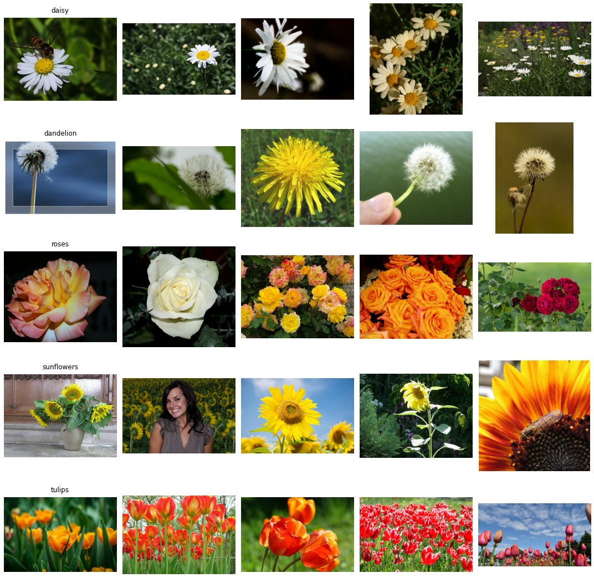
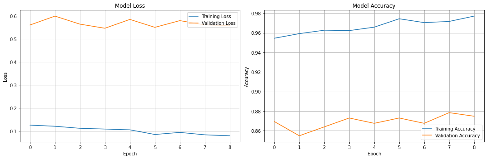
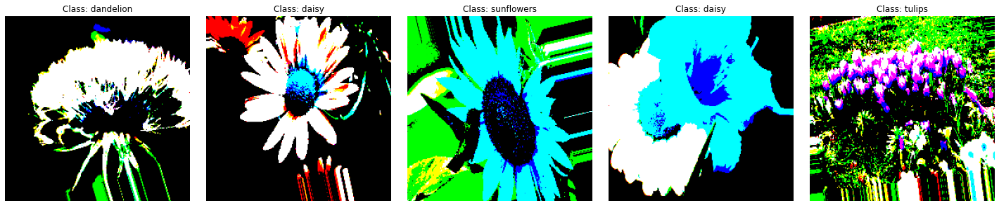
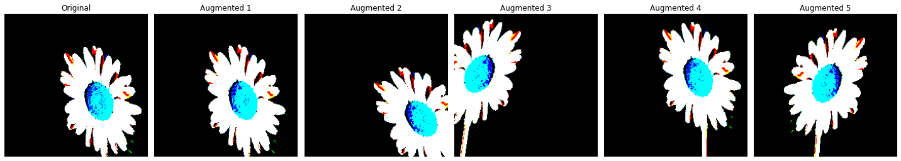
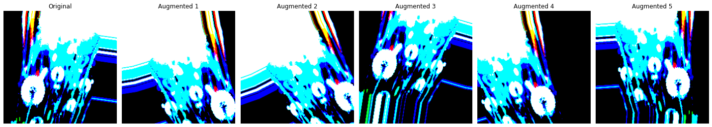
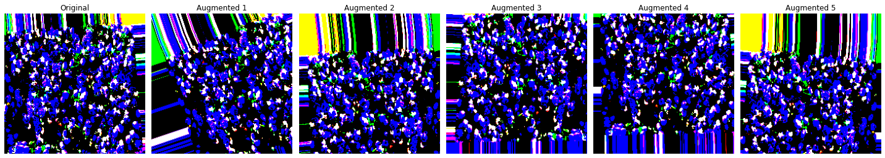
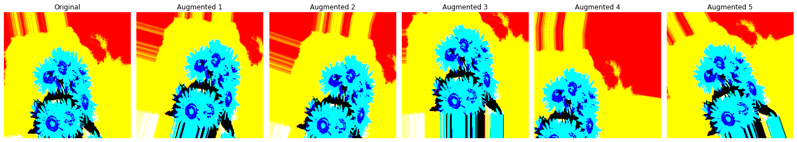
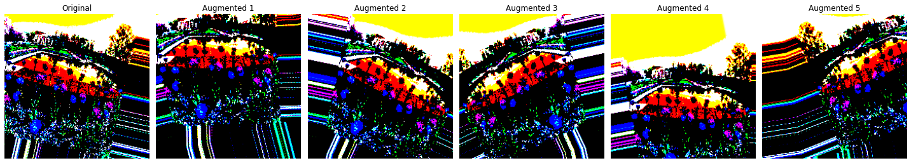

# 프로젝트명: 2. 거울아 거울아

프로젝트 목차:

1.  Data Preparation
2.  CV model setting
3.  Traning & Result analysis (Case 1. 기본모델)
4.  Traning & Result analysis (Case 2. Data 조정)
5.  Traning & Result analysis (Case 3. 추출층 가중치 동결 해졔)
6.  Traning & Result analysis (Case 4. 학습률 손실)
7.  Traning & Result analysis (Case 5. 가중치 손실)
8.  모델 실행 결과 요약
9.  모델 상용화 준비
10. 플러터 앱 실연 (실패함)
11. 회고

# 1. Data Prepration


```python
import math
import matplotlib.pyplot as plt
import numpy as np
import os
import pathlib
import PIL
import PIL.Image
import shutil
from sklearn.metrics import classification_report, confusion_matrix
from sklearn.model_selection import train_test_split
import seaborn as sns

import tensorflow as tf
import tensorflow_addons as tfa
import tensorflow_datasets as tfds
from tensorflow.keras.applications import VGG16
from tensorflow.keras.applications.vgg16 import preprocess_input
from tensorflow.keras.callbacks import (
    ModelCheckpoint,     # 모델 저장
    EarlyStopping,      # 조기 종료
    ReduceLROnPlateau,  # 학습률 조정
    TensorBoard,        # 텐서보드 로깅
    CSVLogger,          # CSV 파일로 로그 저장
    LearningRateScheduler # 학습률 스케쥴로 사용
)
from tensorflow.keras.layers import Dense, GlobalAveragePooling2D
from tensorflow.keras.metrics import CategoricalAccuracy, TopKCategoricalAccuracy
from tensorflow.keras.models import Model
from tensorflow.keras.optimizers import Adam
from tensorflow.keras.preprocessing.image import ImageDataGenerator
from tensorflow.keras.preprocessing.image import load_img, img_to_array
from tensorflow.keras.regularizers import l2
```


```python
# aiffel 디렉토리 경로 설정
base_dir = '/aiffel/aiffel/'
dataset_url = "https://storage.googleapis.com/download.tensorflow.org/example_images/flower_photos.tgz"

# 데이터 다운로드 및 저장
data_dir = tf.keras.utils.get_file(origin=dataset_url,
                                  fname='flower_photos',
                                  cache_dir=base_dir,  # aiffel 디렉토리에 저장
                                  untar=True)
data_dir = pathlib.Path(data_dir)

# 저장된 경로 확인
print(f"데이터가 저장된 경로: {data_dir}")

# 디렉토리 구조 확인
print("\n폴더 구조:")
for item in data_dir.glob('*'):
    if item.is_dir():
        print(f"클래스: {item.name}")
        print(f"이미지 개수: {len(list(item.glob('*')))}개")

# 이미지 개수
image_count = len(list(data_dir.glob('*/*.jpg')))
print(f"총 이미지 개수: {image_count}")
```

    데이터가 저장된 경로: /aiffel/aiffel/datasets/flower_photos
    
    폴더 구조:
    클래스: dandelion
    이미지 개수: 898개
    클래스: sunflowers
    이미지 개수: 699개
    클래스: daisy
    이미지 개수: 633개
    클래스: tulips
    이미지 개수: 799개
    클래스: .ipynb_checkpoints
    이미지 개수: 0개
    클래스: roses
    이미지 개수: 641개
    총 이미지 개수: 3670


```python
# 이미지 시각화

def display_sample_images(data_dir, n_samples=5):
    # 클래스 목록 가져오기 (정렬된 상태로)
    classes = sorted([item.name for item in data_dir.glob('*') if item.is_dir()])
    n_classes = len(classes)
    
    # figure 크기 설정
    plt.figure(figsize=(15, 3*n_classes))
    
    # 각 클래스별로 이미지 표시
    for idx, class_name in enumerate(classes):
        class_path = data_dir / class_name
        image_files = list(class_path.glob('*'))[:n_samples]
        
        for i, image_path in enumerate(image_files):
            # 이미지 로드
            img = plt.imread(image_path)
            
            # subplot 위치 계산 (1부터 시작하도록 보장)
            subplot_idx = idx * n_samples + i + 1
            
            # subplot이 유효한 범위 내에 있는지 확인
            if subplot_idx <= n_classes * n_samples:
                plt.subplot(n_classes, n_samples, subplot_idx)
                plt.imshow(img)
                plt.axis('off')
                
                # 첫 번째 열에만 클래스 이름 표시
                if i == 0:
                    plt.title(f'{class_name}', pad=10)
    
    plt.tight_layout()
    plt.show()

# 데이터셋 경로 확인 및 시각화
print(f"데이터 경로: {data_dir}")
display_sample_images(data_dir)

# 클래스별 이미지 개수 출력
for item in sorted(data_dir.glob('*')):
    if item.is_dir():
        print(f"{item.name}: {len(list(item.glob('*')))}개 이미지")
```

    데이터 경로: /aiffel/aiffel/datasets/flower_photos


    

    


    .ipynb_checkpoints: 0개 이미지
    daisy: 633개 이미지
    dandelion: 898개 이미지
    roses: 641개 이미지
    sunflowers: 699개 이미지
    tulips: 799개 이미지


```python
# 데이터 세트 전처리
datagen = ImageDataGenerator(
    rescale=1./255,
    validation_split=0.2
)
```


```python
# 데이터 세트 만들기

def split_dataset(source_dir, train_dir, valid_dir, test_dir, train_size=0.7, valid_size=0.15, test_size=0.15, random_state=42):
    print(f"\n===== 데이터 분할 시작 =====")
    print(f"분할 비율: 훈련={train_size*100}%, 검증={valid_size*100}%, 테스트={test_size*100}%")
    
    # 비율 검사
    if round(train_size + valid_size + test_size, 5) != 1.0:
        raise ValueError("train_size, valid_size, test_size의 합이 1이 되어야 합니다.")
    
    # 대상 디렉토리 생성
    os.makedirs(train_dir, exist_ok=True)
    os.makedirs(valid_dir, exist_ok=True)
    os.makedirs(test_dir, exist_ok=True)
    
    dataset_stats = {'train': {}, 'valid': {}, 'test': {}}
    
    # 숨김 파일과 디렉토리 제외
    for class_name in os.listdir(source_dir):
        # .으로 시작하는 숨김 파일/폴더 무시
        if class_name.startswith('.'):
            continue
            
        class_dir = os.path.join(source_dir, class_name)
        if not os.path.isdir(class_dir):
            continue
            
        # 클래스별 디렉토리 생성
        os.makedirs(os.path.join(train_dir, class_name), exist_ok=True)
        os.makedirs(os.path.join(valid_dir, class_name), exist_ok=True)
        os.makedirs(os.path.join(test_dir, class_name), exist_ok=True)
        
        # 이미지 파일 목록 가져오기 (숨김 파일 제외)
        files = [f for f in os.listdir(class_dir) 
                if f.lower().endswith(('.jpg', '.jpeg', '.png', '.gif'))
                and not f.startswith('.')]  # 숨김 파일 제외
        
        # 먼저 테스트셋 분리
        train_valid_files, test_files = train_test_split(
            files,
            test_size=test_size,
            random_state=random_state
        )
        
        # 남은 데이터를 훈련셋과 검증셋으로 분할
        # valid_size를 남은 비율에 맞게 조정
        remaining_valid_ratio = valid_size / (train_size + valid_size)
        train_files, valid_files = train_test_split(
            train_valid_files,
            test_size=remaining_valid_ratio,
            random_state=random_state
        )
        
        # 파일 복사 함수
        def copy_files(file_list, target_dir):
            for f in file_list:
                src = os.path.join(source_dir, class_name, f)
                dst = os.path.join(target_dir, class_name, f)
                shutil.copy2(src, dst)
        
        # 파일 복사 실행
        copy_files(train_files, train_dir)
        copy_files(valid_files, valid_dir)
        copy_files(test_files, test_dir)
        
        # 통계 저장
        dataset_stats['train'][class_name] = len(train_files)
        dataset_stats['valid'][class_name] = len(valid_files)
        dataset_stats['test'][class_name] = len(test_files)
        
        print(f"\n클래스 {class_name}:")
        print(f"  - 전체 이미지: {len(files)}개")
        print(f"  - 훈련 이미지: {len(train_files)}개 ({len(train_files)/len(files)*100:.1f}%)")
        print(f"  - 검증 이미지: {len(valid_files)}개 ({len(valid_files)/len(files)*100:.1f}%)")
        print(f"  - 테스트 이미지: {len(test_files)}개 ({len(test_files)/len(files)*100:.1f}%)")
    
   
    # 전체 통계 출력
    print("\n===== 최종 데이터 분할 결과 =====")
    total_train = sum(dataset_stats['train'].values())
    total_valid = sum(dataset_stats['valid'].values())
    total_test = sum(dataset_stats['test'].values())
    total_images = total_train + total_valid + total_test
    
    print(f"전체 이미지 수: {total_images}개")
    print(f"훈련셋: {total_train}개 ({total_train/total_images*100:.1f}%)")
    print(f"검증셋: {total_valid}개 ({total_valid/total_images*100:.1f}%)")
    print(f"테스트셋: {total_test}개 ({total_test/total_images*100:.1f}%)")
    
    return dataset_stats

  
# 경로 설정
source_directory = '/aiffel/aiffel/datasets/flower_photos'
train_directory = '/aiffel/aiffel/datasets/flower_photos_split/train'
valid_directory = '/aiffel/aiffel/datasets/flower_photos_split/valid'
test_directory = '/aiffel/aiffel/datasets/flower_photos_split/test' 

# 데이터 분할 실행
stats = split_dataset(source_directory, train_directory, valid_directory, test_directory)
```

    
    ===== 데이터 분할 시작 =====
    분할 비율: 훈련=70.0%, 검증=15.0%, 테스트=15.0%
    
    클래스 dandelion:
      - 전체 이미지: 898개
      - 훈련 이미지: 628개 (69.9%)
      - 검증 이미지: 135개 (15.0%)
      - 테스트 이미지: 135개 (15.0%)
    
    클래스 sunflowers:
      - 전체 이미지: 699개
      - 훈련 이미지: 489개 (70.0%)
      - 검증 이미지: 105개 (15.0%)
      - 테스트 이미지: 105개 (15.0%)
    
    클래스 daisy:
      - 전체 이미지: 633개
      - 훈련 이미지: 443개 (70.0%)
      - 검증 이미지: 95개 (15.0%)
      - 테스트 이미지: 95개 (15.0%)
    
    클래스 tulips:
      - 전체 이미지: 799개
      - 훈련 이미지: 559개 (70.0%)
      - 검증 이미지: 120개 (15.0%)
      - 테스트 이미지: 120개 (15.0%)
    
    클래스 roses:
      - 전체 이미지: 641개
      - 훈련 이미지: 448개 (69.9%)
      - 검증 이미지: 96개 (15.0%)
      - 테스트 이미지: 97개 (15.1%)
    
    ===== 최종 데이터 분할 결과 =====
    전체 이미지 수: 3670개
    훈련셋: 2567개 (69.9%)
    검증셋: 551개 (15.0%)
    테스트셋: 552개 (15.0%)


```python
# 데이터 제너레이터 설정

## 경로 정의
train_dir = '/aiffel/aiffel/datasets/flower_photos_split/train'
valid_dir = '/aiffel/aiffel/datasets/flower_photos_split/valid'
test_dir = '/aiffel/aiffel/datasets/flower_photos_split/test'

## .ipynb_checkpoints 폴더 제거
for dir_path in [train_dir, valid_dir, test_dir]:
    checkpoint_path = os.path.join(dir_path, '.ipynb_checkpoints')
    if os.path.exists(checkpoint_path):
        shutil.rmtree(checkpoint_path)

## 데이터 제너레이터 설정        
train_datagen = ImageDataGenerator(
    preprocessing_function=preprocess_input,
    rotation_range=20,
    width_shift_range=0.2,
    height_shift_range=0.2,
    horizontal_flip=True
)

valid_datagen = ImageDataGenerator(
    preprocessing_function=preprocess_input
)

test_datagen = ImageDataGenerator(
    preprocessing_function=preprocess_input
)

# 2. 데이터 로드 및 클래스 확인
train_generator = train_datagen.flow_from_directory(
    directory='/aiffel/aiffel/datasets/flower_photos_split/train',
    target_size=(224, 224),
    batch_size=32,
    class_mode='categorical',
    shuffle=True
)

valid_generator = valid_datagen.flow_from_directory(
    directory='/aiffel/aiffel/datasets/flower_photos_split/valid',
    target_size=(224, 224),
    batch_size=32,
    class_mode='categorical',
    shuffle=False
)

test_generator = test_datagen.flow_from_directory(
    directory='/aiffel/aiffel/datasets/flower_photos_split/test',
    target_size=(224, 224),
    batch_size=32,
    class_mode='categorical',
    shuffle=False
)

# 3. 클래스 수 확인
print("훈련 데이터 클래스:", train_generator.class_indices)
print("검증 데이터 클래스:", valid_generator.class_indices)
print("테스트 데이터 클래스:", test_generator.class_indices)

num_classes = len(train_generator.class_indices)
print("클래스 수:", num_classes)
```

    Found 2567 images belonging to 5 classes.
    Found 551 images belonging to 5 classes.
    Found 552 images belonging to 5 classes.
    훈련 데이터 클래스: {'daisy': 0, 'dandelion': 1, 'roses': 2, 'sunflowers': 3, 'tulips': 4}
    검증 데이터 클래스: {'daisy': 0, 'dandelion': 1, 'roses': 2, 'sunflowers': 3, 'tulips': 4}
    테스트 데이터 클래스: {'daisy': 0, 'dandelion': 1, 'roses': 2, 'sunflowers': 3, 'tulips': 4}
    클래스 수: 5


# 2. CV model setting


```python
# 모델 생성
def create_model(num_classes):
    base_model = VGG16(weights='imagenet', include_top=False, input_shape=(224, 224, 3))
    x = base_model.output
    x = GlobalAveragePooling2D()(x)
    x = Dense(512, activation='relu')(x)
    predictions = Dense(num_classes, activation='softmax')(x)
    
    model = Model(inputs=base_model.input, outputs=predictions)
    
    # 기본 모델 가중치 고정
    for layer in base_model.layers:
        layer.trainable = False
    
    return model

# 모델 생성 및 컴파일
model = create_model(num_classes)
model.compile(
    optimizer=Adam(learning_rate=0.0001),
    loss='categorical_crossentropy',
    metrics=['accuracy']
)

# 모델 구조 확인
model.summary()

# 체크포인트와 로그를 저장할 디렉토리 생성
checkpoint_path = "model_checkpoints"
log_path = "training_logs"
os.makedirs(checkpoint_path, exist_ok=True)
os.makedirs(log_path, exist_ok=True)

# 콜백 정의
callbacks = [
    # 모델 체크포인트 저장
    ModelCheckpoint(
        filepath=os.path.join(checkpoint_path, 'vgg16_case1.h5'),
        monitor='val_accuracy',    # 검증 정확도 모니터링
        save_best_only=True,      # 가장 좋은 성능의 모델만 저장
        mode='max',               # 정확도는 높을수록 좋음
        verbose=1
    ),
    
    # 조기 종료
    EarlyStopping(
        monitor='val_loss',       # 검증 손실 모니터링
        patience=5,               # 5번의 에포크 동안 개선이 없으면 중지
        restore_best_weights=True,# 가장 좋은 가중치로 복원
        verbose=1
    ),
 
]
```

    Model: "model_3"
    _________________________________________________________________
    Layer (type)                 Output Shape              Param #   
    =================================================================
    input_4 (InputLayer)         [(None, 224, 224, 3)]     0         
    _________________________________________________________________
    block1_conv1 (Conv2D)        (None, 224, 224, 64)      1792      
    _________________________________________________________________
    block1_conv2 (Conv2D)        (None, 224, 224, 64)      36928     
    _________________________________________________________________
    block1_pool (MaxPooling2D)   (None, 112, 112, 64)      0         
    _________________________________________________________________
    block2_conv1 (Conv2D)        (None, 112, 112, 128)     73856     
    _________________________________________________________________
    block2_conv2 (Conv2D)        (None, 112, 112, 128)     147584    
    _________________________________________________________________
    block2_pool (MaxPooling2D)   (None, 56, 56, 128)       0         
    _________________________________________________________________
    block3_conv1 (Conv2D)        (None, 56, 56, 256)       295168    
    _________________________________________________________________
    block3_conv2 (Conv2D)        (None, 56, 56, 256)       590080    
    _________________________________________________________________
    block3_conv3 (Conv2D)        (None, 56, 56, 256)       590080    
    _________________________________________________________________
    block3_pool (MaxPooling2D)   (None, 28, 28, 256)       0         
    _________________________________________________________________
    block4_conv1 (Conv2D)        (None, 28, 28, 512)       1180160   
    _________________________________________________________________
    block4_conv2 (Conv2D)        (None, 28, 28, 512)       2359808   
    _________________________________________________________________
    block4_conv3 (Conv2D)        (None, 28, 28, 512)       2359808   
    _________________________________________________________________
    block4_pool (MaxPooling2D)   (None, 14, 14, 512)       0         
    _________________________________________________________________
    block5_conv1 (Conv2D)        (None, 14, 14, 512)       2359808   
    _________________________________________________________________
    block5_conv2 (Conv2D)        (None, 14, 14, 512)       2359808   
    _________________________________________________________________
    block5_conv3 (Conv2D)        (None, 14, 14, 512)       2359808   
    _________________________________________________________________
    block5_pool (MaxPooling2D)   (None, 7, 7, 512)         0         
    _________________________________________________________________
    global_average_pooling2d_3 ( (None, 512)               0         
    _________________________________________________________________
    dense_6 (Dense)              (None, 512)               262656    
    _________________________________________________________________
    dense_7 (Dense)              (None, 5)                 2565      
    =================================================================
    Total params: 14,979,909
    Trainable params: 265,221
    Non-trainable params: 14,714,688
    _________________________________________________________________


# 3. Traning & Result analysis (Case 1. 기본모델)


```python
history_1_0 = model.fit(
    train_generator,
    validation_data=valid_generator,
    epochs=50,
    callbacks=callbacks,
    verbose=1
)
```

    Epoch 1/50
    81/81 [==============================] - 37s 448ms/step - loss: 1.5919 - accuracy: 0.5551 - val_loss: 1.0314 - val_accuracy: 0.7078
    
    Epoch 00001: val_accuracy improved from -inf to 0.70780, saving model to model_checkpoints/vgg16_case1.h5
    Epoch 2/50
    81/81 [==============================] - 36s 445ms/step - loss: 0.6598 - accuracy: 0.7865 - val_loss: 0.7944 - val_accuracy: 0.7677
    
    Epoch 00002: val_accuracy improved from 0.70780 to 0.76770, saving model to model_checkpoints/vgg16_case1.h5
    Epoch 3/50
    81/81 [==============================] - 36s 443ms/step - loss: 0.5241 - accuracy: 0.8196 - val_loss: 0.6997 - val_accuracy: 0.7840
    
    Epoch 00003: val_accuracy improved from 0.76770 to 0.78403, saving model to model_checkpoints/vgg16_case1.h5
    Epoch 4/50
    81/81 [==============================] - 36s 444ms/step - loss: 0.4062 - accuracy: 0.8578 - val_loss: 0.6709 - val_accuracy: 0.8094
    
    Epoch 00004: val_accuracy improved from 0.78403 to 0.80944, saving model to model_checkpoints/vgg16_case1.h5
    Epoch 5/50
    81/81 [==============================] - 36s 444ms/step - loss: 0.3502 - accuracy: 0.8785 - val_loss: 0.6422 - val_accuracy: 0.8131
    
    Epoch 00005: val_accuracy improved from 0.80944 to 0.81307, saving model to model_checkpoints/vgg16_case1.h5
    Epoch 6/50
    81/81 [==============================] - 36s 442ms/step - loss: 0.3119 - accuracy: 0.8839 - val_loss: 0.5862 - val_accuracy: 0.8276
    
    Epoch 00006: val_accuracy improved from 0.81307 to 0.82759, saving model to model_checkpoints/vgg16_case1.h5
    Epoch 7/50
    81/81 [==============================] - 37s 456ms/step - loss: 0.2720 - accuracy: 0.8991 - val_loss: 0.5698 - val_accuracy: 0.8348
    
    Epoch 00007: val_accuracy improved from 0.82759 to 0.83485, saving model to model_checkpoints/vgg16_case1.h5
    Epoch 8/50
    81/81 [==============================] - 37s 450ms/step - loss: 0.2400 - accuracy: 0.9104 - val_loss: 0.5374 - val_accuracy: 0.8421
    
    Epoch 00008: val_accuracy improved from 0.83485 to 0.84211, saving model to model_checkpoints/vgg16_case1.h5
    Epoch 9/50
    81/81 [==============================] - 36s 445ms/step - loss: 0.2317 - accuracy: 0.9162 - val_loss: 0.5482 - val_accuracy: 0.8330
    
    Epoch 00009: val_accuracy did not improve from 0.84211
    Epoch 10/50
    81/81 [==============================] - 36s 447ms/step - loss: 0.2063 - accuracy: 0.9229 - val_loss: 0.5250 - val_accuracy: 0.8457
    
    Epoch 00010: val_accuracy improved from 0.84211 to 0.84574, saving model to model_checkpoints/vgg16_case1.h5
    Epoch 11/50
    81/81 [==============================] - 37s 455ms/step - loss: 0.1916 - accuracy: 0.9330 - val_loss: 0.5294 - val_accuracy: 0.8457
    
    Epoch 00011: val_accuracy did not improve from 0.84574
    Epoch 12/50
    81/81 [==============================] - 37s 450ms/step - loss: 0.1709 - accuracy: 0.9420 - val_loss: 0.5034 - val_accuracy: 0.8548
    
    Epoch 00012: val_accuracy improved from 0.84574 to 0.85481, saving model to model_checkpoints/vgg16_case1.h5
    Epoch 13/50
    81/81 [==============================] - 36s 446ms/step - loss: 0.1732 - accuracy: 0.9431 - val_loss: 0.5070 - val_accuracy: 0.8639
    
    Epoch 00013: val_accuracy improved from 0.85481 to 0.86388, saving model to model_checkpoints/vgg16_case1.h5
    Epoch 14/50
    81/81 [==============================] - 36s 449ms/step - loss: 0.1510 - accuracy: 0.9482 - val_loss: 0.5158 - val_accuracy: 0.8730
    
    Epoch 00014: val_accuracy improved from 0.86388 to 0.87296, saving model to model_checkpoints/vgg16_case1.h5
    Epoch 15/50
    81/81 [==============================] - 36s 444ms/step - loss: 0.1292 - accuracy: 0.9591 - val_loss: 0.4857 - val_accuracy: 0.8548
    
    Epoch 00015: val_accuracy did not improve from 0.87296
    Epoch 16/50
    81/81 [==============================] - 37s 453ms/step - loss: 0.1297 - accuracy: 0.9568 - val_loss: 0.5115 - val_accuracy: 0.8566
    
    Epoch 00016: val_accuracy did not improve from 0.87296
    Epoch 17/50
    81/81 [==============================] - 37s 456ms/step - loss: 0.1206 - accuracy: 0.9560 - val_loss: 0.5111 - val_accuracy: 0.8675
    
    Epoch 00017: val_accuracy did not improve from 0.87296
    Epoch 18/50
    81/81 [==============================] - 37s 451ms/step - loss: 0.1141 - accuracy: 0.9571 - val_loss: 0.5072 - val_accuracy: 0.8748
    
    Epoch 00018: val_accuracy improved from 0.87296 to 0.87477, saving model to model_checkpoints/vgg16_case1.h5
    Epoch 19/50
    81/81 [==============================] - 36s 445ms/step - loss: 0.1206 - accuracy: 0.9595 - val_loss: 0.4995 - val_accuracy: 0.8730
    
    Epoch 00019: val_accuracy did not improve from 0.87477
    Epoch 20/50
    81/81 [==============================] - 37s 451ms/step - loss: 0.1016 - accuracy: 0.9669 - val_loss: 0.5402 - val_accuracy: 0.8693
    
    Epoch 00020: val_accuracy did not improve from 0.87477
    Restoring model weights from the end of the best epoch.
    Epoch 00020: early stopping


```python
# 🔍학습 결과 저장
model.save(checkpoint_path)
print(f"✅ 모델이 저장되었습니다: {checkpoint_path}")
```

    INFO:tensorflow:Assets written to: model_checkpoints/assets
    ✅ 모델이 저장되었습니다: model_checkpoints


```python
def plot_training_history(history):
    # 손실과 정확도 그래프를 2x1 구조로 생성
    fig, (ax1, ax2) = plt.subplots(1, 2, figsize=(15, 5))
    
    # 손실 그래프
    ax1.plot(history_1_0.history['loss'], label='Training Loss')
    ax1.plot(history_1_0.history['val_loss'], label='Validation Loss')
    ax1.set_title('Model Loss')
    ax1.set_xlabel('Epoch')
    ax1.set_ylabel('Loss')
    ax1.legend(loc='upper right')
    ax1.grid(True)
    
    # 정확도 그래프
    ax2.plot(history_1_0.history['accuracy'], label='Training Accuracy')
    ax2.plot(history_1_0.history['val_accuracy'], label='Validation Accuracy')
    ax2.set_title('Model Accuracy')
    ax2.set_xlabel('Epoch')
    ax2.set_ylabel('Accuracy')
    ax2.legend(loc='lower right')
    ax2.grid(True)
    
    plt.tight_layout()
    plt.show()

plot_training_history(history_1_0)
print()
    # 최종 성능 출력
print("\n===== 최종 학습 결과 =====")
print(f"최종 훈련 손실: {history_1_0.history['loss'][-1]:.4f}")
print(f"최종 검증 손실: {history_1_0.history['val_loss'][-1]:.4f}")
print(f"최종 훈련 정확도: {history_1_0.history['accuracy'][-1]:.4f}")
print(f"최종 검증 정확도: {history_1_0.history['val_accuracy'][-1]:.4f}")
```


    

    


    
    
    ===== 최종 학습 결과 =====
    최종 훈련 손실: 0.0802
    최종 검증 손실: 0.5576
    최종 훈련 정확도: 0.9770
    최종 검증 정확도: 0.8748


```python
# 모델 평가
print("\n===== 모델 평가 =====")
evaluation = model.evaluate(test_generator)
print(f'Test Loss: {evaluation[0]:.4f}')
print(f'Test Accuracy: {evaluation[1]:.4f}')

# 예측 및 분류 보고서 생성 (선택사항)
from sklearn.metrics import classification_report
import numpy as np

# 예측
predictions = model.predict(test_generator)
y_pred = np.argmax(predictions, axis=1)
y_true = test_generator.classes

# 클래스 레이블
class_labels = list(test_generator.class_indices.keys())

# 분류 보고서 출력
print("\n===== 분류 보고서 =====")
print(classification_report(y_true, y_pred, target_names=class_labels))
```

    
    ===== 모델 평가 =====
    18/18 [==============================] - 3s 135ms/step - loss: 0.3827 - accuracy: 0.8822
    Test Loss: 0.3827
    Test Accuracy: 0.8822
    
    ===== 분류 보고서 =====
                  precision    recall  f1-score   support
    
           daisy       0.91      0.93      0.92        95
       dandelion       0.90      0.90      0.90       135
           roses       0.84      0.88      0.86        97
      sunflowers       0.91      0.88      0.89       105
          tulips       0.86      0.84      0.85       120
    
        accuracy                           0.88       552
       macro avg       0.88      0.88      0.88       552
    weighted avg       0.88      0.88      0.88       552
    


# 4. Traning & Result analysis (Case 2. Data 증강)


```python
# 1. 훈련 데이터용 ImageDataGenerator - 다양한 증강 기법 적용
train_datagen_aug = ImageDataGenerator(
    preprocessing_function=preprocess_input,
    rotation_range=30,              # 이미지 회전 (0-180도)
    width_shift_range=0.2,         # 좌우 이동
    height_shift_range=0.2,        # 상하 이동
    brightness_range=[0.8,1.2],    # 밝기 조절
    shear_range=0.2,              # 전단 변환
    zoom_range=0.2,               # 확대/축소
    horizontal_flip=True,         # 좌우 반전
    vertical_flip=False,          # 상하 반전 (꽃 이미지는 상하반전이 부적절할 수 있음)
    fill_mode='nearest'          # 빈 픽셀 채우기 방식
)

# 2. 검증 및 테스트 데이터용 ImageDataGenerator - 전처리만 적용
valid_datagen = ImageDataGenerator(
    preprocessing_function=preprocess_input
)

test_datagen = ImageDataGenerator(
    preprocessing_function=preprocess_input
)

# 3. 데이터 로드
train_generator_aug = train_datagen_aug.flow_from_directory(
    directory=train_dir,
    target_size=(224, 224),
    batch_size=32,
    class_mode='categorical',
    shuffle=True
)

valid_generator = valid_datagen.flow_from_directory(
    directory=valid_dir,
    target_size=(224, 224),
    batch_size=32,
    class_mode='categorical',
    shuffle=False
)

test_generator = test_datagen.flow_from_directory(
    directory=test_dir,
    target_size=(224, 224),
    batch_size=32,
    class_mode='categorical',
    shuffle=False
)

# 4. 증강된 이미지 시각화 함수
def visualize_augmented_images(generator, num_images=5):
    """증강된 이미지를 시각화하는 함수"""
    plt.figure(figsize=(20, 4))
    
    # 하나의 배치에서 이미지 가져오기
    x, y = next(generator)
    
    for i in range(num_images):
        plt.subplot(1, num_images, i+1)
        plt.imshow((x[i] + 1) / 2)  # [-1, 1] 범위를 [0, 1] 범위로 변환
        plt.axis('off')
        plt.title(f'Class: {list(train_generator.class_indices.keys())[np.argmax(y[i])]}')
    
    plt.tight_layout()
    plt.show()

# 5. 증강된 이미지 확인
print("===== 증강된 이미지 예시 =====")
visualize_augmented_images(train_generator)

# 6. 각 클래스별 증강된 이미지 확인
def visualize_augmentation_per_class(generator, num_augmentations=5):
    """각 클래스별로 증강된 이미지를 보여주는 함수"""
    class_names = list(generator.class_indices.keys())
    
    for class_name in class_names:
        print(f"\n=== Class: {class_name} ===")
        
        # 해당 클래스의 첫 번째 이미지 찾기
        for x, y in generator:
            class_indices = np.where(np.argmax(y, axis=1) == generator.class_indices[class_name])[0]
            if len(class_indices) > 0:
                img = x[class_indices[0]]
                break
        
        # 선택된 이미지에 대해 여러 번의 증강 적용
        plt.figure(figsize=(20, 4))
        plt.subplot(1, num_augmentations+1, 1)
        plt.imshow((img + 1) / 2)
        plt.title('Original')
        plt.axis('off')
        
        for i in range(num_augmentations):
            img_aug = train_datagen.random_transform(img)
            plt.subplot(1, num_augmentations+1, i+2)
            plt.imshow((img_aug + 1) / 2)
            plt.title(f'Augmented {i+1}')
            plt.axis('off')
        
        plt.tight_layout()
        plt.show()

# 7. 각 클래스별 증강 결과 확인
print("\n===== 클래스별 증강 결과 =====")
visualize_augmentation_per_class(train_generator)
```

    Found 2567 images belonging to 5 classes.
    Found 551 images belonging to 5 classes.
    Found 552 images belonging to 5 classes.
    ===== 증강된 이미지 예시 =====


    Clipping input data to the valid range for imshow with RGB data ([0..1] for floats or [0..255] for integers).
    Clipping input data to the valid range for imshow with RGB data ([0..1] for floats or [0..255] for integers).
    Clipping input data to the valid range for imshow with RGB data ([0..1] for floats or [0..255] for integers).
    Clipping input data to the valid range for imshow with RGB data ([0..1] for floats or [0..255] for integers).
    Clipping input data to the valid range for imshow with RGB data ([0..1] for floats or [0..255] for integers).


    

    


    
    ===== 클래스별 증강 결과 =====
    
    === Class: daisy ===


    Clipping input data to the valid range for imshow with RGB data ([0..1] for floats or [0..255] for integers).
    Clipping input data to the valid range for imshow with RGB data ([0..1] for floats or [0..255] for integers).
    Clipping input data to the valid range for imshow with RGB data ([0..1] for floats or [0..255] for integers).
    Clipping input data to the valid range for imshow with RGB data ([0..1] for floats or [0..255] for integers).
    Clipping input data to the valid range for imshow with RGB data ([0..1] for floats or [0..255] for integers).
    Clipping input data to the valid range for imshow with RGB data ([0..1] for floats or [0..255] for integers).


    

    


    
    === Class: dandelion ===


    Clipping input data to the valid range for imshow with RGB data ([0..1] for floats or [0..255] for integers).
    Clipping input data to the valid range for imshow with RGB data ([0..1] for floats or [0..255] for integers).
    Clipping input data to the valid range for imshow with RGB data ([0..1] for floats or [0..255] for integers).
    Clipping input data to the valid range for imshow with RGB data ([0..1] for floats or [0..255] for integers).
    Clipping input data to the valid range for imshow with RGB data ([0..1] for floats or [0..255] for integers).
    Clipping input data to the valid range for imshow with RGB data ([0..1] for floats or [0..255] for integers).


    

    


    
    === Class: roses ===


    Clipping input data to the valid range for imshow with RGB data ([0..1] for floats or [0..255] for integers).
    Clipping input data to the valid range for imshow with RGB data ([0..1] for floats or [0..255] for integers).
    Clipping input data to the valid range for imshow with RGB data ([0..1] for floats or [0..255] for integers).
    Clipping input data to the valid range for imshow with RGB data ([0..1] for floats or [0..255] for integers).
    Clipping input data to the valid range for imshow with RGB data ([0..1] for floats or [0..255] for integers).
    Clipping input data to the valid range for imshow with RGB data ([0..1] for floats or [0..255] for integers).


    

    


    
    === Class: sunflowers ===


    Clipping input data to the valid range for imshow with RGB data ([0..1] for floats or [0..255] for integers).
    Clipping input data to the valid range for imshow with RGB data ([0..1] for floats or [0..255] for integers).
    Clipping input data to the valid range for imshow with RGB data ([0..1] for floats or [0..255] for integers).
    Clipping input data to the valid range for imshow with RGB data ([0..1] for floats or [0..255] for integers).
    Clipping input data to the valid range for imshow with RGB data ([0..1] for floats or [0..255] for integers).
    Clipping input data to the valid range for imshow with RGB data ([0..1] for floats or [0..255] for integers).


    

    


    
    === Class: tulips ===


    Clipping input data to the valid range for imshow with RGB data ([0..1] for floats or [0..255] for integers).
    Clipping input data to the valid range for imshow with RGB data ([0..1] for floats or [0..255] for integers).
    Clipping input data to the valid range for imshow with RGB data ([0..1] for floats or [0..255] for integers).
    Clipping input data to the valid range for imshow with RGB data ([0..1] for floats or [0..255] for integers).
    Clipping input data to the valid range for imshow with RGB data ([0..1] for floats or [0..255] for integers).
    Clipping input data to the valid range for imshow with RGB data ([0..1] for floats or [0..255] for integers).


    

    


```python
# 모델 학습
history_2_0 = model.fit(
    train_generator_aug,
    validation_data=valid_generator,
    epochs=50,
    callbacks=callbacks,
    verbose=1
)

# 모델 학습 결과 시각화 
plot_training_history(history_2_0)
print()
    # 최종 성능 출력
print("\n===== 최종 학습 결과 =====")
print(f"최종 훈련 손실: {history_2_0.history['loss'][-1]:.4f}")
print(f"최종 검증 손실: {history_2_0.history['val_loss'][-1]:.4f}")
print(f"최종 훈련 정확도: {history_2_0.history['accuracy'][-1]:.4f}")
print(f"최종 검증 정확도: {history_2_0.history['val_accuracy'][-1]:.4f}")
```

    Epoch 1/50
    81/81 [==============================] - 43s 525ms/step - loss: 0.1317 - accuracy: 0.9533 - val_loss: 0.5648 - val_accuracy: 0.8766
    
    Epoch 00001: val_accuracy did not improve from 0.87840
    Epoch 2/50
    81/81 [==============================] - 43s 531ms/step - loss: 0.1473 - accuracy: 0.9470 - val_loss: 0.5489 - val_accuracy: 0.8621
    
    Epoch 00002: val_accuracy did not improve from 0.87840
    Epoch 3/50
    81/81 [==============================] - 43s 534ms/step - loss: 0.1373 - accuracy: 0.9517 - val_loss: 0.5841 - val_accuracy: 0.8621
    
    Epoch 00003: val_accuracy did not improve from 0.87840
    Epoch 4/50
    81/81 [==============================] - 43s 533ms/step - loss: 0.1241 - accuracy: 0.9560 - val_loss: 0.5810 - val_accuracy: 0.8566
    
    Epoch 00004: val_accuracy did not improve from 0.87840
    Epoch 5/50
    81/81 [==============================] - 43s 531ms/step - loss: 0.1060 - accuracy: 0.9634 - val_loss: 0.5547 - val_accuracy: 0.8730
    
    Epoch 00005: val_accuracy did not improve from 0.87840
    Epoch 6/50
    81/81 [==============================] - 44s 539ms/step - loss: 0.1050 - accuracy: 0.9653 - val_loss: 0.5966 - val_accuracy: 0.8693
    
    Epoch 00006: val_accuracy did not improve from 0.87840
    Epoch 7/50
    81/81 [==============================] - 43s 532ms/step - loss: 0.1188 - accuracy: 0.9575 - val_loss: 0.5955 - val_accuracy: 0.8675
    
    Epoch 00007: val_accuracy did not improve from 0.87840
    Restoring model weights from the end of the best epoch.
    Epoch 00007: early stopping


    

    


    
    
    ===== 최종 학습 결과 =====
    최종 훈련 손실: 0.1188
    최종 검증 손실: 0.5955
    최종 훈련 정확도: 0.9575
    최종 검증 정확도: 0.8675


```python
# 모델 평가
print("\n===== 모델 평가 =====")
evaluation = model.evaluate(test_generator)
print(f'Test Loss: {evaluation[0]:.4f}')
print(f'Test Accuracy: {evaluation[1]:.4f}')

# 예측 및 분류 보고서 생성 (선택사항)
from sklearn.metrics import classification_report
import numpy as np

# 예측
predictions = model.predict(test_generator)
y_pred = np.argmax(predictions, axis=1)
y_true = test_generator.classes

# 클래스 레이블
class_labels = list(test_generator.class_indices.keys())

# 분류 보고서 출력
print("\n===== 분류 보고서 =====")
print(classification_report(y_true, y_pred, target_names=class_labels))
```

    
    ===== 모델 평가 =====
    18/18 [==============================] - 3s 140ms/step - loss: 0.3780 - accuracy: 0.8804
    Test Loss: 0.3780
    Test Accuracy: 0.8804
    
    ===== 분류 보고서 =====
                  precision    recall  f1-score   support
    
           daisy       0.91      0.92      0.91        95
       dandelion       0.90      0.91      0.90       135
           roses       0.83      0.86      0.84        97
      sunflowers       0.95      0.85      0.89       105
          tulips       0.83      0.87      0.85       120
    
        accuracy                           0.88       552
       macro avg       0.88      0.88      0.88       552
    weighted avg       0.88      0.88      0.88       552
    


# 5. Traning & Result analysis (Case 3. 추출층 가중치 동결 해제)


```python
# 모델 생성
def create_model(num_classes):
    base_model = VGG16(weights='imagenet', include_top=False, input_shape=(224, 224, 3))
    x = base_model.output
    x = GlobalAveragePooling2D()(x)
    x = Dense(512, activation='relu')(x)
    predictions = Dense(num_classes, activation='softmax')(x)
    
    model = Model(inputs=base_model.input, outputs=predictions)
    
    for layer in base_model.layers[:10]:  # 처음 10개 층은 고정
        layer.trainable = False
    for layer in base_model.layers[10:]:  # 나머지 층은 학습 가능
        layer.trainable = True
    
    return model

# 모델 생성 및 컴파일
model_case3 = create_model(num_classes)
model_case3.compile(
    optimizer=Adam(learning_rate=0.0001),
    loss='categorical_crossentropy',
    metrics=['accuracy']
)

# 모델 구조 확인
model_case3.summary()


# 콜백 정의
callbacks = [
    # 모델 체크포인트 저장
    ModelCheckpoint(
        filepath=os.path.join(checkpoint_path, 'best_model.h5'),
        monitor='val_accuracy',    # 검증 정확도 모니터링
        save_best_only=True,      # 가장 좋은 성능의 모델만 저장
        mode='max',               # 정확도는 높을수록 좋음
        verbose=1
    ),
    
    # 조기 종료
    EarlyStopping(
        monitor='val_loss',       # 검증 손실 모니터링
        patience=5,               # 5번의 에포크 동안 개선이 없으면 중지
        restore_best_weights=True,# 가장 좋은 가중치로 복원
        verbose=1
    )
]
```

    Model: "model_1"
    _________________________________________________________________
    Layer (type)                 Output Shape              Param #   
    =================================================================
    input_2 (InputLayer)         [(None, 224, 224, 3)]     0         
    _________________________________________________________________
    block1_conv1 (Conv2D)        (None, 224, 224, 64)      1792      
    _________________________________________________________________
    block1_conv2 (Conv2D)        (None, 224, 224, 64)      36928     
    _________________________________________________________________
    block1_pool (MaxPooling2D)   (None, 112, 112, 64)      0         
    _________________________________________________________________
    block2_conv1 (Conv2D)        (None, 112, 112, 128)     73856     
    _________________________________________________________________
    block2_conv2 (Conv2D)        (None, 112, 112, 128)     147584    
    _________________________________________________________________
    block2_pool (MaxPooling2D)   (None, 56, 56, 128)       0         
    _________________________________________________________________
    block3_conv1 (Conv2D)        (None, 56, 56, 256)       295168    
    _________________________________________________________________
    block3_conv2 (Conv2D)        (None, 56, 56, 256)       590080    
    _________________________________________________________________
    block3_conv3 (Conv2D)        (None, 56, 56, 256)       590080    
    _________________________________________________________________
    block3_pool (MaxPooling2D)   (None, 28, 28, 256)       0         
    _________________________________________________________________
    block4_conv1 (Conv2D)        (None, 28, 28, 512)       1180160   
    _________________________________________________________________
    block4_conv2 (Conv2D)        (None, 28, 28, 512)       2359808   
    _________________________________________________________________
    block4_conv3 (Conv2D)        (None, 28, 28, 512)       2359808   
    _________________________________________________________________
    block4_pool (MaxPooling2D)   (None, 14, 14, 512)       0         
    _________________________________________________________________
    block5_conv1 (Conv2D)        (None, 14, 14, 512)       2359808   
    _________________________________________________________________
    block5_conv2 (Conv2D)        (None, 14, 14, 512)       2359808   
    _________________________________________________________________
    block5_conv3 (Conv2D)        (None, 14, 14, 512)       2359808   
    _________________________________________________________________
    block5_pool (MaxPooling2D)   (None, 7, 7, 512)         0         
    _________________________________________________________________
    global_average_pooling2d_1 ( (None, 512)               0         
    _________________________________________________________________
    dense_2 (Dense)              (None, 512)               262656    
    _________________________________________________________________
    dense_3 (Dense)              (None, 5)                 2565      
    =================================================================
    Total params: 14,979,909
    Trainable params: 13,244,421
    Non-trainable params: 1,735,488
    _________________________________________________________________


```python
# 모델 학습
history_case3 = model_case3.fit(
    train_generator_aug,
    validation_data=valid_generator,
    epochs=50,
    callbacks=callbacks,
    verbose=1
)
```

    Epoch 1/50
    81/81 [==============================] - 47s 533ms/step - loss: 0.8919 - accuracy: 0.6837 - val_loss: 0.7276 - val_accuracy: 0.7659
    
    Epoch 00001: val_accuracy improved from -inf to 0.76588, saving model to model_checkpoints/best_model.h5
    Epoch 2/50
    81/81 [==============================] - 44s 542ms/step - loss: 0.4383 - accuracy: 0.8457 - val_loss: 0.4073 - val_accuracy: 0.8566
    
    Epoch 00002: val_accuracy improved from 0.76588 to 0.85662, saving model to model_checkpoints/best_model.h5
    Epoch 3/50
    81/81 [==============================] - 44s 538ms/step - loss: 0.3384 - accuracy: 0.8804 - val_loss: 0.3753 - val_accuracy: 0.8621
    
    Epoch 00003: val_accuracy improved from 0.85662 to 0.86207, saving model to model_checkpoints/best_model.h5
    Epoch 4/50
    81/81 [==============================] - 44s 540ms/step - loss: 0.2668 - accuracy: 0.9042 - val_loss: 0.4098 - val_accuracy: 0.8693
    
    Epoch 00004: val_accuracy improved from 0.86207 to 0.86933, saving model to model_checkpoints/best_model.h5
    Epoch 5/50
    81/81 [==============================] - 44s 540ms/step - loss: 0.2168 - accuracy: 0.9213 - val_loss: 0.3215 - val_accuracy: 0.8966
    
    Epoch 00005: val_accuracy improved from 0.86933 to 0.89655, saving model to model_checkpoints/best_model.h5
    Epoch 6/50
    81/81 [==============================] - 44s 536ms/step - loss: 0.1843 - accuracy: 0.9346 - val_loss: 0.5885 - val_accuracy: 0.8603
    
    Epoch 00006: val_accuracy did not improve from 0.89655
    Epoch 7/50
    81/81 [==============================] - 45s 558ms/step - loss: 0.1463 - accuracy: 0.9451 - val_loss: 0.4298 - val_accuracy: 0.8911
    
    Epoch 00007: val_accuracy did not improve from 0.89655
    Epoch 8/50
    81/81 [==============================] - 44s 543ms/step - loss: 0.1587 - accuracy: 0.9427 - val_loss: 0.2718 - val_accuracy: 0.9093
    
    Epoch 00008: val_accuracy improved from 0.89655 to 0.90926, saving model to model_checkpoints/best_model.h5
    Epoch 9/50
    81/81 [==============================] - 45s 555ms/step - loss: 0.1426 - accuracy: 0.9536 - val_loss: 0.3280 - val_accuracy: 0.9111
    
    Epoch 00009: val_accuracy improved from 0.90926 to 0.91107, saving model to model_checkpoints/best_model.h5
    Epoch 10/50
    81/81 [==============================] - 44s 541ms/step - loss: 0.1397 - accuracy: 0.9505 - val_loss: 0.3355 - val_accuracy: 0.9111
    
    Epoch 00010: val_accuracy did not improve from 0.91107
    Epoch 11/50
    81/81 [==============================] - 45s 553ms/step - loss: 0.1242 - accuracy: 0.9649 - val_loss: 0.4468 - val_accuracy: 0.8784
    
    Epoch 00011: val_accuracy did not improve from 0.91107
    Epoch 12/50
    81/81 [==============================] - 44s 546ms/step - loss: 0.1175 - accuracy: 0.9579 - val_loss: 0.4796 - val_accuracy: 0.9165
    
    Epoch 00012: val_accuracy improved from 0.91107 to 0.91652, saving model to model_checkpoints/best_model.h5
    Epoch 13/50
    81/81 [==============================] - 44s 545ms/step - loss: 0.1416 - accuracy: 0.9513 - val_loss: 0.4595 - val_accuracy: 0.8766
    
    Epoch 00013: val_accuracy did not improve from 0.91652
    Restoring model weights from the end of the best epoch.
    Epoch 00013: early stopping


```python
# 모델 학습 결과 시각화 
plot_training_history(history_case3)
print()
    # 최종 성능 출력
print("\n===== 최종 학습 결과 =====")
print(f"최종 훈련 손실: {history_case3.history['loss'][-1]:.4f}")
print(f"최종 검증 손실: {history_case3.history['val_loss'][-1]:.4f}")
print(f"최종 훈련 정확도: {history_case3.history['accuracy'][-1]:.4f}")
print(f"최종 검증 정확도: {history_case3.history['val_accuracy'][-1]:.4f}")
```


    

    


    
    
    ===== 최종 학습 결과 =====
    최종 훈련 손실: 0.1416
    최종 검증 손실: 0.4595
    최종 훈련 정확도: 0.9513
    최종 검증 정확도: 0.8766


```python
# 모델 평가
print("\n===== 모델 평가 =====")
evaluation = model_case3.evaluate(test_generator)
print(f'Test Loss: {evaluation[0]:.4f}')
print(f'Test Accuracy: {evaluation[1]:.4f}')

# 예측 및 분류 보고서 생성 (선택사항)
from sklearn.metrics import classification_report
import numpy as np

# 예측
predictions = model_case3.predict(test_generator)
y_pred = np.argmax(predictions, axis=1)
y_true = test_generator.classes

# 클래스 레이블
class_labels = list(test_generator.class_indices.keys())

# 분류 보고서 출력
print("\n===== 분류 보고서 =====")
print(classification_report(y_true, y_pred, target_names=class_labels))
```

    
    ===== 모델 평가 =====
    18/18 [==============================] - 3s 140ms/step - loss: 0.2744 - accuracy: 0.9149
    Test Loss: 0.2744
    Test Accuracy: 0.9149
    
    ===== 분류 보고서 =====
                  precision    recall  f1-score   support
    
           daisy       0.97      0.89      0.93        95
       dandelion       0.94      0.97      0.95       135
           roses       0.84      0.89      0.86        97
      sunflowers       0.93      0.95      0.94       105
          tulips       0.90      0.86      0.88       120
    
        accuracy                           0.91       552
       macro avg       0.91      0.91      0.91       552
    weighted avg       0.92      0.91      0.91       552
    


# 6. Traning & Result analysis (Case 4. 학습률 손실)


```python
# 학습률 스케줄러를 사용
def schedule(epoch):
    initial_lr = 0.0001
    drop = 0.5
    epochs_drop = 5.0
    lr = initial_lr * math.pow(drop, math.floor((1+epoch)/epochs_drop))
    return lr

# 컴파일 시 콜백 추가
lr_scheduler = LearningRateScheduler(schedule)

# 콜백 정의
callbacks = [
    # 모델 체크포인트 저장
    ModelCheckpoint(
        filepath=os.path.join(checkpoint_path, 'best_model.h5'),
        monitor='val_accuracy',    # 검증 정확도 모니터링
        save_best_only=True,      # 가장 좋은 성능의 모델만 저장
        mode='max',               # 정확도는 높을수록 좋음
        verbose=1
    ),
    
    # 조기 종료
    EarlyStopping(
        monitor='val_loss',       # 검증 손실 모니터링
        patience=5,               # 5번의 에포크 동안 개선이 없으면 중지
        restore_best_weights=True,# 가장 좋은 가중치로 복원
        verbose=1
    ),
    
    # 학습률 조정
    lr_scheduler
]

# 모델 학습
history_case4 = model_case3.fit(
    train_generator_aug,
    validation_data=valid_generator,
    epochs=50,
    callbacks=callbacks,
    verbose=1
)
```

    Epoch 1/50
    81/81 [==============================] - 45s 559ms/step - loss: 0.1424 - accuracy: 0.9552 - val_loss: 0.4541 - val_accuracy: 0.8621
    
    Epoch 00001: val_accuracy improved from -inf to 0.86207, saving model to model_checkpoints/best_model.h5
    Epoch 2/50
    81/81 [==============================] - 45s 551ms/step - loss: 0.1359 - accuracy: 0.9509 - val_loss: 0.4051 - val_accuracy: 0.9147
    
    Epoch 00002: val_accuracy improved from 0.86207 to 0.91470, saving model to model_checkpoints/best_model.h5
    Epoch 3/50
    81/81 [==============================] - 45s 548ms/step - loss: 0.1275 - accuracy: 0.9536 - val_loss: 0.3559 - val_accuracy: 0.8966
    
    Epoch 00003: val_accuracy did not improve from 0.91470
    Epoch 4/50
    81/81 [==============================] - 45s 549ms/step - loss: 0.1925 - accuracy: 0.9381 - val_loss: 0.4426 - val_accuracy: 0.8784
    
    Epoch 00004: val_accuracy did not improve from 0.91470
    Epoch 5/50
    81/81 [==============================] - 44s 543ms/step - loss: 0.0772 - accuracy: 0.9731 - val_loss: 0.3345 - val_accuracy: 0.9238
    
    Epoch 00005: val_accuracy improved from 0.91470 to 0.92377, saving model to model_checkpoints/best_model.h5
    Epoch 6/50
    81/81 [==============================] - 44s 542ms/step - loss: 0.0402 - accuracy: 0.9848 - val_loss: 0.4436 - val_accuracy: 0.9183
    
    Epoch 00006: val_accuracy did not improve from 0.92377
    Epoch 7/50
    81/81 [==============================] - 44s 543ms/step - loss: 0.0443 - accuracy: 0.9875 - val_loss: 0.3480 - val_accuracy: 0.9147
    
    Epoch 00007: val_accuracy did not improve from 0.92377
    Epoch 8/50
    81/81 [==============================] - 44s 543ms/step - loss: 0.0332 - accuracy: 0.9895 - val_loss: 0.2519 - val_accuracy: 0.9365
    
    Epoch 00008: val_accuracy improved from 0.92377 to 0.93648, saving model to model_checkpoints/best_model.h5
    Epoch 9/50
    81/81 [==============================] - 44s 538ms/step - loss: 0.0246 - accuracy: 0.9918 - val_loss: 0.3234 - val_accuracy: 0.9401
    
    Epoch 00009: val_accuracy improved from 0.93648 to 0.94011, saving model to model_checkpoints/best_model.h5
    Epoch 10/50
    81/81 [==============================] - 44s 537ms/step - loss: 0.0120 - accuracy: 0.9961 - val_loss: 0.2908 - val_accuracy: 0.9474
    
    Epoch 00010: val_accuracy improved from 0.94011 to 0.94737, saving model to model_checkpoints/best_model.h5
    Epoch 11/50
    81/81 [==============================] - 44s 536ms/step - loss: 0.0175 - accuracy: 0.9934 - val_loss: 0.2870 - val_accuracy: 0.9401
    
    Epoch 00011: val_accuracy did not improve from 0.94737
    Epoch 12/50
    81/81 [==============================] - 44s 538ms/step - loss: 0.0176 - accuracy: 0.9953 - val_loss: 0.2757 - val_accuracy: 0.9528
    
    Epoch 00012: val_accuracy improved from 0.94737 to 0.95281, saving model to model_checkpoints/best_model.h5
    Epoch 13/50
    81/81 [==============================] - 44s 542ms/step - loss: 0.0128 - accuracy: 0.9973 - val_loss: 0.3487 - val_accuracy: 0.9419
    
    Epoch 00013: val_accuracy did not improve from 0.95281
    Restoring model weights from the end of the best epoch.
    Epoch 00013: early stopping


```python
# 모델 학습 결과 시각화 
plot_training_history(history_case4)
print()
    # 최종 성능 출력
print("\n===== 최종 학습 결과 =====")
print(f"최종 훈련 손실: {history_case4.history['loss'][-1]:.4f}")
print(f"최종 검증 손실: {history_case4.history['val_loss'][-1]:.4f}")
print(f"최종 훈련 정확도: {history_case4.history['accuracy'][-1]:.4f}")
print(f"최종 검증 정확도: {history_case4.history['val_accuracy'][-1]:.4f}")
```


    

    


    
    
    ===== 최종 학습 결과 =====
    최종 훈련 손실: 0.0128
    최종 검증 손실: 0.3487
    최종 훈련 정확도: 0.9973
    최종 검증 정확도: 0.9419


```python
# 모델 평가
print("\n===== 모델 평가 =====")
evaluation = model_case3.evaluate(test_generator)
print(f'Test Loss: {evaluation[0]:.4f}')
print(f'Test Accuracy: {evaluation[1]:.4f}')

# 예측 및 분류 보고서 생성 (선택사항)
from sklearn.metrics import classification_report
import numpy as np

# 예측
predictions = model_case3.predict(test_generator)
y_pred = np.argmax(predictions, axis=1)
y_true = test_generator.classes

# 클래스 레이블
class_labels = list(test_generator.class_indices.keys())

# 분류 보고서 출력
print("\n===== 분류 보고서 =====")
print(classification_report(y_true, y_pred, target_names=class_labels))
```

    
    ===== 모델 평가 =====
    18/18 [==============================] - 3s 134ms/step - loss: 0.3712 - accuracy: 0.9257
    Test Loss: 0.3712
    Test Accuracy: 0.9257
    
    ===== 분류 보고서 =====
                  precision    recall  f1-score   support
    
           daisy       0.93      0.95      0.94        95
       dandelion       0.95      0.96      0.96       135
           roses       0.87      0.90      0.88        97
      sunflowers       0.94      0.95      0.95       105
          tulips       0.93      0.87      0.90       120
    
        accuracy                           0.93       552
       macro avg       0.92      0.93      0.92       552
    weighted avg       0.93      0.93      0.93       552
    


# 7. Traning & Result analysis (Case 5. 가중치 손실)


```python
def create_model_with_weight_decay(num_classes, weight_decay=1e-3):# 중간 크기 데이터셋에 적합한 decay 값으로 함
    
    # VGG16 기본 모델 생성
    base_model = VGG16(weights='imagenet', 
                      include_top=False, 
                      input_shape=(224, 224, 3))
    
    x = base_model.output
    x = GlobalAveragePooling2D()(x)
    
    # Dense 층에 weight decay 적용
    x = Dense(512, 
             activation='relu',
             kernel_regularizer=l2(weight_decay),
             bias_regularizer=l2(weight_decay))(x)
    
    # 출력층에도 weight decay 적용
    predictions = Dense(num_classes, 
                      activation='softmax',
                      kernel_regularizer=l2(weight_decay),
                      bias_regularizer=l2(weight_decay))(x)
    
    model = Model(inputs=base_model.input, outputs=predictions)
    
    # VGG16 기본 층들에도 가중치 학습 가능토록, weight decay 적용 
    for layer in base_model.layers[:10]:  # 처음 10개 층은 고정
        layer.trainable = False
    for layer in base_model.layers[10:]:  # 나머지 층은 학습 가능
        layer.trainable = True
    
    for layer in base_model.layers:       # weight decay 적용 
        if isinstance(layer, tf.keras.layers.Conv2D):
            layer.kernel_regularizer = l2(weight_decay)
            layer.bias_regularizer = l2(weight_decay)
    
    return model

# 모델 생성 및 컴파일
model_case5 = create_model_with_weight_decay(num_classes=5, weight_decay=1e-3)

# Adam 옵티마이저에 weight decay 적용 (AdamW)
optimizer = tfa.optimizers.AdamW(
    learning_rate=0.0001,
    weight_decay=0.0001
)

# 모델 컴파일
model_case5.compile(
    optimizer=Adam(learning_rate=0.0001),
    loss='categorical_crossentropy',
    metrics=['accuracy']
)

# 모델 구조 확인
model_case5.summary()

```

    Model: "model_2"
    _________________________________________________________________
    Layer (type)                 Output Shape              Param #   
    =================================================================
    input_3 (InputLayer)         [(None, 224, 224, 3)]     0         
    _________________________________________________________________
    block1_conv1 (Conv2D)        (None, 224, 224, 64)      1792      
    _________________________________________________________________
    block1_conv2 (Conv2D)        (None, 224, 224, 64)      36928     
    _________________________________________________________________
    block1_pool (MaxPooling2D)   (None, 112, 112, 64)      0         
    _________________________________________________________________
    block2_conv1 (Conv2D)        (None, 112, 112, 128)     73856     
    _________________________________________________________________
    block2_conv2 (Conv2D)        (None, 112, 112, 128)     147584    
    _________________________________________________________________
    block2_pool (MaxPooling2D)   (None, 56, 56, 128)       0         
    _________________________________________________________________
    block3_conv1 (Conv2D)        (None, 56, 56, 256)       295168    
    _________________________________________________________________
    block3_conv2 (Conv2D)        (None, 56, 56, 256)       590080    
    _________________________________________________________________
    block3_conv3 (Conv2D)        (None, 56, 56, 256)       590080    
    _________________________________________________________________
    block3_pool (MaxPooling2D)   (None, 28, 28, 256)       0         
    _________________________________________________________________
    block4_conv1 (Conv2D)        (None, 28, 28, 512)       1180160   
    _________________________________________________________________
    block4_conv2 (Conv2D)        (None, 28, 28, 512)       2359808   
    _________________________________________________________________
    block4_conv3 (Conv2D)        (None, 28, 28, 512)       2359808   
    _________________________________________________________________
    block4_pool (MaxPooling2D)   (None, 14, 14, 512)       0         
    _________________________________________________________________
    block5_conv1 (Conv2D)        (None, 14, 14, 512)       2359808   
    _________________________________________________________________
    block5_conv2 (Conv2D)        (None, 14, 14, 512)       2359808   
    _________________________________________________________________
    block5_conv3 (Conv2D)        (None, 14, 14, 512)       2359808   
    _________________________________________________________________
    block5_pool (MaxPooling2D)   (None, 7, 7, 512)         0         
    _________________________________________________________________
    global_average_pooling2d_2 ( (None, 512)               0         
    _________________________________________________________________
    dense_4 (Dense)              (None, 512)               262656    
    _________________________________________________________________
    dense_5 (Dense)              (None, 5)                 2565      
    =================================================================
    Total params: 14,979,909
    Trainable params: 13,244,421
    Non-trainable params: 1,735,488
    _________________________________________________________________


```python
# 콜백 정의
callbacks = [
    # 모델 체크포인트 저장
    ModelCheckpoint(
        filepath=os.path.join(checkpoint_path, 'best_model.h5'),
        monitor='val_accuracy',    # 검증 정확도 모니터링
        save_best_only=True,      # 가장 좋은 성능의 모델만 저장
        mode='max',               # 정확도는 높을수록 좋음
        verbose=1
    ),
    
    # 조기 종료
    EarlyStopping(
        monitor='val_loss',       # 검증 손실 모니터링
        patience=5,               # 5번의 에포크 동안 개선이 없으면 중지
        restore_best_weights=True,# 가장 좋은 가중치로 복원
        verbose=1
    ),
    
    # 학습률 조정
    lr_scheduler
]

# 모델 학습
history_case5 = model_case5.fit(
    train_generator_aug,
    validation_data=valid_generator,
    epochs=50,
    callbacks=callbacks,
    verbose=1
)
```

    Epoch 1/50
    81/81 [==============================] - 45s 541ms/step - loss: 1.2472 - accuracy: 0.7503 - val_loss: 1.0372 - val_accuracy: 0.8221
    
    Epoch 00001: val_accuracy improved from -inf to 0.82214, saving model to model_checkpoints/best_model.h5
    Epoch 2/50
    81/81 [==============================] - 45s 558ms/step - loss: 0.8927 - accuracy: 0.8668 - val_loss: 0.8529 - val_accuracy: 0.8802
    
    Epoch 00002: val_accuracy improved from 0.82214 to 0.88022, saving model to model_checkpoints/best_model.h5
    Epoch 3/50
    81/81 [==============================] - 47s 581ms/step - loss: 0.7752 - accuracy: 0.8929 - val_loss: 0.9160 - val_accuracy: 0.8639
    
    Epoch 00003: val_accuracy did not improve from 0.88022
    Epoch 4/50
    81/81 [==============================] - 44s 536ms/step - loss: 0.7557 - accuracy: 0.8999 - val_loss: 0.8715 - val_accuracy: 0.8748
    
    Epoch 00004: val_accuracy did not improve from 0.88022
    Epoch 5/50
    81/81 [==============================] - 44s 539ms/step - loss: 0.6307 - accuracy: 0.9404 - val_loss: 0.7901 - val_accuracy: 0.9056
    
    Epoch 00005: val_accuracy improved from 0.88022 to 0.90563, saving model to model_checkpoints/best_model.h5
    Epoch 6/50
    81/81 [==============================] - 44s 541ms/step - loss: 0.5598 - accuracy: 0.9646 - val_loss: 0.8104 - val_accuracy: 0.9038
    
    Epoch 00006: val_accuracy did not improve from 0.90563
    Epoch 7/50
    81/81 [==============================] - 43s 535ms/step - loss: 0.5632 - accuracy: 0.9622 - val_loss: 0.7884 - val_accuracy: 0.8947
    
    Epoch 00007: val_accuracy did not improve from 0.90563
    Epoch 8/50
    81/81 [==============================] - 44s 552ms/step - loss: 0.5362 - accuracy: 0.9661 - val_loss: 0.8012 - val_accuracy: 0.8929
    
    Epoch 00008: val_accuracy did not improve from 0.90563
    Epoch 9/50
    81/81 [==============================] - 43s 534ms/step - loss: 0.5062 - accuracy: 0.9735 - val_loss: 0.8911 - val_accuracy: 0.8984
    
    Epoch 00009: val_accuracy did not improve from 0.90563
    Epoch 10/50
    81/81 [==============================] - 43s 534ms/step - loss: 0.4767 - accuracy: 0.9825 - val_loss: 0.8137 - val_accuracy: 0.9165
    
    Epoch 00010: val_accuracy improved from 0.90563 to 0.91652, saving model to model_checkpoints/best_model.h5
    Epoch 11/50
    81/81 [==============================] - 44s 538ms/step - loss: 0.4563 - accuracy: 0.9891 - val_loss: 0.8455 - val_accuracy: 0.9147
    
    Epoch 00011: val_accuracy did not improve from 0.91652
    Epoch 12/50
    81/81 [==============================] - 45s 558ms/step - loss: 0.4430 - accuracy: 0.9930 - val_loss: 0.8183 - val_accuracy: 0.9274
    
    Epoch 00012: val_accuracy improved from 0.91652 to 0.92740, saving model to model_checkpoints/best_model.h5
    Restoring model weights from the end of the best epoch.
    Epoch 00012: early stopping


```python
# 모델 학습 결과 시각화 
plot_training_history(history_case5)
print()
    # 최종 성능 출력
print("\n===== 최종 학습 결과 =====")
print(f"최종 훈련 손실: {history_case5.history['loss'][-1]:.4f}")
print(f"최종 검증 손실: {history_case5.history['val_loss'][-1]:.4f}")
print(f"최종 훈련 정확도: {history_case5.history['accuracy'][-1]:.4f}")
print(f"최종 검증 정확도: {history_case5.history['val_accuracy'][-1]:.4f}")
```


    

    


    
    
    ===== 최종 학습 결과 =====
    최종 훈련 손실: 0.4430
    최종 검증 손실: 0.8183
    최종 훈련 정확도: 0.9930
    최종 검증 정확도: 0.9274


```python
# 모델 평가
print("\n===== 모델 평가 =====")
evaluation = model_case5.evaluate(test_generator)
print(f'Test Loss: {evaluation[0]:.4f}')
print(f'Test Accuracy: {evaluation[1]:.4f}')

# 예측 및 분류 보고서 생성 (선택사항)
from sklearn.metrics import classification_report
import numpy as np

# 예측
predictions = model_case5.predict(test_generator)
y_pred = np.argmax(predictions, axis=1)
y_true = test_generator.classes

# 클래스 레이블
class_labels = list(test_generator.class_indices.keys())

# 분류 보고서 출력
print("\n===== 분류 보고서 =====")
print(classification_report(y_true, y_pred, target_names=class_labels))
```

    
    ===== 모델 평가 =====
    18/18 [==============================] - 3s 135ms/step - loss: 0.9487 - accuracy: 0.8859
    Test Loss: 0.9487
    Test Accuracy: 0.8859
    
    ===== 분류 보고서 =====
                  precision    recall  f1-score   support
    
           daisy       0.93      0.82      0.87        95
       dandelion       0.98      0.90      0.94       135
           roses       0.93      0.76      0.84        97
      sunflowers       0.86      0.96      0.91       105
          tulips       0.78      0.95      0.85       120
    
        accuracy                           0.89       552
       macro avg       0.90      0.88      0.88       552
    weighted avg       0.90      0.89      0.89       552
    


# 8. 결과 요약

Case1. 기본 모델 : 훈련 정확도 (97.70%), 검증 정확도 (87.48%), 테스트 정확도 (88.22%)

Case2. 데이터 증강: 훈련 정확도 (95.75%), 검증 정확도 (86.75%), 테스트 정확도 (88.04%)

Case3. 추출층 가중치 동결 해제: 훈련 정확도 (95.13%), 검증 정확도 (87.66%), 테스트 정확도 (91.49%)

Case4. 학습률을 조정하는 경우 (step decay): 훈련 정확도 (99.73%), 검증 정확도 (94.19%), 테스트 정확도 (92.57%)

Case5. 가중치 손실 (weight decay): 훈련 정확도 (99.30%), 검증 정확도 (92.2074%), 테스트 정확도 (88.59%)

# 9. 기본 모델 상용화 준비


```python
# 모델 상용화

def show_and_predict_image(filename, img_size=224, class_indices=None):
    # 기본 디렉토리 경로 설정
    BASE_DIR = '/aiffel/aiffel/datasets/sunflower_test'
    
    if class_indices is None:
        # 기본 클래스 정의
        class_indices = {
            'dandelion': 0,
            'daisy': 1,
            'sunflower': 2,
            'rose': 3,
            'tulip': 4
        }
    
    # 클래스 이름과 인덱스 매핑 반전
    idx_to_class = {v: k for k, v in class_indices.items()}
    
    # 전체 파일 경로 생성
    filepath = os.path.join(BASE_DIR, filename)
    
   
    # 이미지 로드 및 전처리
    try:
        image = load_img(filepath, target_size=(img_size, img_size))
        image_array = img_to_array(image)
        image_array = np.expand_dims(image_array, axis=0)
        image_array = image_array / 255.0
        
        # 이미지 출력
        plt.figure(figsize=(8, 8))
        plt.imshow(image)
        plt.axis('off')
        
        # 예측 수행
        predictions = model.predict(image_array)
        predicted_class = np.argmax(predictions[0])
        confidence = predictions[0][predicted_class] * 100
        
        # 결과 출력
        class_name = idx_to_class[predicted_class]
        print(f"\n예측 결과: {class_name} ({confidence:.2f}%)")
        
    except Exception as e:
        print(f"오류 발생: {str(e)}")
```


```python
show_and_predict_image('sunflower_1.jpg')
```

    검사할 파일 경로: /aiffel/aiffel/datasets/sunflower_test/sunflower_1.jpg
    
    예측 결과: dandelion (32.56%)


    

    


```python
show_and_predict_image('sunflower_2.jpg')
```

    검사할 파일 경로: /aiffel/aiffel/datasets/sunflower_test/sunflower_2.jpg
    
    예측 결과: dandelion (38.01%)


    

    


```python
show_and_predict_image('sunflower_3.jpg')
```

    검사할 파일 경로: /aiffel/aiffel/datasets/sunflower_test/sunflower_3.jpg
    
    예측 결과: daisy (30.58%)


    

    


```python
show_and_predict_image('sunflower_4.jpg')
```

    검사할 파일 경로: /aiffel/aiffel/datasets/sunflower_test/sunflower_4.jpg
    
    예측 결과: dandelion (29.62%)


    

    


```python
show_and_predict_image('10386540696_0a95ee53a8_n.jpg')
```

    
    예측 결과: dandelion (32.55%)


    

    


```python
show_and_predict_image('9681915384_b3b646dc92_m.jpg')
```

    
    예측 결과: sunflower (26.41%)


    

    


```python
show_and_predict_image('12282924083_fb80aa17d4_n_sunflower.jpg')
```

    
    예측 결과: dandelion (28.19%)


    

    
# 10. 플러터 앱 구현

성공하지 못함


# 11. 회고

Flutter 앱은 안타깝게도 구현하지 못했습니다. API 연결이라는 첫번째 걸림돌을 넘질 못했습니다. 과연 다음번 프로젝트에서는 성공할 수 있을런지 여전히 자신이 없습니다. 
