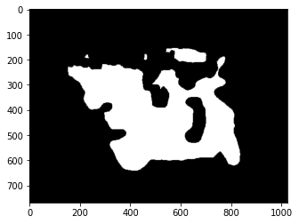
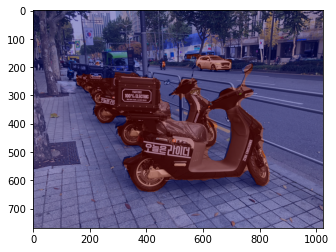

# 라이브러리 가져오기


```python
# os: Operating System의 줄임말로, 운영체제에서 제공되는 여러 기능을 파이썬에서 사용할 수 있도록 함 (Ex. 디렉토리 경로 이동, 시스템 환경 변수 가져오기 등)
# urllib: URL 작업을 위한 여러 모듈을 모은 패키지. (Ex. urllib.request, urllib.parse, ...)
# cv2: OpenCV 라이브러리로, 실시간 컴퓨터 비전을 목적으로 한 프로그래밍 라이브러리
# numpy(NumPy): 행렬이나 대규모 다차원 배열을 쉽게 처리할 수 있도록 지원하는 라이브러리. 데이터 구조 외에도 수치 계산을 위해 효율적으로 구현된 기능을 제공
# pixellib: 이미지 및 비디오 segmentation을 수행하기 위한 라이브러리. 
# pixellib.semantic: segmentation 기법 중, semantic segmentation을 쉽게 사용할 수 있도록 만든 라이브러리
# matplotlib: 파이썬 프로그래밍 언어 및 수학적 확장 NumPy 라이브러리를 활용한 플로팅 라이브러리로, 데이터 시각화 도구
import os
import urllib
import cv2
import numpy as np
from pixellib.semantic import semantic_segmentation
from matplotlib import pyplot as plt
```

    Matplotlib is building the font cache; this may take a moment.


# 이미지 가져오기


```python
# os 모듈에 있는 getenv() 함수를 이용하여 읽고싶은 파일의 경로를 file_path에 저장
# cv2.imread(경로): 경로에 해당하는 이미지 파일을 읽어서 변수에 저장
img_path = os.getenv('HOME')+'/aiffel/human_segmentation/input_images/motorbike.jpg'  
img_orig = cv2.imread(img_path) 
print(img_orig.shape)

# cv2.cvtColor(입력 이미지, 색상 변환 코드): 입력 이미지의 색상 채널을 변경
# cv2.COLOR_BGR2RGB: 이미지 색상 채널을 변경 (BGR 형식을 RGB 형식으로 변경)
# plt.imshow(): 저장된 데이터를 이미지의 형식으로 표시, 입력은 RGB(A) 데이터 혹은 2D 스칼라 데이터
# plt.show(): 현재 열려있는 모든 figure를 표시 (여기서 figure는 이미지, 그래프 등)
plt.imshow(cv2.cvtColor(img_orig, cv2.COLOR_BGR2RGB))
plt.show()
```

    (768, 1024, 3)


    

    


# 모델 불러오기


```python
# 1. os.getenv(x)함수는 환경 변수x의 값을 포함하는 문자열 변수를 반환합니다. model_dir 에 "/aiffel/human_segmentation/models" 저장
# 2. #os.path.join(a, b)는 경로를 병합하여 새 경로 생성 model_file 에 "/aiffel/aiffel/human_segmentation/models/deeplabv3_xception_tf_dim_ordering_tf_kernels.h5" 저장
# 1
model_dir = os.getenv('HOME')+'/aiffel/human_segmentation/models' 
# 2
model_file = os.path.join(model_dir, 'deeplabv3_xception_tf_dim_ordering_tf_kernels.h5') 

# PixelLib가 제공하는 모델의 url입니다
model_url = 'https://github.com/ayoolaolafenwa/PixelLib/releases/download/1.1/deeplabv3_xception_tf_dim_ordering_tf_kernels.h5' 

# 다운로드를 시작합니다
urllib.request.urlretrieve(model_url, model_file) # urllib 패키지 내에 있는 request 모듈의 urlretrieve 함수를 이용해서 model_url에 있는 파일을 다운로드 해서 model_file 파일명으로 저장
```


    ('/aiffel/aiffel/human_segmentation/models/deeplabv3_xception_tf_dim_ordering_tf_kernels.h5',
     <http.client.HTTPMessage at 0x7988cf2e8910>)


# 세그멘트 진행


```python
model = semantic_segmentation() #PixelLib 라이브러리 에서 가져온 클래스를 가져와서 semantic segmentation을 수행하는 클래스 인스턴스를 만듬
model.load_pascalvoc_model(model_file) # pascal voc에 대해 훈련된 예외 모델(model_file)을 로드하는 함수를 호출
```


```python
segvalues, output = model.segmentAsPascalvoc(img_path) # segmentAsPascalvoc()함 수 를 호출 하여 입력된 이미지를 분할, 분할 출력의 배열을 가져옴, 분할 은 pacalvoc 데이터로 학습된 모델을 이용
```


```python
#pascalvoc 데이터의 라벨종류
LABEL_NAMES = [
    'background', 'aeroplane', 'bicycle', 'bird', 'boat', 'bottle', 'bus',
    'car', 'cat', 'chair', 'cow', 'diningtable', 'dog', 'horse', 'motorbike',
    'person', 'pottedplant', 'sheep', 'sofa', 'train', 'tv'
]
len(LABEL_NAMES)
```


    21


```python
#segmentAsPascalvoc() 함수 를 호출하여 입력된 이미지를 분할한 뒤 나온 결과값 중 output을 matplotlib을 이용해 출력
plt.imshow(output)
plt.show()
```


    

    


```python
segvalues # segmentAsPascalvoc() 함수를 호출하여 입력된 이미지를 분할한 뒤 나온 결과값 중 배열값을 출력
```


    {'class_ids': array([ 0,  7, 14, 15]),
     'masks': array([[False, False, False, ..., False, False, False],
            [False, False, False, ..., False, False, False],
            [False, False, False, ..., False, False, False],
            ...,
            [False, False, False, ..., False, False, False],
            [False, False, False, ..., False, False, False],
            [False, False, False, ..., False, False, False]])}


```python
#segvalues에 있는 class_ids를 담겨있는 값을 통해 pacalvoc에 담겨있는 라벨을 출력
for class_id in segvalues['class_ids']:
    print(LABEL_NAMES[class_id])
```

    background
    car
    motorbike
    person


```python
#컬러맵 만들기 
colormap = np.zeros((256, 3), dtype = int)
ind = np.arange(256, dtype=int)

for shift in reversed(range(8)):
    for channel in range(3):
        colormap[:, channel] |= ((ind >> channel) & 1) << shift
    ind >>= 3
```


```python
print(colormap[7])
print(LABEL_NAMES[7])
```

    [128 128 128]
    car


```python
print(colormap[14])
print(LABEL_NAMES[14])
```

    [ 64 128 128]
    motorbike


```python
colormap[15]
print(LABEL_NAMES[15])
```

    person


```python
seg_color_7 = (128,128,128)
```


```python
seg_color_14 = (128,128,64)
```


```python
seg_color_15 = (128,128,192)
```


```python
seg_map_7 = np.all(output == seg_color_7, axis=-1)
seg_map_14 = np.all(output == seg_color_14, axis=-1)
seg_map_15 = np.all(output == seg_color_15, axis=-1)
```


```python
# 모든 마스크를 결합하여 하나의 seg_map 생성
combined_seg_map = seg_map_7 | seg_map_14 | seg_map_15

# 결과 시각화
print("output shape:", output.shape)
print("combined_seg_map shape:", combined_seg_map.shape)

plt.imshow(combined_seg_map, cmap='gray')
plt.show()
```

    output shape: (768, 1024, 3)
    combined_seg_map shape: (768, 1024)


    

    


```python
# 원본이미지를 img_show에 할당한뒤 객체와 배경을 분리해서 표현한 color mask를 만듦
# 이미지 로드 및 복사
img_show = img_orig.copy()

# True과 False인 값을 각각 255과 0으로 바꿔줍니다
img_mask = combined_seg_map.astype(np.uint8) * 255
# 255와 0을 적당한 색상으로 바꿔봅니다
color_mask = cv2.applyColorMap(img_mask, cv2.COLORMAP_JET)

# 이미지 시각화
plt.imshow(cv2.cvtColor(color_mask, cv2.COLOR_BGR2RGB))  # OpenCV의 BGR 이미지를 RGB로 변환하여 표시
plt.axis('off')  # 시각적으로 깔끔하게 하기 위해 축을 끔
plt.show()
```


    

    


```python
# 원본이미지와 color_mask 를 합쳐서 출력
# 0.5과 0.5는 두 이미지를 섞는 비율입니다.
img_show = cv2.addWeighted(img_show, 0.6, color_mask, 0.4, 0.0)

plt.imshow(cv2.cvtColor(img_show, cv2.COLOR_BGR2RGB))
plt.show()
```


    

    


# 배경 흐리게 하기


```python
# blurring kernel size를 조정하여 배경 흐리게 하기. (숫자가 커질수록 더 흐려짐)
img_orig_blur = cv2.blur(img_orig, (20,20))
plt.imshow(cv2.cvtColor(img_orig_blur, cv2.COLOR_BGR2RGB))
plt.show()
```


    

    


# 배경만 추출


```python
# img_mask_color 확인하기
img_mask_color = cv2.cvtColor(img_mask, cv2.COLOR_GRAY2BGR)
plt.imshow(cv2.cvtColor(img_show, cv2.COLOR_BGR2RGB))
plt.show()
```


    

    


```python
# img_bg_mask 확인하기
img_bg_mask = cv2.bitwise_not(img_mask_color)
plt.imshow(cv2.cvtColor(img_bg_mask, cv2.COLOR_BGR2RGB))
plt.show()
```


    

    


```python
# img_bg_blur 확인하기
img_bg_blur = cv2.bitwise_and(img_orig_blur, img_bg_mask)
plt.imshow(cv2.cvtColor(img_bg_blur, cv2.COLOR_BGR2RGB))
plt.show()
```


    

    


# 흐린 배경과 원본 영상 합성


```python
# np.where(조건, 참일때, 거짓일때)
# 세그멘테이션 마스크가 255인 부분만 원본 이미지 값을 가지고 오고 
# 아닌 영역은 블러된 이미지 값을 사용합니다.
img_concat = np.where(img_mask_color==255, img_orig, img_bg_blur)
# plt.imshow(): 저장된 데이터를 이미지의 형식으로 표시한다.
# cv2.cvtColor(입력 이미지, 색상 변환 코드): 입력 이미지의 색상 채널을 변경
# cv2.COLOR_BGR2RGB: 원본이 BGR 순서로 픽셀을 읽다보니 
# 이미지 색상 채널을 변경해야함 (BGR 형식을 RGB 형식으로 변경)
plt.imshow(cv2.cvtColor(img_concat, cv2.COLOR_BGR2RGB))
plt.show()
```


    

    
# 회고


실행 과정 중에 몇가지 이슈/문제점을 확인할 수 있었습니다. 
1. 파란색 동그라미: 멀리서 오고 있는 자동차 이미지임. 해당 이미지 앞에도 자동차가 있는데 그걸 잡지 못하고 한대만 잡아냄. 
2. 분홍색 동그라미: 초록색의 트럭임. 트럭이여서 자동차로 인지하지 않는지 아예 class ID 가 부여되지 않음 
3. 빨간색 동그라미: Class Id 를 보면 사람이라고 나와있지만, 오토바이를 타고 있는 사람의 오토바이 부분임. 어떤 이유가 에러를 유발하였는지 모르지만, 결과상으로는 인식을 잘못 하였음

파이썬으로 실행한 후, 해당 코드를 일반화 시켜서 플러터 통해 구현하려는데 오늘의 프로젝트 목표였지만, 코드 일반화부분이 미완되어 결국 플러터는 시작을 못하였습니다. 

```python

```
