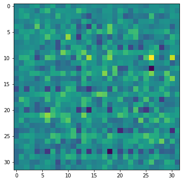

# Step 1. 라이브러리 다운로드/설치


```python
import os
import glob
import time

import PIL
import imageio
import numpy as np
import tensorflow as tf
from tensorflow.keras import layers
from IPython import display
import matplotlib.pyplot as plt
%matplotlib inline

print("tensorflow",tensorflow.__version__)
print("imageio",imageio.__version__)
```

    tensorflow 2.6.0
    imageio 2.9.0


# Step 2. 데이터셋 구성하기


```python
cifar10 = tf.keras.datasets.cifar10

(train_x, _), (test_x, _) = cifar10.load_data()

train_x.shape
```


    (50000, 32, 32, 3)


```python
# CIFAR-10 데이터셋
cifar10 = tf.keras.datasets.cifar10

(train_x, _), (test_x, _) = cifar10.load_data()

# train_x 정규화
train_x = (train_x - 127.5)/127.5

print(train_x.shape)
print(test_x.shape)
print(train_x[0].shape)
print("max pixel:", train_x.max())
print("min pixel:", train_x.min())
```

    (50000, 32, 32, 3)
    (10000, 32, 32, 3)
    (32, 32, 3)
    max pixel: 1.0
    min pixel: -1.0


```python
# train_x 배열의 첫 번째 컬러 이미지를 표시
plt.imshow(train_x[700])  # cmap 파라미터를 생략
plt.colorbar()
plt.show()
```

    Clipping input data to the valid range for imshow with RGB data ([0..1] for floats or [0..255] for integers).


    

    


```python
# 무작위로 25개 이미지 선택하여 보여주기
random_indices = np.random.choice(50000, 25, replace=False)

# 서브플롯을 위해 figure 크기 설정
plt.figure(figsize=(20, 20))

for i, index in enumerate(random_indices):
    plt.subplot(5, 5, i + 1)  # 5x5 그리드로 서브플롯 만들기
    plt.imshow(train_x[index])
    plt.title(f'index: {index}')
    plt.axis('off')

plt.show()
```

    Clipping input data to the valid range for imshow with RGB data ([0..1] for floats or [0..255] for integers).
    Clipping input data to the valid range for imshow with RGB data ([0..1] for floats or [0..255] for integers).
    Clipping input data to the valid range for imshow with RGB data ([0..1] for floats or [0..255] for integers).
    Clipping input data to the valid range for imshow with RGB data ([0..1] for floats or [0..255] for integers).
    Clipping input data to the valid range for imshow with RGB data ([0..1] for floats or [0..255] for integers).
    Clipping input data to the valid range for imshow with RGB data ([0..1] for floats or [0..255] for integers).
    Clipping input data to the valid range for imshow with RGB data ([0..1] for floats or [0..255] for integers).
    Clipping input data to the valid range for imshow with RGB data ([0..1] for floats or [0..255] for integers).
    Clipping input data to the valid range for imshow with RGB data ([0..1] for floats or [0..255] for integers).
    Clipping input data to the valid range for imshow with RGB data ([0..1] for floats or [0..255] for integers).
    Clipping input data to the valid range for imshow with RGB data ([0..1] for floats or [0..255] for integers).
    Clipping input data to the valid range for imshow with RGB data ([0..1] for floats or [0..255] for integers).
    Clipping input data to the valid range for imshow with RGB data ([0..1] for floats or [0..255] for integers).
    Clipping input data to the valid range for imshow with RGB data ([0..1] for floats or [0..255] for integers).
    Clipping input data to the valid range for imshow with RGB data ([0..1] for floats or [0..255] for integers).
    Clipping input data to the valid range for imshow with RGB data ([0..1] for floats or [0..255] for integers).
    Clipping input data to the valid range for imshow with RGB data ([0..1] for floats or [0..255] for integers).
    Clipping input data to the valid range for imshow with RGB data ([0..1] for floats or [0..255] for integers).
    Clipping input data to the valid range for imshow with RGB data ([0..1] for floats or [0..255] for integers).
    Clipping input data to the valid range for imshow with RGB data ([0..1] for floats or [0..255] for integers).
    Clipping input data to the valid range for imshow with RGB data ([0..1] for floats or [0..255] for integers).
    Clipping input data to the valid range for imshow with RGB data ([0..1] for floats or [0..255] for integers).
    Clipping input data to the valid range for imshow with RGB data ([0..1] for floats or [0..255] for integers).
    Clipping input data to the valid range for imshow with RGB data ([0..1] for floats or [0..255] for integers).
    Clipping input data to the valid range for imshow with RGB data ([0..1] for floats or [0..255] for integers).


    

    


```python
# 텐서플로우용 Dataset 준비

BUFFER_SIZE = 50000
BATCH_SIZE = 256

# 학습용 미니배치 만들기
train_dataset = tf.data.Dataset.from_tensor_slices(train_x).shuffle(BUFFER_SIZE).batch(BATCH_SIZE)
```

# Step 3. 생성자 모델 구현하기


```python
# 생성자 모델 만들기 (Kernel size 변경 5.5 -> 3.3)

def make_generator_model():
    model = tf.keras.Sequential()
    
    # 입력 형태는 잠재 공간 (잠재 벡터 크기)입니다.
    model.add(layers.Dense(8*8*256, use_bias=False, input_shape=(100,)))
    model.add(layers.BatchNormalization())
    model.add(layers.LeakyReLU())

    # Reshape 단계에서 새로운 크기로 재조정합니다.
    model.add(layers.Reshape((8, 8, 256)))
   
    # Transposed Convolution 단계들
    model.add(layers.Conv2DTranspose(128, (3, 3), strides=(1, 1), padding='same', use_bias=False))
    model.add(layers.BatchNormalization())
    model.add(layers.LeakyReLU())

    model.add(layers.Conv2DTranspose(64, (3, 3), strides=(2, 2), padding='same', use_bias=False))
 
    model.add(layers.BatchNormalization())
    model.add(layers.LeakyReLU())

    # 최종 출력 레이어, 출력은 (32, 32, 3) 형태로 RGB 이미지이므로 3 채널
    model.add(layers.Conv2DTranspose(3, (3, 3), strides=(2, 2), padding='same', use_bias=False, activation='tanh'))
 
    return model
```


```python
# 생성자 모델 확인

generator = make_generator_model()
generator.summary()
```

    Model: "sequential_5"
    _________________________________________________________________
    Layer (type)                 Output Shape              Param #   
    =================================================================
    dense_5 (Dense)              (None, 16384)             1638400   
    _________________________________________________________________
    batch_normalization_3 (Batch (None, 16384)             65536     
    _________________________________________________________________
    leaky_re_lu_11 (LeakyReLU)   (None, 16384)             0         
    _________________________________________________________________
    reshape_1 (Reshape)          (None, 8, 8, 256)         0         
    _________________________________________________________________
    conv2d_transpose_3 (Conv2DTr (None, 8, 8, 128)         294912    
    _________________________________________________________________
    batch_normalization_4 (Batch (None, 8, 8, 128)         512       
    _________________________________________________________________
    leaky_re_lu_12 (LeakyReLU)   (None, 8, 8, 128)         0         
    _________________________________________________________________
    conv2d_transpose_4 (Conv2DTr (None, 16, 16, 64)        73728     
    _________________________________________________________________
    batch_normalization_5 (Batch (None, 16, 16, 64)        256       
    _________________________________________________________________
    leaky_re_lu_13 (LeakyReLU)   (None, 16, 16, 64)        0         
    _________________________________________________________________
    conv2d_transpose_5 (Conv2DTr (None, 32, 32, 3)         1728      
    =================================================================
    Total params: 2,075,072
    Trainable params: 2,041,920
    Non-trainable params: 33,152
    _________________________________________________________________


```python
#(아직 훈련이 되지않은) 생성자를 이용해 이미지를 생성해 보기

noise = tf.random.normal([1, 100])
generated_image = generator(noise, training=False)

plt.imshow(generated_image[0, :, :, 0])
```


    <matplotlib.image.AxesImage at 0x79b56cbb6ac0>


    

    


```python
print(generated_image.shape)
```

    (1, 32, 32, 3)


# Step 4. 판별자 모델 구현하기


```python
# 판별자 모델 만들기 (Kernel size 변경 5.5 -> 3.3, Dropout 0.3 -> 0.5)

def make_discriminator_model(): # 입력 형태를 32x32x3으로 변경
    model = tensorflow.keras.Sequential() 
    model.add(layers.Conv2D(64, (3, 3), strides=(2, 2), padding='same',
                            input_shape=[32, 32, 3]))
    model.add(layers.LeakyReLU())
    model.add(layers.Dropout(0.3))

    model.add(layers.Conv2D(128, (3, 3), strides=(2, 2), padding='same'))
    model.add(layers.LeakyReLU())
    model.add(layers.Dropout(0.5))

    model.add(layers.Flatten())
    model.add(layers.Dense(1))

    return model


# 판별자 모델 확인
discriminator = make_discriminator_model()
discriminator.summary()
```

    Model: "sequential_6"
    _________________________________________________________________
    Layer (type)                 Output Shape              Param #   
    =================================================================
    conv2d_8 (Conv2D)            (None, 16, 16, 64)        1792      
    _________________________________________________________________
    leaky_re_lu_14 (LeakyReLU)   (None, 16, 16, 64)        0         
    _________________________________________________________________
    dropout_8 (Dropout)          (None, 16, 16, 64)        0         
    _________________________________________________________________
    conv2d_9 (Conv2D)            (None, 8, 8, 128)         73856     
    _________________________________________________________________
    leaky_re_lu_15 (LeakyReLU)   (None, 8, 8, 128)         0         
    _________________________________________________________________
    dropout_9 (Dropout)          (None, 8, 8, 128)         0         
    _________________________________________________________________
    flatten_4 (Flatten)          (None, 8192)              0         
    _________________________________________________________________
    dense_6 (Dense)              (None, 1)                 8193      
    =================================================================
    Total params: 83,841
    Trainable params: 83,841
    Non-trainable params: 0
    _________________________________________________________________


```python
# (아직까지 훈련이 되지 않은) 판별자를 사용하여, 생성된 이미지가 진짜인지 가짜인지 판별
discriminator = make_discriminator_model()
decision = discriminator(generated_image)
print (decision)
```

    tf.Tensor([[0.00348047]], shape=(1, 1), dtype=float32)


# STEP 5. 손실함수와 최적화 함수 구현하기


```python
# 크로스 엔트로피 손실함수 (cross entropy loss) 를 이진분류에 맞게 조정
cross_entropy = tensorflow.keras.losses.BinaryCrossentropy(from_logits=True)

# 생성자 손실함수 
def generator_loss(fake_output):
    return cross_entropy(tensorflow.ones_like(fake_output), fake_output)

# 판별자 손실함수
def discriminator_loss(real_output, fake_output):
    real_loss = cross_entropy(tensorflow.ones_like(real_output), real_output)
    fake_loss = cross_entropy(tensorflow.zeros_like(fake_output), fake_output)
    total_loss = real_loss + fake_loss
    return total_loss

# 판별자 정확도
def discriminator_accuracy(real_output, fake_output):
    real_accuracy = tf.reduce_mean(tf.cast(tf.math.greater_equal(real_output, tf.constant(0.5)), tf.float32))
    fake_accuracy = tf.reduce_mean(tf.cast(tf.math.less(fake_output, tf.constant(0.5)), tf.float32))
    return real_accuracy, fake_accuracy

# 옵티마이저 (학습률 조정 : 0.0001 -> 0.001)
generator_optimizer = tf.keras.optimizers.Adam(1e-3) # 생성자 정확도
discriminator_optimizer = tf.keras.optimizers.Adam(1e-3) # 판별자 정확도
```


```python
# 훈련 루프 정의하기 (매번 학습이 어떻게 진행되어가고 있는지를 확인하기 위해 생성자가 생성한 샘플을 확인하는 것임)
EPOCHS = 50
noise_dim = 100
num_examples_to_generate = 16
seed = tf.random.normal([num_examples_to_generate, noise_dim])
```

# STEP 6. 훈련과정 상세 기능 구현하기


```python
# 훈련 데코레이터

@tf.function
def train_step(images):   # 하나의 미니 배치 당 진행할 train_step 함수
    noise = tensorflow.random.normal([BATCH_SIZE, noise_dim])

    with tensorflow.GradientTape() as gen_tape, tensorflow.GradientTape() as disc_tape:
      generated_images = generator(noise, training=True)

      real_output = discriminator(images, training=True)
      fake_output = discriminator(generated_images, training=True)

      gen_loss = generator_loss(fake_output)
      disc_loss = discriminator_loss(real_output, fake_output)
    
      real_accuracy, fake_accuracy = discriminator_accuracy(real_output, fake_output) 

    gradients_of_generator = gen_tape.gradient(gen_loss, generator.trainable_variables)
    gradients_of_discriminator = disc_tape.gradient(disc_loss, discriminator.trainable_variables)

    generator_optimizer.apply_gradients(zip(gradients_of_generator, generator.trainable_variables))
    discriminator_optimizer.apply_gradients(zip(gradients_of_discriminator, discriminator.trainable_variables))
    
    return gen_loss, disc_loss, real_accuracy, fake_accuracy 
```


```python
# 이미지 생성 및 저장

def generate_and_save_images(model, epoch, it, sample_seeds):

    predictions = model(sample_seeds, training=False)

    fig = plt.figure(figsize=(2, 8))
    for i in range(predictions.shape[0]):
        plt.subplot(2, 8, i+1)
        plt.imshow(predictions[i, :, :, 0])
        plt.axis('off')
   
    plt.savefig('{}/aiffel/dcgan_newimage/cifar10/generated_samples/sample_epoch_{:04d}_iter_{:03d}.png'
                    .format(os.getenv('HOME'), epoch, it))

    plt.show()
```


```python
# 결과 시각화

from matplotlib.pylab import rcParams
rcParams['figure.figsize'] = 15, 6    # matlab 차트의 기본 크기를 15,6으로 지정해 줍니다.

def draw_train_history(history, epoch):
    # summarize history for loss  
    plt.subplot(211)  
    plt.plot(history['gen_loss'])  
    plt.plot(history['disc_loss'])  
    plt.title('model loss')  
    plt.ylabel('loss')  
    plt.xlabel('batch iters')  
    plt.legend(['gen_loss', 'disc_loss'], loc='upper left')  

    # summarize history for accuracy  
    plt.subplot(212)  
    plt.plot(history['fake_accuracy'])  
    plt.plot(history['real_accuracy'])  
    plt.title('discriminator accuracy')  
    plt.ylabel('accuracy')  
    plt.xlabel('batch iters')  
    plt.legend(['fake_accuracy', 'real_accuracy'], loc='upper left')  
    
    # training_history 디렉토리에 epoch별로 그래프를 이미지 파일로 저장합니다.
    plt.savefig('{}/aiffel/dcgan_newimage/cifar10/training_history/train_history_{:04d}.png'
                    .format(os.getenv('HOME'), epoch))
    plt.show()
```


```python
# 체크포인트 저장
checkpoint_dir = './aiffel/dcgan_newimage/cifar10/training_checkpoints' 
checkpoint_prefix = os.path.join(checkpoint_dir, "ckpt")
checkpoint = tf.train.Checkpoint(generator_optimizer=generator_optimizer,
                                 discriminator_optimizer=discriminator_optimizer,
                                 generator=generator,
                                 discriminator=discriminator)
```

# STEP 7. 학습 과정 진행하기


```python
def train(dataset, epochs, save_every):
    start = time.time()
    history = {'gen_loss':[], 'disc_loss':[], 'real_accuracy':[], 'fake_accuracy':[]}

    for epoch in range(epochs):
        epoch_start = time.time()
        for it, image_batch in enumerate(dataset):
            gen_loss, disc_loss, real_accuracy, fake_accuracy = train_step(image_batch)
            history['gen_loss'].append(gen_loss)
            history['disc_loss'].append(disc_loss)
            history['real_accuracy'].append(real_accuracy)
            history['fake_accuracy'].append(fake_accuracy)

            if it % 50 == 0:
                display.clear_output(wait=True)
                generate_and_save_images(generator, epoch+1, it+1, seed)
                print('Epoch {} | iter {}'.format(epoch+1, it+1))
                print('Time for epoch {} : {} sec'.format(epoch+1, int(time.time()-epoch_start)))

        if (epoch + 1) % save_every == 0:
            checkpoint.save(file_prefix=checkpoint_prefix)

        display.clear_output(wait=True)
        generate_and_save_images(generator, epochs, it, seed)
        print('Time for training : {} sec'.format(int(time.time()-start)))

        draw_train_history(history, epoch)
```


```python
# 학습하기
%time
save_every = 5
train(train_dataset, EPOCHS, save_every)
```


    

    


    Time for training : 539 sec


    

    


```python
# 체크포인트 저장
checkpoint.restore(tensorflow.train.latest_checkpoint(checkpoint_dir))
```


    <tensorflow.python.training.tracking.util.CheckpointLoadStatus at 0x79b56ef28580>


```python
# 에포크 숫자를 사용하여 하나의 이미지를 보여줍니다.
def display_image(epoch_no):
  return PIL.Image.open('image_at_epoch_{:04d}.png'.format(epoch_no))
```


```python
# GIF 생성

anim_file = os.getenv('HOME')+'/aiffel/dcgan_newimage/cifar10/cifar10_dcgan.gif'

with imageio.get_writer(anim_file, mode='I') as writer:
    filenames = glob.glob('{}/aiffel/dcgan_newimage/cifar10/generated_samples/sample*.png'.format(os.getenv('HOME')))
    filenames = sorted(filenames)
    last = -1
    for i, filename in enumerate(filenames):
        frame = 2*(i**0.5)
        if round(frame) > round(last):
            last = frame
        else:
            continue
        image = imageio.imread(filename)
        writer.append_data(image)
    image = imageio.imread(filename)
    writer.append_data(image)

!ls -l ~/aiffel/dcgan_newimage/cifar10/cifar10_dcgan.gif
```

    -rw-r--r-- 1 root root 125816 Mar 14 08:21 /aiffel/aiffel/dcgan_newimage/cifar10/cifar10_dcgan.gif


# 회고


```python
1) 노드 7을 통해 학습한 동일한 모델을 사용하여 Cifar10 을 수행하였고, 아래와 같은 변화를 주었습니다. 
 - 생성자와 판별자 모두에서 CNN 부분의 Kernel Size 를 5*5 에서 3*3 으로 변경함 : 작은 윈도우로 촘촘히 정보를 읽어낼 것이라는 전제하에.
 - 생성자와 판별자 모두의 학습률을 0.0001 에서 0.001 로 변경함: 급격한 변화가 결과에 미치는 영향을 보고자 함이 목적임
    
2) 위와 같은 결과에도 불구하고 결과적으로 생성된 이미지는 실체를 명확히 인식하기 어려운 수준이었습니다. 

3) 32*32 라는 작은 이미지 사이즈로 모델을 훈련시킨 것이 Cifar10 의 한계라는 판단하에 고해상도의 훈련 데이터로 (Google Landmark) 
훈련을 실행해보고자 하였으나, 데이터 사이즈의 한계로 인하여 학습 시간 내에 다운로드를 받지 못하여 결과 비교를 수행할 수 없었습니다. 

```
