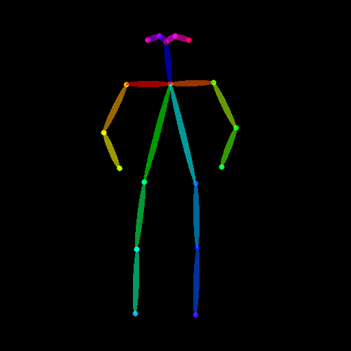

# 라이브러리 설치


```python
!pip install diffusers==0.31
```

    Requirement already satisfied: diffusers==0.31 in /opt/conda/lib/python3.9/site-packages (0.31.0)
    Requirement already satisfied: numpy in /opt/conda/lib/python3.9/site-packages (from diffusers==0.31) (1.21.4)
    Requirement already satisfied: requests in /opt/conda/lib/python3.9/site-packages (from diffusers==0.31) (2.26.0)
    Requirement already satisfied: regex!=2019.12.17 in /opt/conda/lib/python3.9/site-packages (from diffusers==0.31) (2021.11.10)
    Requirement already satisfied: filelock in /opt/conda/lib/python3.9/site-packages (from diffusers==0.31) (3.12.2)
    Requirement already satisfied: safetensors>=0.3.1 in /opt/conda/lib/python3.9/site-packages (from diffusers==0.31) (0.5.3)
    Requirement already satisfied: importlib-metadata in /opt/conda/lib/python3.9/site-packages (from diffusers==0.31) (4.8.2)
    Requirement already satisfied: huggingface-hub>=0.23.2 in /opt/conda/lib/python3.9/site-packages (from diffusers==0.31) (0.29.3)
    Requirement already satisfied: Pillow in /opt/conda/lib/python3.9/site-packages (from diffusers==0.31) (8.3.2)
    Requirement already satisfied: typing-extensions>=3.7.4.3 in /opt/conda/lib/python3.9/site-packages (from huggingface-hub>=0.23.2->diffusers==0.31) (4.7.0)
    Requirement already satisfied: tqdm>=4.42.1 in /opt/conda/lib/python3.9/site-packages (from huggingface-hub>=0.23.2->diffusers==0.31) (4.62.3)
    Requirement already satisfied: packaging>=20.9 in /opt/conda/lib/python3.9/site-packages (from huggingface-hub>=0.23.2->diffusers==0.31) (21.3)
    Requirement already satisfied: pyyaml>=5.1 in /opt/conda/lib/python3.9/site-packages (from huggingface-hub>=0.23.2->diffusers==0.31) (6.0)
    Requirement already satisfied: fsspec>=2023.5.0 in /opt/conda/lib/python3.9/site-packages (from huggingface-hub>=0.23.2->diffusers==0.31) (2025.3.0)
    Requirement already satisfied: zipp>=0.5 in /opt/conda/lib/python3.9/site-packages (from importlib-metadata->diffusers==0.31) (3.6.0)
    Requirement already satisfied: urllib3<1.27,>=1.21.1 in /opt/conda/lib/python3.9/site-packages (from requests->diffusers==0.31) (1.26.7)
    Requirement already satisfied: idna<4,>=2.5 in /opt/conda/lib/python3.9/site-packages (from requests->diffusers==0.31) (2.10)
    Requirement already satisfied: certifi>=2017.4.17 in /opt/conda/lib/python3.9/site-packages (from requests->diffusers==0.31) (2023.5.7)
    Requirement already satisfied: charset-normalizer~=2.0.0 in /opt/conda/lib/python3.9/site-packages (from requests->diffusers==0.31) (2.0.8)
    Requirement already satisfied: pyparsing!=3.0.5,>=2.0.2 in /opt/conda/lib/python3.9/site-packages (from packaging>=20.9->huggingface-hub>=0.23.2->diffusers==0.31) (3.0.6)
    WARNING: Running pip as the 'root' user can result in broken permissions and conflicting behaviour with the system package manager. It is recommended to use a virtual environment instead: https://pip.pypa.io/warnings/venv


# 윤곽선 검출


```python
import torch
from diffusers import StableDiffusionControlNetPipeline
from diffusers.utils import load_image 

# 이미지 불러오기
image = load_image(
    "https://hf.co/datasets/huggingface/documentation-images/resolve/main/diffusers/input_image_vermeer.png"
)

image
```

    
    ===================================BUG REPORT===================================
    Welcome to bitsandbytes. For bug reports, please run
    
    python -m bitsandbytes
    
     and submit this information together with your error trace to: https://github.com/TimDettmers/bitsandbytes/issues
    ================================================================================
    bin /opt/conda/lib/python3.9/site-packages/bitsandbytes/libbitsandbytes_cpu.so
    /opt/conda/lib/python3.9/site-packages/bitsandbytes/libbitsandbytes_cpu.so: undefined symbol: cadam32bit_grad_fp32
    CUDA_SETUP: WARNING! libcudart.so not found in any environmental path. Searching in backup paths...
    CUDA SETUP: Highest compute capability among GPUs detected: 7.5
    CUDA SETUP: Detected CUDA version 113
    CUDA SETUP: Loading binary /opt/conda/lib/python3.9/site-packages/bitsandbytes/libbitsandbytes_cpu.so...


    /opt/conda/lib/python3.9/site-packages/bitsandbytes/cextension.py:34: UserWarning: The installed version of bitsandbytes was compiled without GPU support. 8-bit optimizers, 8-bit multiplication, and GPU quantization are unavailable.
      warn("The installed version of bitsandbytes was compiled without GPU support. "
    /opt/conda/lib/python3.9/site-packages/bitsandbytes/cuda_setup/main.py:149: UserWarning: WARNING: The following directories listed in your path were found to be non-existent: {PosixPath('/usr/local/nvidia/lib')}
      warn(msg)
    /opt/conda/lib/python3.9/site-packages/bitsandbytes/cuda_setup/main.py:149: UserWarning: /usr/local/nvidia/lib:/usr/local/nvidia/lib64 did not contain ['libcudart.so', 'libcudart.so.11.0', 'libcudart.so.12.0'] as expected! Searching further paths...
      warn(msg)
    /opt/conda/lib/python3.9/site-packages/bitsandbytes/cuda_setup/main.py:149: UserWarning: WARNING: The following directories listed in your path were found to be non-existent: {PosixPath('//10.88.0.1'), PosixPath('tcp'), PosixPath('443')}
      warn(msg)
    /opt/conda/lib/python3.9/site-packages/bitsandbytes/cuda_setup/main.py:149: UserWarning: WARNING: The following directories listed in your path were found to be non-existent: {PosixPath('//10.88.13.255'), PosixPath('tcp'), PosixPath('8888')}
      warn(msg)
    /opt/conda/lib/python3.9/site-packages/bitsandbytes/cuda_setup/main.py:149: UserWarning: WARNING: The following directories listed in your path were found to be non-existent: {PosixPath('8887'), PosixPath('//10.88.13.255'), PosixPath('tcp')}
      warn(msg)
    /opt/conda/lib/python3.9/site-packages/bitsandbytes/cuda_setup/main.py:149: UserWarning: WARNING: The following directories listed in your path were found to be non-existent: {PosixPath('/aiffel/storage/package')}
      warn(msg)
    /opt/conda/lib/python3.9/site-packages/bitsandbytes/cuda_setup/main.py:149: UserWarning: WARNING: The following directories listed in your path were found to be non-existent: {PosixPath('//matplotlib_inline.backend_inline'), PosixPath('module')}
      warn(msg)
    /opt/conda/lib/python3.9/site-packages/bitsandbytes/cuda_setup/main.py:149: UserWarning: WARNING: The following directories listed in your path were found to be non-existent: {PosixPath('/usr/local/cuda/lib64')}
      warn(msg)
    /opt/conda/lib/python3.9/site-packages/bitsandbytes/cuda_setup/main.py:149: UserWarning: WARNING: No libcudart.so found! Install CUDA or the cudatoolkit package (anaconda)!
      warn(msg)


    

    


```python
# OpenCV 를 사용하여 이미지 윤곽선 검출
import cv2
from PIL import Image 
import numpy as np

# 이미지를 NumPy 배열로 변환합니다. 
image = np.array(image)

# threshold를 지정합니다. 
low_threshold = 100
high_threshold = 200

# 윤곽선을 검출합니다. 
image = cv2.Canny(image, low_threshold, high_threshold)
image = image[:, :, None]
image = np.concatenate([image, image, image], axis=2)
canny_image = Image.fromarray(image)  # NumPy 배열을 PIL 이미지로 변환합니다. 

canny_image
```


    

    


```python
# 윤곽선 검출을 위한 컨드롤넷과 파이프 생성
from diffusers import StableDiffusionControlNetPipeline, ControlNetModel

canny_controlnet = ControlNetModel.from_pretrained("lllyasviel/sd-controlnet-canny", torch_dtype=torch.float16)
canny_pipe = StableDiffusionControlNetPipeline.from_pretrained(
    "runwayml/stable-diffusion-v1-5", controlnet=canny_controlnet, torch_dtype=torch.float16
)
```


    Loading pipeline components...:   0%|          | 0/7 [00:00<?, ?it/s]


    `text_config_dict` is provided which will be used to initialize `CLIPTextConfig`. The value `text_config["id2label"]` will be overriden.


```python
# 윤곽선 검출을 이용하여 새 이미지 만들기 (1)

from diffusers import UniPCMultistepScheduler
canny_pipe.scheduler = UniPCMultistepScheduler.from_config(canny_pipe.scheduler.config)
canny_pipe = canny_pipe.to("cuda")

# 동일한 이미지를 생성하기 위해 seed를 지정합니다. 
generator = torch.manual_seed(1275)  

# 이미지를 생성합니다. 
canny_image = canny_pipe(
    prompt="snow-white in summer beach", 
    num_inference_steps=20, 
    generator=generator, 
    image=canny_image
).images[0]

# 생성된 이미지를 저장합니다. 
canny_image.save("/aiffel/aiffel/canny_image.png")  

# 생성된 이미지를 출력합니다. 
canny_image
```


      0%|          | 0/20 [00:00<?, ?it/s]


    

    


```python
# 윤곽선 검출을 이용하여 새 이미지 만들기 (2)
canny_image_1 = canny_pipe(
    prompt="red-hood girl in a forest", 
    negative_prompt='wolf',
    num_inference_steps=20, 
    generator=generator, 
    image=canny_image
).images[0]

# 생성된 이미지를 저장합니다. 
canny_image_1.save("/aiffel/aiffel/canny_image_1.png")  

# 생성된 이미지를 출력합니다. 
canny_image_1
```


      0%|          | 0/20 [00:00<?, ?it/s]


    

    


# 인체자세감지


```python
# controlnet-aux를 설치합니다. Human pose를 검출해주는 controlnet의 보조용 모델입니다.
!pip install controlnet-aux==0.0.1
```

    Requirement already satisfied: controlnet-aux==0.0.1 in /opt/conda/lib/python3.9/site-packages (0.0.1)
    Requirement already satisfied: einops in /opt/conda/lib/python3.9/site-packages (from controlnet-aux==0.0.1) (0.8.1)
    Requirement already satisfied: Pillow in /opt/conda/lib/python3.9/site-packages (from controlnet-aux==0.0.1) (8.3.2)
    Requirement already satisfied: huggingface-hub in /opt/conda/lib/python3.9/site-packages (from controlnet-aux==0.0.1) (0.29.3)
    Requirement already satisfied: importlib-metadata in /opt/conda/lib/python3.9/site-packages (from controlnet-aux==0.0.1) (4.8.2)
    Requirement already satisfied: opencv-python in /opt/conda/lib/python3.9/site-packages (from controlnet-aux==0.0.1) (4.5.3.56)
    Requirement already satisfied: numpy in /opt/conda/lib/python3.9/site-packages (from controlnet-aux==0.0.1) (1.21.4)
    Requirement already satisfied: scipy in /opt/conda/lib/python3.9/site-packages (from controlnet-aux==0.0.1) (1.7.1)
    Requirement already satisfied: torch in /opt/conda/lib/python3.9/site-packages (from controlnet-aux==0.0.1) (1.12.1)
    Requirement already satisfied: filelock in /opt/conda/lib/python3.9/site-packages (from controlnet-aux==0.0.1) (3.12.2)
    Requirement already satisfied: fsspec>=2023.5.0 in /opt/conda/lib/python3.9/site-packages (from huggingface-hub->controlnet-aux==0.0.1) (2025.3.0)
    Requirement already satisfied: pyyaml>=5.1 in /opt/conda/lib/python3.9/site-packages (from huggingface-hub->controlnet-aux==0.0.1) (6.0)
    Requirement already satisfied: requests in /opt/conda/lib/python3.9/site-packages (from huggingface-hub->controlnet-aux==0.0.1) (2.26.0)
    Requirement already satisfied: typing-extensions>=3.7.4.3 in /opt/conda/lib/python3.9/site-packages (from huggingface-hub->controlnet-aux==0.0.1) (4.7.0)
    Requirement already satisfied: packaging>=20.9 in /opt/conda/lib/python3.9/site-packages (from huggingface-hub->controlnet-aux==0.0.1) (21.3)
    Requirement already satisfied: tqdm>=4.42.1 in /opt/conda/lib/python3.9/site-packages (from huggingface-hub->controlnet-aux==0.0.1) (4.62.3)
    Requirement already satisfied: zipp>=0.5 in /opt/conda/lib/python3.9/site-packages (from importlib-metadata->controlnet-aux==0.0.1) (3.6.0)
    Requirement already satisfied: pyparsing!=3.0.5,>=2.0.2 in /opt/conda/lib/python3.9/site-packages (from packaging>=20.9->huggingface-hub->controlnet-aux==0.0.1) (3.0.6)
    Requirement already satisfied: charset-normalizer~=2.0.0 in /opt/conda/lib/python3.9/site-packages (from requests->huggingface-hub->controlnet-aux==0.0.1) (2.0.8)
    Requirement already satisfied: urllib3<1.27,>=1.21.1 in /opt/conda/lib/python3.9/site-packages (from requests->huggingface-hub->controlnet-aux==0.0.1) (1.26.7)
    Requirement already satisfied: certifi>=2017.4.17 in /opt/conda/lib/python3.9/site-packages (from requests->huggingface-hub->controlnet-aux==0.0.1) (2023.5.7)
    Requirement already satisfied: idna<4,>=2.5 in /opt/conda/lib/python3.9/site-packages (from requests->huggingface-hub->controlnet-aux==0.0.1) (2.10)
    WARNING: Running pip as the 'root' user can result in broken permissions and conflicting behaviour with the system package manager. It is recommended to use a virtual environment instead: https://pip.pypa.io/warnings/venv


```python
# 이미지 불러오기
from diffusers.utils import load_image

openpose_image = load_image(
    "https://huggingface.co/datasets/huggingface/documentation-images/resolve/main/diffusers/person.png"
)
openpose_image
```


    

    


```python
from controlnet_aux import OpenposeDetector

# 인체의 자세를 검출하는 사전 학습된 ControlNet 불러오기
openpose = OpenposeDetector.from_pretrained("lllyasviel/ControlNet")

# 이미지에서 자세 검출
openpose_image = openpose(openpose_image)
openpose_image
```

    cuda


    

    


```python
# Openpost 파이프라인 추출
from diffusers import StableDiffusionControlNetPipeline, ControlNetModel 

openpose_controlnet = ControlNetModel.from_pretrained("lllyasviel/sd-controlnet-openpose", torch_dtype=torch.float16)
openpose_pipe = StableDiffusionControlNetPipeline.from_pretrained(
    "runwayml/stable-diffusion-v1-5", controlnet=openpose_controlnet, torch_dtype=torch.float16
)
```


    Loading pipeline components...:   0%|          | 0/7 [00:00<?, ?it/s]


    `text_config_dict` is provided which will be used to initialize `CLIPTextConfig`. The value `text_config["id2label"]` will be overriden.


```python
# 이미지 생성(1)
from diffusers import UniPCMultistepScheduler

openpose_pipe.scheduler = UniPCMultistepScheduler.from_config(openpose_pipe.scheduler.config)
openpose_pipe = openpose_pipe.to("cuda")

# 동일한 이미지를 생성하기 위해 seed를 넣어줍니다. 
generator = torch.manual_seed(2512) 

#프롬프트를 작성합니다. 
prompt =  'elefatnt in a jungle'
negative_prompt =  'green color'

images = openpose_image

# 이미지를 생성합니다. 
openpose_image1 =openpose_pipe(
    prompt=prompt,
    negative_promprt=negative_prompt, 
    num_inference_steps=20, 
    generator=generator, 
    image=images    
).images[0]

# 생성된 이미지를 출력합니다. 
openpose_image1
```


      0%|          | 0/20 [00:00<?, ?it/s]


    

    


```python
# 이미지 생성(2)
generator = torch.manual_seed(2512) 

#프롬프트를 작성합니다. 
prompt =  'clown in winter night'
negative_prompt = 'stars'

images = openpose_image

# 이미지를 생성합니다. 
openpose_image2 =openpose_pipe(
    prompt=prompt,
    negative_promprt=negative_prompt, 
    num_inference_steps=20, 
    generator=generator, 
    image=images    
).images[0]

# 생성된 이미지를 출력합니다. 
openpose_image2
```


      0%|          | 0/20 [00:00<?, ?it/s]


    

    


# 윤곽선 검출 + 인체 자세 감지


```python
from diffusers.utils import load_image 
from PIL import Image


# 이미지 불러오기
image_test = load_image(
    "https://www.aljazeera.com/wp-content/uploads/2022/09/h_57889116.jpg")

image_test
```


    

    


```python
from PIL import Image
import cv2
import numpy as np
from diffusers.utils import load_image

import torch
from diffusers import StableDiffusionControlNetPipeline
from diffusers.utils import load_image 

# 윤곽선 검출

#threshhold를 지정합니다. 
low_threshold = 100
high_threshold = 200

# 이미지를 NumPy 배열로 변환합니다. 
image_test = np.array(image_test)

# 인체 감지 포즈를 넣어줄 가운데 부분을 지워줍니다. 
zero_start = image_test.shape[1] // 4
zero_end = zero_start + image_test.shape[1] // 2
image_test[:, zero_start:zero_end] = 0

# 윤곽선을 검출합니다. 
image_test = cv2.Canny(image_test, low_threshold, high_threshold)
image_test = image_test[:, :, None]
image_test = np.concatenate([image_test, image_test, image_test], axis=2)
canny_image_test = Image.fromarray(image_test)  # NumPy 배열을 PIL 이미지로 변환합니다. 

canny_image_test
```


    

    


```python
# 인체자세 검출
from controlnet_aux import OpenposeDetector
from diffusers.utils import load_image 

# 이미지 불러오기
image_test_1 = load_image(
    "https://cdn.incheonilbo.com/news/photo/202412/1273487_590172_291.jpg"
)
image_test_1
```


    

    


```python
# Openpose 이미지 생성 
openpose_image_test = openpose(image_test_1)
openpose_image_test
```


    

    


```python
# 윤곽선 검출과 인체자세 검출 컨트롤넷 만들기
import torch
from diffusers import StableDiffusionControlNetPipeline, ControlNetModel, UniPCMultistepScheduler  

# Canny Edge Detection ControlNet 설정
canny_controlnet = ControlNetModel.from_pretrained("lllyasviel/sd-controlnet-canny", torch_dtype=torch.float16)
canny_pipe = StableDiffusionControlNetPipeline.from_pretrained(
    "runwayml/stable-diffusion-v1-5", controlnet=canny_controlnet, torch_dtype=torch.float16
)

# Openpose ControlNet 설정
openpose_controlnet = ControlNetModel.from_pretrained("lllyasviel/sd-controlnet-openpose", torch_dtype=torch.float16)
openpose_pipe = StableDiffusionControlNetPipeline.from_pretrained(
    "runwayml/stable-diffusion-v1-5", controlnet=openpose_controlnet, torch_dtype=torch.float16
)

# 두 개의 ControlNet을 리스트로 만듭니다
controlnets = [canny_pipe, openpose_pipe]


# 리스트 controlnets를 파이프라인으로 전달합니다. 
pipe = StableDiffusionControlNetPipeline.from_pretrained(
    "runwayml/stable-diffusion-v1-5",
    controlnet=controlnets,  # ControlNet 리스트 전달
    torch_dtype=torch.float16
)

pipe.scheduler = UniPCMultistepScheduler.from_config(pipe.scheduler.config)
pipe = pipe.to("cuda")

# 프롬프트를 작성합니다. 
prompt =  'a monkey playing in a beach'
negative_prompt =  'humane'

# seed를 지정합니다. 
generator = torch.manual_seed(538) 

images = [openpose_image_test, canny_image_test]

# 이미지를 생성합니다. 
image_mixed =pipe(
    prompt=prompt,
    negative_promprt=negative_prompt, 
    num_inference_steps=20, 
    generator=generator, 
    image=images    
).images[0]

# 생성된 이미지를 저장합니다.
image_mixed.save("aiffel/aiffel/diffusers/output/image_mixed.png")

# 생성된 이미지를 출력합니다.  
image_mixed
```

    
    ===================================BUG REPORT===================================
    Welcome to bitsandbytes. For bug reports, please run
    
    python -m bitsandbytes
    
     and submit this information together with your error trace to: https://github.com/TimDettmers/bitsandbytes/issues
    ================================================================================
    bin /opt/conda/lib/python3.9/site-packages/bitsandbytes/libbitsandbytes_cpu.so
    /opt/conda/lib/python3.9/site-packages/bitsandbytes/libbitsandbytes_cpu.so: undefined symbol: cadam32bit_grad_fp32
    CUDA_SETUP: WARNING! libcudart.so not found in any environmental path. Searching in backup paths...
    CUDA SETUP: Highest compute capability among GPUs detected: 7.5
    CUDA SETUP: Detected CUDA version 113
    CUDA SETUP: Loading binary /opt/conda/lib/python3.9/site-packages/bitsandbytes/libbitsandbytes_cpu.so...


    /opt/conda/lib/python3.9/site-packages/bitsandbytes/cextension.py:34: UserWarning: The installed version of bitsandbytes was compiled without GPU support. 8-bit optimizers, 8-bit multiplication, and GPU quantization are unavailable.
      warn("The installed version of bitsandbytes was compiled without GPU support. "
    /opt/conda/lib/python3.9/site-packages/bitsandbytes/cuda_setup/main.py:149: UserWarning: WARNING: The following directories listed in your path were found to be non-existent: {PosixPath('/usr/local/nvidia/lib')}
      warn(msg)
    /opt/conda/lib/python3.9/site-packages/bitsandbytes/cuda_setup/main.py:149: UserWarning: /usr/local/nvidia/lib:/usr/local/nvidia/lib64 did not contain ['libcudart.so', 'libcudart.so.11.0', 'libcudart.so.12.0'] as expected! Searching further paths...
      warn(msg)
    /opt/conda/lib/python3.9/site-packages/bitsandbytes/cuda_setup/main.py:149: UserWarning: WARNING: The following directories listed in your path were found to be non-existent: {PosixPath('tcp'), PosixPath('//10.88.0.1'), PosixPath('443')}
      warn(msg)
    /opt/conda/lib/python3.9/site-packages/bitsandbytes/cuda_setup/main.py:149: UserWarning: WARNING: The following directories listed in your path were found to be non-existent: {PosixPath('tcp'), PosixPath('8888'), PosixPath('//10.88.13.255')}
      warn(msg)
    /opt/conda/lib/python3.9/site-packages/bitsandbytes/cuda_setup/main.py:149: UserWarning: WARNING: The following directories listed in your path were found to be non-existent: {PosixPath('tcp'), PosixPath('8887'), PosixPath('//10.88.13.255')}
      warn(msg)
    /opt/conda/lib/python3.9/site-packages/bitsandbytes/cuda_setup/main.py:149: UserWarning: WARNING: The following directories listed in your path were found to be non-existent: {PosixPath('/aiffel/storage/package')}
      warn(msg)
    /opt/conda/lib/python3.9/site-packages/bitsandbytes/cuda_setup/main.py:149: UserWarning: WARNING: The following directories listed in your path were found to be non-existent: {PosixPath('//matplotlib_inline.backend_inline'), PosixPath('module')}
      warn(msg)
    /opt/conda/lib/python3.9/site-packages/bitsandbytes/cuda_setup/main.py:149: UserWarning: WARNING: The following directories listed in your path were found to be non-existent: {PosixPath('/usr/local/cuda/lib64')}
      warn(msg)
    /opt/conda/lib/python3.9/site-packages/bitsandbytes/cuda_setup/main.py:149: UserWarning: WARNING: No libcudart.so found! Install CUDA or the cudatoolkit package (anaconda)!
      warn(msg)


    Loading pipeline components...:   0%|          | 0/7 [00:00<?, ?it/s]


    `text_config_dict` is provided which will be used to initialize `CLIPTextConfig`. The value `text_config["id2label"]` will be overriden.


    Loading pipeline components...:   0%|          | 0/7 [00:00<?, ?it/s]


    `text_config_dict` is provided which will be used to initialize `CLIPTextConfig`. The value `text_config["id2label"]` will be overriden.


    Loading pipeline components...:   0%|          | 0/7 [00:00<?, ?it/s]


    `text_config_dict` is provided which will be used to initialize `CLIPTextConfig`. The value `text_config["id2label"]` will be overriden.


<pre style="white-space:pre;overflow-x:auto;line-height:normal;font-family:Menlo,'DejaVu Sans Mono',consolas,'Courier New',monospace"><span style="color: #800000; text-decoration-color: #800000">╭─────────────────────────────── </span><span style="color: #800000; text-decoration-color: #800000; font-weight: bold">Traceback </span><span style="color: #bf7f7f; text-decoration-color: #bf7f7f; font-weight: bold">(most recent call last)</span><span style="color: #800000; text-decoration-color: #800000"> ────────────────────────────────╮</span>
<span style="color: #800000; text-decoration-color: #800000">│</span> in <span style="color: #00ff00; text-decoration-color: #00ff00">&lt;module&gt;</span>:<span style="color: #0000ff; text-decoration-color: #0000ff">22</span>                                                                                   <span style="color: #800000; text-decoration-color: #800000">│</span>
<span style="color: #800000; text-decoration-color: #800000">│</span>                                                                                                  <span style="color: #800000; text-decoration-color: #800000">│</span>
<span style="color: #800000; text-decoration-color: #800000">│</span>   <span style="color: #7f7f7f; text-decoration-color: #7f7f7f">19 </span>                                                                                            <span style="color: #800000; text-decoration-color: #800000">│</span>
<span style="color: #800000; text-decoration-color: #800000">│</span>   <span style="color: #7f7f7f; text-decoration-color: #7f7f7f">20 </span>                                                                                            <span style="color: #800000; text-decoration-color: #800000">│</span>
<span style="color: #800000; text-decoration-color: #800000">│</span>   <span style="color: #7f7f7f; text-decoration-color: #7f7f7f">21 # 리스트 controlnets를 파이프라인으로 전달합니다. </span>                                          <span style="color: #800000; text-decoration-color: #800000">│</span>
<span style="color: #800000; text-decoration-color: #800000">│</span> <span style="color: #800000; text-decoration-color: #800000">❱ </span>22 pipe = StableDiffusionControlNetPipeline.from_pretrained(                                   <span style="color: #800000; text-decoration-color: #800000">│</span>
<span style="color: #800000; text-decoration-color: #800000">│</span>   <span style="color: #7f7f7f; text-decoration-color: #7f7f7f">23 </span><span style="color: #7f7f7f; text-decoration-color: #7f7f7f">│   </span><span style="color: #808000; text-decoration-color: #808000">"runwayml/stable-diffusion-v1-5"</span>,                                                       <span style="color: #800000; text-decoration-color: #800000">│</span>
<span style="color: #800000; text-decoration-color: #800000">│</span>   <span style="color: #7f7f7f; text-decoration-color: #7f7f7f">24 </span><span style="color: #7f7f7f; text-decoration-color: #7f7f7f">│   </span>controlnet=controlnets,  <span style="color: #7f7f7f; text-decoration-color: #7f7f7f"># ControlNet 리스트 전달</span>                                       <span style="color: #800000; text-decoration-color: #800000">│</span>
<span style="color: #800000; text-decoration-color: #800000">│</span>   <span style="color: #7f7f7f; text-decoration-color: #7f7f7f">25 </span><span style="color: #7f7f7f; text-decoration-color: #7f7f7f">│   </span>torch_dtype=torch.float16                                                               <span style="color: #800000; text-decoration-color: #800000">│</span>
<span style="color: #800000; text-decoration-color: #800000">│</span>                                                                                                  <span style="color: #800000; text-decoration-color: #800000">│</span>
<span style="color: #800000; text-decoration-color: #800000">│</span> <span style="color: #bfbf7f; text-decoration-color: #bfbf7f">/opt/conda/lib/python3.9/site-packages/huggingface_hub/utils/</span><span style="color: #808000; text-decoration-color: #808000; font-weight: bold">_validators.py</span>:<span style="color: #0000ff; text-decoration-color: #0000ff">114</span> in <span style="color: #00ff00; text-decoration-color: #00ff00">_inner_fn</span>     <span style="color: #800000; text-decoration-color: #800000">│</span>
<span style="color: #800000; text-decoration-color: #800000">│</span>                                                                                                  <span style="color: #800000; text-decoration-color: #800000">│</span>
<span style="color: #800000; text-decoration-color: #800000">│</span>   <span style="color: #7f7f7f; text-decoration-color: #7f7f7f">111 </span><span style="color: #7f7f7f; text-decoration-color: #7f7f7f">│   │   </span><span style="color: #0000ff; text-decoration-color: #0000ff">if</span> check_use_auth_token:                                                           <span style="color: #800000; text-decoration-color: #800000">│</span>
<span style="color: #800000; text-decoration-color: #800000">│</span>   <span style="color: #7f7f7f; text-decoration-color: #7f7f7f">112 </span><span style="color: #7f7f7f; text-decoration-color: #7f7f7f">│   │   │   </span>kwargs = smoothly_deprecate_use_auth_token(fn_name=fn.<span style="color: #ff0000; text-decoration-color: #ff0000">__name__</span>, has_token=ha   <span style="color: #800000; text-decoration-color: #800000">│</span>
<span style="color: #800000; text-decoration-color: #800000">│</span>   <span style="color: #7f7f7f; text-decoration-color: #7f7f7f">113 </span><span style="color: #7f7f7f; text-decoration-color: #7f7f7f">│   │   </span>                                                                                   <span style="color: #800000; text-decoration-color: #800000">│</span>
<span style="color: #800000; text-decoration-color: #800000">│</span> <span style="color: #800000; text-decoration-color: #800000">❱ </span>114 <span style="color: #7f7f7f; text-decoration-color: #7f7f7f">│   │   </span><span style="color: #0000ff; text-decoration-color: #0000ff">return</span> fn(*args, **kwargs)                                                         <span style="color: #800000; text-decoration-color: #800000">│</span>
<span style="color: #800000; text-decoration-color: #800000">│</span>   <span style="color: #7f7f7f; text-decoration-color: #7f7f7f">115 </span><span style="color: #7f7f7f; text-decoration-color: #7f7f7f">│   </span>                                                                                       <span style="color: #800000; text-decoration-color: #800000">│</span>
<span style="color: #800000; text-decoration-color: #800000">│</span>   <span style="color: #7f7f7f; text-decoration-color: #7f7f7f">116 </span><span style="color: #7f7f7f; text-decoration-color: #7f7f7f">│   </span><span style="color: #0000ff; text-decoration-color: #0000ff">return</span> _inner_fn  <span style="color: #7f7f7f; text-decoration-color: #7f7f7f"># type: ignore</span>                                                       <span style="color: #800000; text-decoration-color: #800000">│</span>
<span style="color: #800000; text-decoration-color: #800000">│</span>   <span style="color: #7f7f7f; text-decoration-color: #7f7f7f">117 </span>                                                                                           <span style="color: #800000; text-decoration-color: #800000">│</span>
<span style="color: #800000; text-decoration-color: #800000">│</span>                                                                                                  <span style="color: #800000; text-decoration-color: #800000">│</span>
<span style="color: #800000; text-decoration-color: #800000">│</span> <span style="color: #bfbf7f; text-decoration-color: #bfbf7f">/opt/conda/lib/python3.9/site-packages/diffusers/pipelines/</span><span style="color: #808000; text-decoration-color: #808000; font-weight: bold">pipeline_utils.py</span>:<span style="color: #0000ff; text-decoration-color: #0000ff">948</span> in              <span style="color: #800000; text-decoration-color: #800000">│</span>
<span style="color: #800000; text-decoration-color: #800000">│</span> <span style="color: #00ff00; text-decoration-color: #00ff00">from_pretrained</span>                                                                                  <span style="color: #800000; text-decoration-color: #800000">│</span>
<span style="color: #800000; text-decoration-color: #800000">│</span>                                                                                                  <span style="color: #800000; text-decoration-color: #800000">│</span>
<span style="color: #800000; text-decoration-color: #800000">│</span>   <span style="color: #7f7f7f; text-decoration-color: #7f7f7f"> 945 </span><span style="color: #7f7f7f; text-decoration-color: #7f7f7f">│   │   │   </span>)                                                                             <span style="color: #800000; text-decoration-color: #800000">│</span>
<span style="color: #800000; text-decoration-color: #800000">│</span>   <span style="color: #7f7f7f; text-decoration-color: #7f7f7f"> 946 </span><span style="color: #7f7f7f; text-decoration-color: #7f7f7f">│   │   </span>                                                                                  <span style="color: #800000; text-decoration-color: #800000">│</span>
<span style="color: #800000; text-decoration-color: #800000">│</span>   <span style="color: #7f7f7f; text-decoration-color: #7f7f7f"> 947 </span><span style="color: #7f7f7f; text-decoration-color: #7f7f7f">│   │   </span><span style="color: #7f7f7f; text-decoration-color: #7f7f7f"># 10. Instantiate the pipeline</span>                                                    <span style="color: #800000; text-decoration-color: #800000">│</span>
<span style="color: #800000; text-decoration-color: #800000">│</span> <span style="color: #800000; text-decoration-color: #800000">❱ </span> 948 <span style="color: #7f7f7f; text-decoration-color: #7f7f7f">│   │   </span>model = pipeline_class(**init_kwargs)                                             <span style="color: #800000; text-decoration-color: #800000">│</span>
<span style="color: #800000; text-decoration-color: #800000">│</span>   <span style="color: #7f7f7f; text-decoration-color: #7f7f7f"> 949 </span><span style="color: #7f7f7f; text-decoration-color: #7f7f7f">│   │   </span>                                                                                  <span style="color: #800000; text-decoration-color: #800000">│</span>
<span style="color: #800000; text-decoration-color: #800000">│</span>   <span style="color: #7f7f7f; text-decoration-color: #7f7f7f"> 950 </span><span style="color: #7f7f7f; text-decoration-color: #7f7f7f">│   │   </span><span style="color: #7f7f7f; text-decoration-color: #7f7f7f"># 11. Save where the model was instantiated from</span>                                  <span style="color: #800000; text-decoration-color: #800000">│</span>
<span style="color: #800000; text-decoration-color: #800000">│</span>   <span style="color: #7f7f7f; text-decoration-color: #7f7f7f"> 951 </span><span style="color: #7f7f7f; text-decoration-color: #7f7f7f">│   │   </span>model.register_to_config(_name_or_path=pretrained_model_name_or_path)             <span style="color: #800000; text-decoration-color: #800000">│</span>
<span style="color: #800000; text-decoration-color: #800000">│</span>                                                                                                  <span style="color: #800000; text-decoration-color: #800000">│</span>
<span style="color: #800000; text-decoration-color: #800000">│</span> <span style="color: #bfbf7f; text-decoration-color: #bfbf7f">/opt/conda/lib/python3.9/site-packages/diffusers/pipelines/controlnet/</span><span style="color: #808000; text-decoration-color: #808000; font-weight: bold">pipeline_controlnet.py</span>:<span style="color: #0000ff; text-decoration-color: #0000ff">237</span> <span style="color: #800000; text-decoration-color: #800000">│</span>
<span style="color: #800000; text-decoration-color: #800000">│</span> in <span style="color: #00ff00; text-decoration-color: #00ff00">__init__</span>                                                                                      <span style="color: #800000; text-decoration-color: #800000">│</span>
<span style="color: #800000; text-decoration-color: #800000">│</span>                                                                                                  <span style="color: #800000; text-decoration-color: #800000">│</span>
<span style="color: #800000; text-decoration-color: #800000">│</span>   <span style="color: #7f7f7f; text-decoration-color: #7f7f7f"> 234 </span><span style="color: #7f7f7f; text-decoration-color: #7f7f7f">│   │   │   </span>)                                                                             <span style="color: #800000; text-decoration-color: #800000">│</span>
<span style="color: #800000; text-decoration-color: #800000">│</span>   <span style="color: #7f7f7f; text-decoration-color: #7f7f7f"> 235 </span><span style="color: #7f7f7f; text-decoration-color: #7f7f7f">│   │   </span>                                                                                  <span style="color: #800000; text-decoration-color: #800000">│</span>
<span style="color: #800000; text-decoration-color: #800000">│</span>   <span style="color: #7f7f7f; text-decoration-color: #7f7f7f"> 236 </span><span style="color: #7f7f7f; text-decoration-color: #7f7f7f">│   │   </span><span style="color: #0000ff; text-decoration-color: #0000ff">if</span> <span style="color: #00ffff; text-decoration-color: #00ffff">isinstance</span>(controlnet, (<span style="color: #00ffff; text-decoration-color: #00ffff">list</span>, <span style="color: #00ffff; text-decoration-color: #00ffff">tuple</span>)):                                         <span style="color: #800000; text-decoration-color: #800000">│</span>
<span style="color: #800000; text-decoration-color: #800000">│</span> <span style="color: #800000; text-decoration-color: #800000">❱ </span> 237 <span style="color: #7f7f7f; text-decoration-color: #7f7f7f">│   │   │   </span>controlnet = MultiControlNetModel(controlnet)                                 <span style="color: #800000; text-decoration-color: #800000">│</span>
<span style="color: #800000; text-decoration-color: #800000">│</span>   <span style="color: #7f7f7f; text-decoration-color: #7f7f7f"> 238 </span><span style="color: #7f7f7f; text-decoration-color: #7f7f7f">│   │   </span>                                                                                  <span style="color: #800000; text-decoration-color: #800000">│</span>
<span style="color: #800000; text-decoration-color: #800000">│</span>   <span style="color: #7f7f7f; text-decoration-color: #7f7f7f"> 239 </span><span style="color: #7f7f7f; text-decoration-color: #7f7f7f">│   │   </span><span style="color: #00ffff; text-decoration-color: #00ffff">self</span>.register_modules(                                                            <span style="color: #800000; text-decoration-color: #800000">│</span>
<span style="color: #800000; text-decoration-color: #800000">│</span>   <span style="color: #7f7f7f; text-decoration-color: #7f7f7f"> 240 </span><span style="color: #7f7f7f; text-decoration-color: #7f7f7f">│   │   │   </span>vae=vae,                                                                      <span style="color: #800000; text-decoration-color: #800000">│</span>
<span style="color: #800000; text-decoration-color: #800000">│</span>                                                                                                  <span style="color: #800000; text-decoration-color: #800000">│</span>
<span style="color: #800000; text-decoration-color: #800000">│</span> <span style="color: #bfbf7f; text-decoration-color: #bfbf7f">/opt/conda/lib/python3.9/site-packages/diffusers/pipelines/controlnet/</span><span style="color: #808000; text-decoration-color: #808000; font-weight: bold">multicontrolnet.py</span>:<span style="color: #0000ff; text-decoration-color: #0000ff">30</span> in   <span style="color: #800000; text-decoration-color: #800000">│</span>
<span style="color: #800000; text-decoration-color: #800000">│</span> <span style="color: #00ff00; text-decoration-color: #00ff00">__init__</span>                                                                                         <span style="color: #800000; text-decoration-color: #800000">│</span>
<span style="color: #800000; text-decoration-color: #800000">│</span>                                                                                                  <span style="color: #800000; text-decoration-color: #800000">│</span>
<span style="color: #800000; text-decoration-color: #800000">│</span>   <span style="color: #7f7f7f; text-decoration-color: #7f7f7f"> 27 </span><span style="color: #7f7f7f; text-decoration-color: #7f7f7f">│   </span>                                                                                       <span style="color: #800000; text-decoration-color: #800000">│</span>
<span style="color: #800000; text-decoration-color: #800000">│</span>   <span style="color: #7f7f7f; text-decoration-color: #7f7f7f"> 28 </span><span style="color: #7f7f7f; text-decoration-color: #7f7f7f">│   </span><span style="color: #0000ff; text-decoration-color: #0000ff">def</span> <span style="color: #00ff00; text-decoration-color: #00ff00">__init__</span>(<span style="color: #00ffff; text-decoration-color: #00ffff">self</span>, controlnets: Union[List[ControlNetModel], Tuple[ControlNetModel]]   <span style="color: #800000; text-decoration-color: #800000">│</span>
<span style="color: #800000; text-decoration-color: #800000">│</span>   <span style="color: #7f7f7f; text-decoration-color: #7f7f7f"> 29 </span><span style="color: #7f7f7f; text-decoration-color: #7f7f7f">│   │   </span><span style="color: #00ffff; text-decoration-color: #00ffff">super</span>().<span style="color: #00ff00; text-decoration-color: #00ff00">__init__</span>()                                                                 <span style="color: #800000; text-decoration-color: #800000">│</span>
<span style="color: #800000; text-decoration-color: #800000">│</span> <span style="color: #800000; text-decoration-color: #800000">❱ </span> 30 <span style="color: #7f7f7f; text-decoration-color: #7f7f7f">│   │   </span><span style="color: #00ffff; text-decoration-color: #00ffff">self</span>.nets = nn.ModuleList(controlnets)                                             <span style="color: #800000; text-decoration-color: #800000">│</span>
<span style="color: #800000; text-decoration-color: #800000">│</span>   <span style="color: #7f7f7f; text-decoration-color: #7f7f7f"> 31 </span><span style="color: #7f7f7f; text-decoration-color: #7f7f7f">│   </span>                                                                                       <span style="color: #800000; text-decoration-color: #800000">│</span>
<span style="color: #800000; text-decoration-color: #800000">│</span>   <span style="color: #7f7f7f; text-decoration-color: #7f7f7f"> 32 </span><span style="color: #7f7f7f; text-decoration-color: #7f7f7f">│   </span><span style="color: #0000ff; text-decoration-color: #0000ff">def</span> <span style="color: #00ff00; text-decoration-color: #00ff00">forward</span>(                                                                           <span style="color: #800000; text-decoration-color: #800000">│</span>
<span style="color: #800000; text-decoration-color: #800000">│</span>   <span style="color: #7f7f7f; text-decoration-color: #7f7f7f"> 33 </span><span style="color: #7f7f7f; text-decoration-color: #7f7f7f">│   │   </span><span style="color: #00ffff; text-decoration-color: #00ffff">self</span>,                                                                              <span style="color: #800000; text-decoration-color: #800000">│</span>
<span style="color: #800000; text-decoration-color: #800000">│</span>                                                                                                  <span style="color: #800000; text-decoration-color: #800000">│</span>
<span style="color: #800000; text-decoration-color: #800000">│</span> <span style="color: #bfbf7f; text-decoration-color: #bfbf7f">/opt/conda/lib/python3.9/site-packages/torch/nn/modules/</span><span style="color: #808000; text-decoration-color: #808000; font-weight: bold">container.py</span>:<span style="color: #0000ff; text-decoration-color: #0000ff">181</span> in <span style="color: #00ff00; text-decoration-color: #00ff00">__init__</span>             <span style="color: #800000; text-decoration-color: #800000">│</span>
<span style="color: #800000; text-decoration-color: #800000">│</span>                                                                                                  <span style="color: #800000; text-decoration-color: #800000">│</span>
<span style="color: #800000; text-decoration-color: #800000">│</span>   <span style="color: #7f7f7f; text-decoration-color: #7f7f7f">178 </span><span style="color: #7f7f7f; text-decoration-color: #7f7f7f">│   </span><span style="color: #0000ff; text-decoration-color: #0000ff">def</span> <span style="color: #00ff00; text-decoration-color: #00ff00">__init__</span>(<span style="color: #00ffff; text-decoration-color: #00ffff">self</span>, modules: Optional[Iterable[Module]] = <span style="color: #0000ff; text-decoration-color: #0000ff">None</span>) -&gt; <span style="color: #0000ff; text-decoration-color: #0000ff">None</span>:                <span style="color: #800000; text-decoration-color: #800000">│</span>
<span style="color: #800000; text-decoration-color: #800000">│</span>   <span style="color: #7f7f7f; text-decoration-color: #7f7f7f">179 </span><span style="color: #7f7f7f; text-decoration-color: #7f7f7f">│   │   </span><span style="color: #00ffff; text-decoration-color: #00ffff">super</span>(ModuleList, <span style="color: #00ffff; text-decoration-color: #00ffff">self</span>).<span style="color: #00ff00; text-decoration-color: #00ff00">__init__</span>()                                                 <span style="color: #800000; text-decoration-color: #800000">│</span>
<span style="color: #800000; text-decoration-color: #800000">│</span>   <span style="color: #7f7f7f; text-decoration-color: #7f7f7f">180 </span><span style="color: #7f7f7f; text-decoration-color: #7f7f7f">│   │   </span><span style="color: #0000ff; text-decoration-color: #0000ff">if</span> modules <span style="color: #ff00ff; text-decoration-color: #ff00ff">is</span> <span style="color: #ff00ff; text-decoration-color: #ff00ff">not</span> <span style="color: #0000ff; text-decoration-color: #0000ff">None</span>:                                                            <span style="color: #800000; text-decoration-color: #800000">│</span>
<span style="color: #800000; text-decoration-color: #800000">│</span> <span style="color: #800000; text-decoration-color: #800000">❱ </span>181 <span style="color: #7f7f7f; text-decoration-color: #7f7f7f">│   │   │   </span><span style="color: #00ffff; text-decoration-color: #00ffff">self</span> += modules                                                                <span style="color: #800000; text-decoration-color: #800000">│</span>
<span style="color: #800000; text-decoration-color: #800000">│</span>   <span style="color: #7f7f7f; text-decoration-color: #7f7f7f">182 </span><span style="color: #7f7f7f; text-decoration-color: #7f7f7f">│   </span>                                                                                       <span style="color: #800000; text-decoration-color: #800000">│</span>
<span style="color: #800000; text-decoration-color: #800000">│</span>   <span style="color: #7f7f7f; text-decoration-color: #7f7f7f">183 </span><span style="color: #7f7f7f; text-decoration-color: #7f7f7f">│   </span><span style="color: #0000ff; text-decoration-color: #0000ff">def</span> <span style="color: #00ff00; text-decoration-color: #00ff00">_get_abs_string_index</span>(<span style="color: #00ffff; text-decoration-color: #00ffff">self</span>, idx):                                                  <span style="color: #800000; text-decoration-color: #800000">│</span>
<span style="color: #800000; text-decoration-color: #800000">│</span>   <span style="color: #7f7f7f; text-decoration-color: #7f7f7f">184 </span><span style="color: #bfbfbf; text-decoration-color: #bfbfbf">│   │   </span><span style="color: #808000; text-decoration-color: #808000">"""Get the absolute index for the list of modules"""</span>                               <span style="color: #800000; text-decoration-color: #800000">│</span>
<span style="color: #800000; text-decoration-color: #800000">│</span>                                                                                                  <span style="color: #800000; text-decoration-color: #800000">│</span>
<span style="color: #800000; text-decoration-color: #800000">│</span> <span style="color: #bfbf7f; text-decoration-color: #bfbf7f">/opt/conda/lib/python3.9/site-packages/torch/nn/modules/</span><span style="color: #808000; text-decoration-color: #808000; font-weight: bold">container.py</span>:<span style="color: #0000ff; text-decoration-color: #0000ff">222</span> in <span style="color: #00ff00; text-decoration-color: #00ff00">__iadd__</span>             <span style="color: #800000; text-decoration-color: #800000">│</span>
<span style="color: #800000; text-decoration-color: #800000">│</span>                                                                                                  <span style="color: #800000; text-decoration-color: #800000">│</span>
<span style="color: #800000; text-decoration-color: #800000">│</span>   <span style="color: #7f7f7f; text-decoration-color: #7f7f7f">219 </span><span style="color: #7f7f7f; text-decoration-color: #7f7f7f">│   │   </span><span style="color: #0000ff; text-decoration-color: #0000ff">return</span> <span style="color: #00ffff; text-decoration-color: #00ffff">iter</span>(<span style="color: #00ffff; text-decoration-color: #00ffff">self</span>._modules.values())                                                <span style="color: #800000; text-decoration-color: #800000">│</span>
<span style="color: #800000; text-decoration-color: #800000">│</span>   <span style="color: #7f7f7f; text-decoration-color: #7f7f7f">220 </span><span style="color: #7f7f7f; text-decoration-color: #7f7f7f">│   </span>                                                                                       <span style="color: #800000; text-decoration-color: #800000">│</span>
<span style="color: #800000; text-decoration-color: #800000">│</span>   <span style="color: #7f7f7f; text-decoration-color: #7f7f7f">221 </span><span style="color: #7f7f7f; text-decoration-color: #7f7f7f">│   </span><span style="color: #0000ff; text-decoration-color: #0000ff">def</span> <span style="color: #00ff00; text-decoration-color: #00ff00">__iadd__</span>(<span style="color: #00ffff; text-decoration-color: #00ffff">self</span>, modules: Iterable[Module]) -&gt; <span style="color: #808000; text-decoration-color: #808000">'ModuleList'</span>:                         <span style="color: #800000; text-decoration-color: #800000">│</span>
<span style="color: #800000; text-decoration-color: #800000">│</span> <span style="color: #800000; text-decoration-color: #800000">❱ </span>222 <span style="color: #7f7f7f; text-decoration-color: #7f7f7f">│   │   </span><span style="color: #0000ff; text-decoration-color: #0000ff">return</span> <span style="color: #00ffff; text-decoration-color: #00ffff">self</span>.extend(modules)                                                        <span style="color: #800000; text-decoration-color: #800000">│</span>
<span style="color: #800000; text-decoration-color: #800000">│</span>   <span style="color: #7f7f7f; text-decoration-color: #7f7f7f">223 </span><span style="color: #7f7f7f; text-decoration-color: #7f7f7f">│   </span>                                                                                       <span style="color: #800000; text-decoration-color: #800000">│</span>
<span style="color: #800000; text-decoration-color: #800000">│</span>   <span style="color: #7f7f7f; text-decoration-color: #7f7f7f">224 </span><span style="color: #7f7f7f; text-decoration-color: #7f7f7f">│   </span><span style="color: #0000ff; text-decoration-color: #0000ff">def</span> <span style="color: #00ff00; text-decoration-color: #00ff00">__add__</span>(<span style="color: #00ffff; text-decoration-color: #00ffff">self</span>, other: Iterable[Module]) -&gt; <span style="color: #808000; text-decoration-color: #808000">'ModuleList'</span>:                            <span style="color: #800000; text-decoration-color: #800000">│</span>
<span style="color: #800000; text-decoration-color: #800000">│</span>   <span style="color: #7f7f7f; text-decoration-color: #7f7f7f">225 </span><span style="color: #7f7f7f; text-decoration-color: #7f7f7f">│   │   </span>combined = ModuleList()                                                            <span style="color: #800000; text-decoration-color: #800000">│</span>
<span style="color: #800000; text-decoration-color: #800000">│</span>                                                                                                  <span style="color: #800000; text-decoration-color: #800000">│</span>
<span style="color: #800000; text-decoration-color: #800000">│</span> <span style="color: #bfbf7f; text-decoration-color: #bfbf7f">/opt/conda/lib/python3.9/site-packages/torch/nn/modules/</span><span style="color: #808000; text-decoration-color: #808000; font-weight: bold">container.py</span>:<span style="color: #0000ff; text-decoration-color: #0000ff">267</span> in <span style="color: #00ff00; text-decoration-color: #00ff00">extend</span>               <span style="color: #800000; text-decoration-color: #800000">│</span>
<span style="color: #800000; text-decoration-color: #800000">│</span>                                                                                                  <span style="color: #800000; text-decoration-color: #800000">│</span>
<span style="color: #800000; text-decoration-color: #800000">│</span>   <span style="color: #7f7f7f; text-decoration-color: #7f7f7f">264 </span><span style="color: #7f7f7f; text-decoration-color: #7f7f7f">│   │   │   │   │   │   │   </span><span style="color: #808000; text-decoration-color: #808000">"iterable, but got "</span> + <span style="color: #00ffff; text-decoration-color: #00ffff">type</span>(modules).<span style="color: #ff0000; text-decoration-color: #ff0000">__name__</span>)                 <span style="color: #800000; text-decoration-color: #800000">│</span>
<span style="color: #800000; text-decoration-color: #800000">│</span>   <span style="color: #7f7f7f; text-decoration-color: #7f7f7f">265 </span><span style="color: #7f7f7f; text-decoration-color: #7f7f7f">│   │   </span>offset = <span style="color: #00ffff; text-decoration-color: #00ffff">len</span>(<span style="color: #00ffff; text-decoration-color: #00ffff">self</span>)                                                                 <span style="color: #800000; text-decoration-color: #800000">│</span>
<span style="color: #800000; text-decoration-color: #800000">│</span>   <span style="color: #7f7f7f; text-decoration-color: #7f7f7f">266 </span><span style="color: #7f7f7f; text-decoration-color: #7f7f7f">│   │   </span><span style="color: #0000ff; text-decoration-color: #0000ff">for</span> i, module <span style="color: #ff00ff; text-decoration-color: #ff00ff">in</span> <span style="color: #00ffff; text-decoration-color: #00ffff">enumerate</span>(modules):                                               <span style="color: #800000; text-decoration-color: #800000">│</span>
<span style="color: #800000; text-decoration-color: #800000">│</span> <span style="color: #800000; text-decoration-color: #800000">❱ </span>267 <span style="color: #7f7f7f; text-decoration-color: #7f7f7f">│   │   │   </span><span style="color: #00ffff; text-decoration-color: #00ffff">self</span>.add_module(<span style="color: #00ffff; text-decoration-color: #00ffff">str</span>(offset + i), module)                                       <span style="color: #800000; text-decoration-color: #800000">│</span>
<span style="color: #800000; text-decoration-color: #800000">│</span>   <span style="color: #7f7f7f; text-decoration-color: #7f7f7f">268 </span><span style="color: #7f7f7f; text-decoration-color: #7f7f7f">│   │   </span><span style="color: #0000ff; text-decoration-color: #0000ff">return</span> <span style="color: #00ffff; text-decoration-color: #00ffff">self</span>                                                                        <span style="color: #800000; text-decoration-color: #800000">│</span>
<span style="color: #800000; text-decoration-color: #800000">│</span>   <span style="color: #7f7f7f; text-decoration-color: #7f7f7f">269 </span><span style="color: #7f7f7f; text-decoration-color: #7f7f7f">│   </span>                                                                                       <span style="color: #800000; text-decoration-color: #800000">│</span>
<span style="color: #800000; text-decoration-color: #800000">│</span>   <span style="color: #7f7f7f; text-decoration-color: #7f7f7f">270 </span><span style="color: #7f7f7f; text-decoration-color: #7f7f7f">│   </span><span style="color: #7f7f7f; text-decoration-color: #7f7f7f"># remove forward alltogether to fallback on Module's _forward_unimplemented</span>            <span style="color: #800000; text-decoration-color: #800000">│</span>
<span style="color: #800000; text-decoration-color: #800000">│</span>                                                                                                  <span style="color: #800000; text-decoration-color: #800000">│</span>
<span style="color: #800000; text-decoration-color: #800000">│</span> <span style="color: #bfbf7f; text-decoration-color: #bfbf7f">/opt/conda/lib/python3.9/site-packages/torch/nn/modules/</span><span style="color: #808000; text-decoration-color: #808000; font-weight: bold">module.py</span>:<span style="color: #0000ff; text-decoration-color: #0000ff">382</span> in <span style="color: #00ff00; text-decoration-color: #00ff00">add_module</span>              <span style="color: #800000; text-decoration-color: #800000">│</span>
<span style="color: #800000; text-decoration-color: #800000">│</span>                                                                                                  <span style="color: #800000; text-decoration-color: #800000">│</span>
<span style="color: #800000; text-decoration-color: #800000">│</span>   <span style="color: #7f7f7f; text-decoration-color: #7f7f7f"> 379 </span><span style="color: #bfbf7f; text-decoration-color: #bfbf7f">│   │   │   </span><span style="color: #808000; text-decoration-color: #808000">module (Module): child module to be added to the module.</span>                      <span style="color: #800000; text-decoration-color: #800000">│</span>
<span style="color: #800000; text-decoration-color: #800000">│</span>   <span style="color: #7f7f7f; text-decoration-color: #7f7f7f"> 380 </span><span style="color: #bfbf7f; text-decoration-color: #bfbf7f">│   │   </span><span style="color: #808000; text-decoration-color: #808000">"""</span>                                                                               <span style="color: #800000; text-decoration-color: #800000">│</span>
<span style="color: #800000; text-decoration-color: #800000">│</span>   <span style="color: #7f7f7f; text-decoration-color: #7f7f7f"> 381 </span><span style="color: #7f7f7f; text-decoration-color: #7f7f7f">│   │   </span><span style="color: #0000ff; text-decoration-color: #0000ff">if</span> <span style="color: #ff00ff; text-decoration-color: #ff00ff">not</span> <span style="color: #00ffff; text-decoration-color: #00ffff">isinstance</span>(module, Module) <span style="color: #ff00ff; text-decoration-color: #ff00ff">and</span> module <span style="color: #ff00ff; text-decoration-color: #ff00ff">is</span> <span style="color: #ff00ff; text-decoration-color: #ff00ff">not</span> <span style="color: #0000ff; text-decoration-color: #0000ff">None</span>:                         <span style="color: #800000; text-decoration-color: #800000">│</span>
<span style="color: #800000; text-decoration-color: #800000">│</span> <span style="color: #800000; text-decoration-color: #800000">❱ </span> 382 <span style="color: #7f7f7f; text-decoration-color: #7f7f7f">│   │   │   </span><span style="color: #0000ff; text-decoration-color: #0000ff">raise</span> <span style="color: #00ffff; text-decoration-color: #00ffff">TypeError</span>(<span style="color: #808000; text-decoration-color: #808000">"{} is not a Module subclass"</span>.format(                         <span style="color: #800000; text-decoration-color: #800000">│</span>
<span style="color: #800000; text-decoration-color: #800000">│</span>   <span style="color: #7f7f7f; text-decoration-color: #7f7f7f"> 383 </span><span style="color: #7f7f7f; text-decoration-color: #7f7f7f">│   │   │   │   </span>torch.typename(module)))                                                  <span style="color: #800000; text-decoration-color: #800000">│</span>
<span style="color: #800000; text-decoration-color: #800000">│</span>   <span style="color: #7f7f7f; text-decoration-color: #7f7f7f"> 384 </span><span style="color: #7f7f7f; text-decoration-color: #7f7f7f">│   │   </span><span style="color: #0000ff; text-decoration-color: #0000ff">elif</span> <span style="color: #ff00ff; text-decoration-color: #ff00ff">not</span> <span style="color: #00ffff; text-decoration-color: #00ffff">isinstance</span>(name, torch._six.string_classes):                             <span style="color: #800000; text-decoration-color: #800000">│</span>
<span style="color: #800000; text-decoration-color: #800000">│</span>   <span style="color: #7f7f7f; text-decoration-color: #7f7f7f"> 385 </span><span style="color: #7f7f7f; text-decoration-color: #7f7f7f">│   │   │   </span><span style="color: #0000ff; text-decoration-color: #0000ff">raise</span> <span style="color: #00ffff; text-decoration-color: #00ffff">TypeError</span>(<span style="color: #808000; text-decoration-color: #808000">"module name should be a string. Got {}"</span>.format(              <span style="color: #800000; text-decoration-color: #800000">│</span>
<span style="color: #800000; text-decoration-color: #800000">╰──────────────────────────────────────────────────────────────────────────────────────────────────╯</span>
<span style="color: #ff0000; text-decoration-color: #ff0000; font-weight: bold">TypeError: </span>diffusers.pipelines.controlnet.pipeline_controlnet.StableDiffusionControlNetPipeline is not a Module 
subclass
</pre>


# 회고

- 윤곽선 검출과 인체자세 검출은 성공하지 못하였습니다. 
- 현존하는 생셩형 AI 사용으로 기술발전의 수준을 체감할 수 있는 기회가 되어서 유용했습니다. 
- 프롬프트 입력할때 기대했던 이미지들이 만들어 지지 않음이 불충분한 프롬프트로 인한 것인지 아니면 현재 생성형 AI 의 기술 수준 때문인건지가 궁금합니다. 
- 여전히 생성형 AI 의 상업적 사용의 가능성과 잠재력은 의문입니다. 
