# Step 1. 필요 라이브러리 다운로드


```python
!pip install keras-tuner
```

    Requirement already satisfied: keras-tuner in /opt/conda/lib/python3.9/site-packages (1.4.7)
    Requirement already satisfied: requests in /opt/conda/lib/python3.9/site-packages (from keras-tuner) (2.26.0)
    Requirement already satisfied: keras in /opt/conda/lib/python3.9/site-packages (from keras-tuner) (2.6.0)
    Requirement already satisfied: kt-legacy in /opt/conda/lib/python3.9/site-packages (from keras-tuner) (1.0.5)
    Requirement already satisfied: packaging in /opt/conda/lib/python3.9/site-packages (from keras-tuner) (21.3)
    Requirement already satisfied: pyparsing!=3.0.5,>=2.0.2 in /opt/conda/lib/python3.9/site-packages (from packaging->keras-tuner) (3.0.6)
    Requirement already satisfied: urllib3<1.27,>=1.21.1 in /opt/conda/lib/python3.9/site-packages (from requests->keras-tuner) (1.26.7)
    Requirement already satisfied: charset-normalizer~=2.0.0 in /opt/conda/lib/python3.9/site-packages (from requests->keras-tuner) (2.0.8)
    Requirement already satisfied: certifi>=2017.4.17 in /opt/conda/lib/python3.9/site-packages (from requests->keras-tuner) (2021.10.8)
    Requirement already satisfied: idna<4,>=2.5 in /opt/conda/lib/python3.9/site-packages (from requests->keras-tuner) (2.10)
    WARNING: Running pip as the 'root' user can result in broken permissions and conflicting behaviour with the system package manager. It is recommended to use a virtual environment instead: https://pip.pypa.io/warnings/venv


```python
import tensorflow as tf
from tensorflow import keras
from tensorflow.keras import layers
import matplotlib.pyplot as plt
import numpy as np
import keras_tuner as kt
import os
```

# Step 2. CNN 모델 구축


```python
model = keras.Sequential()
model.add(keras.Input(shape=(32, 32, 3))),  # 32x32 RGB images
model.add(layers.Conv2D(32, 3, strides=1, activation="relu")),
model.add(layers.AveragePooling2D(pool_size=(2, 2), strides=None, padding='valid'))
model.add(layers.BatchNormalization()),
model.add(layers.Conv2D(64, 3, activation="relu")),
model.add(layers.AveragePooling2D(pool_size=(2, 2), strides=None, padding='valid'))
model.add(layers.BatchNormalization()),
model.add(layers.Flatten()),
model.add(layers.Dense(256, activation='relu')),
model.add(layers.Dropout(0.5)),
model.add(layers.Dense(10, activation='relu')),

model.summary()
```

    Model: "sequential"
    _________________________________________________________________
    Layer (type)                 Output Shape              Param #   
    =================================================================
    conv2d (Conv2D)              (None, 30, 30, 32)        896       
    _________________________________________________________________
    average_pooling2d (AveragePo (None, 15, 15, 32)        0         
    _________________________________________________________________
    batch_normalization (BatchNo (None, 15, 15, 32)        128       
    _________________________________________________________________
    conv2d_1 (Conv2D)            (None, 13, 13, 64)        18496     
    _________________________________________________________________
    average_pooling2d_1 (Average (None, 6, 6, 64)          0         
    _________________________________________________________________
    batch_normalization_1 (Batch (None, 6, 6, 64)          256       
    _________________________________________________________________
    flatten (Flatten)            (None, 2304)              0         
    _________________________________________________________________
    dense (Dense)                (None, 256)               590080    
    _________________________________________________________________
    dropout (Dropout)            (None, 256)               0         
    _________________________________________________________________
    dense_1 (Dense)              (None, 10)                2570      
    =================================================================
    Total params: 612,426
    Trainable params: 612,234
    Non-trainable params: 192
    _________________________________________________________________


# Step 3. CIFAR10 자료 준비


```python
# CIFAR-10 데이터셋 로드
(X_train, y_train), (X_val, y_val) = keras.datasets.cifar10.load_data()
```


```python
# 데이터 형태 출력
print('X_train shape:', X_train.shape)
print('Number of training images:', X_train.shape[0])
print('Number of test images:', X_val.shape[0])
```

    X_train shape: (50000, 32, 32, 3)
    Number of training images: 50000
    Number of test images: 10000


```python
# 클래스 이름 정의
class_names = ['airplane', 'automobile', 'bird', 'cat', 'deer',
               'dog', 'frog', 'horse', 'ship', 'truck']

# 이미지 표시 함수
def show_samples(X_train, y_train, class_names):
    plt.figure(figsize=(10, 4))
    for i in range(10):
        plt.subplot(2, 5, i + 1)
        plt.xticks([])
        plt.yticks([])
        plt.grid(False)
        plt.imshow(X_train[i])
        plt.xlabel(class_names[y_train[i][0]])
    plt.show()

# 10개의 샘플 이미지 표시
show_samples(X_train, y_train, class_names)
```


    
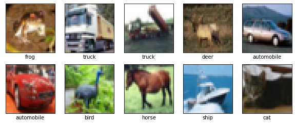
    


# Step 4. 데이터 정확성 확인


```python
# y_train의 데이터 타입 확인
print("y_train의 데이터 타입:", type(y_train))
print("y_train의 첫 번째 값 타입:", type(y_train[0]))
print("y_train의 첫 번째 값:", y_train[0])  
```

    y_train의 데이터 타입: <class 'numpy.ndarray'>
    y_train의 첫 번째 값 타입: <class 'numpy.ndarray'>
    y_train의 첫 번째 값: [6]


```python
# 클래스 수정 함수
def correct_class(image_idx, new_class_id):
    """
    이미지의 클래스를 수정하는 함수
    """
    if 0 <= image_idx < len(X_val) and 0 <= new_class_id < len(class_names):
        # 이전 클래스 ID 저장
        old_class = int(y_val[image_idx])  # 기존 클래스 값
        
        # 레이블 수정
        y_val[image_idx] = new_class_id
        
        print(f"\n이미지 {image_idx}의 클래스가 수정되었습니다:")
        print(f"이전 클래스: {class_names[old_class]} (ID: {old_class})")
        print(f"새로운 클래스: {class_names[new_class_id]} (ID: {new_class_id})")
        
        # 수정된 정보로 이미지 다시 표시
        display_image_info(image_idx)
    else:
        print("잘못된 이미지 인덱스 또는 클래스 ID입니다.")

# 이미지 정보 표시 함수
def display_image_info(image_idx):
    """
    이미지와 관련 정보를 표시하는 함수
    """
    if 0 <= image_idx < len(X_val):
        current_class = int(y_val[image_idx])
        
        print("\n===== 이미지 정보 =====")
        print(f"이미지 크기: {X_val[image_idx].shape}")
        print(f"클래스 ID: {current_class}")
        print(f"클래스 이름: {class_names[current_class]}")
        print(f"이미지 데이터 타입: {X_val[image_idx].dtype}")
        print("-"*30)
        
        plt.figure(figsize=(3, 3))
        plt.imshow(X_val[image_idx])
        plt.title(f"Class ID: {current_class}\nClass Name: {class_names[current_class]}")
        plt.axis('off')
        plt.show()
    else:
        print("잘못된 이미지 인덱스입니다.")
```


```python
display_image_info(2405)
correct_class(2405, 6)
```

    
    ===== 이미지 정보 =====
    이미지 크기: (32, 32, 3)
    클래스 ID: 3
    클래스 이름: cat
    이미지 데이터 타입: uint8
    ------------------------------


    
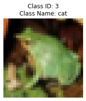
    


    
    이미지 2405의 클래스가 수정되었습니다:
    이전 클래스: cat (ID: 3)
    새로운 클래스: frog (ID: 6)
    
    ===== 이미지 정보 =====
    이미지 크기: (32, 32, 3)
    클래스 ID: 6
    클래스 이름: frog
    이미지 데이터 타입: uint8
    ------------------------------


    

    


```python
display_image_info(6877)
correct_class(6877, 8)
```

    
    ===== 이미지 정보 =====
    이미지 크기: (32, 32, 3)
    클래스 ID: 0
    클래스 이름: airplane
    이미지 데이터 타입: uint8
    ------------------------------


    

    


    
    이미지 6877의 클래스가 수정되었습니다:
    이전 클래스: airplane (ID: 0)
    새로운 클래스: ship (ID: 8)
    
    ===== 이미지 정보 =====
    이미지 크기: (32, 32, 3)
    클래스 ID: 8
    클래스 이름: ship
    이미지 데이터 타입: uint8
    ------------------------------


    

    


```python
display_image_info(8058)
correct_class(8058, 7)
```

    
    ===== 이미지 정보 =====
    이미지 크기: (32, 32, 3)
    클래스 ID: 4
    클래스 이름: deer
    이미지 데이터 타입: uint8
    ------------------------------


    

    


    
    이미지 8058의 클래스가 수정되었습니다:
    이전 클래스: deer (ID: 4)
    새로운 클래스: horse (ID: 7)
    
    ===== 이미지 정보 =====
    이미지 크기: (32, 32, 3)
    클래스 ID: 7
    클래스 이름: horse
    이미지 데이터 타입: uint8
    ------------------------------


    
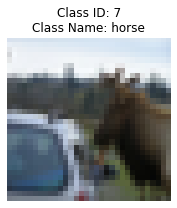
    


```python
display_image_info(2532)
correct_class(2532, 1)
```

    
    ===== 이미지 정보 =====
    이미지 크기: (32, 32, 3)
    클래스 ID: 0
    클래스 이름: airplane
    이미지 데이터 타입: uint8
    ------------------------------


    

    


    
    이미지 2532의 클래스가 수정되었습니다:
    이전 클래스: airplane (ID: 0)
    새로운 클래스: automobile (ID: 1)
    
    ===== 이미지 정보 =====
    이미지 크기: (32, 32, 3)
    클래스 ID: 1
    클래스 이름: automobile
    이미지 데이터 타입: uint8
    ------------------------------


    

    


```python
display_image_info(7657)
correct_class(7657, 7)
```

    
    ===== 이미지 정보 =====
    이미지 크기: (32, 32, 3)
    클래스 ID: 2
    클래스 이름: bird
    이미지 데이터 타입: uint8
    ------------------------------


    
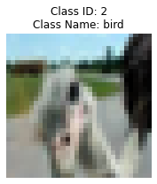
    


    
    이미지 7657의 클래스가 수정되었습니다:
    이전 클래스: bird (ID: 2)
    새로운 클래스: horse (ID: 7)
    
    ===== 이미지 정보 =====
    이미지 크기: (32, 32, 3)
    클래스 ID: 7
    클래스 이름: horse
    이미지 데이터 타입: uint8
    ------------------------------


    

    


```python
display_image_info(1969)
correct_class(1969, 9)
```

    
    ===== 이미지 정보 =====
    이미지 크기: (32, 32, 3)
    클래스 ID: 1
    클래스 이름: automobile
    이미지 데이터 타입: uint8
    ------------------------------


    

    


    
    이미지 1969의 클래스가 수정되었습니다:
    이전 클래스: automobile (ID: 1)
    새로운 클래스: truck (ID: 9)
    
    ===== 이미지 정보 =====
    이미지 크기: (32, 32, 3)
    클래스 ID: 9
    클래스 이름: truck
    이미지 데이터 타입: uint8
    ------------------------------


    

    


```python
display_image_info(2804)
correct_class(2804, 5)
```

    
    ===== 이미지 정보 =====
    이미지 크기: (32, 32, 3)
    클래스 ID: 3
    클래스 이름: cat
    이미지 데이터 타입: uint8
    ------------------------------


    
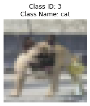
    


    
    이미지 2804의 클래스가 수정되었습니다:
    이전 클래스: cat (ID: 3)
    새로운 클래스: dog (ID: 5)
    
    ===== 이미지 정보 =====
    이미지 크기: (32, 32, 3)
    클래스 ID: 5
    클래스 이름: dog
    이미지 데이터 타입: uint8
    ------------------------------


    
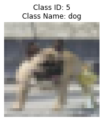
    


```python
display_image_info(6792)
correct_class(6792, 9)
```

    
    ===== 이미지 정보 =====
    이미지 크기: (32, 32, 3)
    클래스 ID: 3
    클래스 이름: cat
    이미지 데이터 타입: uint8
    ------------------------------


    

    


    
    이미지 6792의 클래스가 수정되었습니다:
    이전 클래스: cat (ID: 3)
    새로운 클래스: truck (ID: 9)
    
    ===== 이미지 정보 =====
    이미지 크기: (32, 32, 3)
    클래스 ID: 9
    클래스 이름: truck
    이미지 데이터 타입: uint8
    ------------------------------


    

    


```python
display_image_info(1227)
correct_class(1227, 5)
```

    
    ===== 이미지 정보 =====
    이미지 크기: (32, 32, 3)
    클래스 ID: 3
    클래스 이름: cat
    이미지 데이터 타입: uint8
    ------------------------------


    

    


    
    이미지 1227의 클래스가 수정되었습니다:
    이전 클래스: cat (ID: 3)
    새로운 클래스: dog (ID: 5)
    
    ===== 이미지 정보 =====
    이미지 크기: (32, 32, 3)
    클래스 ID: 5
    클래스 이름: dog
    이미지 데이터 타입: uint8
    ------------------------------


    

    


```python
display_image_info(5191)
correct_class(5191, 5)
```

    
    ===== 이미지 정보 =====
    이미지 크기: (32, 32, 3)
    클래스 ID: 3
    클래스 이름: cat
    이미지 데이터 타입: uint8
    ------------------------------


    

    


    
    이미지 5191의 클래스가 수정되었습니다:
    이전 클래스: cat (ID: 3)
    새로운 클래스: dog (ID: 5)
    
    ===== 이미지 정보 =====
    이미지 크기: (32, 32, 3)
    클래스 ID: 5
    클래스 이름: dog
    이미지 데이터 타입: uint8
    ------------------------------


    

    


```python
display_image_info(5690)
correct_class(5690, 4)
```

    
    ===== 이미지 정보 =====
    이미지 크기: (32, 32, 3)
    클래스 ID: 7
    클래스 이름: horse
    이미지 데이터 타입: uint8
    ------------------------------


    
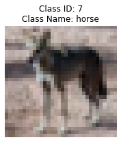
    


    
    이미지 5690의 클래스가 수정되었습니다:
    이전 클래스: horse (ID: 7)
    새로운 클래스: deer (ID: 4)
    
    ===== 이미지 정보 =====
    이미지 크기: (32, 32, 3)
    클래스 ID: 4
    클래스 이름: deer
    이미지 데이터 타입: uint8
    ------------------------------


    
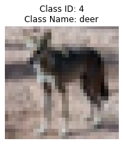
    


```python
display_image_info(1718)
correct_class(1718, 8)
```

    
    ===== 이미지 정보 =====
    이미지 크기: (32, 32, 3)
    클래스 ID: 0
    클래스 이름: airplane
    이미지 데이터 타입: uint8
    ------------------------------


    

    


    
    이미지 1718의 클래스가 수정되었습니다:
    이전 클래스: airplane (ID: 0)
    새로운 클래스: ship (ID: 8)
    
    ===== 이미지 정보 =====
    이미지 크기: (32, 32, 3)
    클래스 ID: 8
    클래스 이름: ship
    이미지 데이터 타입: uint8
    ------------------------------


    

    


```python
display_image_info(2592)
correct_class(2592, 4)
```

    
    ===== 이미지 정보 =====
    이미지 크기: (32, 32, 3)
    클래스 ID: 2
    클래스 이름: bird
    이미지 데이터 타입: uint8
    ------------------------------


    

    


    
    이미지 2592의 클래스가 수정되었습니다:
    이전 클래스: bird (ID: 2)
    새로운 클래스: deer (ID: 4)
    
    ===== 이미지 정보 =====
    이미지 크기: (32, 32, 3)
    클래스 ID: 4
    클래스 이름: deer
    이미지 데이터 타입: uint8
    ------------------------------


    

    


```python
display_image_info(4794)
correct_class(4794, 2)
```

    
    ===== 이미지 정보 =====
    이미지 크기: (32, 32, 3)
    클래스 ID: 4
    클래스 이름: deer
    이미지 데이터 타입: uint8
    ------------------------------


    

    


    
    이미지 4794의 클래스가 수정되었습니다:
    이전 클래스: deer (ID: 4)
    새로운 클래스: bird (ID: 2)
    
    ===== 이미지 정보 =====
    이미지 크기: (32, 32, 3)
    클래스 ID: 2
    클래스 이름: bird
    이미지 데이터 타입: uint8
    ------------------------------


    
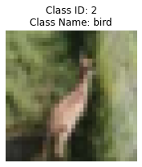
    


```python
display_image_info(5960)
correct_class(5960, 3)
```

    
    ===== 이미지 정보 =====
    이미지 크기: (32, 32, 3)
    클래스 ID: 2
    클래스 이름: bird
    이미지 데이터 타입: uint8
    ------------------------------


    

    


    
    이미지 5960의 클래스가 수정되었습니다:
    이전 클래스: bird (ID: 2)
    새로운 클래스: cat (ID: 3)
    
    ===== 이미지 정보 =====
    이미지 크기: (32, 32, 3)
    클래스 ID: 3
    클래스 이름: cat
    이미지 데이터 타입: uint8
    ------------------------------


    
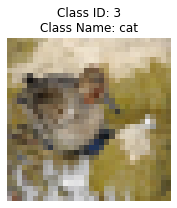
    


```python
display_image_info(165)
correct_class(165, 2)
```

    
    ===== 이미지 정보 =====
    이미지 크기: (32, 32, 3)
    클래스 ID: 4
    클래스 이름: deer
    이미지 데이터 타입: uint8
    ------------------------------


    
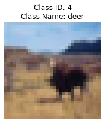
    


    
    이미지 165의 클래스가 수정되었습니다:
    이전 클래스: deer (ID: 4)
    새로운 클래스: bird (ID: 2)
    
    ===== 이미지 정보 =====
    이미지 크기: (32, 32, 3)
    클래스 ID: 2
    클래스 이름: bird
    이미지 데이터 타입: uint8
    ------------------------------


    

    


```python
display_image_info(9227)
correct_class(9227, 9)
```

    
    ===== 이미지 정보 =====
    이미지 크기: (32, 32, 3)
    클래스 ID: 1
    클래스 이름: automobile
    이미지 데이터 타입: uint8
    ------------------------------


    

    


    
    이미지 9227의 클래스가 수정되었습니다:
    이전 클래스: automobile (ID: 1)
    새로운 클래스: truck (ID: 9)
    
    ===== 이미지 정보 =====
    이미지 크기: (32, 32, 3)
    클래스 ID: 9
    클래스 이름: truck
    이미지 데이터 타입: uint8
    ------------------------------


    

    


```python
display_image_info(5632)
correct_class(5632, 5)
```

    
    ===== 이미지 정보 =====
    이미지 크기: (32, 32, 3)
    클래스 ID: 3
    클래스 이름: cat
    이미지 데이터 타입: uint8
    ------------------------------


    

    


    
    이미지 5632의 클래스가 수정되었습니다:
    이전 클래스: cat (ID: 3)
    새로운 클래스: dog (ID: 5)
    
    ===== 이미지 정보 =====
    이미지 크기: (32, 32, 3)
    클래스 ID: 5
    클래스 이름: dog
    이미지 데이터 타입: uint8
    ------------------------------


    

    


```python
display_image_info(9352)
correct_class(9352, 9)
```

    
    ===== 이미지 정보 =====
    이미지 크기: (32, 32, 3)
    클래스 ID: 1
    클래스 이름: automobile
    이미지 데이터 타입: uint8
    ------------------------------


    

    


    
    이미지 9352의 클래스가 수정되었습니다:
    이전 클래스: automobile (ID: 1)
    새로운 클래스: truck (ID: 9)
    
    ===== 이미지 정보 =====
    이미지 크기: (32, 32, 3)
    클래스 ID: 9
    클래스 이름: truck
    이미지 데이터 타입: uint8
    ------------------------------


    

    


```python
display_image_info(7846)
correct_class(7846, 3)
```

    
    ===== 이미지 정보 =====
    이미지 크기: (32, 32, 3)
    클래스 ID: 6
    클래스 이름: frog
    이미지 데이터 타입: uint8
    ------------------------------


    

    


    
    이미지 7846의 클래스가 수정되었습니다:
    이전 클래스: frog (ID: 6)
    새로운 클래스: cat (ID: 3)
    
    ===== 이미지 정보 =====
    이미지 크기: (32, 32, 3)
    클래스 ID: 3
    클래스 이름: cat
    이미지 데이터 타입: uint8
    ------------------------------


    
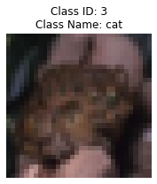
    


```python
display_image_info(6966)
correct_class(6966, 8)
```

    
    ===== 이미지 정보 =====
    이미지 크기: (32, 32, 3)
    클래스 ID: 0
    클래스 이름: airplane
    이미지 데이터 타입: uint8
    ------------------------------


    

    


    
    이미지 6966의 클래스가 수정되었습니다:
    이전 클래스: airplane (ID: 0)
    새로운 클래스: ship (ID: 8)
    
    ===== 이미지 정보 =====
    이미지 크기: (32, 32, 3)
    클래스 ID: 8
    클래스 이름: ship
    이미지 데이터 타입: uint8
    ------------------------------


    

    


```python
display_image_info(5468)
correct_class(5468, 3)
```

    
    ===== 이미지 정보 =====
    이미지 크기: (32, 32, 3)
    클래스 ID: 5
    클래스 이름: dog
    이미지 데이터 타입: uint8
    ------------------------------


    
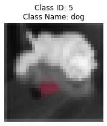
    


    
    이미지 5468의 클래스가 수정되었습니다:
    이전 클래스: dog (ID: 5)
    새로운 클래스: cat (ID: 3)
    
    ===== 이미지 정보 =====
    이미지 크기: (32, 32, 3)
    클래스 ID: 3
    클래스 이름: cat
    이미지 데이터 타입: uint8
    ------------------------------


    
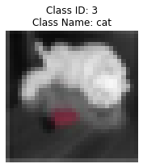
    


```python
# 데이터 전처리
# 픽셀값을 0-1 범위로 정규화
X_train = X_train.astype('float32') / 255.0
X_val = X_val.astype('float32') / 255.0

# 레이블을 원-핫 인코딩으로 변환
y_train = keras.utils.to_categorical(y_train, 10)
y_val = keras.utils.to_categorical(y_val, 10)
```

# Step 5. 하이퍼파라미터 튜닝


```python
# 하이퍼파라미터 튜닝을 위한 모델 정의
def build_model(hp):
    model = tf.keras.Sequential()
    model.add(tf.keras.Input(shape = X_train.shape[1:], name = 'inputs'))
    for i in range(hp.Int('num_layers', min_value=1, max_value=10)):
              model.add(tf.keras.layers.Conv2D(hp.Int(
                  'units_{i}'.format(i=i), min_value=32, max_value=128, step=5), (3,3),activation='relu'))
    model.add(tf.keras.layers.Flatten())
    for i in range(hp.Int('n_connections', 1, 3)):
        model.add(tf.keras.layers.Dense(hp.Choice(f'n_nodes',
                                  values=[32,64,128, 256]), activation = 'relu'))
    model.add(tf.keras.layers.Dense(10, activation='softmax', name = 'outputs'))
    model.compile(optimizer = 'adam',loss='categorical_crossentropy',
        metrics=['accuracy'])
    return model
```


```python
# 튜너 클래스 정의
class DeepTuner(kt.Tuner):
    def run_trial(self, trial, X, y, validation_data, **fit_kwargs):
        model = self.hypermodel.build(trial.hyperparameters)
        
        # validation_data를 fit 함수에 전달
        history = model.fit(
            X, y,
            batch_size=trial.hyperparameters.Choice('batch_size', [16, 32]),
            validation_data=validation_data,  # 추가된 부분
            **fit_kwargs
        )
        
        # 마지막 에포크의 validation accuracy 반환
        val_accuracy = history.history['val_accuracy'][-1]
        
        return {
            'val_accuracy': val_accuracy,
            'loss': history.history['loss'][-1],
            'accuracy': history.history['accuracy'][-1],
            'val_loss': history.history['val_loss'][-1]
        }
```


```python
# 튜너 실행

# 저장 경로 지정
save_dir = '/aiffel/mlops/cifar10_keras_tuner_dir'

cifar10_keras_tuner = DeepTuner(
    oracle=kt.oracles.BayesianOptimizationOracle(
        objective=kt.Objective('val_accuracy', 'max'),
        max_trials=10,
        seed=42),
    hypermodel=build_model,
    overwrite=True, 
    directory=save_dir,  
    project_name='cifar10_keras_tuner')

cifar10_keras_tuner.search(
    X_train, y_train, validation_data=(X_val, y_val), epochs=3)
```

    Trial 10 Complete [00h 01m 06s]
    val_accuracy: 0.5188999772071838
    
    Best val_accuracy So Far: 0.6664000153541565
    Total elapsed time: 00h 10m 04s


# Step 6. 모델 학습/평가


```python
# 최적의 파라미터를 이용한 모델 정의
best_hps = cifar10_keras_tuner.get_best_hyperparameters(num_trials=10)[0]
model = build_model(best_hps)
model.summary()
```

    Model: "sequential_12"
    _________________________________________________________________
    Layer (type)                 Output Shape              Param #   
    =================================================================
    conv2d_67 (Conv2D)           (None, 30, 30, 102)       2856      
    _________________________________________________________________
    conv2d_68 (Conv2D)           (None, 28, 28, 42)        38598     
    _________________________________________________________________
    conv2d_69 (Conv2D)           (None, 26, 26, 67)        25393     
    _________________________________________________________________
    conv2d_70 (Conv2D)           (None, 24, 24, 37)        22348     
    _________________________________________________________________
    conv2d_71 (Conv2D)           (None, 22, 22, 52)        17368     
    _________________________________________________________________
    flatten_12 (Flatten)         (None, 25168)             0         
    _________________________________________________________________
    dense_18 (Dense)             (None, 256)               6443264   
    _________________________________________________________________
    outputs (Dense)              (None, 10)                2570      
    =================================================================
    Total params: 6,552,397
    Trainable params: 6,552,397
    Non-trainable params: 0
    _________________________________________________________________


```python
# 최적의 파라미터로 재구축된 모델 학습
model.fit(X_train, y_train, batch_size=32, epochs = 5)
```

    Epoch 1/5
    1563/1563 [==============================] - 14s 9ms/step - loss: 0.2659 - accuracy: 0.9067
    Epoch 2/5
    1563/1563 [==============================] - 14s 9ms/step - loss: 0.1726 - accuracy: 0.9404
    Epoch 3/5
    1563/1563 [==============================] - 14s 9ms/step - loss: 0.1297 - accuracy: 0.9559
    Epoch 4/5
    1563/1563 [==============================] - 14s 9ms/step - loss: 0.1104 - accuracy: 0.9628
    Epoch 5/5
    1563/1563 [==============================] - 14s 9ms/step - loss: 0.1020 - accuracy: 0.9667


    <keras.callbacks.History at 0x7882cc448dc0>


```python
# 최적의 파라미터로 재구축된 모델 평가
model.evaluate(X_val, y_val)
```

    313/313 [==============================] - 1s 4ms/step - loss: 2.3524 - accuracy: 0.6373


    [2.352430582046509, 0.6373000144958496]


# Step 7. 모델 저장


```python
# 저장할 경로 설정
save_path = '/aiffel/mlops/cifar10_best_model/'
if not os.path.exists(save_path):
    os.makedirs(save_path)

# SavedModel 형식으로 저장 (keras model)
model.save(save_path, save_format='tf')  # save_format='tf'는 SavedModel 형식을 의미

print(f"모델이 다음 경로에 저장되었습니다: {save_path}")

# 저장된 모델 불러오기
loaded_model = tf.keras.models.load_model(save_path)
loaded_model.summary()
```

    INFO:tensorflow:Assets written to: /aiffel/mlops/cifar10_best_model/assets


    INFO:tensorflow:Assets written to: /aiffel/mlops/cifar10_best_model/assets


    모델이 다음 경로에 저장되었습니다: /aiffel/mlops/cifar10_best_model/
    Model: "sequential_12"
    _________________________________________________________________
    Layer (type)                 Output Shape              Param #   
    =================================================================
    conv2d_67 (Conv2D)           (None, 30, 30, 102)       2856      
    _________________________________________________________________
    conv2d_68 (Conv2D)           (None, 28, 28, 42)        38598     
    _________________________________________________________________
    conv2d_69 (Conv2D)           (None, 26, 26, 67)        25393     
    _________________________________________________________________
    conv2d_70 (Conv2D)           (None, 24, 24, 37)        22348     
    _________________________________________________________________
    conv2d_71 (Conv2D)           (None, 22, 22, 52)        17368     
    _________________________________________________________________
    flatten_12 (Flatten)         (None, 25168)             0         
    _________________________________________________________________
    dense_18 (Dense)             (None, 256)               6443264   
    _________________________________________________________________
    outputs (Dense)              (None, 10)                2570      
    =================================================================
    Total params: 6,552,397
    Trainable params: 6,552,397
    Non-trainable params: 0
    _________________________________________________________________


# Step 8. 텐서플로우 경량화 모델 구축


```python
# tensorflow 경량화 모델로 전환
converter = tf.lite.TFLiteConverter.from_keras_model(model)
tflite_model = converter.convert()
```

    INFO:tensorflow:Assets written to: /tmp/tmpeylbeodk/assets


    INFO:tensorflow:Assets written to: /tmp/tmpeylbeodk/assets


```python
# 모델 저장하기
save_path = '/aiffel/mlops/cifar10_best_model/'
model.save(save_path)

# 2. 저장된 모델 불러오기
loaded_model = tf.keras.models.load_model(save_path)

# 3. TensorFlow Lite 변환
# TFLite 변환기 생성
converter = tf.lite.TFLiteConverter.from_keras_model(loaded_model)

# 모델을 TFLite 형식으로 변환
tflite_model = converter.convert()

# TFLite 모델을 파일로 저장
tflite_path = os.path.join(save_path, 'model.tflite')
with open(tflite_path, 'wb') as f:
    f.write(tflite_model)

print(f"TFLite 모델이 저장되었습니다: {tflite_path}")
```

    INFO:tensorflow:Assets written to: /aiffel/mlops/cifar10_best_model/assets


    INFO:tensorflow:Assets written to: /aiffel/mlops/cifar10_best_model/assets


    INFO:tensorflow:Assets written to: /tmp/tmph8k5kq7f/assets


    INFO:tensorflow:Assets written to: /tmp/tmph8k5kq7f/assets


    TFLite 모델이 저장되었습니다: /aiffel/mlops/cifar10_best_model/model.tflite


# 회고

1) 하이퍼파라미터 수정을 통해 변경된 부분 중에 Layer 의 변경이 발생하였고, Base model 에서 만들었던 Layer 의 계층과는 달리 구축이 되었습니다.
2) 기본적인 모델 구조는 동일하게 두고, 모델 내에서 사용하는 파라미터를 변경을 시도한 다른 그루들의 결과와 비교하여서도 테스트 정확도가 63% 로 낮은 수준으로 나오게 되었습니다. 
3) build_model 함수를 만들때, 기본 모델의 구조를 반영하여 작성해봤으면 하는 (즉, Batch normalisation 을 포함한다는지, Pooling Layer 를 삽입한다던지) 아쉬움이 남습니다. 
