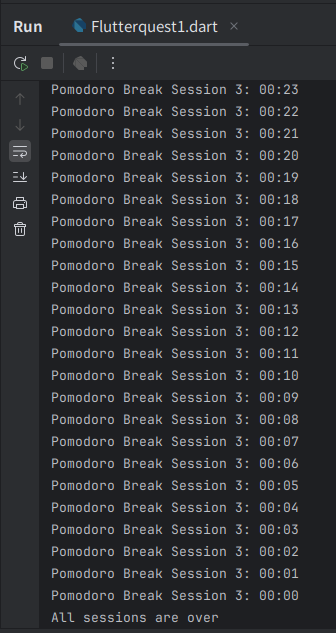
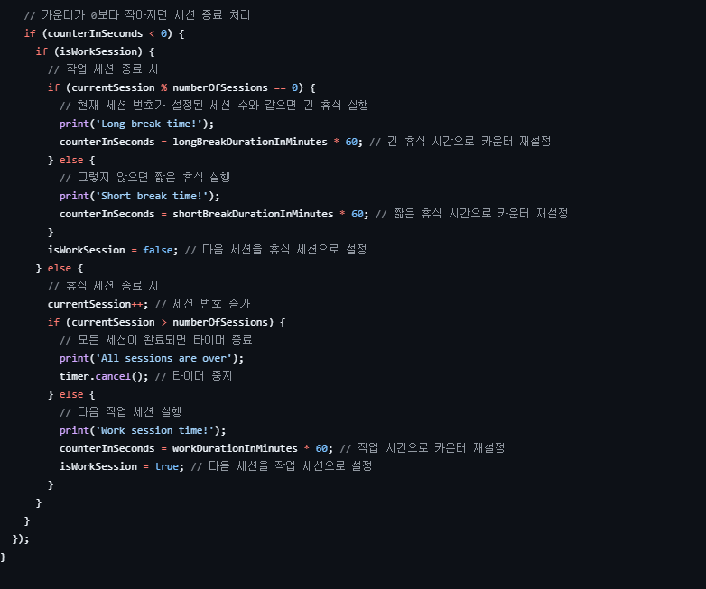
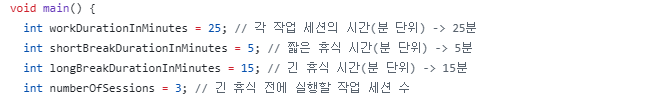
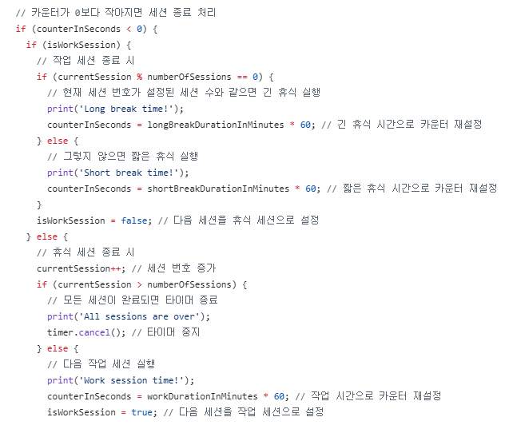

# AIFFEL Campus Online Code Peer Review Templete
- 코더 : 채남병
- 리뷰어 : 이은솔


# PRT(Peer Review Template)
- [x]  **1. 주어진 문제를 해결하는 완성된 코드가 제출되었나요?**
    - 기능이 모두 잘 작동되었다.  출력값을 모두 확인하였다.
    - 
    
- [x]  **2. 전체 코드에서 가장 핵심적이거나 가장 복잡하고 이해하기 어려운 부분에 작성된 
주석 또는 doc string을 보고 해당 코드가 잘 이해되었나요?**
    - 코드마다 주석이 모두 잘 달려있다.
    - 어떤 기능을 하는지 확인 할수 있는 내용이 작성되었다.
    - 
        
- [x]  **3. 에러가 난 부분을 디버깅하여 문제를 해결한 기록을 남겼거나
새로운 시도 또는 추가 실험을 수행해봤나요?**
    - 문제 원인 및 해결 과정은 기록되어 있지 않다.
    - 다만 코드 리뷰 과정에서 잘못 작성된 코드가 발견되어, 이에 대해 추가 설명을 하였다.
    - 
        
- [x]  **4. 회고를 잘 작성했나요?**
    - 주어진 문제를 해결하는 코드에 대해 배운점과 아쉬운점, 느낀점 등이 기록되어 있다.
    - 
        
- [ ]  **5. 코드가 간결하고 효율적인가요?**
    - if (isWorkSession)와 else 부분(긴 휴식 시간과 짧은 휴식 시간을 처리하는 부분)에서 비슷한 로직이 반복되므로 이를 하나의 함수로 묶으면 코드가 더 간결해질 것이다.
    - 


# 회고(참고 링크 및 코드 개선)
```
지금까지 학습한 범위 내에서 코드를 구현하신 점이 놀라웠습니다. 학습했던 부분이라 설명해주실 때 잘 이해할 수 있었습니다. 도움이 많이 되었습니다.
```
