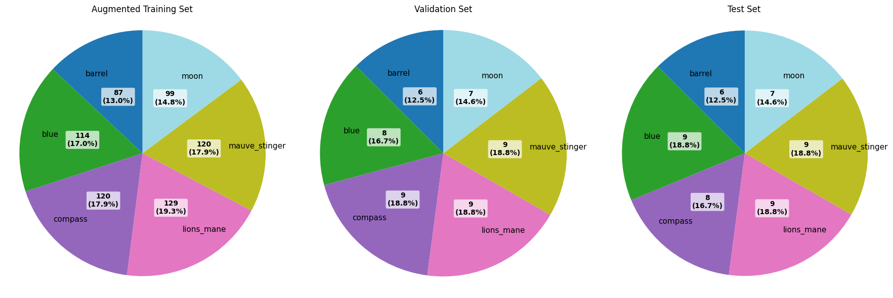

**모듈 불러오기


```python
import tensorflow as tf
from tensorflow.keras import layers, models
from tensorflow.keras.applications import ResNet50
from tensorflow.keras.models import Model
from tensorflow.keras.layers import Dense, GlobalAveragePooling2D
from tensorflow.keras.applications import MobileNetV2
from tensorflow.keras.preprocessing.image import ImageDataGenerator
from tensorflow.keras.applications import DenseNet121
from tensorflow.keras.layers import GlobalAveragePooling2D, Dense, Dropout
from tensorflow.keras.optimizers import Adam
from tensorflow.keras.callbacks import EarlyStopping
from tensorflow.keras import layers, models, optimizers, regularizers

import matplotlib.pyplot as plt
import numpy as np
from pathlib import Path
import pathlib
import os
from sklearn.model_selection import train_test_split
from sklearn.metrics import confusion_matrix, classification_report
import shutil

```

**1. 데이터분석


```python
# 1.2.No 증감 데이터 세트 

# 홈 디렉토리 경로를 확장
home = str(Path.home())

# 원본 데이터 경로와 출력 경로 설정
data_dir = os.path.join(home, 'aiffel/jellyfish')  # 원본 데이터 경로
output_dir = os.path.join(home, 'aiffel/jellyfish/no_aug')  # 증강되지 않은 데이터를 저장할 새 경로


# tf.data.Dataset 생성
dataset = tf.keras.utils.image_dataset_from_directory(
    data_dir,
    batch_size=32,
    image_size=(224, 224),
    shuffle=True
)


# 포함할 폴더 이름
use_folders = [
    "barrel",
    "blue",
    "compass",
    "lions_mane",
    "mauve_stinger",
    "moon"
]


# 클래스 확인
class_names = ["barrel",
    "blue",
    "compass",
    "lions_mane",
    "mauve_stinger",
    "moon"]    

# 각 클래스별 이미지 수를 저장할 딕셔너리
image_counts = {}

# 출력 디렉토리 생성
os.makedirs(output_dir, exist_ok=True)

# 각 폴더(클래스) 순회
for class_name in os.listdir(data_dir):
    class_path = os.path.join(data_dir, class_name)

    if os.path.isdir(class_path):  # 폴더인지 확인
        if class_name in use_folders:  # 포함할 폴더인지 확인
            # 새로운 클래스 폴더 생성
            new_class_path = os.path.join(output_dir, class_name)
            os.makedirs(new_class_path, exist_ok=True)

            # 파일 복사 ('aug'가 없는 파일만)
            for filename in os.listdir(class_path):
                if 'aug' not in filename:  # 'aug'가 없는 파일만 선택
                    src_path = os.path.join(class_path, filename)
                    dst_path = os.path.join(new_class_path, filename)
                    shutil.copy2(src_path, dst_path)
                    print(f"복사된 파일: {dst_path}")

            # 복사된 파일 수 계산
            copied_files = len([f for f in os.listdir(new_class_path) if os.path.isfile(os.path.join(new_class_path, f))])
            image_counts[class_name] = copied_files

# 결과 출력
print("\n각 클래스별 복사된 이미지 수:")
for class_name, count in image_counts.items():
    print(f"{class_name}: {count}개")

print(f"\n데이터가 다음 경로에 저장되었습니다: {output_dir}")
print("클래스 이름:", class_names)
```

    Found 2198 files belonging to 9 classes.
    복사된 파일: /aiffel/aiffel/jellyfish/no_aug/mauve_stinger/51.jpg
    복사된 파일: /aiffel/aiffel/jellyfish/no_aug/mauve_stinger/53.jpg
    복사된 파일: /aiffel/aiffel/jellyfish/no_aug/mauve_stinger/03.jpg
    복사된 파일: /aiffel/aiffel/jellyfish/no_aug/mauve_stinger/09.jpg
    복사된 파일: /aiffel/aiffel/jellyfish/no_aug/mauve_stinger/42.jpg
    복사된 파일: /aiffel/aiffel/jellyfish/no_aug/mauve_stinger/49.jpg
    복사된 파일: /aiffel/aiffel/jellyfish/no_aug/mauve_stinger/36.jpg
    복사된 파일: /aiffel/aiffel/jellyfish/no_aug/mauve_stinger/22.jpg
    복사된 파일: /aiffel/aiffel/jellyfish/no_aug/mauve_stinger/30.jpg
    복사된 파일: /aiffel/aiffel/jellyfish/no_aug/mauve_stinger/04.jpg
    복사된 파일: /aiffel/aiffel/jellyfish/no_aug/mauve_stinger/11.jpg
    복사된 파일: /aiffel/aiffel/jellyfish/no_aug/mauve_stinger/32.jpg
    복사된 파일: /aiffel/aiffel/jellyfish/no_aug/mauve_stinger/45.jpg
    복사된 파일: /aiffel/aiffel/jellyfish/no_aug/mauve_stinger/46.jpg
    복사된 파일: /aiffel/aiffel/jellyfish/no_aug/mauve_stinger/21.jpg
    복사된 파일: /aiffel/aiffel/jellyfish/no_aug/mauve_stinger/62.jpg
    복사된 파일: /aiffel/aiffel/jellyfish/no_aug/mauve_stinger/66.JPG
    복사된 파일: /aiffel/aiffel/jellyfish/no_aug/mauve_stinger/16.jpg
    복사된 파일: /aiffel/aiffel/jellyfish/no_aug/mauve_stinger/68.jpg
    복사된 파일: /aiffel/aiffel/jellyfish/no_aug/mauve_stinger/35.JPG
    복사된 파일: /aiffel/aiffel/jellyfish/no_aug/mauve_stinger/28.jpg
    복사된 파일: /aiffel/aiffel/jellyfish/no_aug/mauve_stinger/57.jpg
    복사된 파일: /aiffel/aiffel/jellyfish/no_aug/mauve_stinger/15.jpg
    복사된 파일: /aiffel/aiffel/jellyfish/no_aug/mauve_stinger/01.jpg
    복사된 파일: /aiffel/aiffel/jellyfish/no_aug/mauve_stinger/18.jpg
    복사된 파일: /aiffel/aiffel/jellyfish/no_aug/mauve_stinger/40.jpg
    복사된 파일: /aiffel/aiffel/jellyfish/no_aug/mauve_stinger/47.jpg
    복사된 파일: /aiffel/aiffel/jellyfish/no_aug/mauve_stinger/56.JPG
    복사된 파일: /aiffel/aiffel/jellyfish/no_aug/mauve_stinger/72.jpg
    복사된 파일: /aiffel/aiffel/jellyfish/no_aug/mauve_stinger/59.jpg
    복사된 파일: /aiffel/aiffel/jellyfish/no_aug/mauve_stinger/64.jpg
    복사된 파일: /aiffel/aiffel/jellyfish/no_aug/mauve_stinger/02.jpg
    복사된 파일: /aiffel/aiffel/jellyfish/no_aug/mauve_stinger/06.jpg
    복사된 파일: /aiffel/aiffel/jellyfish/no_aug/mauve_stinger/31.jpg
    복사된 파일: /aiffel/aiffel/jellyfish/no_aug/mauve_stinger/54.jpg
    복사된 파일: /aiffel/aiffel/jellyfish/no_aug/mauve_stinger/37.jpg
    복사된 파일: /aiffel/aiffel/jellyfish/no_aug/mauve_stinger/08.jpg
    복사된 파일: /aiffel/aiffel/jellyfish/no_aug/mauve_stinger/13.jpg
    복사된 파일: /aiffel/aiffel/jellyfish/no_aug/mauve_stinger/41.jpg
    복사된 파일: /aiffel/aiffel/jellyfish/no_aug/mauve_stinger/55.jpg
    복사된 파일: /aiffel/aiffel/jellyfish/no_aug/mauve_stinger/33.jpg
    복사된 파일: /aiffel/aiffel/jellyfish/no_aug/mauve_stinger/39.jpg
    복사된 파일: /aiffel/aiffel/jellyfish/no_aug/mauve_stinger/12.jpg
    복사된 파일: /aiffel/aiffel/jellyfish/no_aug/mauve_stinger/52.jpg
    복사된 파일: /aiffel/aiffel/jellyfish/no_aug/mauve_stinger/24.jpg
    복사된 파일: /aiffel/aiffel/jellyfish/no_aug/mauve_stinger/50.jpg
    복사된 파일: /aiffel/aiffel/jellyfish/no_aug/mauve_stinger/20.jpg
    복사된 파일: /aiffel/aiffel/jellyfish/no_aug/mauve_stinger/29.jpg
    복사된 파일: /aiffel/aiffel/jellyfish/no_aug/mauve_stinger/71.jpg
    복사된 파일: /aiffel/aiffel/jellyfish/no_aug/mauve_stinger/44.jpg
    복사된 파일: /aiffel/aiffel/jellyfish/no_aug/mauve_stinger/17.jpg
    복사된 파일: /aiffel/aiffel/jellyfish/no_aug/mauve_stinger/05.jpg
    복사된 파일: /aiffel/aiffel/jellyfish/no_aug/mauve_stinger/25.jpg
    복사된 파일: /aiffel/aiffel/jellyfish/no_aug/mauve_stinger/23.jpg
    복사된 파일: /aiffel/aiffel/jellyfish/no_aug/mauve_stinger/65.jpg
    복사된 파일: /aiffel/aiffel/jellyfish/no_aug/mauve_stinger/63.jpg
    복사된 파일: /aiffel/aiffel/jellyfish/no_aug/mauve_stinger/58.jpg
    복사된 파일: /aiffel/aiffel/jellyfish/no_aug/mauve_stinger/43.jpg
    복사된 파일: /aiffel/aiffel/jellyfish/no_aug/compass/51.jpg
    복사된 파일: /aiffel/aiffel/jellyfish/no_aug/compass/53.jpg
    복사된 파일: /aiffel/aiffel/jellyfish/no_aug/compass/03.jpg
    복사된 파일: /aiffel/aiffel/jellyfish/no_aug/compass/09.jpg
    복사된 파일: /aiffel/aiffel/jellyfish/no_aug/compass/42.jpg
    복사된 파일: /aiffel/aiffel/jellyfish/no_aug/compass/49.jpg
    복사된 파일: /aiffel/aiffel/jellyfish/no_aug/compass/36.jpg
    복사된 파일: /aiffel/aiffel/jellyfish/no_aug/compass/30.jpg
    복사된 파일: /aiffel/aiffel/jellyfish/no_aug/compass/07.jpg
    복사된 파일: /aiffel/aiffel/jellyfish/no_aug/compass/32.jpg
    복사된 파일: /aiffel/aiffel/jellyfish/no_aug/compass/45.jpg
    복사된 파일: /aiffel/aiffel/jellyfish/no_aug/compass/35.jpg
    복사된 파일: /aiffel/aiffel/jellyfish/no_aug/compass/21.jpg
    복사된 파일: /aiffel/aiffel/jellyfish/no_aug/compass/62.jpg
    복사된 파일: /aiffel/aiffel/jellyfish/no_aug/compass/16.jpg
    복사된 파일: /aiffel/aiffel/jellyfish/no_aug/compass/57.jpg
    복사된 파일: /aiffel/aiffel/jellyfish/no_aug/compass/15.jpg
    복사된 파일: /aiffel/aiffel/jellyfish/no_aug/compass/71.jpeg
    복사된 파일: /aiffel/aiffel/jellyfish/no_aug/compass/18.jpg
    복사된 파일: /aiffel/aiffel/jellyfish/no_aug/compass/47.jpg
    복사된 파일: /aiffel/aiffel/jellyfish/no_aug/compass/72.jpg
    복사된 파일: /aiffel/aiffel/jellyfish/no_aug/compass/59.jpg
    복사된 파일: /aiffel/aiffel/jellyfish/no_aug/compass/22.JPG
    복사된 파일: /aiffel/aiffel/jellyfish/no_aug/compass/10.jpg
    복사된 파일: /aiffel/aiffel/jellyfish/no_aug/compass/64.jpg
    복사된 파일: /aiffel/aiffel/jellyfish/no_aug/compass/02.jpg
    복사된 파일: /aiffel/aiffel/jellyfish/no_aug/compass/06.jpg
    복사된 파일: /aiffel/aiffel/jellyfish/no_aug/compass/31.jpg
    복사된 파일: /aiffel/aiffel/jellyfish/no_aug/compass/14.jpg
    복사된 파일: /aiffel/aiffel/jellyfish/no_aug/compass/61.jpg
    복사된 파일: /aiffel/aiffel/jellyfish/no_aug/compass/08.jpg
    복사된 파일: /aiffel/aiffel/jellyfish/no_aug/compass/13.jpg
    복사된 파일: /aiffel/aiffel/jellyfish/no_aug/compass/27.jpg
    복사된 파일: /aiffel/aiffel/jellyfish/no_aug/compass/55.jpg
    복사된 파일: /aiffel/aiffel/jellyfish/no_aug/compass/38.jpg
    복사된 파일: /aiffel/aiffel/jellyfish/no_aug/compass/33.jpg
    복사된 파일: /aiffel/aiffel/jellyfish/no_aug/compass/39.jpg
    복사된 파일: /aiffel/aiffel/jellyfish/no_aug/compass/12.jpg
    복사된 파일: /aiffel/aiffel/jellyfish/no_aug/compass/70.jpeg
    복사된 파일: /aiffel/aiffel/jellyfish/no_aug/compass/60.jpg
    복사된 파일: /aiffel/aiffel/jellyfish/no_aug/compass/24.jpg
    복사된 파일: /aiffel/aiffel/jellyfish/no_aug/compass/50.jpg
    복사된 파일: /aiffel/aiffel/jellyfish/no_aug/compass/34.jpg
    복사된 파일: /aiffel/aiffel/jellyfish/no_aug/compass/29.jpg
    복사된 파일: /aiffel/aiffel/jellyfish/no_aug/compass/44.jpg
    복사된 파일: /aiffel/aiffel/jellyfish/no_aug/compass/17.jpg
    복사된 파일: /aiffel/aiffel/jellyfish/no_aug/compass/05.jpg
    복사된 파일: /aiffel/aiffel/jellyfish/no_aug/compass/25.jpg
    복사된 파일: /aiffel/aiffel/jellyfish/no_aug/compass/23.jpg
    복사된 파일: /aiffel/aiffel/jellyfish/no_aug/compass/65.jpg
    복사된 파일: /aiffel/aiffel/jellyfish/no_aug/compass/63.jpg
    복사된 파일: /aiffel/aiffel/jellyfish/no_aug/compass/66.jpg
    복사된 파일: /aiffel/aiffel/jellyfish/no_aug/compass/19.jpg
    복사된 파일: /aiffel/aiffel/jellyfish/no_aug/compass/58.jpg
    복사된 파일: /aiffel/aiffel/jellyfish/no_aug/compass/01.JPG
    복사된 파일: /aiffel/aiffel/jellyfish/no_aug/compass/68.jpeg
    복사된 파일: /aiffel/aiffel/jellyfish/no_aug/compass/43.jpg
    복사된 파일: /aiffel/aiffel/jellyfish/no_aug/barrel/03.jpg
    복사된 파일: /aiffel/aiffel/jellyfish/no_aug/barrel/42.jpg
    복사된 파일: /aiffel/aiffel/jellyfish/no_aug/barrel/49.jpg
    복사된 파일: /aiffel/aiffel/jellyfish/no_aug/barrel/36.jpg
    복사된 파일: /aiffel/aiffel/jellyfish/no_aug/barrel/22.jpg
    복사된 파일: /aiffel/aiffel/jellyfish/no_aug/barrel/30.jpg
    복사된 파일: /aiffel/aiffel/jellyfish/no_aug/barrel/07.jpg
    복사된 파일: /aiffel/aiffel/jellyfish/no_aug/barrel/04.jpg
    복사된 파일: /aiffel/aiffel/jellyfish/no_aug/barrel/11.jpg
    복사된 파일: /aiffel/aiffel/jellyfish/no_aug/barrel/45.jpg
    복사된 파일: /aiffel/aiffel/jellyfish/no_aug/barrel/35.jpg
    복사된 파일: /aiffel/aiffel/jellyfish/no_aug/barrel/46.jpg
    복사된 파일: /aiffel/aiffel/jellyfish/no_aug/barrel/01.jpeg
    복사된 파일: /aiffel/aiffel/jellyfish/no_aug/barrel/21.jpg
    복사된 파일: /aiffel/aiffel/jellyfish/no_aug/barrel/28.jpg
    복사된 파일: /aiffel/aiffel/jellyfish/no_aug/barrel/15.jpg
    복사된 파일: /aiffel/aiffel/jellyfish/no_aug/barrel/48.jpg
    복사된 파일: /aiffel/aiffel/jellyfish/no_aug/barrel/18.jpg
    복사된 파일: /aiffel/aiffel/jellyfish/no_aug/barrel/40.jpg
    복사된 파일: /aiffel/aiffel/jellyfish/no_aug/barrel/39.JPG
    복사된 파일: /aiffel/aiffel/jellyfish/no_aug/barrel/47.jpg
    복사된 파일: /aiffel/aiffel/jellyfish/no_aug/barrel/10.jpg
    복사된 파일: /aiffel/aiffel/jellyfish/no_aug/barrel/02.jpg
    복사된 파일: /aiffel/aiffel/jellyfish/no_aug/barrel/06.jpg
    복사된 파일: /aiffel/aiffel/jellyfish/no_aug/barrel/31.jpg
    복사된 파일: /aiffel/aiffel/jellyfish/no_aug/barrel/14.jpg
    복사된 파일: /aiffel/aiffel/jellyfish/no_aug/barrel/37.jpg
    복사된 파일: /aiffel/aiffel/jellyfish/no_aug/barrel/13.jpg
    복사된 파일: /aiffel/aiffel/jellyfish/no_aug/barrel/27.jpg
    복사된 파일: /aiffel/aiffel/jellyfish/no_aug/barrel/41.jpg
    복사된 파일: /aiffel/aiffel/jellyfish/no_aug/barrel/32.JPG
    복사된 파일: /aiffel/aiffel/jellyfish/no_aug/barrel/38.jpg
    복사된 파일: /aiffel/aiffel/jellyfish/no_aug/barrel/33.jpg
    복사된 파일: /aiffel/aiffel/jellyfish/no_aug/barrel/12.jpg
    복사된 파일: /aiffel/aiffel/jellyfish/no_aug/barrel/24.jpg
    복사된 파일: /aiffel/aiffel/jellyfish/no_aug/barrel/34.jpg
    복사된 파일: /aiffel/aiffel/jellyfish/no_aug/barrel/20.jpg
    복사된 파일: /aiffel/aiffel/jellyfish/no_aug/barrel/29.jpg
    복사된 파일: /aiffel/aiffel/jellyfish/no_aug/barrel/17.jpg
    복사된 파일: /aiffel/aiffel/jellyfish/no_aug/barrel/05.jpg
    복사된 파일: /aiffel/aiffel/jellyfish/no_aug/barrel/25.jpg
    복사된 파일: /aiffel/aiffel/jellyfish/no_aug/blue/51.jpg
    복사된 파일: /aiffel/aiffel/jellyfish/no_aug/blue/53.jpg
    복사된 파일: /aiffel/aiffel/jellyfish/no_aug/blue/03.jpg
    복사된 파일: /aiffel/aiffel/jellyfish/no_aug/blue/09.jpg
    복사된 파일: /aiffel/aiffel/jellyfish/no_aug/blue/42.jpg
    복사된 파일: /aiffel/aiffel/jellyfish/no_aug/blue/49.jpg
    복사된 파일: /aiffel/aiffel/jellyfish/no_aug/blue/36.jpg
    복사된 파일: /aiffel/aiffel/jellyfish/no_aug/blue/07.jpg
    복사된 파일: /aiffel/aiffel/jellyfish/no_aug/blue/04.jpg
    복사된 파일: /aiffel/aiffel/jellyfish/no_aug/blue/11.jpg
    복사된 파일: /aiffel/aiffel/jellyfish/no_aug/blue/32.jpg
    복사된 파일: /aiffel/aiffel/jellyfish/no_aug/blue/45.jpg
    복사된 파일: /aiffel/aiffel/jellyfish/no_aug/blue/46.jpg
    복사된 파일: /aiffel/aiffel/jellyfish/no_aug/blue/67.jpg
    복사된 파일: /aiffel/aiffel/jellyfish/no_aug/blue/21.jpg
    복사된 파일: /aiffel/aiffel/jellyfish/no_aug/blue/62.jpg
    복사된 파일: /aiffel/aiffel/jellyfish/no_aug/blue/69.jpg
    복사된 파일: /aiffel/aiffel/jellyfish/no_aug/blue/26.jpg
    복사된 파일: /aiffel/aiffel/jellyfish/no_aug/blue/28.jpg
    복사된 파일: /aiffel/aiffel/jellyfish/no_aug/blue/57.jpg
    복사된 파일: /aiffel/aiffel/jellyfish/no_aug/blue/15.jpg
    복사된 파일: /aiffel/aiffel/jellyfish/no_aug/blue/18.jpg
    복사된 파일: /aiffel/aiffel/jellyfish/no_aug/blue/40.jpg
    복사된 파일: /aiffel/aiffel/jellyfish/no_aug/blue/59.jpg
    복사된 파일: /aiffel/aiffel/jellyfish/no_aug/blue/64.jpg
    복사된 파일: /aiffel/aiffel/jellyfish/no_aug/blue/02.jpg
    복사된 파일: /aiffel/aiffel/jellyfish/no_aug/blue/06.jpg
    복사된 파일: /aiffel/aiffel/jellyfish/no_aug/blue/31.jpg
    복사된 파일: /aiffel/aiffel/jellyfish/no_aug/blue/54.jpg
    복사된 파일: /aiffel/aiffel/jellyfish/no_aug/blue/61.jpg
    복사된 파일: /aiffel/aiffel/jellyfish/no_aug/blue/37.jpg
    복사된 파일: /aiffel/aiffel/jellyfish/no_aug/blue/56.jpg
    복사된 파일: /aiffel/aiffel/jellyfish/no_aug/blue/08.jpg
    복사된 파일: /aiffel/aiffel/jellyfish/no_aug/blue/13.jpg
    복사된 파일: /aiffel/aiffel/jellyfish/no_aug/blue/27.jpg
    복사된 파일: /aiffel/aiffel/jellyfish/no_aug/blue/41.jpg
    복사된 파일: /aiffel/aiffel/jellyfish/no_aug/blue/55.jpg
    복사된 파일: /aiffel/aiffel/jellyfish/no_aug/blue/38.jpg
    복사된 파일: /aiffel/aiffel/jellyfish/no_aug/blue/39.jpg
    복사된 파일: /aiffel/aiffel/jellyfish/no_aug/blue/60.jpg
    복사된 파일: /aiffel/aiffel/jellyfish/no_aug/blue/52.jpg
    복사된 파일: /aiffel/aiffel/jellyfish/no_aug/blue/68.png
    복사된 파일: /aiffel/aiffel/jellyfish/no_aug/blue/50.jpg
    복사된 파일: /aiffel/aiffel/jellyfish/no_aug/blue/34.jpg
    복사된 파일: /aiffel/aiffel/jellyfish/no_aug/blue/20.jpg
    복사된 파일: /aiffel/aiffel/jellyfish/no_aug/blue/29.jpg
    복사된 파일: /aiffel/aiffel/jellyfish/no_aug/blue/44.jpg
    복사된 파일: /aiffel/aiffel/jellyfish/no_aug/blue/17.jpg
    복사된 파일: /aiffel/aiffel/jellyfish/no_aug/blue/25.jpg
    복사된 파일: /aiffel/aiffel/jellyfish/no_aug/blue/23.jpg
    복사된 파일: /aiffel/aiffel/jellyfish/no_aug/blue/65.jpg
    복사된 파일: /aiffel/aiffel/jellyfish/no_aug/blue/63.jpg
    복사된 파일: /aiffel/aiffel/jellyfish/no_aug/blue/66.jpg
    복사된 파일: /aiffel/aiffel/jellyfish/no_aug/blue/58.jpg
    복사된 파일: /aiffel/aiffel/jellyfish/no_aug/blue/43.jpg
    복사된 파일: /aiffel/aiffel/jellyfish/no_aug/moon/51.jpg
    복사된 파일: /aiffel/aiffel/jellyfish/no_aug/moon/53.jpg
    복사된 파일: /aiffel/aiffel/jellyfish/no_aug/moon/03.jpg
    복사된 파일: /aiffel/aiffel/jellyfish/no_aug/moon/42.jpg
    복사된 파일: /aiffel/aiffel/jellyfish/no_aug/moon/49.jpg
    복사된 파일: /aiffel/aiffel/jellyfish/no_aug/moon/36.jpg
    복사된 파일: /aiffel/aiffel/jellyfish/no_aug/moon/22.jpg
    복사된 파일: /aiffel/aiffel/jellyfish/no_aug/moon/30.jpg
    복사된 파일: /aiffel/aiffel/jellyfish/no_aug/moon/04.jpg
    복사된 파일: /aiffel/aiffel/jellyfish/no_aug/moon/32.jpg
    복사된 파일: /aiffel/aiffel/jellyfish/no_aug/moon/45.jpg
    복사된 파일: /aiffel/aiffel/jellyfish/no_aug/moon/35.jpg
    복사된 파일: /aiffel/aiffel/jellyfish/no_aug/moon/46.jpg
    복사된 파일: /aiffel/aiffel/jellyfish/no_aug/moon/21.jpg
    복사된 파일: /aiffel/aiffel/jellyfish/no_aug/moon/16.jpg
    복사된 파일: /aiffel/aiffel/jellyfish/no_aug/moon/26.jpg
    복사된 파일: /aiffel/aiffel/jellyfish/no_aug/moon/28.jpg
    복사된 파일: /aiffel/aiffel/jellyfish/no_aug/moon/57.jpg
    복사된 파일: /aiffel/aiffel/jellyfish/no_aug/moon/01.jpg
    복사된 파일: /aiffel/aiffel/jellyfish/no_aug/moon/18.jpg
    복사된 파일: /aiffel/aiffel/jellyfish/no_aug/moon/40.jpg
    복사된 파일: /aiffel/aiffel/jellyfish/no_aug/moon/47.jpg
    복사된 파일: /aiffel/aiffel/jellyfish/no_aug/moon/10.jpg
    복사된 파일: /aiffel/aiffel/jellyfish/no_aug/moon/02.jpg
    복사된 파일: /aiffel/aiffel/jellyfish/no_aug/moon/06.jpg
    복사된 파일: /aiffel/aiffel/jellyfish/no_aug/moon/31.jpg
    복사된 파일: /aiffel/aiffel/jellyfish/no_aug/moon/14.jpg
    복사된 파일: /aiffel/aiffel/jellyfish/no_aug/moon/54.jpg
    복사된 파일: /aiffel/aiffel/jellyfish/no_aug/moon/61.jpg
    복사된 파일: /aiffel/aiffel/jellyfish/no_aug/moon/37.jpg
    복사된 파일: /aiffel/aiffel/jellyfish/no_aug/moon/56.jpg
    복사된 파일: /aiffel/aiffel/jellyfish/no_aug/moon/08.jpg
    복사된 파일: /aiffel/aiffel/jellyfish/no_aug/moon/13.jpg
    복사된 파일: /aiffel/aiffel/jellyfish/no_aug/moon/41.jpg
    복사된 파일: /aiffel/aiffel/jellyfish/no_aug/moon/55.jpg
    복사된 파일: /aiffel/aiffel/jellyfish/no_aug/moon/38.jpg
    복사된 파일: /aiffel/aiffel/jellyfish/no_aug/moon/12.jpg
    복사된 파일: /aiffel/aiffel/jellyfish/no_aug/moon/24.jpg
    복사된 파일: /aiffel/aiffel/jellyfish/no_aug/moon/50.jpg
    복사된 파일: /aiffel/aiffel/jellyfish/no_aug/moon/34.jpg
    복사된 파일: /aiffel/aiffel/jellyfish/no_aug/moon/52.JPG
    복사된 파일: /aiffel/aiffel/jellyfish/no_aug/moon/17.jpg
    복사된 파일: /aiffel/aiffel/jellyfish/no_aug/moon/05.jpg
    복사된 파일: /aiffel/aiffel/jellyfish/no_aug/moon/25.jpg
    복사된 파일: /aiffel/aiffel/jellyfish/no_aug/moon/29.JPG
    복사된 파일: /aiffel/aiffel/jellyfish/no_aug/moon/58.jpg
    복사된 파일: /aiffel/aiffel/jellyfish/no_aug/moon/43.jpg
    복사된 파일: /aiffel/aiffel/jellyfish/no_aug/lions_mane/03.jpg
    복사된 파일: /aiffel/aiffel/jellyfish/no_aug/lions_mane/09.jpg
    복사된 파일: /aiffel/aiffel/jellyfish/no_aug/lions_mane/49.jpg
    복사된 파일: /aiffel/aiffel/jellyfish/no_aug/lions_mane/36.jpg
    복사된 파일: /aiffel/aiffel/jellyfish/no_aug/lions_mane/22.jpg
    복사된 파일: /aiffel/aiffel/jellyfish/no_aug/lions_mane/30.jpg
    복사된 파일: /aiffel/aiffel/jellyfish/no_aug/lions_mane/07.jpg
    복사된 파일: /aiffel/aiffel/jellyfish/no_aug/lions_mane/04.jpg
    복사된 파일: /aiffel/aiffel/jellyfish/no_aug/lions_mane/11.jpg
    복사된 파일: /aiffel/aiffel/jellyfish/no_aug/lions_mane/32.jpg
    복사된 파일: /aiffel/aiffel/jellyfish/no_aug/lions_mane/45.jpg
    복사된 파일: /aiffel/aiffel/jellyfish/no_aug/lions_mane/35.jpg
    복사된 파일: /aiffel/aiffel/jellyfish/no_aug/lions_mane/21.jpg
    복사된 파일: /aiffel/aiffel/jellyfish/no_aug/lions_mane/62.jpg
    복사된 파일: /aiffel/aiffel/jellyfish/no_aug/lions_mane/75.jpeg
    복사된 파일: /aiffel/aiffel/jellyfish/no_aug/lions_mane/69.jpg
    복사된 파일: /aiffel/aiffel/jellyfish/no_aug/lions_mane/16.jpg
    복사된 파일: /aiffel/aiffel/jellyfish/no_aug/lions_mane/68.jpg
    복사된 파일: /aiffel/aiffel/jellyfish/no_aug/lions_mane/77.jpg
    복사된 파일: /aiffel/aiffel/jellyfish/no_aug/lions_mane/57.jpg
    복사된 파일: /aiffel/aiffel/jellyfish/no_aug/lions_mane/15.jpg
    복사된 파일: /aiffel/aiffel/jellyfish/no_aug/lions_mane/48.jpg
    복사된 파일: /aiffel/aiffel/jellyfish/no_aug/lions_mane/01.jpg
    복사된 파일: /aiffel/aiffel/jellyfish/no_aug/lions_mane/18.jpg
    복사된 파일: /aiffel/aiffel/jellyfish/no_aug/lions_mane/40.jpg
    복사된 파일: /aiffel/aiffel/jellyfish/no_aug/lions_mane/47.jpg
    복사된 파일: /aiffel/aiffel/jellyfish/no_aug/lions_mane/72.jpg
    복사된 파일: /aiffel/aiffel/jellyfish/no_aug/lions_mane/59.jpg
    복사된 파일: /aiffel/aiffel/jellyfish/no_aug/lions_mane/10.jpg
    복사된 파일: /aiffel/aiffel/jellyfish/no_aug/lions_mane/02.jpg
    복사된 파일: /aiffel/aiffel/jellyfish/no_aug/lions_mane/06.jpg
    복사된 파일: /aiffel/aiffel/jellyfish/no_aug/lions_mane/31.jpg
    복사된 파일: /aiffel/aiffel/jellyfish/no_aug/lions_mane/54.jpg
    복사된 파일: /aiffel/aiffel/jellyfish/no_aug/lions_mane/61.jpg
    복사된 파일: /aiffel/aiffel/jellyfish/no_aug/lions_mane/37.jpg
    복사된 파일: /aiffel/aiffel/jellyfish/no_aug/lions_mane/56.jpg
    복사된 파일: /aiffel/aiffel/jellyfish/no_aug/lions_mane/08.jpg
    복사된 파일: /aiffel/aiffel/jellyfish/no_aug/lions_mane/41.jpg
    복사된 파일: /aiffel/aiffel/jellyfish/no_aug/lions_mane/55.jpg
    복사된 파일: /aiffel/aiffel/jellyfish/no_aug/lions_mane/38.jpg
    복사된 파일: /aiffel/aiffel/jellyfish/no_aug/lions_mane/39.jpg
    복사된 파일: /aiffel/aiffel/jellyfish/no_aug/lions_mane/60.jpg
    복사된 파일: /aiffel/aiffel/jellyfish/no_aug/lions_mane/52.jpg
    복사된 파일: /aiffel/aiffel/jellyfish/no_aug/lions_mane/24.jpg
    복사된 파일: /aiffel/aiffel/jellyfish/no_aug/lions_mane/50.jpg
    복사된 파일: /aiffel/aiffel/jellyfish/no_aug/lions_mane/34.jpg
    복사된 파일: /aiffel/aiffel/jellyfish/no_aug/lions_mane/73.jpeg
    복사된 파일: /aiffel/aiffel/jellyfish/no_aug/lions_mane/20.jpg
    복사된 파일: /aiffel/aiffel/jellyfish/no_aug/lions_mane/29.jpg
    복사된 파일: /aiffel/aiffel/jellyfish/no_aug/lions_mane/26.JPG
    복사된 파일: /aiffel/aiffel/jellyfish/no_aug/lions_mane/71.jpg
    복사된 파일: /aiffel/aiffel/jellyfish/no_aug/lions_mane/44.jpg
    복사된 파일: /aiffel/aiffel/jellyfish/no_aug/lions_mane/17.jpg
    복사된 파일: /aiffel/aiffel/jellyfish/no_aug/lions_mane/05.jpg
    복사된 파일: /aiffel/aiffel/jellyfish/no_aug/lions_mane/25.jpg
    복사된 파일: /aiffel/aiffel/jellyfish/no_aug/lions_mane/74.png
    복사된 파일: /aiffel/aiffel/jellyfish/no_aug/lions_mane/23.jpg
    복사된 파일: /aiffel/aiffel/jellyfish/no_aug/lions_mane/65.jpg
    복사된 파일: /aiffel/aiffel/jellyfish/no_aug/lions_mane/76.jpg
    복사된 파일: /aiffel/aiffel/jellyfish/no_aug/lions_mane/70.jpg
    복사된 파일: /aiffel/aiffel/jellyfish/no_aug/lions_mane/43.jpg
    
    각 클래스별 복사된 이미지 수:
    mauve_stinger: 58개
    compass: 57개
    barrel: 41개
    blue: 55개
    moon: 47개
    lions_mane: 61개
    
    데이터가 다음 경로에 저장되었습니다: /aiffel/aiffel/jellyfish/no_aug
    클래스 이름: ['barrel', 'blue', 'compass', 'lions_mane', 'mauve_stinger', 'moon']


```python
# 1.2.No 증감 데이터 세트 (2)

# 클래스별 이미지 수 계산
class_counts = {name: 0 for name in class_names}

# Dataset 생성
dataset_noaug = tf.keras.utils.image_dataset_from_directory(
    output_dir,
    batch_size=32,
    image_size=(224, 224),
    shuffle=True
)

# 데이터셋 순회하며 이미지 카운트
for images, labels in dataset_noaug:
    for label in labels:
        label_idx = int(label.numpy())
        if label_idx < len(class_names):
            class_name = class_names[label_idx]
            class_counts[class_name] += 1
        else:
            print(f"Warning: Label index {label_idx} is out of range")

# 결과 출력 및 시각화
print("\n클래스별 이미지 수:")
for class_name, count in class_counts.items():
    print(f"{class_name}: {count}개")

# 시각화
plt.figure(figsize=(10, 6))
bars = plt.bar(class_counts.keys(), class_counts.values())
plt.title('Image distribution per class')
plt.xticks(rotation=45, ha='right')
plt.ylabel('no. of images')

# 각 바 위에 이미지 수 표시
for bar in bars:
    height = bar.get_height()
    plt.text(bar.get_x() + bar.get_width()/2., height,
             f'{int(height)}',
             ha='center', va='bottom')

plt.tight_layout()
plt.show()

# 통계 정보 출력
values = list(class_counts.values())
print("\n클래스별 데이터 통계:")
print(f"평균 이미지 수: {np.mean(values):.1f}")
print(f"최대 이미지 수: {np.max(values)}")
print(f"최소 이미지 수: {np.min(values)}")
print(f"표준 편차: {np.std(values):.1f}")
print(f"불균형 비율 (최대/최소): {np.max(values)/np.min(values):.2f}")

```

    Found 319 files belonging to 6 classes.
    
    클래스별 이미지 수:
    barrel: 41개
    blue: 55개
    compass: 57개
    lions_mane: 61개
    mauve_stinger: 58개
    moon: 47개


    

    


    
    클래스별 데이터 통계:
    평균 이미지 수: 53.2
    최대 이미지 수: 61
    최소 이미지 수: 41
    표준 편차: 6.9
    불균형 비율 (최대/최소): 1.49


```python
# 1.3.증감 데이터 세트 (1)

# 배치 크기 정의
BATCH_SIZE = 32
# 이미지 높이와 너비 정의
IMG_HEIGHT = 224
IMG_WIDTH = 224

# 1. 데이터세트를 numpy 배열로 변환
images_list = []
labels_list = []
for images, labels in dataset_noaug:
    images_list.append(images.numpy())
    labels_list.append(labels.numpy())

original_images = np.concatenate(images_list, axis=0)
original_labels = np.concatenate(labels_list, axis=0)

# 데이터 확인
print("이미지 배열 형태:", original_images.shape)
print("레이블 배열 형태:", original_labels.shape)

# Shape 확인
original_images = np.array(original_images)
original_labels = np.array(original_labels)
print("Original images shape:", original_images.shape)
print("Original labels shape:", original_labels.shape)

# 2. 학습세트와 나머지(검증+테스트)를 먼저 분리 (7:3)
X_train, X_temp, y_train, y_temp = train_test_split(
    original_images,
    original_labels,
    test_size=0.3,
    random_state=42,
    stratify=original_labels
)

# 3. 나머지(검증+테스트)를 다시 검증세트와 테스트세트로 균등 분할 (5:5)
X_val, X_test, y_val, y_test = train_test_split(
    X_temp,
    y_temp,
    test_size=0.5,
    random_state=42,
    stratify=y_temp
)

# 4. 데이터 증강
data_augmentation = tf.keras.Sequential([
    tf.keras.layers.RandomFlip('horizontal'),
    tf.keras.layers.RandomRotation(0.2),
    tf.keras.layers.RandomZoom(0.2)
])

# 5. 학습세트에 대한 데이터 증강 적용 (원본 데이터의 2배)
augmented_images = []
augmented_labels = []

# 학습 데이터에 대해서만 증강 적용
for image, label in zip(X_train, y_train):
    image = tf.convert_to_tensor(image)
    # 원본 이미지의 shape 유지를 위해 expand_dims 사용
    image = tf.expand_dims(image, 0)
    # 2개의 증강된 버전 생성
    for _ in range(2):
        aug_image = data_augmentation(image)
        augmented_images.append(aug_image[0].numpy())
        augmented_labels.append(label)

augmented_images = np.array(augmented_images)
augmented_labels = np.array(augmented_labels)

print("Augmented images shape:", augmented_images.shape)
print("Augmented labels shape:", augmented_labels.shape)

# 6. 원본과 증강 데이터 합치기
all_train_images = np.concatenate([X_train, augmented_images])
all_train_labels = np.concatenate([y_train, augmented_labels])

print("Final training images shape:", all_train_images.shape)
print("Final training labels shape:", all_train_labels.shape)

# 7. 최종 데이터세트 생성
augmented_train_dataset = tf.data.Dataset.from_tensor_slices(
    (all_train_images, all_train_labels)
).batch(BATCH_SIZE)

validation_dataset = tf.data.Dataset.from_tensor_slices(
    (X_val, y_val)
).batch(BATCH_SIZE)

test_dataset = tf.data.Dataset.from_tensor_slices(
    (X_test, y_test)
).batch(BATCH_SIZE)

# 8. 최종 데이터세트 크기 확인
print(f"\n최종 데이터세트 크기:")
print(f"원본 학습 이미지 크기: {len(X_train)}")
print(f"증감 학습 이미지 크기: {len(augmented_images)}")
print(f"학습세트 크기: {len(all_train_images)}")
print(f"검증세트 크기: {len(X_val)}")
print(f"테스트세트 크기: {len(X_test)}")
```

    이미지 배열 형태: (319, 224, 224, 3)
    레이블 배열 형태: (319,)
    Original images shape: (319, 224, 224, 3)
    Original labels shape: (319,)
    Augmented images shape: (446, 224, 224, 3)
    Augmented labels shape: (446,)
    Final training images shape: (669, 224, 224, 3)
    Final training labels shape: (669,)
    
    최종 데이터세트 크기:
    원본 학습 이미지 크기: 223
    증감 학습 이미지 크기: 446
    학습세트 크기: 669
    검증세트 크기: 48
    테스트세트 크기: 48


```python
# 1.3.증감 데이터 세트 (2)

## 모델에 사용할 데이터세트 시각화

# 클래스 분포 확인 및 시각화를 위한 데이터 반환
def check_distribution(dataset, dataset_name):
    labels = []
    for batch in dataset:
        _, label_batch = batch
        labels.extend(label_batch.numpy())
    
    unique, counts = np.unique(labels, return_counts=True)
    dist = dict(zip(unique, counts))
    
    print(f"\n{dataset_name} 클래스 분포:")
    for class_idx, count in dist.items():
        percentage = (count/len(labels)*100)
        class_name = class_names[class_idx]  # 클래스 이름 가져오기
        print(f"{class_name}: {count}개 ({percentage:.2f}%)")
    
    return dist

# 각 데이터셋의 분포 확인 및 데이터 저장
train_dist = check_distribution(augmented_train_dataset, "증강된 학습세트")
val_dist = check_distribution(validation_dataset, "검증세트")
test_dist = check_distribution(test_dataset, "테스트세트")

# 파이 차트 그리기
plt.style.use('default')
fig, (ax1, ax2, ax3) = plt.subplots(1, 3, figsize=(18, 6))

def create_pie_chart(dist, ax, title):
    values = list(dist.values())
    labels = [class_names[i] for i in dist.keys()]
    total = sum(values)
    
    def make_autopct(values):
        def my_autopct(pct):
            val = int(round(pct*total/100.0))
            return f'{val}\n({pct:.1f}%)'
        return my_autopct
    
    colors = plt.cm.tab20(np.linspace(0, 1, len(values)))    # tab20 컬러맵
    
    wedges, texts, autotexts = ax.pie(values, 
                                     labels=labels,
                                     colors=colors,
                                     autopct=make_autopct(values),
                                     startangle=90,
                                     labeldistance=0.7,    # 레이블 위치 조정 (1보다 작으면 안쪽)
                                     pctdistance=0.5,     # 퍼센트 위치 조정
                                     radius=1.0)           # 파이 차트 크기
        # 텍스트에 박스 추가
    for autotext in autotexts:
        autotext.set_bbox(dict(facecolor='white', 
                              alpha=0.7, 
                              edgecolor='none',
                              boxstyle='round,pad=0.2'))
        
    # 텍스트 스타일 설정
    plt.setp(autotexts, size=10, weight="bold")
    plt.setp(texts, size=11)
    
    ax.axis('equal')
    ax.set_title(title, pad=5)

# 각 데이터셋별 파이 차트 생성
create_pie_chart(train_dist, ax1, 'Augmented Training Set')
create_pie_chart(val_dist, ax2, 'Validation Set')
create_pie_chart(test_dist, ax3, 'Test Set')

print()
plt.tight_layout()
plt.show()
```

    
    증강된 학습세트 클래스 분포:
    barrel: 87개 (13.00%)
    blue: 114개 (17.04%)
    compass: 120개 (17.94%)
    lions_mane: 129개 (19.28%)
    mauve_stinger: 120개 (17.94%)
    moon: 99개 (14.80%)
    
    검증세트 클래스 분포:
    barrel: 6개 (12.50%)
    blue: 8개 (16.67%)
    compass: 9개 (18.75%)
    lions_mane: 9개 (18.75%)
    mauve_stinger: 9개 (18.75%)
    moon: 7개 (14.58%)
    
    테스트세트 클래스 분포:
    barrel: 6개 (12.50%)
    blue: 9개 (18.75%)
    compass: 8개 (16.67%)
    lions_mane: 9개 (18.75%)
    mauve_stinger: 9개 (18.75%)
    moon: 7개 (14.58%)
    


    

    


**2. CV 모델: Resnet 18


```python
# 2-1. 모델 정의하기

def create_resnet18():
    def residual_block(x, filters, stride=1):
        # 스킵 연결을 위해 입력 저장
        shortcut = x

        # 첫 번째 컨볼루션 층
        x = layers.Conv2D(filters, 3, stride, padding='same')(x)
        x = layers.BatchNormalization()(x)
        x = layers.ReLU()(x)

        # 두 번째 컨볼루션 층
        x = layers.Conv2D(filters, 3, padding='same')(x)
        x = layers.BatchNormalization()(x)

        # 스킵 연결 처리
        if stride != 1 or shortcut.shape[-1] != filters:
            shortcut = layers.Conv2D(filters, 1, stride, padding='same')(shortcut)
            shortcut = layers.BatchNormalization()(shortcut)

        # 스킵 연결 더하기
        x = layers.Add()([x, shortcut])
        x = layers.ReLU()(x)

        return x

    # 입력층
    inputs = layers.Input(shape=(IMG_HEIGHT, IMG_WIDTH, 3))

    # 초기 컨볼루션
    x = layers.Conv2D(64, 7, strides=2, padding='same')(inputs)
    x = layers.BatchNormalization()(x)
    x = layers.ReLU()(x)
    x = layers.MaxPooling2D(3, strides=2, padding='same')(x)

    # ResNet 블록들
    x = residual_block(x, 64)
    x = residual_block(x, 64)

    x = residual_block(x, 128, stride=2)
    x = residual_block(x, 128)

    x = residual_block(x, 256, stride=2)
    x = residual_block(x, 256)

    x = residual_block(x, 512, stride=2)
    x = residual_block(x, 512)

    # 출력층
    x = layers.GlobalAveragePooling2D()(x)
    outputs = layers.Dense(len(class_names), activation='softmax')(x)

    model = models.Model(inputs, outputs)
    return model

# 모델 생성
model_resnet18 = create_resnet18()

# 모델 컴파일
model_resnet18.compile(
    optimizer=tf.keras.optimizers.Adam(learning_rate=0.001),
    loss='sparse_categorical_crossentropy',
    metrics=['accuracy']
)

# 모델 구조 확인
model_resnet18.summary()

# 콜백 설정
callbacks = [
    tf.keras.callbacks.ModelCheckpoint(
        'resnet18_best_model.keras',
        monitor='val_accuracy',
        save_best_only=True,
        mode='max'
    ),
    tf.keras.callbacks.EarlyStopping(
        monitor='val_accuracy',
        patience=10,
        restore_best_weights=True
    )
]
```

    Model: "model"
    __________________________________________________________________________________________________
    Layer (type)                    Output Shape         Param #     Connected to                     
    ==================================================================================================
    input_1 (InputLayer)            [(None, 224, 224, 3) 0                                            
    __________________________________________________________________________________________________
    conv2d (Conv2D)                 (None, 112, 112, 64) 9472        input_1[0][0]                    
    __________________________________________________________________________________________________
    batch_normalization (BatchNorma (None, 112, 112, 64) 256         conv2d[0][0]                     
    __________________________________________________________________________________________________
    re_lu (ReLU)                    (None, 112, 112, 64) 0           batch_normalization[0][0]        
    __________________________________________________________________________________________________
    max_pooling2d (MaxPooling2D)    (None, 56, 56, 64)   0           re_lu[0][0]                      
    __________________________________________________________________________________________________
    conv2d_1 (Conv2D)               (None, 56, 56, 64)   36928       max_pooling2d[0][0]              
    __________________________________________________________________________________________________
    batch_normalization_1 (BatchNor (None, 56, 56, 64)   256         conv2d_1[0][0]                   
    __________________________________________________________________________________________________
    re_lu_1 (ReLU)                  (None, 56, 56, 64)   0           batch_normalization_1[0][0]      
    __________________________________________________________________________________________________
    conv2d_2 (Conv2D)               (None, 56, 56, 64)   36928       re_lu_1[0][0]                    
    __________________________________________________________________________________________________
    batch_normalization_2 (BatchNor (None, 56, 56, 64)   256         conv2d_2[0][0]                   
    __________________________________________________________________________________________________
    add (Add)                       (None, 56, 56, 64)   0           batch_normalization_2[0][0]      
                                                                     max_pooling2d[0][0]              
    __________________________________________________________________________________________________
    re_lu_2 (ReLU)                  (None, 56, 56, 64)   0           add[0][0]                        
    __________________________________________________________________________________________________
    conv2d_3 (Conv2D)               (None, 56, 56, 64)   36928       re_lu_2[0][0]                    
    __________________________________________________________________________________________________
    batch_normalization_3 (BatchNor (None, 56, 56, 64)   256         conv2d_3[0][0]                   
    __________________________________________________________________________________________________
    re_lu_3 (ReLU)                  (None, 56, 56, 64)   0           batch_normalization_3[0][0]      
    __________________________________________________________________________________________________
    conv2d_4 (Conv2D)               (None, 56, 56, 64)   36928       re_lu_3[0][0]                    
    __________________________________________________________________________________________________
    batch_normalization_4 (BatchNor (None, 56, 56, 64)   256         conv2d_4[0][0]                   
    __________________________________________________________________________________________________
    add_1 (Add)                     (None, 56, 56, 64)   0           batch_normalization_4[0][0]      
                                                                     re_lu_2[0][0]                    
    __________________________________________________________________________________________________
    re_lu_4 (ReLU)                  (None, 56, 56, 64)   0           add_1[0][0]                      
    __________________________________________________________________________________________________
    conv2d_5 (Conv2D)               (None, 28, 28, 128)  73856       re_lu_4[0][0]                    
    __________________________________________________________________________________________________
    batch_normalization_5 (BatchNor (None, 28, 28, 128)  512         conv2d_5[0][0]                   
    __________________________________________________________________________________________________
    re_lu_5 (ReLU)                  (None, 28, 28, 128)  0           batch_normalization_5[0][0]      
    __________________________________________________________________________________________________
    conv2d_6 (Conv2D)               (None, 28, 28, 128)  147584      re_lu_5[0][0]                    
    __________________________________________________________________________________________________
    conv2d_7 (Conv2D)               (None, 28, 28, 128)  8320        re_lu_4[0][0]                    
    __________________________________________________________________________________________________
    batch_normalization_6 (BatchNor (None, 28, 28, 128)  512         conv2d_6[0][0]                   
    __________________________________________________________________________________________________
    batch_normalization_7 (BatchNor (None, 28, 28, 128)  512         conv2d_7[0][0]                   
    __________________________________________________________________________________________________
    add_2 (Add)                     (None, 28, 28, 128)  0           batch_normalization_6[0][0]      
                                                                     batch_normalization_7[0][0]      
    __________________________________________________________________________________________________
    re_lu_6 (ReLU)                  (None, 28, 28, 128)  0           add_2[0][0]                      
    __________________________________________________________________________________________________
    conv2d_8 (Conv2D)               (None, 28, 28, 128)  147584      re_lu_6[0][0]                    
    __________________________________________________________________________________________________
    batch_normalization_8 (BatchNor (None, 28, 28, 128)  512         conv2d_8[0][0]                   
    __________________________________________________________________________________________________
    re_lu_7 (ReLU)                  (None, 28, 28, 128)  0           batch_normalization_8[0][0]      
    __________________________________________________________________________________________________
    conv2d_9 (Conv2D)               (None, 28, 28, 128)  147584      re_lu_7[0][0]                    
    __________________________________________________________________________________________________
    batch_normalization_9 (BatchNor (None, 28, 28, 128)  512         conv2d_9[0][0]                   
    __________________________________________________________________________________________________
    add_3 (Add)                     (None, 28, 28, 128)  0           batch_normalization_9[0][0]      
                                                                     re_lu_6[0][0]                    
    __________________________________________________________________________________________________
    re_lu_8 (ReLU)                  (None, 28, 28, 128)  0           add_3[0][0]                      
    __________________________________________________________________________________________________
    conv2d_10 (Conv2D)              (None, 14, 14, 256)  295168      re_lu_8[0][0]                    
    __________________________________________________________________________________________________
    batch_normalization_10 (BatchNo (None, 14, 14, 256)  1024        conv2d_10[0][0]                  
    __________________________________________________________________________________________________
    re_lu_9 (ReLU)                  (None, 14, 14, 256)  0           batch_normalization_10[0][0]     
    __________________________________________________________________________________________________
    conv2d_11 (Conv2D)              (None, 14, 14, 256)  590080      re_lu_9[0][0]                    
    __________________________________________________________________________________________________
    conv2d_12 (Conv2D)              (None, 14, 14, 256)  33024       re_lu_8[0][0]                    
    __________________________________________________________________________________________________
    batch_normalization_11 (BatchNo (None, 14, 14, 256)  1024        conv2d_11[0][0]                  
    __________________________________________________________________________________________________
    batch_normalization_12 (BatchNo (None, 14, 14, 256)  1024        conv2d_12[0][0]                  
    __________________________________________________________________________________________________
    add_4 (Add)                     (None, 14, 14, 256)  0           batch_normalization_11[0][0]     
                                                                     batch_normalization_12[0][0]     
    __________________________________________________________________________________________________
    re_lu_10 (ReLU)                 (None, 14, 14, 256)  0           add_4[0][0]                      
    __________________________________________________________________________________________________
    conv2d_13 (Conv2D)              (None, 14, 14, 256)  590080      re_lu_10[0][0]                   
    __________________________________________________________________________________________________
    batch_normalization_13 (BatchNo (None, 14, 14, 256)  1024        conv2d_13[0][0]                  
    __________________________________________________________________________________________________
    re_lu_11 (ReLU)                 (None, 14, 14, 256)  0           batch_normalization_13[0][0]     
    __________________________________________________________________________________________________
    conv2d_14 (Conv2D)              (None, 14, 14, 256)  590080      re_lu_11[0][0]                   
    __________________________________________________________________________________________________
    batch_normalization_14 (BatchNo (None, 14, 14, 256)  1024        conv2d_14[0][0]                  
    __________________________________________________________________________________________________
    add_5 (Add)                     (None, 14, 14, 256)  0           batch_normalization_14[0][0]     
                                                                     re_lu_10[0][0]                   
    __________________________________________________________________________________________________
    re_lu_12 (ReLU)                 (None, 14, 14, 256)  0           add_5[0][0]                      
    __________________________________________________________________________________________________
    conv2d_15 (Conv2D)              (None, 7, 7, 512)    1180160     re_lu_12[0][0]                   
    __________________________________________________________________________________________________
    batch_normalization_15 (BatchNo (None, 7, 7, 512)    2048        conv2d_15[0][0]                  
    __________________________________________________________________________________________________
    re_lu_13 (ReLU)                 (None, 7, 7, 512)    0           batch_normalization_15[0][0]     
    __________________________________________________________________________________________________
    conv2d_16 (Conv2D)              (None, 7, 7, 512)    2359808     re_lu_13[0][0]                   
    __________________________________________________________________________________________________
    conv2d_17 (Conv2D)              (None, 7, 7, 512)    131584      re_lu_12[0][0]                   
    __________________________________________________________________________________________________
    batch_normalization_16 (BatchNo (None, 7, 7, 512)    2048        conv2d_16[0][0]                  
    __________________________________________________________________________________________________
    batch_normalization_17 (BatchNo (None, 7, 7, 512)    2048        conv2d_17[0][0]                  
    __________________________________________________________________________________________________
    add_6 (Add)                     (None, 7, 7, 512)    0           batch_normalization_16[0][0]     
                                                                     batch_normalization_17[0][0]     
    __________________________________________________________________________________________________
    re_lu_14 (ReLU)                 (None, 7, 7, 512)    0           add_6[0][0]                      
    __________________________________________________________________________________________________
    conv2d_18 (Conv2D)              (None, 7, 7, 512)    2359808     re_lu_14[0][0]                   
    __________________________________________________________________________________________________
    batch_normalization_18 (BatchNo (None, 7, 7, 512)    2048        conv2d_18[0][0]                  
    __________________________________________________________________________________________________
    re_lu_15 (ReLU)                 (None, 7, 7, 512)    0           batch_normalization_18[0][0]     
    __________________________________________________________________________________________________
    conv2d_19 (Conv2D)              (None, 7, 7, 512)    2359808     re_lu_15[0][0]                   
    __________________________________________________________________________________________________
    batch_normalization_19 (BatchNo (None, 7, 7, 512)    2048        conv2d_19[0][0]                  
    __________________________________________________________________________________________________
    add_7 (Add)                     (None, 7, 7, 512)    0           batch_normalization_19[0][0]     
                                                                     re_lu_14[0][0]                   
    __________________________________________________________________________________________________
    re_lu_16 (ReLU)                 (None, 7, 7, 512)    0           add_7[0][0]                      
    __________________________________________________________________________________________________
    global_average_pooling2d (Globa (None, 512)          0           re_lu_16[0][0]                   
    __________________________________________________________________________________________________
    dense (Dense)                   (None, 6)            3078        global_average_pooling2d[0][0]   
    ==================================================================================================
    Total params: 11,193,990
    Trainable params: 11,184,390
    Non-trainable params: 9,600
    __________________________________________________________________________________________________


```python
# Resnet 18 모델 레이어 분석 (1)

def get_layer_info(model):
    trainable_count = 0
    non_trainable_count = 0
    
    for layer in model.layers:
        print(f"Layer Name: {layer.name}")
        print(f"Layer Type: {type(layer).__name__}")
        print(f"Trainable Params: {layer.trainable}")
        print("----------------------")
        
        weights = layer.get_weights()
        if weights:
            print(f"Weight shapes: {[w.shape for w in weights]}")
        print("\n")
   
get_layer_info(model_resnet18)
```

    Layer Name: input_1
    Layer Type: InputLayer
    Trainable Params: True
    ----------------------
    
    
    Layer Name: conv2d
    Layer Type: Conv2D
    Trainable Params: True
    ----------------------
    Weight shapes: [(7, 7, 3, 64), (64,)]
    
    
    Layer Name: batch_normalization
    Layer Type: BatchNormalization
    Trainable Params: True
    ----------------------
    Weight shapes: [(64,), (64,), (64,), (64,)]
    
    
    Layer Name: re_lu
    Layer Type: ReLU
    Trainable Params: True
    ----------------------
    
    
    Layer Name: max_pooling2d
    Layer Type: MaxPooling2D
    Trainable Params: True
    ----------------------
    
    
    Layer Name: conv2d_1
    Layer Type: Conv2D
    Trainable Params: True
    ----------------------
    Weight shapes: [(3, 3, 64, 64), (64,)]
    
    
    Layer Name: batch_normalization_1
    Layer Type: BatchNormalization
    Trainable Params: True
    ----------------------
    Weight shapes: [(64,), (64,), (64,), (64,)]
    
    
    Layer Name: re_lu_1
    Layer Type: ReLU
    Trainable Params: True
    ----------------------
    
    
    Layer Name: conv2d_2
    Layer Type: Conv2D
    Trainable Params: True
    ----------------------
    Weight shapes: [(3, 3, 64, 64), (64,)]
    
    
    Layer Name: batch_normalization_2
    Layer Type: BatchNormalization
    Trainable Params: True
    ----------------------
    Weight shapes: [(64,), (64,), (64,), (64,)]
    
    
    Layer Name: add
    Layer Type: Add
    Trainable Params: True
    ----------------------
    
    
    Layer Name: re_lu_2
    Layer Type: ReLU
    Trainable Params: True
    ----------------------
    
    
    Layer Name: conv2d_3
    Layer Type: Conv2D
    Trainable Params: True
    ----------------------
    Weight shapes: [(3, 3, 64, 64), (64,)]
    
    
    Layer Name: batch_normalization_3
    Layer Type: BatchNormalization
    Trainable Params: True
    ----------------------
    Weight shapes: [(64,), (64,), (64,), (64,)]
    
    
    Layer Name: re_lu_3
    Layer Type: ReLU
    Trainable Params: True
    ----------------------
    
    
    Layer Name: conv2d_4
    Layer Type: Conv2D
    Trainable Params: True
    ----------------------
    Weight shapes: [(3, 3, 64, 64), (64,)]
    
    
    Layer Name: batch_normalization_4
    Layer Type: BatchNormalization
    Trainable Params: True
    ----------------------
    Weight shapes: [(64,), (64,), (64,), (64,)]
    
    
    Layer Name: add_1
    Layer Type: Add
    Trainable Params: True
    ----------------------
    
    
    Layer Name: re_lu_4
    Layer Type: ReLU
    Trainable Params: True
    ----------------------
    
    
    Layer Name: conv2d_5
    Layer Type: Conv2D
    Trainable Params: True
    ----------------------
    Weight shapes: [(3, 3, 64, 128), (128,)]
    
    
    Layer Name: batch_normalization_5
    Layer Type: BatchNormalization
    Trainable Params: True
    ----------------------
    Weight shapes: [(128,), (128,), (128,), (128,)]
    
    
    Layer Name: re_lu_5
    Layer Type: ReLU
    Trainable Params: True
    ----------------------
    
    
    Layer Name: conv2d_6
    Layer Type: Conv2D
    Trainable Params: True
    ----------------------
    Weight shapes: [(3, 3, 128, 128), (128,)]
    
    
    Layer Name: conv2d_7
    Layer Type: Conv2D
    Trainable Params: True
    ----------------------
    Weight shapes: [(1, 1, 64, 128), (128,)]
    
    
    Layer Name: batch_normalization_6
    Layer Type: BatchNormalization
    Trainable Params: True
    ----------------------
    Weight shapes: [(128,), (128,), (128,), (128,)]
    
    
    Layer Name: batch_normalization_7
    Layer Type: BatchNormalization
    Trainable Params: True
    ----------------------
    Weight shapes: [(128,), (128,), (128,), (128,)]
    
    
    Layer Name: add_2
    Layer Type: Add
    Trainable Params: True
    ----------------------
    
    
    Layer Name: re_lu_6
    Layer Type: ReLU
    Trainable Params: True
    ----------------------
    
    
    Layer Name: conv2d_8
    Layer Type: Conv2D
    Trainable Params: True
    ----------------------
    Weight shapes: [(3, 3, 128, 128), (128,)]
    
    
    Layer Name: batch_normalization_8
    Layer Type: BatchNormalization
    Trainable Params: True
    ----------------------
    Weight shapes: [(128,), (128,), (128,), (128,)]
    
    
    Layer Name: re_lu_7
    Layer Type: ReLU
    Trainable Params: True
    ----------------------
    
    
    Layer Name: conv2d_9
    Layer Type: Conv2D
    Trainable Params: True
    ----------------------
    Weight shapes: [(3, 3, 128, 128), (128,)]
    
    
    Layer Name: batch_normalization_9
    Layer Type: BatchNormalization
    Trainable Params: True
    ----------------------
    Weight shapes: [(128,), (128,), (128,), (128,)]
    
    
    Layer Name: add_3
    Layer Type: Add
    Trainable Params: True
    ----------------------
    
    
    Layer Name: re_lu_8
    Layer Type: ReLU
    Trainable Params: True
    ----------------------
    
    
    Layer Name: conv2d_10
    Layer Type: Conv2D
    Trainable Params: True
    ----------------------
    Weight shapes: [(3, 3, 128, 256), (256,)]
    
    
    Layer Name: batch_normalization_10
    Layer Type: BatchNormalization
    Trainable Params: True
    ----------------------
    Weight shapes: [(256,), (256,), (256,), (256,)]
    
    
    Layer Name: re_lu_9
    Layer Type: ReLU
    Trainable Params: True
    ----------------------
    
    
    Layer Name: conv2d_11
    Layer Type: Conv2D
    Trainable Params: True
    ----------------------
    Weight shapes: [(3, 3, 256, 256), (256,)]
    
    
    Layer Name: conv2d_12
    Layer Type: Conv2D
    Trainable Params: True
    ----------------------
    Weight shapes: [(1, 1, 128, 256), (256,)]
    
    
    Layer Name: batch_normalization_11
    Layer Type: BatchNormalization
    Trainable Params: True
    ----------------------
    Weight shapes: [(256,), (256,), (256,), (256,)]
    
    
    Layer Name: batch_normalization_12
    Layer Type: BatchNormalization
    Trainable Params: True
    ----------------------
    Weight shapes: [(256,), (256,), (256,), (256,)]
    
    
    Layer Name: add_4
    Layer Type: Add
    Trainable Params: True
    ----------------------
    
    
    Layer Name: re_lu_10
    Layer Type: ReLU
    Trainable Params: True
    ----------------------
    
    
    Layer Name: conv2d_13
    Layer Type: Conv2D
    Trainable Params: True
    ----------------------
    Weight shapes: [(3, 3, 256, 256), (256,)]
    
    
    Layer Name: batch_normalization_13
    Layer Type: BatchNormalization
    Trainable Params: True
    ----------------------
    Weight shapes: [(256,), (256,), (256,), (256,)]
    
    
    Layer Name: re_lu_11
    Layer Type: ReLU
    Trainable Params: True
    ----------------------
    
    
    Layer Name: conv2d_14
    Layer Type: Conv2D
    Trainable Params: True
    ----------------------
    Weight shapes: [(3, 3, 256, 256), (256,)]
    
    
    Layer Name: batch_normalization_14
    Layer Type: BatchNormalization
    Trainable Params: True
    ----------------------
    Weight shapes: [(256,), (256,), (256,), (256,)]
    
    
    Layer Name: add_5
    Layer Type: Add
    Trainable Params: True
    ----------------------
    
    
    Layer Name: re_lu_12
    Layer Type: ReLU
    Trainable Params: True
    ----------------------
    
    
    Layer Name: conv2d_15
    Layer Type: Conv2D
    Trainable Params: True
    ----------------------
    Weight shapes: [(3, 3, 256, 512), (512,)]
    
    
    Layer Name: batch_normalization_15
    Layer Type: BatchNormalization
    Trainable Params: True
    ----------------------
    Weight shapes: [(512,), (512,), (512,), (512,)]
    
    
    Layer Name: re_lu_13
    Layer Type: ReLU
    Trainable Params: True
    ----------------------
    
    
    Layer Name: conv2d_16
    Layer Type: Conv2D
    Trainable Params: True
    ----------------------
    Weight shapes: [(3, 3, 512, 512), (512,)]
    
    
    Layer Name: conv2d_17
    Layer Type: Conv2D
    Trainable Params: True
    ----------------------
    Weight shapes: [(1, 1, 256, 512), (512,)]
    
    
    Layer Name: batch_normalization_16
    Layer Type: BatchNormalization
    Trainable Params: True
    ----------------------
    Weight shapes: [(512,), (512,), (512,), (512,)]
    
    
    Layer Name: batch_normalization_17
    Layer Type: BatchNormalization
    Trainable Params: True
    ----------------------
    Weight shapes: [(512,), (512,), (512,), (512,)]
    
    
    Layer Name: add_6
    Layer Type: Add
    Trainable Params: True
    ----------------------
    
    
    Layer Name: re_lu_14
    Layer Type: ReLU
    Trainable Params: True
    ----------------------
    
    
    Layer Name: conv2d_18
    Layer Type: Conv2D
    Trainable Params: True
    ----------------------
    Weight shapes: [(3, 3, 512, 512), (512,)]
    
    
    Layer Name: batch_normalization_18
    Layer Type: BatchNormalization
    Trainable Params: True
    ----------------------
    Weight shapes: [(512,), (512,), (512,), (512,)]
    
    
    Layer Name: re_lu_15
    Layer Type: ReLU
    Trainable Params: True
    ----------------------
    
    
    Layer Name: conv2d_19
    Layer Type: Conv2D
    Trainable Params: True
    ----------------------
    Weight shapes: [(3, 3, 512, 512), (512,)]
    
    
    Layer Name: batch_normalization_19
    Layer Type: BatchNormalization
    Trainable Params: True
    ----------------------
    Weight shapes: [(512,), (512,), (512,), (512,)]
    
    
    Layer Name: add_7
    Layer Type: Add
    Trainable Params: True
    ----------------------
    
    
    Layer Name: re_lu_16
    Layer Type: ReLU
    Trainable Params: True
    ----------------------
    
    
    Layer Name: global_average_pooling2d
    Layer Type: GlobalAveragePooling2D
    Trainable Params: True
    ----------------------
    
    
    Layer Name: dense
    Layer Type: Dense
    Trainable Params: True
    ----------------------
    Weight shapes: [(512, 6), (6,)]
    
    


```python
# Resnet 18 모델 레이어 분석 (2)

total_layers = len(model_resnet18.layers)
print(f"총 층의 개수: {total_layers}")

count = 0
for layer in model_resnet18.layers:
    count += 1
print(f"총 층의 개수: {count}")

# 모든 층의 이름과 함께 출력
for i, layer in enumerate(model_resnet18.layers):
    print(f"Layer {i+1}: {layer.name}")
```

    총 층의 개수: 69
    총 층의 개수: 69
    Layer 1: input_1
    Layer 2: conv2d
    Layer 3: batch_normalization
    Layer 4: re_lu
    Layer 5: max_pooling2d
    Layer 6: conv2d_1
    Layer 7: batch_normalization_1
    Layer 8: re_lu_1
    Layer 9: conv2d_2
    Layer 10: batch_normalization_2
    Layer 11: add
    Layer 12: re_lu_2
    Layer 13: conv2d_3
    Layer 14: batch_normalization_3
    Layer 15: re_lu_3
    Layer 16: conv2d_4
    Layer 17: batch_normalization_4
    Layer 18: add_1
    Layer 19: re_lu_4
    Layer 20: conv2d_5
    Layer 21: batch_normalization_5
    Layer 22: re_lu_5
    Layer 23: conv2d_6
    Layer 24: conv2d_7
    Layer 25: batch_normalization_6
    Layer 26: batch_normalization_7
    Layer 27: add_2
    Layer 28: re_lu_6
    Layer 29: conv2d_8
    Layer 30: batch_normalization_8
    Layer 31: re_lu_7
    Layer 32: conv2d_9
    Layer 33: batch_normalization_9
    Layer 34: add_3
    Layer 35: re_lu_8
    Layer 36: conv2d_10
    Layer 37: batch_normalization_10
    Layer 38: re_lu_9
    Layer 39: conv2d_11
    Layer 40: conv2d_12
    Layer 41: batch_normalization_11
    Layer 42: batch_normalization_12
    Layer 43: add_4
    Layer 44: re_lu_10
    Layer 45: conv2d_13
    Layer 46: batch_normalization_13
    Layer 47: re_lu_11
    Layer 48: conv2d_14
    Layer 49: batch_normalization_14
    Layer 50: add_5
    Layer 51: re_lu_12
    Layer 52: conv2d_15
    Layer 53: batch_normalization_15
    Layer 54: re_lu_13
    Layer 55: conv2d_16
    Layer 56: conv2d_17
    Layer 57: batch_normalization_16
    Layer 58: batch_normalization_17
    Layer 59: add_6
    Layer 60: re_lu_14
    Layer 61: conv2d_18
    Layer 62: batch_normalization_18
    Layer 63: re_lu_15
    Layer 64: conv2d_19
    Layer 65: batch_normalization_19
    Layer 66: add_7
    Layer 67: re_lu_16
    Layer 68: global_average_pooling2d
    Layer 69: dense


```python
# Resnet 18 모델 학습
history_res18 = model_resnet18.fit(
    augmented_train_dataset,
    validation_data=validation_dataset,
    epochs=100,
    callbacks=callbacks
)
```

    Epoch 1/100
    21/21 [==============================] - 30s 195ms/step - loss: 2.2689 - accuracy: 0.2586 - val_loss: 344281.8438 - val_accuracy: 0.1875


    /opt/conda/lib/python3.9/site-packages/keras/utils/generic_utils.py:494: CustomMaskWarning: Custom mask layers require a config and must override get_config. When loading, the custom mask layer must be passed to the custom_objects argument.
      warnings.warn('Custom mask layers require a config and must override '


    Epoch 2/100
    21/21 [==============================] - 2s 117ms/step - loss: 1.4596 - accuracy: 0.4006 - val_loss: 6669.4941 - val_accuracy: 0.1875
    Epoch 3/100
    21/21 [==============================] - 2s 116ms/step - loss: 1.2782 - accuracy: 0.4873 - val_loss: 408.8388 - val_accuracy: 0.1875
    Epoch 4/100
    21/21 [==============================] - 2s 117ms/step - loss: 1.1827 - accuracy: 0.5112 - val_loss: 51.0837 - val_accuracy: 0.2292
    Epoch 5/100
    21/21 [==============================] - 3s 119ms/step - loss: 1.0774 - accuracy: 0.6009 - val_loss: 41.2620 - val_accuracy: 0.2708
    Epoch 6/100
    21/21 [==============================] - 3s 119ms/step - loss: 1.0446 - accuracy: 0.6024 - val_loss: 22.5094 - val_accuracy: 0.2292
    Epoch 7/100
    21/21 [==============================] - 2s 119ms/step - loss: 0.9332 - accuracy: 0.6398 - val_loss: 13.6293 - val_accuracy: 0.2708
    Epoch 8/100
    21/21 [==============================] - 2s 118ms/step - loss: 0.8930 - accuracy: 0.6577 - val_loss: 10.1975 - val_accuracy: 0.3333
    Epoch 9/100
    21/21 [==============================] - 3s 118ms/step - loss: 0.7340 - accuracy: 0.7294 - val_loss: 6.9880 - val_accuracy: 0.4375
    Epoch 10/100
    21/21 [==============================] - 2s 116ms/step - loss: 0.5853 - accuracy: 0.7758 - val_loss: 4.5907 - val_accuracy: 0.4583
    Epoch 11/100
    21/21 [==============================] - 2s 117ms/step - loss: 0.5945 - accuracy: 0.7848 - val_loss: 6.8553 - val_accuracy: 0.3750
    Epoch 12/100
    21/21 [==============================] - 2s 116ms/step - loss: 0.7254 - accuracy: 0.7175 - val_loss: 13.3298 - val_accuracy: 0.2917
    Epoch 13/100
    21/21 [==============================] - 2s 115ms/step - loss: 0.6692 - accuracy: 0.7354 - val_loss: 10.8237 - val_accuracy: 0.3542
    Epoch 14/100
    21/21 [==============================] - 2s 115ms/step - loss: 0.4831 - accuracy: 0.8206 - val_loss: 3.6170 - val_accuracy: 0.5000
    Epoch 15/100
    21/21 [==============================] - 2s 115ms/step - loss: 0.4671 - accuracy: 0.8206 - val_loss: 4.4804 - val_accuracy: 0.4792
    Epoch 16/100
    21/21 [==============================] - 2s 114ms/step - loss: 0.4565 - accuracy: 0.8386 - val_loss: 14.0943 - val_accuracy: 0.3333
    Epoch 17/100
    21/21 [==============================] - 2s 114ms/step - loss: 0.4221 - accuracy: 0.8505 - val_loss: 30.0475 - val_accuracy: 0.2917
    Epoch 18/100
    21/21 [==============================] - 2s 115ms/step - loss: 0.2741 - accuracy: 0.9013 - val_loss: 5.7008 - val_accuracy: 0.5000
    Epoch 19/100
    21/21 [==============================] - 2s 114ms/step - loss: 0.2227 - accuracy: 0.9253 - val_loss: 5.2004 - val_accuracy: 0.3958
    Epoch 20/100
    21/21 [==============================] - 2s 114ms/step - loss: 0.3332 - accuracy: 0.8864 - val_loss: 10.4619 - val_accuracy: 0.3542
    Epoch 21/100
    21/21 [==============================] - 2s 115ms/step - loss: 0.4042 - accuracy: 0.8490 - val_loss: 10.1788 - val_accuracy: 0.4167
    Epoch 22/100
    21/21 [==============================] - 2s 115ms/step - loss: 0.2733 - accuracy: 0.9148 - val_loss: 4.3588 - val_accuracy: 0.4375
    Epoch 23/100
    21/21 [==============================] - 2s 115ms/step - loss: 0.1821 - accuracy: 0.9417 - val_loss: 3.1637 - val_accuracy: 0.5625
    Epoch 24/100
    21/21 [==============================] - 2s 116ms/step - loss: 0.1887 - accuracy: 0.9387 - val_loss: 5.6556 - val_accuracy: 0.4375
    Epoch 25/100
    21/21 [==============================] - 2s 115ms/step - loss: 0.2864 - accuracy: 0.8999 - val_loss: 8.7159 - val_accuracy: 0.4167
    Epoch 26/100
    21/21 [==============================] - 2s 115ms/step - loss: 0.2040 - accuracy: 0.9312 - val_loss: 10.0757 - val_accuracy: 0.4375
    Epoch 27/100
    21/21 [==============================] - 2s 116ms/step - loss: 0.1140 - accuracy: 0.9641 - val_loss: 2.9565 - val_accuracy: 0.6250
    Epoch 28/100
    21/21 [==============================] - 2s 116ms/step - loss: 0.1842 - accuracy: 0.9312 - val_loss: 8.1197 - val_accuracy: 0.3542
    Epoch 29/100
    21/21 [==============================] - 2s 116ms/step - loss: 0.1862 - accuracy: 0.9312 - val_loss: 3.1221 - val_accuracy: 0.5625
    Epoch 30/100
    21/21 [==============================] - 2s 116ms/step - loss: 0.0909 - accuracy: 0.9761 - val_loss: 2.3639 - val_accuracy: 0.6458
    Epoch 31/100
    21/21 [==============================] - 2s 115ms/step - loss: 0.0791 - accuracy: 0.9806 - val_loss: 4.1058 - val_accuracy: 0.5417
    Epoch 32/100
    21/21 [==============================] - 2s 116ms/step - loss: 0.0776 - accuracy: 0.9821 - val_loss: 4.5526 - val_accuracy: 0.6250
    Epoch 33/100
    21/21 [==============================] - 2s 116ms/step - loss: 0.1089 - accuracy: 0.9656 - val_loss: 2.8473 - val_accuracy: 0.5833
    Epoch 34/100
    21/21 [==============================] - 2s 116ms/step - loss: 0.1323 - accuracy: 0.9447 - val_loss: 7.8783 - val_accuracy: 0.4792
    Epoch 35/100
    21/21 [==============================] - 2s 116ms/step - loss: 0.1434 - accuracy: 0.9581 - val_loss: 15.2473 - val_accuracy: 0.3542
    Epoch 36/100
    21/21 [==============================] - 2s 116ms/step - loss: 0.1448 - accuracy: 0.9477 - val_loss: 4.8169 - val_accuracy: 0.5417
    Epoch 37/100
    21/21 [==============================] - 2s 116ms/step - loss: 0.1228 - accuracy: 0.9671 - val_loss: 4.7286 - val_accuracy: 0.5417
    Epoch 38/100
    21/21 [==============================] - 2s 116ms/step - loss: 0.1010 - accuracy: 0.9641 - val_loss: 4.0313 - val_accuracy: 0.5833
    Epoch 39/100
    21/21 [==============================] - 2s 116ms/step - loss: 0.0357 - accuracy: 0.9880 - val_loss: 2.5250 - val_accuracy: 0.5625
    Epoch 40/100
    21/21 [==============================] - 2s 115ms/step - loss: 0.0132 - accuracy: 1.0000 - val_loss: 2.8721 - val_accuracy: 0.6042


```python
# 2-2. Resnet 18 학습 결과 시각화

plt.figure(figsize=(12, 4))

plt.subplot(1, 2, 1)
plt.plot(history_res18.history['accuracy'], label='Training Accuracy')
plt.plot(history_res18.history['val_accuracy'], label='Validation Accuracy')
plt.title('Model Accuracy')
plt.xlabel('Epoch')
plt.ylabel('Accuracy')
plt.legend()

plt.subplot(1, 2, 2)
plt.plot(history_res18.history['loss'], label='Training Loss')
plt.plot(history_res18.history['val_loss'], label='Validation Loss')
plt.title('Model Loss')
plt.xlabel('Epoch')
plt.ylabel('Loss')
plt.legend()

plt.tight_layout()
plt.show()

# 테스트 데이터셋에서 성능 평가
test_loss, test_accuracy = model_resnet18.evaluate(test_dataset)
print(f"\n테스트 정확도: {test_accuracy:.4f}")

# 클래스별 성능 평가
predictions = []
true_labels = []

for images, labels in test_dataset:
    pred = model_resnet18.predict(images)
    predictions.extend(np.argmax(pred, axis=1))
    true_labels.extend(labels.numpy())

# 혼동 행렬 생성
from sklearn.metrics import confusion_matrix, classification_report
cm = confusion_matrix(true_labels, predictions)
print("\n혼동 행렬:")
print(cm)

# 분류 보고서 출력
print("\n분류 보고서:")
print(classification_report(true_labels, predictions, target_names=class_names))
```


    

    


    2/2 [==============================] - 0s 29ms/step - loss: 2.8330 - accuracy: 0.5000
    
    테스트 정확도: 0.5000
    
    혼동 행렬:
    [[3 1 1 0 1 0]
     [2 7 0 0 0 0]
     [1 3 3 0 1 0]
     [1 2 2 4 0 0]
     [0 0 3 1 4 1]
     [0 3 0 0 1 3]]
    
    분류 보고서:
                   precision    recall  f1-score   support
    
           barrel       0.43      0.50      0.46         6
             blue       0.44      0.78      0.56         9
          compass       0.33      0.38      0.35         8
       lions_mane       0.80      0.44      0.57         9
    mauve_stinger       0.57      0.44      0.50         9
             moon       0.75      0.43      0.55         7
    
         accuracy                           0.50        48
        macro avg       0.55      0.50      0.50        48
     weighted avg       0.56      0.50      0.50        48
    


**3. CV Model: Resnet 50


```python
## Resnet 50 모델 구성하기

# 계층 모델 만들기
base_model = ResNet50(weights='imagenet', include_top=False, input_shape=(224, 224, 3))
model_resnet50 = models.Sequential()
model_resnet50.add(base_model)
model_resnet50.add(layers.GlobalAveragePooling2D())
model_resnet50.add(layers.Dense(6, activation='softmax'))

# 모델 컴파일
model_resnet50.compile(
    optimizer=tf.keras.optimizers.Adam(learning_rate=0.001),
    loss='sparse_categorical_crossentropy',
    metrics=['accuracy']
)

# 모델 구조 확인
model_resnet50.summary()

# 콜백 설정
callbacks = [
    tf.keras.callbacks.ModelCheckpoint(
        'resnet50_best_model.keras',
        monitor='val_accuracy',
        save_best_only=True,
        mode='max'
    ),
    tf.keras.callbacks.EarlyStopping(
        monitor='val_accuracy',
        patience=10,
        restore_best_weights=True
    )
]
```

    Model: "sequential_3"
    _________________________________________________________________
    Layer (type)                 Output Shape              Param #   
    =================================================================
    resnet50 (Functional)        (None, 7, 7, 2048)        23587712  
    _________________________________________________________________
    global_average_pooling2d_1 ( (None, 2048)              0         
    _________________________________________________________________
    dense_1 (Dense)              (None, 6)                 12294     
    =================================================================
    Total params: 23,600,006
    Trainable params: 23,546,886
    Non-trainable params: 53,120
    _________________________________________________________________


```python
# Resnet 50 모델 레이어 분석 (1)

def get_layer_info(model):
    trainable_count = 0
    non_trainable_count = 0
    
    for layer in model.layers:
        print(f"Layer Name: {layer.name}")
        print(f"Layer Type: {type(layer).__name__}")
        print(f"Trainable Params: {layer.trainable}")
        print("----------------------")
        
        weights = layer.get_weights()
        if weights:
            print(f"Weight shapes: {[w.shape for w in weights]}")
        print("\n")
   
get_layer_info(model_resnet50)
```

    Layer Name: resnet50
    Layer Type: Functional
    Trainable Params: True
    ----------------------
    Weight shapes: [(7, 7, 3, 64), (64,), (64,), (64,), (64,), (64,), (1, 1, 64, 64), (64,), (64,), (64,), (64,), (64,), (3, 3, 64, 64), (64,), (64,), (64,), (64,), (64,), (1, 1, 64, 256), (256,), (1, 1, 64, 256), (256,), (256,), (256,), (256,), (256,), (256,), (256,), (256,), (256,), (1, 1, 256, 64), (64,), (64,), (64,), (64,), (64,), (3, 3, 64, 64), (64,), (64,), (64,), (64,), (64,), (1, 1, 64, 256), (256,), (256,), (256,), (256,), (256,), (1, 1, 256, 64), (64,), (64,), (64,), (64,), (64,), (3, 3, 64, 64), (64,), (64,), (64,), (64,), (64,), (1, 1, 64, 256), (256,), (256,), (256,), (256,), (256,), (1, 1, 256, 128), (128,), (128,), (128,), (128,), (128,), (3, 3, 128, 128), (128,), (128,), (128,), (128,), (128,), (1, 1, 256, 512), (512,), (1, 1, 128, 512), (512,), (512,), (512,), (512,), (512,), (512,), (512,), (512,), (512,), (1, 1, 512, 128), (128,), (128,), (128,), (128,), (128,), (3, 3, 128, 128), (128,), (128,), (128,), (128,), (128,), (1, 1, 128, 512), (512,), (512,), (512,), (512,), (512,), (1, 1, 512, 128), (128,), (128,), (128,), (128,), (128,), (3, 3, 128, 128), (128,), (128,), (128,), (128,), (128,), (1, 1, 128, 512), (512,), (512,), (512,), (512,), (512,), (1, 1, 512, 128), (128,), (128,), (128,), (128,), (128,), (3, 3, 128, 128), (128,), (128,), (128,), (128,), (128,), (1, 1, 128, 512), (512,), (512,), (512,), (512,), (512,), (1, 1, 512, 256), (256,), (256,), (256,), (256,), (256,), (3, 3, 256, 256), (256,), (256,), (256,), (256,), (256,), (1, 1, 512, 1024), (1024,), (1, 1, 256, 1024), (1024,), (1024,), (1024,), (1024,), (1024,), (1024,), (1024,), (1024,), (1024,), (1, 1, 1024, 256), (256,), (256,), (256,), (256,), (256,), (3, 3, 256, 256), (256,), (256,), (256,), (256,), (256,), (1, 1, 256, 1024), (1024,), (1024,), (1024,), (1024,), (1024,), (1, 1, 1024, 256), (256,), (256,), (256,), (256,), (256,), (3, 3, 256, 256), (256,), (256,), (256,), (256,), (256,), (1, 1, 256, 1024), (1024,), (1024,), (1024,), (1024,), (1024,), (1, 1, 1024, 256), (256,), (256,), (256,), (256,), (256,), (3, 3, 256, 256), (256,), (256,), (256,), (256,), (256,), (1, 1, 256, 1024), (1024,), (1024,), (1024,), (1024,), (1024,), (1, 1, 1024, 256), (256,), (256,), (256,), (256,), (256,), (3, 3, 256, 256), (256,), (256,), (256,), (256,), (256,), (1, 1, 256, 1024), (1024,), (1024,), (1024,), (1024,), (1024,), (1, 1, 1024, 256), (256,), (256,), (256,), (256,), (256,), (3, 3, 256, 256), (256,), (256,), (256,), (256,), (256,), (1, 1, 256, 1024), (1024,), (1024,), (1024,), (1024,), (1024,), (1, 1, 1024, 512), (512,), (512,), (512,), (512,), (512,), (3, 3, 512, 512), (512,), (512,), (512,), (512,), (512,), (1, 1, 1024, 2048), (2048,), (1, 1, 512, 2048), (2048,), (2048,), (2048,), (2048,), (2048,), (2048,), (2048,), (2048,), (2048,), (1, 1, 2048, 512), (512,), (512,), (512,), (512,), (512,), (3, 3, 512, 512), (512,), (512,), (512,), (512,), (512,), (1, 1, 512, 2048), (2048,), (2048,), (2048,), (2048,), (2048,), (1, 1, 2048, 512), (512,), (512,), (512,), (512,), (512,), (3, 3, 512, 512), (512,), (512,), (512,), (512,), (512,), (1, 1, 512, 2048), (2048,), (2048,), (2048,), (2048,), (2048,)]
    
    
    Layer Name: global_average_pooling2d_1
    Layer Type: GlobalAveragePooling2D
    Trainable Params: True
    ----------------------
    
    
    Layer Name: dense_1
    Layer Type: Dense
    Trainable Params: True
    ----------------------
    Weight shapes: [(2048, 6), (6,)]
    
    


```python
# Resnet 50 모델 레이어 분석 (2)

total_layers = len(model_resnet50.layers)
print(f"총 층의 개수: {total_layers}")

count = 0
for layer in model_resnet50.layers:
    count += 1
print(f"총 층의 개수: {count}")

# 모든 층의 이름과 함께 출력
for i, layer in enumerate(model_resnet50.layers):
    print(f"Layer {i+1}: {layer.name}")
```

    총 층의 개수: 3
    총 층의 개수: 3
    Layer 1: resnet50
    Layer 2: global_average_pooling2d_1
    Layer 3: dense_1


```python
# Resnet 50 모델 학습

history_res50 = model_resnet50.fit(
    augmented_train_dataset,
    validation_data=validation_dataset,
    epochs=100,
    callbacks=callbacks
)
```

    Epoch 1/100
    21/21 [==============================] - 16s 451ms/step - loss: 2.1237 - accuracy: 0.4933 - val_loss: 15901.1445 - val_accuracy: 0.1875


    /opt/conda/lib/python3.9/site-packages/keras/utils/generic_utils.py:494: CustomMaskWarning: Custom mask layers require a config and must override get_config. When loading, the custom mask layer must be passed to the custom_objects argument.
      warnings.warn('Custom mask layers require a config and must override '


    Epoch 2/100
    21/21 [==============================] - 7s 328ms/step - loss: 1.1482 - accuracy: 0.6084 - val_loss: 45127.6992 - val_accuracy: 0.1875
    Epoch 3/100
    21/21 [==============================] - 7s 331ms/step - loss: 0.6187 - accuracy: 0.7937 - val_loss: 648.1163 - val_accuracy: 0.1875
    Epoch 4/100
    21/21 [==============================] - 7s 335ms/step - loss: 0.4329 - accuracy: 0.8520 - val_loss: 149.4596 - val_accuracy: 0.2083
    Epoch 5/100
    21/21 [==============================] - 7s 339ms/step - loss: 0.2167 - accuracy: 0.9342 - val_loss: 25.5134 - val_accuracy: 0.3958
    Epoch 6/100
    21/21 [==============================] - 7s 345ms/step - loss: 0.1471 - accuracy: 0.9626 - val_loss: 14.5471 - val_accuracy: 0.4167
    Epoch 7/100
    21/21 [==============================] - 7s 347ms/step - loss: 0.0748 - accuracy: 0.9791 - val_loss: 6.8313 - val_accuracy: 0.4792
    Epoch 8/100
    21/21 [==============================] - 7s 344ms/step - loss: 0.0198 - accuracy: 0.9985 - val_loss: 1.7834 - val_accuracy: 0.7083
    Epoch 9/100
    21/21 [==============================] - 7s 340ms/step - loss: 0.0040 - accuracy: 1.0000 - val_loss: 1.2104 - val_accuracy: 0.7917
    Epoch 10/100
    21/21 [==============================] - 7s 336ms/step - loss: 0.0013 - accuracy: 1.0000 - val_loss: 1.1890 - val_accuracy: 0.8125
    Epoch 11/100
    21/21 [==============================] - 7s 336ms/step - loss: 9.4012e-04 - accuracy: 1.0000 - val_loss: 1.1707 - val_accuracy: 0.8125
    Epoch 12/100
    21/21 [==============================] - 7s 341ms/step - loss: 7.4332e-04 - accuracy: 1.0000 - val_loss: 1.1610 - val_accuracy: 0.8333
    Epoch 13/100
    21/21 [==============================] - 7s 343ms/step - loss: 6.2007e-04 - accuracy: 1.0000 - val_loss: 1.1636 - val_accuracy: 0.8125
    Epoch 14/100
    21/21 [==============================] - 7s 343ms/step - loss: 5.3195e-04 - accuracy: 1.0000 - val_loss: 1.1737 - val_accuracy: 0.8125
    Epoch 15/100
    21/21 [==============================] - 7s 344ms/step - loss: 4.6452e-04 - accuracy: 1.0000 - val_loss: 1.1864 - val_accuracy: 0.8125
    Epoch 16/100
    21/21 [==============================] - 7s 343ms/step - loss: 4.1093e-04 - accuracy: 1.0000 - val_loss: 1.2000 - val_accuracy: 0.8125
    Epoch 17/100
    21/21 [==============================] - 7s 343ms/step - loss: 3.6725e-04 - accuracy: 1.0000 - val_loss: 1.2134 - val_accuracy: 0.8125
    Epoch 18/100
    21/21 [==============================] - 7s 340ms/step - loss: 3.3094e-04 - accuracy: 1.0000 - val_loss: 1.2260 - val_accuracy: 0.8125
    Epoch 19/100
    21/21 [==============================] - 7s 337ms/step - loss: 3.0027e-04 - accuracy: 1.0000 - val_loss: 1.2371 - val_accuracy: 0.8125
    Epoch 20/100
    21/21 [==============================] - 7s 338ms/step - loss: 2.7405e-04 - accuracy: 1.0000 - val_loss: 1.2468 - val_accuracy: 0.8125
    Epoch 21/100
    21/21 [==============================] - 7s 339ms/step - loss: 2.5136e-04 - accuracy: 1.0000 - val_loss: 1.2552 - val_accuracy: 0.8125
    Epoch 22/100
    21/21 [==============================] - 7s 339ms/step - loss: 2.3156e-04 - accuracy: 1.0000 - val_loss: 1.2625 - val_accuracy: 0.8125


```python
# Resnet 50 학습 결과 시각화

plt.figure(figsize=(12, 4))

plt.subplot(1, 2, 1)
plt.plot(history_res50.history['accuracy'], label='Training Accuracy')
plt.plot(history_res50.history['val_accuracy'], label='Validation Accuracy')
plt.title('Model Accuracy')
plt.xlabel('Epoch')
plt.ylabel('Accuracy')
plt.legend()

plt.subplot(1, 2, 2)
plt.plot(history_res50.history['loss'], label='Training Loss')
plt.plot(history_res50.history['val_loss'], label='Validation Loss')
plt.title('Model Loss')
plt.xlabel('Epoch')
plt.ylabel('Loss')
plt.legend()

plt.tight_layout()
plt.show()

# 테스트 데이터셋에서 성능 평가
test_loss, test_accuracy = model_resnet50.evaluate(test_dataset)
print(f"\n테스트 정확도: {test_accuracy:.4f}")

# 클래스별 성능 평가
predictions = []
true_labels = []

for images, labels in test_dataset:
    pred = model_resnet50.predict(images)
    predictions.extend(np.argmax(pred, axis=1))
    true_labels.extend(labels.numpy())

# 혼동 행렬 생성
from sklearn.metrics import confusion_matrix, classification_report
cm = confusion_matrix(true_labels, predictions)
print("\n혼동 행렬:")
print(cm)

# 분류 보고서 출력
print("\n분류 보고서:")
print(classification_report(true_labels, predictions, target_names=class_names))
```


    

    


    2/2 [==============================] - 0s 60ms/step - loss: 0.8533 - accuracy: 0.7500
    
    테스트 정확도: 0.7500
    
    혼동 행렬:
    [[5 0 1 0 0 0]
     [0 7 0 0 0 2]
     [1 1 4 1 1 0]
     [0 0 1 8 0 0]
     [0 1 0 1 7 0]
     [0 1 1 0 0 5]]
    
    분류 보고서:
                   precision    recall  f1-score   support
    
           barrel       0.83      0.83      0.83         6
             blue       0.70      0.78      0.74         9
          compass       0.57      0.50      0.53         8
       lions_mane       0.80      0.89      0.84         9
    mauve_stinger       0.88      0.78      0.82         9
             moon       0.71      0.71      0.71         7
    
         accuracy                           0.75        48
        macro avg       0.75      0.75      0.75        48
     weighted avg       0.75      0.75      0.75        48
    


**4. CV Model: DenseNet121


```python
## DenseNet 121 모델 구성

base_model = DenseNet121(weights='imagenet', include_top=False, input_shape=(224, 224, 3))

x = base_model.output
x = GlobalAveragePooling2D()(x)  # GAP 레이어로 벡터 크기 축소
x = Dense(512, activation='relu')(x)  # Fully Connected 레이어
predictions = Dense(6, activation='softmax')(x)  # 이진 분류용 출력 레이어

# 전이학습을 위해 기존 층들을 고정
base_model.trainable = False

# 전체 모델 생성
model_dense121 = Model(inputs=base_model.input, outputs=predictions)
model_dense121.summary()

for layer in base_model.layers:
    layer.trainable = False
    
model_dense121.compile(optimizer=Adam(learning_rate=0.001),
              loss='sparse_categorical_crossentropy',
              metrics=['accuracy'])

callbacks = [
    tf.keras.callbacks.ModelCheckpoint(
        'densenet121_best_model.keras',
        monitor='val_accuracy',
        save_best_only=True,
        mode='max'
    ),
    tf.keras.callbacks.EarlyStopping(
        monitor='val_accuracy',
        patience=10,
        restore_best_weights=True
    )
]

```

    Model: "model_5"
    __________________________________________________________________________________________________
    Layer (type)                    Output Shape         Param #     Connected to                     
    ==================================================================================================
    input_8 (InputLayer)            [(None, 224, 224, 3) 0                                            
    __________________________________________________________________________________________________
    zero_padding2d_6 (ZeroPadding2D (None, 230, 230, 3)  0           input_8[0][0]                    
    __________________________________________________________________________________________________
    conv1/conv (Conv2D)             (None, 112, 112, 64) 9408        zero_padding2d_6[0][0]           
    __________________________________________________________________________________________________
    conv1/bn (BatchNormalization)   (None, 112, 112, 64) 256         conv1/conv[0][0]                 
    __________________________________________________________________________________________________
    conv1/relu (Activation)         (None, 112, 112, 64) 0           conv1/bn[0][0]                   
    __________________________________________________________________________________________________
    zero_padding2d_7 (ZeroPadding2D (None, 114, 114, 64) 0           conv1/relu[0][0]                 
    __________________________________________________________________________________________________
    pool1 (MaxPooling2D)            (None, 56, 56, 64)   0           zero_padding2d_7[0][0]           
    __________________________________________________________________________________________________
    conv2_block1_0_bn (BatchNormali (None, 56, 56, 64)   256         pool1[0][0]                      
    __________________________________________________________________________________________________
    conv2_block1_0_relu (Activation (None, 56, 56, 64)   0           conv2_block1_0_bn[0][0]          
    __________________________________________________________________________________________________
    conv2_block1_1_conv (Conv2D)    (None, 56, 56, 128)  8192        conv2_block1_0_relu[0][0]        
    __________________________________________________________________________________________________
    conv2_block1_1_bn (BatchNormali (None, 56, 56, 128)  512         conv2_block1_1_conv[0][0]        
    __________________________________________________________________________________________________
    conv2_block1_1_relu (Activation (None, 56, 56, 128)  0           conv2_block1_1_bn[0][0]          
    __________________________________________________________________________________________________
    conv2_block1_2_conv (Conv2D)    (None, 56, 56, 32)   36864       conv2_block1_1_relu[0][0]        
    __________________________________________________________________________________________________
    conv2_block1_concat (Concatenat (None, 56, 56, 96)   0           pool1[0][0]                      
                                                                     conv2_block1_2_conv[0][0]        
    __________________________________________________________________________________________________
    conv2_block2_0_bn (BatchNormali (None, 56, 56, 96)   384         conv2_block1_concat[0][0]        
    __________________________________________________________________________________________________
    conv2_block2_0_relu (Activation (None, 56, 56, 96)   0           conv2_block2_0_bn[0][0]          
    __________________________________________________________________________________________________
    conv2_block2_1_conv (Conv2D)    (None, 56, 56, 128)  12288       conv2_block2_0_relu[0][0]        
    __________________________________________________________________________________________________
    conv2_block2_1_bn (BatchNormali (None, 56, 56, 128)  512         conv2_block2_1_conv[0][0]        
    __________________________________________________________________________________________________
    conv2_block2_1_relu (Activation (None, 56, 56, 128)  0           conv2_block2_1_bn[0][0]          
    __________________________________________________________________________________________________
    conv2_block2_2_conv (Conv2D)    (None, 56, 56, 32)   36864       conv2_block2_1_relu[0][0]        
    __________________________________________________________________________________________________
    conv2_block2_concat (Concatenat (None, 56, 56, 128)  0           conv2_block1_concat[0][0]        
                                                                     conv2_block2_2_conv[0][0]        
    __________________________________________________________________________________________________
    conv2_block3_0_bn (BatchNormali (None, 56, 56, 128)  512         conv2_block2_concat[0][0]        
    __________________________________________________________________________________________________
    conv2_block3_0_relu (Activation (None, 56, 56, 128)  0           conv2_block3_0_bn[0][0]          
    __________________________________________________________________________________________________
    conv2_block3_1_conv (Conv2D)    (None, 56, 56, 128)  16384       conv2_block3_0_relu[0][0]        
    __________________________________________________________________________________________________
    conv2_block3_1_bn (BatchNormali (None, 56, 56, 128)  512         conv2_block3_1_conv[0][0]        
    __________________________________________________________________________________________________
    conv2_block3_1_relu (Activation (None, 56, 56, 128)  0           conv2_block3_1_bn[0][0]          
    __________________________________________________________________________________________________
    conv2_block3_2_conv (Conv2D)    (None, 56, 56, 32)   36864       conv2_block3_1_relu[0][0]        
    __________________________________________________________________________________________________
    conv2_block3_concat (Concatenat (None, 56, 56, 160)  0           conv2_block2_concat[0][0]        
                                                                     conv2_block3_2_conv[0][0]        
    __________________________________________________________________________________________________
    conv2_block4_0_bn (BatchNormali (None, 56, 56, 160)  640         conv2_block3_concat[0][0]        
    __________________________________________________________________________________________________
    conv2_block4_0_relu (Activation (None, 56, 56, 160)  0           conv2_block4_0_bn[0][0]          
    __________________________________________________________________________________________________
    conv2_block4_1_conv (Conv2D)    (None, 56, 56, 128)  20480       conv2_block4_0_relu[0][0]        
    __________________________________________________________________________________________________
    conv2_block4_1_bn (BatchNormali (None, 56, 56, 128)  512         conv2_block4_1_conv[0][0]        
    __________________________________________________________________________________________________
    conv2_block4_1_relu (Activation (None, 56, 56, 128)  0           conv2_block4_1_bn[0][0]          
    __________________________________________________________________________________________________
    conv2_block4_2_conv (Conv2D)    (None, 56, 56, 32)   36864       conv2_block4_1_relu[0][0]        
    __________________________________________________________________________________________________
    conv2_block4_concat (Concatenat (None, 56, 56, 192)  0           conv2_block3_concat[0][0]        
                                                                     conv2_block4_2_conv[0][0]        
    __________________________________________________________________________________________________
    conv2_block5_0_bn (BatchNormali (None, 56, 56, 192)  768         conv2_block4_concat[0][0]        
    __________________________________________________________________________________________________
    conv2_block5_0_relu (Activation (None, 56, 56, 192)  0           conv2_block5_0_bn[0][0]          
    __________________________________________________________________________________________________
    conv2_block5_1_conv (Conv2D)    (None, 56, 56, 128)  24576       conv2_block5_0_relu[0][0]        
    __________________________________________________________________________________________________
    conv2_block5_1_bn (BatchNormali (None, 56, 56, 128)  512         conv2_block5_1_conv[0][0]        
    __________________________________________________________________________________________________
    conv2_block5_1_relu (Activation (None, 56, 56, 128)  0           conv2_block5_1_bn[0][0]          
    __________________________________________________________________________________________________
    conv2_block5_2_conv (Conv2D)    (None, 56, 56, 32)   36864       conv2_block5_1_relu[0][0]        
    __________________________________________________________________________________________________
    conv2_block5_concat (Concatenat (None, 56, 56, 224)  0           conv2_block4_concat[0][0]        
                                                                     conv2_block5_2_conv[0][0]        
    __________________________________________________________________________________________________
    conv2_block6_0_bn (BatchNormali (None, 56, 56, 224)  896         conv2_block5_concat[0][0]        
    __________________________________________________________________________________________________
    conv2_block6_0_relu (Activation (None, 56, 56, 224)  0           conv2_block6_0_bn[0][0]          
    __________________________________________________________________________________________________
    conv2_block6_1_conv (Conv2D)    (None, 56, 56, 128)  28672       conv2_block6_0_relu[0][0]        
    __________________________________________________________________________________________________
    conv2_block6_1_bn (BatchNormali (None, 56, 56, 128)  512         conv2_block6_1_conv[0][0]        
    __________________________________________________________________________________________________
    conv2_block6_1_relu (Activation (None, 56, 56, 128)  0           conv2_block6_1_bn[0][0]          
    __________________________________________________________________________________________________
    conv2_block6_2_conv (Conv2D)    (None, 56, 56, 32)   36864       conv2_block6_1_relu[0][0]        
    __________________________________________________________________________________________________
    conv2_block6_concat (Concatenat (None, 56, 56, 256)  0           conv2_block5_concat[0][0]        
                                                                     conv2_block6_2_conv[0][0]        
    __________________________________________________________________________________________________
    pool2_bn (BatchNormalization)   (None, 56, 56, 256)  1024        conv2_block6_concat[0][0]        
    __________________________________________________________________________________________________
    pool2_relu (Activation)         (None, 56, 56, 256)  0           pool2_bn[0][0]                   
    __________________________________________________________________________________________________
    pool2_conv (Conv2D)             (None, 56, 56, 128)  32768       pool2_relu[0][0]                 
    __________________________________________________________________________________________________
    pool2_pool (AveragePooling2D)   (None, 28, 28, 128)  0           pool2_conv[0][0]                 
    __________________________________________________________________________________________________
    conv3_block1_0_bn (BatchNormali (None, 28, 28, 128)  512         pool2_pool[0][0]                 
    __________________________________________________________________________________________________
    conv3_block1_0_relu (Activation (None, 28, 28, 128)  0           conv3_block1_0_bn[0][0]          
    __________________________________________________________________________________________________
    conv3_block1_1_conv (Conv2D)    (None, 28, 28, 128)  16384       conv3_block1_0_relu[0][0]        
    __________________________________________________________________________________________________
    conv3_block1_1_bn (BatchNormali (None, 28, 28, 128)  512         conv3_block1_1_conv[0][0]        
    __________________________________________________________________________________________________
    conv3_block1_1_relu (Activation (None, 28, 28, 128)  0           conv3_block1_1_bn[0][0]          
    __________________________________________________________________________________________________
    conv3_block1_2_conv (Conv2D)    (None, 28, 28, 32)   36864       conv3_block1_1_relu[0][0]        
    __________________________________________________________________________________________________
    conv3_block1_concat (Concatenat (None, 28, 28, 160)  0           pool2_pool[0][0]                 
                                                                     conv3_block1_2_conv[0][0]        
    __________________________________________________________________________________________________
    conv3_block2_0_bn (BatchNormali (None, 28, 28, 160)  640         conv3_block1_concat[0][0]        
    __________________________________________________________________________________________________
    conv3_block2_0_relu (Activation (None, 28, 28, 160)  0           conv3_block2_0_bn[0][0]          
    __________________________________________________________________________________________________
    conv3_block2_1_conv (Conv2D)    (None, 28, 28, 128)  20480       conv3_block2_0_relu[0][0]        
    __________________________________________________________________________________________________
    conv3_block2_1_bn (BatchNormali (None, 28, 28, 128)  512         conv3_block2_1_conv[0][0]        
    __________________________________________________________________________________________________
    conv3_block2_1_relu (Activation (None, 28, 28, 128)  0           conv3_block2_1_bn[0][0]          
    __________________________________________________________________________________________________
    conv3_block2_2_conv (Conv2D)    (None, 28, 28, 32)   36864       conv3_block2_1_relu[0][0]        
    __________________________________________________________________________________________________
    conv3_block2_concat (Concatenat (None, 28, 28, 192)  0           conv3_block1_concat[0][0]        
                                                                     conv3_block2_2_conv[0][0]        
    __________________________________________________________________________________________________
    conv3_block3_0_bn (BatchNormali (None, 28, 28, 192)  768         conv3_block2_concat[0][0]        
    __________________________________________________________________________________________________
    conv3_block3_0_relu (Activation (None, 28, 28, 192)  0           conv3_block3_0_bn[0][0]          
    __________________________________________________________________________________________________
    conv3_block3_1_conv (Conv2D)    (None, 28, 28, 128)  24576       conv3_block3_0_relu[0][0]        
    __________________________________________________________________________________________________
    conv3_block3_1_bn (BatchNormali (None, 28, 28, 128)  512         conv3_block3_1_conv[0][0]        
    __________________________________________________________________________________________________
    conv3_block3_1_relu (Activation (None, 28, 28, 128)  0           conv3_block3_1_bn[0][0]          
    __________________________________________________________________________________________________
    conv3_block3_2_conv (Conv2D)    (None, 28, 28, 32)   36864       conv3_block3_1_relu[0][0]        
    __________________________________________________________________________________________________
    conv3_block3_concat (Concatenat (None, 28, 28, 224)  0           conv3_block2_concat[0][0]        
                                                                     conv3_block3_2_conv[0][0]        
    __________________________________________________________________________________________________
    conv3_block4_0_bn (BatchNormali (None, 28, 28, 224)  896         conv3_block3_concat[0][0]        
    __________________________________________________________________________________________________
    conv3_block4_0_relu (Activation (None, 28, 28, 224)  0           conv3_block4_0_bn[0][0]          
    __________________________________________________________________________________________________
    conv3_block4_1_conv (Conv2D)    (None, 28, 28, 128)  28672       conv3_block4_0_relu[0][0]        
    __________________________________________________________________________________________________
    conv3_block4_1_bn (BatchNormali (None, 28, 28, 128)  512         conv3_block4_1_conv[0][0]        
    __________________________________________________________________________________________________
    conv3_block4_1_relu (Activation (None, 28, 28, 128)  0           conv3_block4_1_bn[0][0]          
    __________________________________________________________________________________________________
    conv3_block4_2_conv (Conv2D)    (None, 28, 28, 32)   36864       conv3_block4_1_relu[0][0]        
    __________________________________________________________________________________________________
    conv3_block4_concat (Concatenat (None, 28, 28, 256)  0           conv3_block3_concat[0][0]        
                                                                     conv3_block4_2_conv[0][0]        
    __________________________________________________________________________________________________
    conv3_block5_0_bn (BatchNormali (None, 28, 28, 256)  1024        conv3_block4_concat[0][0]        
    __________________________________________________________________________________________________
    conv3_block5_0_relu (Activation (None, 28, 28, 256)  0           conv3_block5_0_bn[0][0]          
    __________________________________________________________________________________________________
    conv3_block5_1_conv (Conv2D)    (None, 28, 28, 128)  32768       conv3_block5_0_relu[0][0]        
    __________________________________________________________________________________________________
    conv3_block5_1_bn (BatchNormali (None, 28, 28, 128)  512         conv3_block5_1_conv[0][0]        
    __________________________________________________________________________________________________
    conv3_block5_1_relu (Activation (None, 28, 28, 128)  0           conv3_block5_1_bn[0][0]          
    __________________________________________________________________________________________________
    conv3_block5_2_conv (Conv2D)    (None, 28, 28, 32)   36864       conv3_block5_1_relu[0][0]        
    __________________________________________________________________________________________________
    conv3_block5_concat (Concatenat (None, 28, 28, 288)  0           conv3_block4_concat[0][0]        
                                                                     conv3_block5_2_conv[0][0]        
    __________________________________________________________________________________________________
    conv3_block6_0_bn (BatchNormali (None, 28, 28, 288)  1152        conv3_block5_concat[0][0]        
    __________________________________________________________________________________________________
    conv3_block6_0_relu (Activation (None, 28, 28, 288)  0           conv3_block6_0_bn[0][0]          
    __________________________________________________________________________________________________
    conv3_block6_1_conv (Conv2D)    (None, 28, 28, 128)  36864       conv3_block6_0_relu[0][0]        
    __________________________________________________________________________________________________
    conv3_block6_1_bn (BatchNormali (None, 28, 28, 128)  512         conv3_block6_1_conv[0][0]        
    __________________________________________________________________________________________________
    conv3_block6_1_relu (Activation (None, 28, 28, 128)  0           conv3_block6_1_bn[0][0]          
    __________________________________________________________________________________________________
    conv3_block6_2_conv (Conv2D)    (None, 28, 28, 32)   36864       conv3_block6_1_relu[0][0]        
    __________________________________________________________________________________________________
    conv3_block6_concat (Concatenat (None, 28, 28, 320)  0           conv3_block5_concat[0][0]        
                                                                     conv3_block6_2_conv[0][0]        
    __________________________________________________________________________________________________
    conv3_block7_0_bn (BatchNormali (None, 28, 28, 320)  1280        conv3_block6_concat[0][0]        
    __________________________________________________________________________________________________
    conv3_block7_0_relu (Activation (None, 28, 28, 320)  0           conv3_block7_0_bn[0][0]          
    __________________________________________________________________________________________________
    conv3_block7_1_conv (Conv2D)    (None, 28, 28, 128)  40960       conv3_block7_0_relu[0][0]        
    __________________________________________________________________________________________________
    conv3_block7_1_bn (BatchNormali (None, 28, 28, 128)  512         conv3_block7_1_conv[0][0]        
    __________________________________________________________________________________________________
    conv3_block7_1_relu (Activation (None, 28, 28, 128)  0           conv3_block7_1_bn[0][0]          
    __________________________________________________________________________________________________
    conv3_block7_2_conv (Conv2D)    (None, 28, 28, 32)   36864       conv3_block7_1_relu[0][0]        
    __________________________________________________________________________________________________
    conv3_block7_concat (Concatenat (None, 28, 28, 352)  0           conv3_block6_concat[0][0]        
                                                                     conv3_block7_2_conv[0][0]        
    __________________________________________________________________________________________________
    conv3_block8_0_bn (BatchNormali (None, 28, 28, 352)  1408        conv3_block7_concat[0][0]        
    __________________________________________________________________________________________________
    conv3_block8_0_relu (Activation (None, 28, 28, 352)  0           conv3_block8_0_bn[0][0]          
    __________________________________________________________________________________________________
    conv3_block8_1_conv (Conv2D)    (None, 28, 28, 128)  45056       conv3_block8_0_relu[0][0]        
    __________________________________________________________________________________________________
    conv3_block8_1_bn (BatchNormali (None, 28, 28, 128)  512         conv3_block8_1_conv[0][0]        
    __________________________________________________________________________________________________
    conv3_block8_1_relu (Activation (None, 28, 28, 128)  0           conv3_block8_1_bn[0][0]          
    __________________________________________________________________________________________________
    conv3_block8_2_conv (Conv2D)    (None, 28, 28, 32)   36864       conv3_block8_1_relu[0][0]        
    __________________________________________________________________________________________________
    conv3_block8_concat (Concatenat (None, 28, 28, 384)  0           conv3_block7_concat[0][0]        
                                                                     conv3_block8_2_conv[0][0]        
    __________________________________________________________________________________________________
    conv3_block9_0_bn (BatchNormali (None, 28, 28, 384)  1536        conv3_block8_concat[0][0]        
    __________________________________________________________________________________________________
    conv3_block9_0_relu (Activation (None, 28, 28, 384)  0           conv3_block9_0_bn[0][0]          
    __________________________________________________________________________________________________
    conv3_block9_1_conv (Conv2D)    (None, 28, 28, 128)  49152       conv3_block9_0_relu[0][0]        
    __________________________________________________________________________________________________
    conv3_block9_1_bn (BatchNormali (None, 28, 28, 128)  512         conv3_block9_1_conv[0][0]        
    __________________________________________________________________________________________________
    conv3_block9_1_relu (Activation (None, 28, 28, 128)  0           conv3_block9_1_bn[0][0]          
    __________________________________________________________________________________________________
    conv3_block9_2_conv (Conv2D)    (None, 28, 28, 32)   36864       conv3_block9_1_relu[0][0]        
    __________________________________________________________________________________________________
    conv3_block9_concat (Concatenat (None, 28, 28, 416)  0           conv3_block8_concat[0][0]        
                                                                     conv3_block9_2_conv[0][0]        
    __________________________________________________________________________________________________
    conv3_block10_0_bn (BatchNormal (None, 28, 28, 416)  1664        conv3_block9_concat[0][0]        
    __________________________________________________________________________________________________
    conv3_block10_0_relu (Activatio (None, 28, 28, 416)  0           conv3_block10_0_bn[0][0]         
    __________________________________________________________________________________________________
    conv3_block10_1_conv (Conv2D)   (None, 28, 28, 128)  53248       conv3_block10_0_relu[0][0]       
    __________________________________________________________________________________________________
    conv3_block10_1_bn (BatchNormal (None, 28, 28, 128)  512         conv3_block10_1_conv[0][0]       
    __________________________________________________________________________________________________
    conv3_block10_1_relu (Activatio (None, 28, 28, 128)  0           conv3_block10_1_bn[0][0]         
    __________________________________________________________________________________________________
    conv3_block10_2_conv (Conv2D)   (None, 28, 28, 32)   36864       conv3_block10_1_relu[0][0]       
    __________________________________________________________________________________________________
    conv3_block10_concat (Concatena (None, 28, 28, 448)  0           conv3_block9_concat[0][0]        
                                                                     conv3_block10_2_conv[0][0]       
    __________________________________________________________________________________________________
    conv3_block11_0_bn (BatchNormal (None, 28, 28, 448)  1792        conv3_block10_concat[0][0]       
    __________________________________________________________________________________________________
    conv3_block11_0_relu (Activatio (None, 28, 28, 448)  0           conv3_block11_0_bn[0][0]         
    __________________________________________________________________________________________________
    conv3_block11_1_conv (Conv2D)   (None, 28, 28, 128)  57344       conv3_block11_0_relu[0][0]       
    __________________________________________________________________________________________________
    conv3_block11_1_bn (BatchNormal (None, 28, 28, 128)  512         conv3_block11_1_conv[0][0]       
    __________________________________________________________________________________________________
    conv3_block11_1_relu (Activatio (None, 28, 28, 128)  0           conv3_block11_1_bn[0][0]         
    __________________________________________________________________________________________________
    conv3_block11_2_conv (Conv2D)   (None, 28, 28, 32)   36864       conv3_block11_1_relu[0][0]       
    __________________________________________________________________________________________________
    conv3_block11_concat (Concatena (None, 28, 28, 480)  0           conv3_block10_concat[0][0]       
                                                                     conv3_block11_2_conv[0][0]       
    __________________________________________________________________________________________________
    conv3_block12_0_bn (BatchNormal (None, 28, 28, 480)  1920        conv3_block11_concat[0][0]       
    __________________________________________________________________________________________________
    conv3_block12_0_relu (Activatio (None, 28, 28, 480)  0           conv3_block12_0_bn[0][0]         
    __________________________________________________________________________________________________
    conv3_block12_1_conv (Conv2D)   (None, 28, 28, 128)  61440       conv3_block12_0_relu[0][0]       
    __________________________________________________________________________________________________
    conv3_block12_1_bn (BatchNormal (None, 28, 28, 128)  512         conv3_block12_1_conv[0][0]       
    __________________________________________________________________________________________________
    conv3_block12_1_relu (Activatio (None, 28, 28, 128)  0           conv3_block12_1_bn[0][0]         
    __________________________________________________________________________________________________
    conv3_block12_2_conv (Conv2D)   (None, 28, 28, 32)   36864       conv3_block12_1_relu[0][0]       
    __________________________________________________________________________________________________
    conv3_block12_concat (Concatena (None, 28, 28, 512)  0           conv3_block11_concat[0][0]       
                                                                     conv3_block12_2_conv[0][0]       
    __________________________________________________________________________________________________
    pool3_bn (BatchNormalization)   (None, 28, 28, 512)  2048        conv3_block12_concat[0][0]       
    __________________________________________________________________________________________________
    pool3_relu (Activation)         (None, 28, 28, 512)  0           pool3_bn[0][0]                   
    __________________________________________________________________________________________________
    pool3_conv (Conv2D)             (None, 28, 28, 256)  131072      pool3_relu[0][0]                 
    __________________________________________________________________________________________________
    pool3_pool (AveragePooling2D)   (None, 14, 14, 256)  0           pool3_conv[0][0]                 
    __________________________________________________________________________________________________
    conv4_block1_0_bn (BatchNormali (None, 14, 14, 256)  1024        pool3_pool[0][0]                 
    __________________________________________________________________________________________________
    conv4_block1_0_relu (Activation (None, 14, 14, 256)  0           conv4_block1_0_bn[0][0]          
    __________________________________________________________________________________________________
    conv4_block1_1_conv (Conv2D)    (None, 14, 14, 128)  32768       conv4_block1_0_relu[0][0]        
    __________________________________________________________________________________________________
    conv4_block1_1_bn (BatchNormali (None, 14, 14, 128)  512         conv4_block1_1_conv[0][0]        
    __________________________________________________________________________________________________
    conv4_block1_1_relu (Activation (None, 14, 14, 128)  0           conv4_block1_1_bn[0][0]          
    __________________________________________________________________________________________________
    conv4_block1_2_conv (Conv2D)    (None, 14, 14, 32)   36864       conv4_block1_1_relu[0][0]        
    __________________________________________________________________________________________________
    conv4_block1_concat (Concatenat (None, 14, 14, 288)  0           pool3_pool[0][0]                 
                                                                     conv4_block1_2_conv[0][0]        
    __________________________________________________________________________________________________
    conv4_block2_0_bn (BatchNormali (None, 14, 14, 288)  1152        conv4_block1_concat[0][0]        
    __________________________________________________________________________________________________
    conv4_block2_0_relu (Activation (None, 14, 14, 288)  0           conv4_block2_0_bn[0][0]          
    __________________________________________________________________________________________________
    conv4_block2_1_conv (Conv2D)    (None, 14, 14, 128)  36864       conv4_block2_0_relu[0][0]        
    __________________________________________________________________________________________________
    conv4_block2_1_bn (BatchNormali (None, 14, 14, 128)  512         conv4_block2_1_conv[0][0]        
    __________________________________________________________________________________________________
    conv4_block2_1_relu (Activation (None, 14, 14, 128)  0           conv4_block2_1_bn[0][0]          
    __________________________________________________________________________________________________
    conv4_block2_2_conv (Conv2D)    (None, 14, 14, 32)   36864       conv4_block2_1_relu[0][0]        
    __________________________________________________________________________________________________
    conv4_block2_concat (Concatenat (None, 14, 14, 320)  0           conv4_block1_concat[0][0]        
                                                                     conv4_block2_2_conv[0][0]        
    __________________________________________________________________________________________________
    conv4_block3_0_bn (BatchNormali (None, 14, 14, 320)  1280        conv4_block2_concat[0][0]        
    __________________________________________________________________________________________________
    conv4_block3_0_relu (Activation (None, 14, 14, 320)  0           conv4_block3_0_bn[0][0]          
    __________________________________________________________________________________________________
    conv4_block3_1_conv (Conv2D)    (None, 14, 14, 128)  40960       conv4_block3_0_relu[0][0]        
    __________________________________________________________________________________________________
    conv4_block3_1_bn (BatchNormali (None, 14, 14, 128)  512         conv4_block3_1_conv[0][0]        
    __________________________________________________________________________________________________
    conv4_block3_1_relu (Activation (None, 14, 14, 128)  0           conv4_block3_1_bn[0][0]          
    __________________________________________________________________________________________________
    conv4_block3_2_conv (Conv2D)    (None, 14, 14, 32)   36864       conv4_block3_1_relu[0][0]        
    __________________________________________________________________________________________________
    conv4_block3_concat (Concatenat (None, 14, 14, 352)  0           conv4_block2_concat[0][0]        
                                                                     conv4_block3_2_conv[0][0]        
    __________________________________________________________________________________________________
    conv4_block4_0_bn (BatchNormali (None, 14, 14, 352)  1408        conv4_block3_concat[0][0]        
    __________________________________________________________________________________________________
    conv4_block4_0_relu (Activation (None, 14, 14, 352)  0           conv4_block4_0_bn[0][0]          
    __________________________________________________________________________________________________
    conv4_block4_1_conv (Conv2D)    (None, 14, 14, 128)  45056       conv4_block4_0_relu[0][0]        
    __________________________________________________________________________________________________
    conv4_block4_1_bn (BatchNormali (None, 14, 14, 128)  512         conv4_block4_1_conv[0][0]        
    __________________________________________________________________________________________________
    conv4_block4_1_relu (Activation (None, 14, 14, 128)  0           conv4_block4_1_bn[0][0]          
    __________________________________________________________________________________________________
    conv4_block4_2_conv (Conv2D)    (None, 14, 14, 32)   36864       conv4_block4_1_relu[0][0]        
    __________________________________________________________________________________________________
    conv4_block4_concat (Concatenat (None, 14, 14, 384)  0           conv4_block3_concat[0][0]        
                                                                     conv4_block4_2_conv[0][0]        
    __________________________________________________________________________________________________
    conv4_block5_0_bn (BatchNormali (None, 14, 14, 384)  1536        conv4_block4_concat[0][0]        
    __________________________________________________________________________________________________
    conv4_block5_0_relu (Activation (None, 14, 14, 384)  0           conv4_block5_0_bn[0][0]          
    __________________________________________________________________________________________________
    conv4_block5_1_conv (Conv2D)    (None, 14, 14, 128)  49152       conv4_block5_0_relu[0][0]        
    __________________________________________________________________________________________________
    conv4_block5_1_bn (BatchNormali (None, 14, 14, 128)  512         conv4_block5_1_conv[0][0]        
    __________________________________________________________________________________________________
    conv4_block5_1_relu (Activation (None, 14, 14, 128)  0           conv4_block5_1_bn[0][0]          
    __________________________________________________________________________________________________
    conv4_block5_2_conv (Conv2D)    (None, 14, 14, 32)   36864       conv4_block5_1_relu[0][0]        
    __________________________________________________________________________________________________
    conv4_block5_concat (Concatenat (None, 14, 14, 416)  0           conv4_block4_concat[0][0]        
                                                                     conv4_block5_2_conv[0][0]        
    __________________________________________________________________________________________________
    conv4_block6_0_bn (BatchNormali (None, 14, 14, 416)  1664        conv4_block5_concat[0][0]        
    __________________________________________________________________________________________________
    conv4_block6_0_relu (Activation (None, 14, 14, 416)  0           conv4_block6_0_bn[0][0]          
    __________________________________________________________________________________________________
    conv4_block6_1_conv (Conv2D)    (None, 14, 14, 128)  53248       conv4_block6_0_relu[0][0]        
    __________________________________________________________________________________________________
    conv4_block6_1_bn (BatchNormali (None, 14, 14, 128)  512         conv4_block6_1_conv[0][0]        
    __________________________________________________________________________________________________
    conv4_block6_1_relu (Activation (None, 14, 14, 128)  0           conv4_block6_1_bn[0][0]          
    __________________________________________________________________________________________________
    conv4_block6_2_conv (Conv2D)    (None, 14, 14, 32)   36864       conv4_block6_1_relu[0][0]        
    __________________________________________________________________________________________________
    conv4_block6_concat (Concatenat (None, 14, 14, 448)  0           conv4_block5_concat[0][0]        
                                                                     conv4_block6_2_conv[0][0]        
    __________________________________________________________________________________________________
    conv4_block7_0_bn (BatchNormali (None, 14, 14, 448)  1792        conv4_block6_concat[0][0]        
    __________________________________________________________________________________________________
    conv4_block7_0_relu (Activation (None, 14, 14, 448)  0           conv4_block7_0_bn[0][0]          
    __________________________________________________________________________________________________
    conv4_block7_1_conv (Conv2D)    (None, 14, 14, 128)  57344       conv4_block7_0_relu[0][0]        
    __________________________________________________________________________________________________
    conv4_block7_1_bn (BatchNormali (None, 14, 14, 128)  512         conv4_block7_1_conv[0][0]        
    __________________________________________________________________________________________________
    conv4_block7_1_relu (Activation (None, 14, 14, 128)  0           conv4_block7_1_bn[0][0]          
    __________________________________________________________________________________________________
    conv4_block7_2_conv (Conv2D)    (None, 14, 14, 32)   36864       conv4_block7_1_relu[0][0]        
    __________________________________________________________________________________________________
    conv4_block7_concat (Concatenat (None, 14, 14, 480)  0           conv4_block6_concat[0][0]        
                                                                     conv4_block7_2_conv[0][0]        
    __________________________________________________________________________________________________
    conv4_block8_0_bn (BatchNormali (None, 14, 14, 480)  1920        conv4_block7_concat[0][0]        
    __________________________________________________________________________________________________
    conv4_block8_0_relu (Activation (None, 14, 14, 480)  0           conv4_block8_0_bn[0][0]          
    __________________________________________________________________________________________________
    conv4_block8_1_conv (Conv2D)    (None, 14, 14, 128)  61440       conv4_block8_0_relu[0][0]        
    __________________________________________________________________________________________________
    conv4_block8_1_bn (BatchNormali (None, 14, 14, 128)  512         conv4_block8_1_conv[0][0]        
    __________________________________________________________________________________________________
    conv4_block8_1_relu (Activation (None, 14, 14, 128)  0           conv4_block8_1_bn[0][0]          
    __________________________________________________________________________________________________
    conv4_block8_2_conv (Conv2D)    (None, 14, 14, 32)   36864       conv4_block8_1_relu[0][0]        
    __________________________________________________________________________________________________
    conv4_block8_concat (Concatenat (None, 14, 14, 512)  0           conv4_block7_concat[0][0]        
                                                                     conv4_block8_2_conv[0][0]        
    __________________________________________________________________________________________________
    conv4_block9_0_bn (BatchNormali (None, 14, 14, 512)  2048        conv4_block8_concat[0][0]        
    __________________________________________________________________________________________________
    conv4_block9_0_relu (Activation (None, 14, 14, 512)  0           conv4_block9_0_bn[0][0]          
    __________________________________________________________________________________________________
    conv4_block9_1_conv (Conv2D)    (None, 14, 14, 128)  65536       conv4_block9_0_relu[0][0]        
    __________________________________________________________________________________________________
    conv4_block9_1_bn (BatchNormali (None, 14, 14, 128)  512         conv4_block9_1_conv[0][0]        
    __________________________________________________________________________________________________
    conv4_block9_1_relu (Activation (None, 14, 14, 128)  0           conv4_block9_1_bn[0][0]          
    __________________________________________________________________________________________________
    conv4_block9_2_conv (Conv2D)    (None, 14, 14, 32)   36864       conv4_block9_1_relu[0][0]        
    __________________________________________________________________________________________________
    conv4_block9_concat (Concatenat (None, 14, 14, 544)  0           conv4_block8_concat[0][0]        
                                                                     conv4_block9_2_conv[0][0]        
    __________________________________________________________________________________________________
    conv4_block10_0_bn (BatchNormal (None, 14, 14, 544)  2176        conv4_block9_concat[0][0]        
    __________________________________________________________________________________________________
    conv4_block10_0_relu (Activatio (None, 14, 14, 544)  0           conv4_block10_0_bn[0][0]         
    __________________________________________________________________________________________________
    conv4_block10_1_conv (Conv2D)   (None, 14, 14, 128)  69632       conv4_block10_0_relu[0][0]       
    __________________________________________________________________________________________________
    conv4_block10_1_bn (BatchNormal (None, 14, 14, 128)  512         conv4_block10_1_conv[0][0]       
    __________________________________________________________________________________________________
    conv4_block10_1_relu (Activatio (None, 14, 14, 128)  0           conv4_block10_1_bn[0][0]         
    __________________________________________________________________________________________________
    conv4_block10_2_conv (Conv2D)   (None, 14, 14, 32)   36864       conv4_block10_1_relu[0][0]       
    __________________________________________________________________________________________________
    conv4_block10_concat (Concatena (None, 14, 14, 576)  0           conv4_block9_concat[0][0]        
                                                                     conv4_block10_2_conv[0][0]       
    __________________________________________________________________________________________________
    conv4_block11_0_bn (BatchNormal (None, 14, 14, 576)  2304        conv4_block10_concat[0][0]       
    __________________________________________________________________________________________________
    conv4_block11_0_relu (Activatio (None, 14, 14, 576)  0           conv4_block11_0_bn[0][0]         
    __________________________________________________________________________________________________
    conv4_block11_1_conv (Conv2D)   (None, 14, 14, 128)  73728       conv4_block11_0_relu[0][0]       
    __________________________________________________________________________________________________
    conv4_block11_1_bn (BatchNormal (None, 14, 14, 128)  512         conv4_block11_1_conv[0][0]       
    __________________________________________________________________________________________________
    conv4_block11_1_relu (Activatio (None, 14, 14, 128)  0           conv4_block11_1_bn[0][0]         
    __________________________________________________________________________________________________
    conv4_block11_2_conv (Conv2D)   (None, 14, 14, 32)   36864       conv4_block11_1_relu[0][0]       
    __________________________________________________________________________________________________
    conv4_block11_concat (Concatena (None, 14, 14, 608)  0           conv4_block10_concat[0][0]       
                                                                     conv4_block11_2_conv[0][0]       
    __________________________________________________________________________________________________
    conv4_block12_0_bn (BatchNormal (None, 14, 14, 608)  2432        conv4_block11_concat[0][0]       
    __________________________________________________________________________________________________
    conv4_block12_0_relu (Activatio (None, 14, 14, 608)  0           conv4_block12_0_bn[0][0]         
    __________________________________________________________________________________________________
    conv4_block12_1_conv (Conv2D)   (None, 14, 14, 128)  77824       conv4_block12_0_relu[0][0]       
    __________________________________________________________________________________________________
    conv4_block12_1_bn (BatchNormal (None, 14, 14, 128)  512         conv4_block12_1_conv[0][0]       
    __________________________________________________________________________________________________
    conv4_block12_1_relu (Activatio (None, 14, 14, 128)  0           conv4_block12_1_bn[0][0]         
    __________________________________________________________________________________________________
    conv4_block12_2_conv (Conv2D)   (None, 14, 14, 32)   36864       conv4_block12_1_relu[0][0]       
    __________________________________________________________________________________________________
    conv4_block12_concat (Concatena (None, 14, 14, 640)  0           conv4_block11_concat[0][0]       
                                                                     conv4_block12_2_conv[0][0]       
    __________________________________________________________________________________________________
    conv4_block13_0_bn (BatchNormal (None, 14, 14, 640)  2560        conv4_block12_concat[0][0]       
    __________________________________________________________________________________________________
    conv4_block13_0_relu (Activatio (None, 14, 14, 640)  0           conv4_block13_0_bn[0][0]         
    __________________________________________________________________________________________________
    conv4_block13_1_conv (Conv2D)   (None, 14, 14, 128)  81920       conv4_block13_0_relu[0][0]       
    __________________________________________________________________________________________________
    conv4_block13_1_bn (BatchNormal (None, 14, 14, 128)  512         conv4_block13_1_conv[0][0]       
    __________________________________________________________________________________________________
    conv4_block13_1_relu (Activatio (None, 14, 14, 128)  0           conv4_block13_1_bn[0][0]         
    __________________________________________________________________________________________________
    conv4_block13_2_conv (Conv2D)   (None, 14, 14, 32)   36864       conv4_block13_1_relu[0][0]       
    __________________________________________________________________________________________________
    conv4_block13_concat (Concatena (None, 14, 14, 672)  0           conv4_block12_concat[0][0]       
                                                                     conv4_block13_2_conv[0][0]       
    __________________________________________________________________________________________________
    conv4_block14_0_bn (BatchNormal (None, 14, 14, 672)  2688        conv4_block13_concat[0][0]       
    __________________________________________________________________________________________________
    conv4_block14_0_relu (Activatio (None, 14, 14, 672)  0           conv4_block14_0_bn[0][0]         
    __________________________________________________________________________________________________
    conv4_block14_1_conv (Conv2D)   (None, 14, 14, 128)  86016       conv4_block14_0_relu[0][0]       
    __________________________________________________________________________________________________
    conv4_block14_1_bn (BatchNormal (None, 14, 14, 128)  512         conv4_block14_1_conv[0][0]       
    __________________________________________________________________________________________________
    conv4_block14_1_relu (Activatio (None, 14, 14, 128)  0           conv4_block14_1_bn[0][0]         
    __________________________________________________________________________________________________
    conv4_block14_2_conv (Conv2D)   (None, 14, 14, 32)   36864       conv4_block14_1_relu[0][0]       
    __________________________________________________________________________________________________
    conv4_block14_concat (Concatena (None, 14, 14, 704)  0           conv4_block13_concat[0][0]       
                                                                     conv4_block14_2_conv[0][0]       
    __________________________________________________________________________________________________
    conv4_block15_0_bn (BatchNormal (None, 14, 14, 704)  2816        conv4_block14_concat[0][0]       
    __________________________________________________________________________________________________
    conv4_block15_0_relu (Activatio (None, 14, 14, 704)  0           conv4_block15_0_bn[0][0]         
    __________________________________________________________________________________________________
    conv4_block15_1_conv (Conv2D)   (None, 14, 14, 128)  90112       conv4_block15_0_relu[0][0]       
    __________________________________________________________________________________________________
    conv4_block15_1_bn (BatchNormal (None, 14, 14, 128)  512         conv4_block15_1_conv[0][0]       
    __________________________________________________________________________________________________
    conv4_block15_1_relu (Activatio (None, 14, 14, 128)  0           conv4_block15_1_bn[0][0]         
    __________________________________________________________________________________________________
    conv4_block15_2_conv (Conv2D)   (None, 14, 14, 32)   36864       conv4_block15_1_relu[0][0]       
    __________________________________________________________________________________________________
    conv4_block15_concat (Concatena (None, 14, 14, 736)  0           conv4_block14_concat[0][0]       
                                                                     conv4_block15_2_conv[0][0]       
    __________________________________________________________________________________________________
    conv4_block16_0_bn (BatchNormal (None, 14, 14, 736)  2944        conv4_block15_concat[0][0]       
    __________________________________________________________________________________________________
    conv4_block16_0_relu (Activatio (None, 14, 14, 736)  0           conv4_block16_0_bn[0][0]         
    __________________________________________________________________________________________________
    conv4_block16_1_conv (Conv2D)   (None, 14, 14, 128)  94208       conv4_block16_0_relu[0][0]       
    __________________________________________________________________________________________________
    conv4_block16_1_bn (BatchNormal (None, 14, 14, 128)  512         conv4_block16_1_conv[0][0]       
    __________________________________________________________________________________________________
    conv4_block16_1_relu (Activatio (None, 14, 14, 128)  0           conv4_block16_1_bn[0][0]         
    __________________________________________________________________________________________________
    conv4_block16_2_conv (Conv2D)   (None, 14, 14, 32)   36864       conv4_block16_1_relu[0][0]       
    __________________________________________________________________________________________________
    conv4_block16_concat (Concatena (None, 14, 14, 768)  0           conv4_block15_concat[0][0]       
                                                                     conv4_block16_2_conv[0][0]       
    __________________________________________________________________________________________________
    conv4_block17_0_bn (BatchNormal (None, 14, 14, 768)  3072        conv4_block16_concat[0][0]       
    __________________________________________________________________________________________________
    conv4_block17_0_relu (Activatio (None, 14, 14, 768)  0           conv4_block17_0_bn[0][0]         
    __________________________________________________________________________________________________
    conv4_block17_1_conv (Conv2D)   (None, 14, 14, 128)  98304       conv4_block17_0_relu[0][0]       
    __________________________________________________________________________________________________
    conv4_block17_1_bn (BatchNormal (None, 14, 14, 128)  512         conv4_block17_1_conv[0][0]       
    __________________________________________________________________________________________________
    conv4_block17_1_relu (Activatio (None, 14, 14, 128)  0           conv4_block17_1_bn[0][0]         
    __________________________________________________________________________________________________
    conv4_block17_2_conv (Conv2D)   (None, 14, 14, 32)   36864       conv4_block17_1_relu[0][0]       
    __________________________________________________________________________________________________
    conv4_block17_concat (Concatena (None, 14, 14, 800)  0           conv4_block16_concat[0][0]       
                                                                     conv4_block17_2_conv[0][0]       
    __________________________________________________________________________________________________
    conv4_block18_0_bn (BatchNormal (None, 14, 14, 800)  3200        conv4_block17_concat[0][0]       
    __________________________________________________________________________________________________
    conv4_block18_0_relu (Activatio (None, 14, 14, 800)  0           conv4_block18_0_bn[0][0]         
    __________________________________________________________________________________________________
    conv4_block18_1_conv (Conv2D)   (None, 14, 14, 128)  102400      conv4_block18_0_relu[0][0]       
    __________________________________________________________________________________________________
    conv4_block18_1_bn (BatchNormal (None, 14, 14, 128)  512         conv4_block18_1_conv[0][0]       
    __________________________________________________________________________________________________
    conv4_block18_1_relu (Activatio (None, 14, 14, 128)  0           conv4_block18_1_bn[0][0]         
    __________________________________________________________________________________________________
    conv4_block18_2_conv (Conv2D)   (None, 14, 14, 32)   36864       conv4_block18_1_relu[0][0]       
    __________________________________________________________________________________________________
    conv4_block18_concat (Concatena (None, 14, 14, 832)  0           conv4_block17_concat[0][0]       
                                                                     conv4_block18_2_conv[0][0]       
    __________________________________________________________________________________________________
    conv4_block19_0_bn (BatchNormal (None, 14, 14, 832)  3328        conv4_block18_concat[0][0]       
    __________________________________________________________________________________________________
    conv4_block19_0_relu (Activatio (None, 14, 14, 832)  0           conv4_block19_0_bn[0][0]         
    __________________________________________________________________________________________________
    conv4_block19_1_conv (Conv2D)   (None, 14, 14, 128)  106496      conv4_block19_0_relu[0][0]       
    __________________________________________________________________________________________________
    conv4_block19_1_bn (BatchNormal (None, 14, 14, 128)  512         conv4_block19_1_conv[0][0]       
    __________________________________________________________________________________________________
    conv4_block19_1_relu (Activatio (None, 14, 14, 128)  0           conv4_block19_1_bn[0][0]         
    __________________________________________________________________________________________________
    conv4_block19_2_conv (Conv2D)   (None, 14, 14, 32)   36864       conv4_block19_1_relu[0][0]       
    __________________________________________________________________________________________________
    conv4_block19_concat (Concatena (None, 14, 14, 864)  0           conv4_block18_concat[0][0]       
                                                                     conv4_block19_2_conv[0][0]       
    __________________________________________________________________________________________________
    conv4_block20_0_bn (BatchNormal (None, 14, 14, 864)  3456        conv4_block19_concat[0][0]       
    __________________________________________________________________________________________________
    conv4_block20_0_relu (Activatio (None, 14, 14, 864)  0           conv4_block20_0_bn[0][0]         
    __________________________________________________________________________________________________
    conv4_block20_1_conv (Conv2D)   (None, 14, 14, 128)  110592      conv4_block20_0_relu[0][0]       
    __________________________________________________________________________________________________
    conv4_block20_1_bn (BatchNormal (None, 14, 14, 128)  512         conv4_block20_1_conv[0][0]       
    __________________________________________________________________________________________________
    conv4_block20_1_relu (Activatio (None, 14, 14, 128)  0           conv4_block20_1_bn[0][0]         
    __________________________________________________________________________________________________
    conv4_block20_2_conv (Conv2D)   (None, 14, 14, 32)   36864       conv4_block20_1_relu[0][0]       
    __________________________________________________________________________________________________
    conv4_block20_concat (Concatena (None, 14, 14, 896)  0           conv4_block19_concat[0][0]       
                                                                     conv4_block20_2_conv[0][0]       
    __________________________________________________________________________________________________
    conv4_block21_0_bn (BatchNormal (None, 14, 14, 896)  3584        conv4_block20_concat[0][0]       
    __________________________________________________________________________________________________
    conv4_block21_0_relu (Activatio (None, 14, 14, 896)  0           conv4_block21_0_bn[0][0]         
    __________________________________________________________________________________________________
    conv4_block21_1_conv (Conv2D)   (None, 14, 14, 128)  114688      conv4_block21_0_relu[0][0]       
    __________________________________________________________________________________________________
    conv4_block21_1_bn (BatchNormal (None, 14, 14, 128)  512         conv4_block21_1_conv[0][0]       
    __________________________________________________________________________________________________
    conv4_block21_1_relu (Activatio (None, 14, 14, 128)  0           conv4_block21_1_bn[0][0]         
    __________________________________________________________________________________________________
    conv4_block21_2_conv (Conv2D)   (None, 14, 14, 32)   36864       conv4_block21_1_relu[0][0]       
    __________________________________________________________________________________________________
    conv4_block21_concat (Concatena (None, 14, 14, 928)  0           conv4_block20_concat[0][0]       
                                                                     conv4_block21_2_conv[0][0]       
    __________________________________________________________________________________________________
    conv4_block22_0_bn (BatchNormal (None, 14, 14, 928)  3712        conv4_block21_concat[0][0]       
    __________________________________________________________________________________________________
    conv4_block22_0_relu (Activatio (None, 14, 14, 928)  0           conv4_block22_0_bn[0][0]         
    __________________________________________________________________________________________________
    conv4_block22_1_conv (Conv2D)   (None, 14, 14, 128)  118784      conv4_block22_0_relu[0][0]       
    __________________________________________________________________________________________________
    conv4_block22_1_bn (BatchNormal (None, 14, 14, 128)  512         conv4_block22_1_conv[0][0]       
    __________________________________________________________________________________________________
    conv4_block22_1_relu (Activatio (None, 14, 14, 128)  0           conv4_block22_1_bn[0][0]         
    __________________________________________________________________________________________________
    conv4_block22_2_conv (Conv2D)   (None, 14, 14, 32)   36864       conv4_block22_1_relu[0][0]       
    __________________________________________________________________________________________________
    conv4_block22_concat (Concatena (None, 14, 14, 960)  0           conv4_block21_concat[0][0]       
                                                                     conv4_block22_2_conv[0][0]       
    __________________________________________________________________________________________________
    conv4_block23_0_bn (BatchNormal (None, 14, 14, 960)  3840        conv4_block22_concat[0][0]       
    __________________________________________________________________________________________________
    conv4_block23_0_relu (Activatio (None, 14, 14, 960)  0           conv4_block23_0_bn[0][0]         
    __________________________________________________________________________________________________
    conv4_block23_1_conv (Conv2D)   (None, 14, 14, 128)  122880      conv4_block23_0_relu[0][0]       
    __________________________________________________________________________________________________
    conv4_block23_1_bn (BatchNormal (None, 14, 14, 128)  512         conv4_block23_1_conv[0][0]       
    __________________________________________________________________________________________________
    conv4_block23_1_relu (Activatio (None, 14, 14, 128)  0           conv4_block23_1_bn[0][0]         
    __________________________________________________________________________________________________
    conv4_block23_2_conv (Conv2D)   (None, 14, 14, 32)   36864       conv4_block23_1_relu[0][0]       
    __________________________________________________________________________________________________
    conv4_block23_concat (Concatena (None, 14, 14, 992)  0           conv4_block22_concat[0][0]       
                                                                     conv4_block23_2_conv[0][0]       
    __________________________________________________________________________________________________
    conv4_block24_0_bn (BatchNormal (None, 14, 14, 992)  3968        conv4_block23_concat[0][0]       
    __________________________________________________________________________________________________
    conv4_block24_0_relu (Activatio (None, 14, 14, 992)  0           conv4_block24_0_bn[0][0]         
    __________________________________________________________________________________________________
    conv4_block24_1_conv (Conv2D)   (None, 14, 14, 128)  126976      conv4_block24_0_relu[0][0]       
    __________________________________________________________________________________________________
    conv4_block24_1_bn (BatchNormal (None, 14, 14, 128)  512         conv4_block24_1_conv[0][0]       
    __________________________________________________________________________________________________
    conv4_block24_1_relu (Activatio (None, 14, 14, 128)  0           conv4_block24_1_bn[0][0]         
    __________________________________________________________________________________________________
    conv4_block24_2_conv (Conv2D)   (None, 14, 14, 32)   36864       conv4_block24_1_relu[0][0]       
    __________________________________________________________________________________________________
    conv4_block24_concat (Concatena (None, 14, 14, 1024) 0           conv4_block23_concat[0][0]       
                                                                     conv4_block24_2_conv[0][0]       
    __________________________________________________________________________________________________
    pool4_bn (BatchNormalization)   (None, 14, 14, 1024) 4096        conv4_block24_concat[0][0]       
    __________________________________________________________________________________________________
    pool4_relu (Activation)         (None, 14, 14, 1024) 0           pool4_bn[0][0]                   
    __________________________________________________________________________________________________
    pool4_conv (Conv2D)             (None, 14, 14, 512)  524288      pool4_relu[0][0]                 
    __________________________________________________________________________________________________
    pool4_pool (AveragePooling2D)   (None, 7, 7, 512)    0           pool4_conv[0][0]                 
    __________________________________________________________________________________________________
    conv5_block1_0_bn (BatchNormali (None, 7, 7, 512)    2048        pool4_pool[0][0]                 
    __________________________________________________________________________________________________
    conv5_block1_0_relu (Activation (None, 7, 7, 512)    0           conv5_block1_0_bn[0][0]          
    __________________________________________________________________________________________________
    conv5_block1_1_conv (Conv2D)    (None, 7, 7, 128)    65536       conv5_block1_0_relu[0][0]        
    __________________________________________________________________________________________________
    conv5_block1_1_bn (BatchNormali (None, 7, 7, 128)    512         conv5_block1_1_conv[0][0]        
    __________________________________________________________________________________________________
    conv5_block1_1_relu (Activation (None, 7, 7, 128)    0           conv5_block1_1_bn[0][0]          
    __________________________________________________________________________________________________
    conv5_block1_2_conv (Conv2D)    (None, 7, 7, 32)     36864       conv5_block1_1_relu[0][0]        
    __________________________________________________________________________________________________
    conv5_block1_concat (Concatenat (None, 7, 7, 544)    0           pool4_pool[0][0]                 
                                                                     conv5_block1_2_conv[0][0]        
    __________________________________________________________________________________________________
    conv5_block2_0_bn (BatchNormali (None, 7, 7, 544)    2176        conv5_block1_concat[0][0]        
    __________________________________________________________________________________________________
    conv5_block2_0_relu (Activation (None, 7, 7, 544)    0           conv5_block2_0_bn[0][0]          
    __________________________________________________________________________________________________
    conv5_block2_1_conv (Conv2D)    (None, 7, 7, 128)    69632       conv5_block2_0_relu[0][0]        
    __________________________________________________________________________________________________
    conv5_block2_1_bn (BatchNormali (None, 7, 7, 128)    512         conv5_block2_1_conv[0][0]        
    __________________________________________________________________________________________________
    conv5_block2_1_relu (Activation (None, 7, 7, 128)    0           conv5_block2_1_bn[0][0]          
    __________________________________________________________________________________________________
    conv5_block2_2_conv (Conv2D)    (None, 7, 7, 32)     36864       conv5_block2_1_relu[0][0]        
    __________________________________________________________________________________________________
    conv5_block2_concat (Concatenat (None, 7, 7, 576)    0           conv5_block1_concat[0][0]        
                                                                     conv5_block2_2_conv[0][0]        
    __________________________________________________________________________________________________
    conv5_block3_0_bn (BatchNormali (None, 7, 7, 576)    2304        conv5_block2_concat[0][0]        
    __________________________________________________________________________________________________
    conv5_block3_0_relu (Activation (None, 7, 7, 576)    0           conv5_block3_0_bn[0][0]          
    __________________________________________________________________________________________________
    conv5_block3_1_conv (Conv2D)    (None, 7, 7, 128)    73728       conv5_block3_0_relu[0][0]        
    __________________________________________________________________________________________________
    conv5_block3_1_bn (BatchNormali (None, 7, 7, 128)    512         conv5_block3_1_conv[0][0]        
    __________________________________________________________________________________________________
    conv5_block3_1_relu (Activation (None, 7, 7, 128)    0           conv5_block3_1_bn[0][0]          
    __________________________________________________________________________________________________
    conv5_block3_2_conv (Conv2D)    (None, 7, 7, 32)     36864       conv5_block3_1_relu[0][0]        
    __________________________________________________________________________________________________
    conv5_block3_concat (Concatenat (None, 7, 7, 608)    0           conv5_block2_concat[0][0]        
                                                                     conv5_block3_2_conv[0][0]        
    __________________________________________________________________________________________________
    conv5_block4_0_bn (BatchNormali (None, 7, 7, 608)    2432        conv5_block3_concat[0][0]        
    __________________________________________________________________________________________________
    conv5_block4_0_relu (Activation (None, 7, 7, 608)    0           conv5_block4_0_bn[0][0]          
    __________________________________________________________________________________________________
    conv5_block4_1_conv (Conv2D)    (None, 7, 7, 128)    77824       conv5_block4_0_relu[0][0]        
    __________________________________________________________________________________________________
    conv5_block4_1_bn (BatchNormali (None, 7, 7, 128)    512         conv5_block4_1_conv[0][0]        
    __________________________________________________________________________________________________
    conv5_block4_1_relu (Activation (None, 7, 7, 128)    0           conv5_block4_1_bn[0][0]          
    __________________________________________________________________________________________________
    conv5_block4_2_conv (Conv2D)    (None, 7, 7, 32)     36864       conv5_block4_1_relu[0][0]        
    __________________________________________________________________________________________________
    conv5_block4_concat (Concatenat (None, 7, 7, 640)    0           conv5_block3_concat[0][0]        
                                                                     conv5_block4_2_conv[0][0]        
    __________________________________________________________________________________________________
    conv5_block5_0_bn (BatchNormali (None, 7, 7, 640)    2560        conv5_block4_concat[0][0]        
    __________________________________________________________________________________________________
    conv5_block5_0_relu (Activation (None, 7, 7, 640)    0           conv5_block5_0_bn[0][0]          
    __________________________________________________________________________________________________
    conv5_block5_1_conv (Conv2D)    (None, 7, 7, 128)    81920       conv5_block5_0_relu[0][0]        
    __________________________________________________________________________________________________
    conv5_block5_1_bn (BatchNormali (None, 7, 7, 128)    512         conv5_block5_1_conv[0][0]        
    __________________________________________________________________________________________________
    conv5_block5_1_relu (Activation (None, 7, 7, 128)    0           conv5_block5_1_bn[0][0]          
    __________________________________________________________________________________________________
    conv5_block5_2_conv (Conv2D)    (None, 7, 7, 32)     36864       conv5_block5_1_relu[0][0]        
    __________________________________________________________________________________________________
    conv5_block5_concat (Concatenat (None, 7, 7, 672)    0           conv5_block4_concat[0][0]        
                                                                     conv5_block5_2_conv[0][0]        
    __________________________________________________________________________________________________
    conv5_block6_0_bn (BatchNormali (None, 7, 7, 672)    2688        conv5_block5_concat[0][0]        
    __________________________________________________________________________________________________
    conv5_block6_0_relu (Activation (None, 7, 7, 672)    0           conv5_block6_0_bn[0][0]          
    __________________________________________________________________________________________________
    conv5_block6_1_conv (Conv2D)    (None, 7, 7, 128)    86016       conv5_block6_0_relu[0][0]        
    __________________________________________________________________________________________________
    conv5_block6_1_bn (BatchNormali (None, 7, 7, 128)    512         conv5_block6_1_conv[0][0]        
    __________________________________________________________________________________________________
    conv5_block6_1_relu (Activation (None, 7, 7, 128)    0           conv5_block6_1_bn[0][0]          
    __________________________________________________________________________________________________
    conv5_block6_2_conv (Conv2D)    (None, 7, 7, 32)     36864       conv5_block6_1_relu[0][0]        
    __________________________________________________________________________________________________
    conv5_block6_concat (Concatenat (None, 7, 7, 704)    0           conv5_block5_concat[0][0]        
                                                                     conv5_block6_2_conv[0][0]        
    __________________________________________________________________________________________________
    conv5_block7_0_bn (BatchNormali (None, 7, 7, 704)    2816        conv5_block6_concat[0][0]        
    __________________________________________________________________________________________________
    conv5_block7_0_relu (Activation (None, 7, 7, 704)    0           conv5_block7_0_bn[0][0]          
    __________________________________________________________________________________________________
    conv5_block7_1_conv (Conv2D)    (None, 7, 7, 128)    90112       conv5_block7_0_relu[0][0]        
    __________________________________________________________________________________________________
    conv5_block7_1_bn (BatchNormali (None, 7, 7, 128)    512         conv5_block7_1_conv[0][0]        
    __________________________________________________________________________________________________
    conv5_block7_1_relu (Activation (None, 7, 7, 128)    0           conv5_block7_1_bn[0][0]          
    __________________________________________________________________________________________________
    conv5_block7_2_conv (Conv2D)    (None, 7, 7, 32)     36864       conv5_block7_1_relu[0][0]        
    __________________________________________________________________________________________________
    conv5_block7_concat (Concatenat (None, 7, 7, 736)    0           conv5_block6_concat[0][0]        
                                                                     conv5_block7_2_conv[0][0]        
    __________________________________________________________________________________________________
    conv5_block8_0_bn (BatchNormali (None, 7, 7, 736)    2944        conv5_block7_concat[0][0]        
    __________________________________________________________________________________________________
    conv5_block8_0_relu (Activation (None, 7, 7, 736)    0           conv5_block8_0_bn[0][0]          
    __________________________________________________________________________________________________
    conv5_block8_1_conv (Conv2D)    (None, 7, 7, 128)    94208       conv5_block8_0_relu[0][0]        
    __________________________________________________________________________________________________
    conv5_block8_1_bn (BatchNormali (None, 7, 7, 128)    512         conv5_block8_1_conv[0][0]        
    __________________________________________________________________________________________________
    conv5_block8_1_relu (Activation (None, 7, 7, 128)    0           conv5_block8_1_bn[0][0]          
    __________________________________________________________________________________________________
    conv5_block8_2_conv (Conv2D)    (None, 7, 7, 32)     36864       conv5_block8_1_relu[0][0]        
    __________________________________________________________________________________________________
    conv5_block8_concat (Concatenat (None, 7, 7, 768)    0           conv5_block7_concat[0][0]        
                                                                     conv5_block8_2_conv[0][0]        
    __________________________________________________________________________________________________
    conv5_block9_0_bn (BatchNormali (None, 7, 7, 768)    3072        conv5_block8_concat[0][0]        
    __________________________________________________________________________________________________
    conv5_block9_0_relu (Activation (None, 7, 7, 768)    0           conv5_block9_0_bn[0][0]          
    __________________________________________________________________________________________________
    conv5_block9_1_conv (Conv2D)    (None, 7, 7, 128)    98304       conv5_block9_0_relu[0][0]        
    __________________________________________________________________________________________________
    conv5_block9_1_bn (BatchNormali (None, 7, 7, 128)    512         conv5_block9_1_conv[0][0]        
    __________________________________________________________________________________________________
    conv5_block9_1_relu (Activation (None, 7, 7, 128)    0           conv5_block9_1_bn[0][0]          
    __________________________________________________________________________________________________
    conv5_block9_2_conv (Conv2D)    (None, 7, 7, 32)     36864       conv5_block9_1_relu[0][0]        
    __________________________________________________________________________________________________
    conv5_block9_concat (Concatenat (None, 7, 7, 800)    0           conv5_block8_concat[0][0]        
                                                                     conv5_block9_2_conv[0][0]        
    __________________________________________________________________________________________________
    conv5_block10_0_bn (BatchNormal (None, 7, 7, 800)    3200        conv5_block9_concat[0][0]        
    __________________________________________________________________________________________________
    conv5_block10_0_relu (Activatio (None, 7, 7, 800)    0           conv5_block10_0_bn[0][0]         
    __________________________________________________________________________________________________
    conv5_block10_1_conv (Conv2D)   (None, 7, 7, 128)    102400      conv5_block10_0_relu[0][0]       
    __________________________________________________________________________________________________
    conv5_block10_1_bn (BatchNormal (None, 7, 7, 128)    512         conv5_block10_1_conv[0][0]       
    __________________________________________________________________________________________________
    conv5_block10_1_relu (Activatio (None, 7, 7, 128)    0           conv5_block10_1_bn[0][0]         
    __________________________________________________________________________________________________
    conv5_block10_2_conv (Conv2D)   (None, 7, 7, 32)     36864       conv5_block10_1_relu[0][0]       
    __________________________________________________________________________________________________
    conv5_block10_concat (Concatena (None, 7, 7, 832)    0           conv5_block9_concat[0][0]        
                                                                     conv5_block10_2_conv[0][0]       
    __________________________________________________________________________________________________
    conv5_block11_0_bn (BatchNormal (None, 7, 7, 832)    3328        conv5_block10_concat[0][0]       
    __________________________________________________________________________________________________
    conv5_block11_0_relu (Activatio (None, 7, 7, 832)    0           conv5_block11_0_bn[0][0]         
    __________________________________________________________________________________________________
    conv5_block11_1_conv (Conv2D)   (None, 7, 7, 128)    106496      conv5_block11_0_relu[0][0]       
    __________________________________________________________________________________________________
    conv5_block11_1_bn (BatchNormal (None, 7, 7, 128)    512         conv5_block11_1_conv[0][0]       
    __________________________________________________________________________________________________
    conv5_block11_1_relu (Activatio (None, 7, 7, 128)    0           conv5_block11_1_bn[0][0]         
    __________________________________________________________________________________________________
    conv5_block11_2_conv (Conv2D)   (None, 7, 7, 32)     36864       conv5_block11_1_relu[0][0]       
    __________________________________________________________________________________________________
    conv5_block11_concat (Concatena (None, 7, 7, 864)    0           conv5_block10_concat[0][0]       
                                                                     conv5_block11_2_conv[0][0]       
    __________________________________________________________________________________________________
    conv5_block12_0_bn (BatchNormal (None, 7, 7, 864)    3456        conv5_block11_concat[0][0]       
    __________________________________________________________________________________________________
    conv5_block12_0_relu (Activatio (None, 7, 7, 864)    0           conv5_block12_0_bn[0][0]         
    __________________________________________________________________________________________________
    conv5_block12_1_conv (Conv2D)   (None, 7, 7, 128)    110592      conv5_block12_0_relu[0][0]       
    __________________________________________________________________________________________________
    conv5_block12_1_bn (BatchNormal (None, 7, 7, 128)    512         conv5_block12_1_conv[0][0]       
    __________________________________________________________________________________________________
    conv5_block12_1_relu (Activatio (None, 7, 7, 128)    0           conv5_block12_1_bn[0][0]         
    __________________________________________________________________________________________________
    conv5_block12_2_conv (Conv2D)   (None, 7, 7, 32)     36864       conv5_block12_1_relu[0][0]       
    __________________________________________________________________________________________________
    conv5_block12_concat (Concatena (None, 7, 7, 896)    0           conv5_block11_concat[0][0]       
                                                                     conv5_block12_2_conv[0][0]       
    __________________________________________________________________________________________________
    conv5_block13_0_bn (BatchNormal (None, 7, 7, 896)    3584        conv5_block12_concat[0][0]       
    __________________________________________________________________________________________________
    conv5_block13_0_relu (Activatio (None, 7, 7, 896)    0           conv5_block13_0_bn[0][0]         
    __________________________________________________________________________________________________
    conv5_block13_1_conv (Conv2D)   (None, 7, 7, 128)    114688      conv5_block13_0_relu[0][0]       
    __________________________________________________________________________________________________
    conv5_block13_1_bn (BatchNormal (None, 7, 7, 128)    512         conv5_block13_1_conv[0][0]       
    __________________________________________________________________________________________________
    conv5_block13_1_relu (Activatio (None, 7, 7, 128)    0           conv5_block13_1_bn[0][0]         
    __________________________________________________________________________________________________
    conv5_block13_2_conv (Conv2D)   (None, 7, 7, 32)     36864       conv5_block13_1_relu[0][0]       
    __________________________________________________________________________________________________
    conv5_block13_concat (Concatena (None, 7, 7, 928)    0           conv5_block12_concat[0][0]       
                                                                     conv5_block13_2_conv[0][0]       
    __________________________________________________________________________________________________
    conv5_block14_0_bn (BatchNormal (None, 7, 7, 928)    3712        conv5_block13_concat[0][0]       
    __________________________________________________________________________________________________
    conv5_block14_0_relu (Activatio (None, 7, 7, 928)    0           conv5_block14_0_bn[0][0]         
    __________________________________________________________________________________________________
    conv5_block14_1_conv (Conv2D)   (None, 7, 7, 128)    118784      conv5_block14_0_relu[0][0]       
    __________________________________________________________________________________________________
    conv5_block14_1_bn (BatchNormal (None, 7, 7, 128)    512         conv5_block14_1_conv[0][0]       
    __________________________________________________________________________________________________
    conv5_block14_1_relu (Activatio (None, 7, 7, 128)    0           conv5_block14_1_bn[0][0]         
    __________________________________________________________________________________________________
    conv5_block14_2_conv (Conv2D)   (None, 7, 7, 32)     36864       conv5_block14_1_relu[0][0]       
    __________________________________________________________________________________________________
    conv5_block14_concat (Concatena (None, 7, 7, 960)    0           conv5_block13_concat[0][0]       
                                                                     conv5_block14_2_conv[0][0]       
    __________________________________________________________________________________________________
    conv5_block15_0_bn (BatchNormal (None, 7, 7, 960)    3840        conv5_block14_concat[0][0]       
    __________________________________________________________________________________________________
    conv5_block15_0_relu (Activatio (None, 7, 7, 960)    0           conv5_block15_0_bn[0][0]         
    __________________________________________________________________________________________________
    conv5_block15_1_conv (Conv2D)   (None, 7, 7, 128)    122880      conv5_block15_0_relu[0][0]       
    __________________________________________________________________________________________________
    conv5_block15_1_bn (BatchNormal (None, 7, 7, 128)    512         conv5_block15_1_conv[0][0]       
    __________________________________________________________________________________________________
    conv5_block15_1_relu (Activatio (None, 7, 7, 128)    0           conv5_block15_1_bn[0][0]         
    __________________________________________________________________________________________________
    conv5_block15_2_conv (Conv2D)   (None, 7, 7, 32)     36864       conv5_block15_1_relu[0][0]       
    __________________________________________________________________________________________________
    conv5_block15_concat (Concatena (None, 7, 7, 992)    0           conv5_block14_concat[0][0]       
                                                                     conv5_block15_2_conv[0][0]       
    __________________________________________________________________________________________________
    conv5_block16_0_bn (BatchNormal (None, 7, 7, 992)    3968        conv5_block15_concat[0][0]       
    __________________________________________________________________________________________________
    conv5_block16_0_relu (Activatio (None, 7, 7, 992)    0           conv5_block16_0_bn[0][0]         
    __________________________________________________________________________________________________
    conv5_block16_1_conv (Conv2D)   (None, 7, 7, 128)    126976      conv5_block16_0_relu[0][0]       
    __________________________________________________________________________________________________
    conv5_block16_1_bn (BatchNormal (None, 7, 7, 128)    512         conv5_block16_1_conv[0][0]       
    __________________________________________________________________________________________________
    conv5_block16_1_relu (Activatio (None, 7, 7, 128)    0           conv5_block16_1_bn[0][0]         
    __________________________________________________________________________________________________
    conv5_block16_2_conv (Conv2D)   (None, 7, 7, 32)     36864       conv5_block16_1_relu[0][0]       
    __________________________________________________________________________________________________
    conv5_block16_concat (Concatena (None, 7, 7, 1024)   0           conv5_block15_concat[0][0]       
                                                                     conv5_block16_2_conv[0][0]       
    __________________________________________________________________________________________________
    bn (BatchNormalization)         (None, 7, 7, 1024)   4096        conv5_block16_concat[0][0]       
    __________________________________________________________________________________________________
    relu (Activation)               (None, 7, 7, 1024)   0           bn[0][0]                         
    __________________________________________________________________________________________________
    global_average_pooling2d_6 (Glo (None, 1024)         0           relu[0][0]                       
    __________________________________________________________________________________________________
    dense_10 (Dense)                (None, 512)          524800      global_average_pooling2d_6[0][0] 
    __________________________________________________________________________________________________
    dense_11 (Dense)                (None, 6)            3078        dense_10[0][0]                   
    ==================================================================================================
    Total params: 7,565,382
    Trainable params: 527,878
    Non-trainable params: 7,037,504
    __________________________________________________________________________________________________


```python
# Densenet 121 모델 레이어 분석 (1)

def get_layer_info(model):
    trainable_count = 0
    non_trainable_count = 0
    
    for layer in model.layers:
        print(f"Layer Name: {layer.name}")
        print(f"Layer Type: {type(layer).__name__}")
        print(f"Trainable Params: {layer.trainable}")
        print("----------------------")
        
        weights = layer.get_weights()
        if weights:
            print(f"Weight shapes: {[w.shape for w in weights]}")
        print("\n")
   
get_layer_info(model_dense121)
```

    Layer Name: input_8
    Layer Type: InputLayer
    Trainable Params: False
    ----------------------
    
    
    Layer Name: zero_padding2d_6
    Layer Type: ZeroPadding2D
    Trainable Params: False
    ----------------------
    
    
    Layer Name: conv1/conv
    Layer Type: Conv2D
    Trainable Params: False
    ----------------------
    Weight shapes: [(7, 7, 3, 64)]
    
    
    Layer Name: conv1/bn
    Layer Type: BatchNormalization
    Trainable Params: False
    ----------------------
    Weight shapes: [(64,), (64,), (64,), (64,)]
    
    
    Layer Name: conv1/relu
    Layer Type: Activation
    Trainable Params: False
    ----------------------
    
    
    Layer Name: zero_padding2d_7
    Layer Type: ZeroPadding2D
    Trainable Params: False
    ----------------------
    
    
    Layer Name: pool1
    Layer Type: MaxPooling2D
    Trainable Params: False
    ----------------------
    
    
    Layer Name: conv2_block1_0_bn
    Layer Type: BatchNormalization
    Trainable Params: False
    ----------------------
    Weight shapes: [(64,), (64,), (64,), (64,)]
    
    
    Layer Name: conv2_block1_0_relu
    Layer Type: Activation
    Trainable Params: False
    ----------------------
    
    
    Layer Name: conv2_block1_1_conv
    Layer Type: Conv2D
    Trainable Params: False
    ----------------------
    Weight shapes: [(1, 1, 64, 128)]
    
    
    Layer Name: conv2_block1_1_bn
    Layer Type: BatchNormalization
    Trainable Params: False
    ----------------------
    Weight shapes: [(128,), (128,), (128,), (128,)]
    
    
    Layer Name: conv2_block1_1_relu
    Layer Type: Activation
    Trainable Params: False
    ----------------------
    
    
    Layer Name: conv2_block1_2_conv
    Layer Type: Conv2D
    Trainable Params: False
    ----------------------
    Weight shapes: [(3, 3, 128, 32)]
    
    
    Layer Name: conv2_block1_concat
    Layer Type: Concatenate
    Trainable Params: False
    ----------------------
    
    
    Layer Name: conv2_block2_0_bn
    Layer Type: BatchNormalization
    Trainable Params: False
    ----------------------
    Weight shapes: [(96,), (96,), (96,), (96,)]
    
    
    Layer Name: conv2_block2_0_relu
    Layer Type: Activation
    Trainable Params: False
    ----------------------
    
    
    Layer Name: conv2_block2_1_conv
    Layer Type: Conv2D
    Trainable Params: False
    ----------------------
    Weight shapes: [(1, 1, 96, 128)]
    
    
    Layer Name: conv2_block2_1_bn
    Layer Type: BatchNormalization
    Trainable Params: False
    ----------------------
    Weight shapes: [(128,), (128,), (128,), (128,)]
    
    
    Layer Name: conv2_block2_1_relu
    Layer Type: Activation
    Trainable Params: False
    ----------------------
    
    
    Layer Name: conv2_block2_2_conv
    Layer Type: Conv2D
    Trainable Params: False
    ----------------------
    Weight shapes: [(3, 3, 128, 32)]
    
    
    Layer Name: conv2_block2_concat
    Layer Type: Concatenate
    Trainable Params: False
    ----------------------
    
    
    Layer Name: conv2_block3_0_bn
    Layer Type: BatchNormalization
    Trainable Params: False
    ----------------------
    Weight shapes: [(128,), (128,), (128,), (128,)]
    
    
    Layer Name: conv2_block3_0_relu
    Layer Type: Activation
    Trainable Params: False
    ----------------------
    
    
    Layer Name: conv2_block3_1_conv
    Layer Type: Conv2D
    Trainable Params: False
    ----------------------
    Weight shapes: [(1, 1, 128, 128)]
    
    
    Layer Name: conv2_block3_1_bn
    Layer Type: BatchNormalization
    Trainable Params: False
    ----------------------
    Weight shapes: [(128,), (128,), (128,), (128,)]
    
    
    Layer Name: conv2_block3_1_relu
    Layer Type: Activation
    Trainable Params: False
    ----------------------
    
    
    Layer Name: conv2_block3_2_conv
    Layer Type: Conv2D
    Trainable Params: False
    ----------------------
    Weight shapes: [(3, 3, 128, 32)]
    
    
    Layer Name: conv2_block3_concat
    Layer Type: Concatenate
    Trainable Params: False
    ----------------------
    
    
    Layer Name: conv2_block4_0_bn
    Layer Type: BatchNormalization
    Trainable Params: False
    ----------------------
    Weight shapes: [(160,), (160,), (160,), (160,)]
    
    
    Layer Name: conv2_block4_0_relu
    Layer Type: Activation
    Trainable Params: False
    ----------------------
    
    
    Layer Name: conv2_block4_1_conv
    Layer Type: Conv2D
    Trainable Params: False
    ----------------------
    Weight shapes: [(1, 1, 160, 128)]
    
    
    Layer Name: conv2_block4_1_bn
    Layer Type: BatchNormalization
    Trainable Params: False
    ----------------------
    Weight shapes: [(128,), (128,), (128,), (128,)]
    
    
    Layer Name: conv2_block4_1_relu
    Layer Type: Activation
    Trainable Params: False
    ----------------------
    
    
    Layer Name: conv2_block4_2_conv
    Layer Type: Conv2D
    Trainable Params: False
    ----------------------
    Weight shapes: [(3, 3, 128, 32)]
    
    
    Layer Name: conv2_block4_concat
    Layer Type: Concatenate
    Trainable Params: False
    ----------------------
    
    
    Layer Name: conv2_block5_0_bn
    Layer Type: BatchNormalization
    Trainable Params: False
    ----------------------
    Weight shapes: [(192,), (192,), (192,), (192,)]
    
    
    Layer Name: conv2_block5_0_relu
    Layer Type: Activation
    Trainable Params: False
    ----------------------
    
    
    Layer Name: conv2_block5_1_conv
    Layer Type: Conv2D
    Trainable Params: False
    ----------------------
    Weight shapes: [(1, 1, 192, 128)]
    
    
    Layer Name: conv2_block5_1_bn
    Layer Type: BatchNormalization
    Trainable Params: False
    ----------------------
    Weight shapes: [(128,), (128,), (128,), (128,)]
    
    
    Layer Name: conv2_block5_1_relu
    Layer Type: Activation
    Trainable Params: False
    ----------------------
    
    
    Layer Name: conv2_block5_2_conv
    Layer Type: Conv2D
    Trainable Params: False
    ----------------------
    Weight shapes: [(3, 3, 128, 32)]
    
    
    Layer Name: conv2_block5_concat
    Layer Type: Concatenate
    Trainable Params: False
    ----------------------
    
    
    Layer Name: conv2_block6_0_bn
    Layer Type: BatchNormalization
    Trainable Params: False
    ----------------------
    Weight shapes: [(224,), (224,), (224,), (224,)]
    
    
    Layer Name: conv2_block6_0_relu
    Layer Type: Activation
    Trainable Params: False
    ----------------------
    
    
    Layer Name: conv2_block6_1_conv
    Layer Type: Conv2D
    Trainable Params: False
    ----------------------
    Weight shapes: [(1, 1, 224, 128)]
    
    
    Layer Name: conv2_block6_1_bn
    Layer Type: BatchNormalization
    Trainable Params: False
    ----------------------
    Weight shapes: [(128,), (128,), (128,), (128,)]
    
    
    Layer Name: conv2_block6_1_relu
    Layer Type: Activation
    Trainable Params: False
    ----------------------
    
    
    Layer Name: conv2_block6_2_conv
    Layer Type: Conv2D
    Trainable Params: False
    ----------------------
    Weight shapes: [(3, 3, 128, 32)]
    
    
    Layer Name: conv2_block6_concat
    Layer Type: Concatenate
    Trainable Params: False
    ----------------------
    
    
    Layer Name: pool2_bn
    Layer Type: BatchNormalization
    Trainable Params: False
    ----------------------
    Weight shapes: [(256,), (256,), (256,), (256,)]
    
    
    Layer Name: pool2_relu
    Layer Type: Activation
    Trainable Params: False
    ----------------------
    
    
    Layer Name: pool2_conv
    Layer Type: Conv2D
    Trainable Params: False
    ----------------------
    Weight shapes: [(1, 1, 256, 128)]
    
    
    Layer Name: pool2_pool
    Layer Type: AveragePooling2D
    Trainable Params: False
    ----------------------
    
    
    Layer Name: conv3_block1_0_bn
    Layer Type: BatchNormalization
    Trainable Params: False
    ----------------------
    Weight shapes: [(128,), (128,), (128,), (128,)]
    
    
    Layer Name: conv3_block1_0_relu
    Layer Type: Activation
    Trainable Params: False
    ----------------------
    
    
    Layer Name: conv3_block1_1_conv
    Layer Type: Conv2D
    Trainable Params: False
    ----------------------
    Weight shapes: [(1, 1, 128, 128)]
    
    
    Layer Name: conv3_block1_1_bn
    Layer Type: BatchNormalization
    Trainable Params: False
    ----------------------
    Weight shapes: [(128,), (128,), (128,), (128,)]
    
    
    Layer Name: conv3_block1_1_relu
    Layer Type: Activation
    Trainable Params: False
    ----------------------
    
    
    Layer Name: conv3_block1_2_conv
    Layer Type: Conv2D
    Trainable Params: False
    ----------------------
    Weight shapes: [(3, 3, 128, 32)]
    
    
    Layer Name: conv3_block1_concat
    Layer Type: Concatenate
    Trainable Params: False
    ----------------------
    
    
    Layer Name: conv3_block2_0_bn
    Layer Type: BatchNormalization
    Trainable Params: False
    ----------------------
    Weight shapes: [(160,), (160,), (160,), (160,)]
    
    
    Layer Name: conv3_block2_0_relu
    Layer Type: Activation
    Trainable Params: False
    ----------------------
    
    
    Layer Name: conv3_block2_1_conv
    Layer Type: Conv2D
    Trainable Params: False
    ----------------------
    Weight shapes: [(1, 1, 160, 128)]
    
    
    Layer Name: conv3_block2_1_bn
    Layer Type: BatchNormalization
    Trainable Params: False
    ----------------------
    Weight shapes: [(128,), (128,), (128,), (128,)]
    
    
    Layer Name: conv3_block2_1_relu
    Layer Type: Activation
    Trainable Params: False
    ----------------------
    
    
    Layer Name: conv3_block2_2_conv
    Layer Type: Conv2D
    Trainable Params: False
    ----------------------
    Weight shapes: [(3, 3, 128, 32)]
    
    
    Layer Name: conv3_block2_concat
    Layer Type: Concatenate
    Trainable Params: False
    ----------------------
    
    
    Layer Name: conv3_block3_0_bn
    Layer Type: BatchNormalization
    Trainable Params: False
    ----------------------
    Weight shapes: [(192,), (192,), (192,), (192,)]
    
    
    Layer Name: conv3_block3_0_relu
    Layer Type: Activation
    Trainable Params: False
    ----------------------
    
    
    Layer Name: conv3_block3_1_conv
    Layer Type: Conv2D
    Trainable Params: False
    ----------------------
    Weight shapes: [(1, 1, 192, 128)]
    
    
    Layer Name: conv3_block3_1_bn
    Layer Type: BatchNormalization
    Trainable Params: False
    ----------------------
    Weight shapes: [(128,), (128,), (128,), (128,)]
    
    
    Layer Name: conv3_block3_1_relu
    Layer Type: Activation
    Trainable Params: False
    ----------------------
    
    
    Layer Name: conv3_block3_2_conv
    Layer Type: Conv2D
    Trainable Params: False
    ----------------------
    Weight shapes: [(3, 3, 128, 32)]
    
    
    Layer Name: conv3_block3_concat
    Layer Type: Concatenate
    Trainable Params: False
    ----------------------
    
    
    Layer Name: conv3_block4_0_bn
    Layer Type: BatchNormalization
    Trainable Params: False
    ----------------------
    Weight shapes: [(224,), (224,), (224,), (224,)]
    
    
    Layer Name: conv3_block4_0_relu
    Layer Type: Activation
    Trainable Params: False
    ----------------------
    
    
    Layer Name: conv3_block4_1_conv
    Layer Type: Conv2D
    Trainable Params: False
    ----------------------
    Weight shapes: [(1, 1, 224, 128)]
    
    
    Layer Name: conv3_block4_1_bn
    Layer Type: BatchNormalization
    Trainable Params: False
    ----------------------
    Weight shapes: [(128,), (128,), (128,), (128,)]
    
    
    Layer Name: conv3_block4_1_relu
    Layer Type: Activation
    Trainable Params: False
    ----------------------
    
    
    Layer Name: conv3_block4_2_conv
    Layer Type: Conv2D
    Trainable Params: False
    ----------------------
    Weight shapes: [(3, 3, 128, 32)]
    
    
    Layer Name: conv3_block4_concat
    Layer Type: Concatenate
    Trainable Params: False
    ----------------------
    
    
    Layer Name: conv3_block5_0_bn
    Layer Type: BatchNormalization
    Trainable Params: False
    ----------------------
    Weight shapes: [(256,), (256,), (256,), (256,)]
    
    
    Layer Name: conv3_block5_0_relu
    Layer Type: Activation
    Trainable Params: False
    ----------------------
    
    
    Layer Name: conv3_block5_1_conv
    Layer Type: Conv2D
    Trainable Params: False
    ----------------------
    Weight shapes: [(1, 1, 256, 128)]
    
    
    Layer Name: conv3_block5_1_bn
    Layer Type: BatchNormalization
    Trainable Params: False
    ----------------------
    Weight shapes: [(128,), (128,), (128,), (128,)]
    
    
    Layer Name: conv3_block5_1_relu
    Layer Type: Activation
    Trainable Params: False
    ----------------------
    
    
    Layer Name: conv3_block5_2_conv
    Layer Type: Conv2D
    Trainable Params: False
    ----------------------
    Weight shapes: [(3, 3, 128, 32)]
    
    
    Layer Name: conv3_block5_concat
    Layer Type: Concatenate
    Trainable Params: False
    ----------------------
    
    
    Layer Name: conv3_block6_0_bn
    Layer Type: BatchNormalization
    Trainable Params: False
    ----------------------
    Weight shapes: [(288,), (288,), (288,), (288,)]
    
    
    Layer Name: conv3_block6_0_relu
    Layer Type: Activation
    Trainable Params: False
    ----------------------
    
    
    Layer Name: conv3_block6_1_conv
    Layer Type: Conv2D
    Trainable Params: False
    ----------------------
    Weight shapes: [(1, 1, 288, 128)]
    
    
    Layer Name: conv3_block6_1_bn
    Layer Type: BatchNormalization
    Trainable Params: False
    ----------------------
    Weight shapes: [(128,), (128,), (128,), (128,)]
    
    
    Layer Name: conv3_block6_1_relu
    Layer Type: Activation
    Trainable Params: False
    ----------------------
    
    
    Layer Name: conv3_block6_2_conv
    Layer Type: Conv2D
    Trainable Params: False
    ----------------------
    Weight shapes: [(3, 3, 128, 32)]
    
    
    Layer Name: conv3_block6_concat
    Layer Type: Concatenate
    Trainable Params: False
    ----------------------
    
    
    Layer Name: conv3_block7_0_bn
    Layer Type: BatchNormalization
    Trainable Params: False
    ----------------------
    Weight shapes: [(320,), (320,), (320,), (320,)]
    
    
    Layer Name: conv3_block7_0_relu
    Layer Type: Activation
    Trainable Params: False
    ----------------------
    
    
    Layer Name: conv3_block7_1_conv
    Layer Type: Conv2D
    Trainable Params: False
    ----------------------
    Weight shapes: [(1, 1, 320, 128)]
    
    
    Layer Name: conv3_block7_1_bn
    Layer Type: BatchNormalization
    Trainable Params: False
    ----------------------
    Weight shapes: [(128,), (128,), (128,), (128,)]
    
    
    Layer Name: conv3_block7_1_relu
    Layer Type: Activation
    Trainable Params: False
    ----------------------
    
    
    Layer Name: conv3_block7_2_conv
    Layer Type: Conv2D
    Trainable Params: False
    ----------------------
    Weight shapes: [(3, 3, 128, 32)]
    
    
    Layer Name: conv3_block7_concat
    Layer Type: Concatenate
    Trainable Params: False
    ----------------------
    
    
    Layer Name: conv3_block8_0_bn
    Layer Type: BatchNormalization
    Trainable Params: False
    ----------------------
    Weight shapes: [(352,), (352,), (352,), (352,)]
    
    
    Layer Name: conv3_block8_0_relu
    Layer Type: Activation
    Trainable Params: False
    ----------------------
    
    
    Layer Name: conv3_block8_1_conv
    Layer Type: Conv2D
    Trainable Params: False
    ----------------------
    Weight shapes: [(1, 1, 352, 128)]
    
    
    Layer Name: conv3_block8_1_bn
    Layer Type: BatchNormalization
    Trainable Params: False
    ----------------------
    Weight shapes: [(128,), (128,), (128,), (128,)]
    
    
    Layer Name: conv3_block8_1_relu
    Layer Type: Activation
    Trainable Params: False
    ----------------------
    
    
    Layer Name: conv3_block8_2_conv
    Layer Type: Conv2D
    Trainable Params: False
    ----------------------
    Weight shapes: [(3, 3, 128, 32)]
    
    
    Layer Name: conv3_block8_concat
    Layer Type: Concatenate
    Trainable Params: False
    ----------------------
    
    
    Layer Name: conv3_block9_0_bn
    Layer Type: BatchNormalization
    Trainable Params: False
    ----------------------
    Weight shapes: [(384,), (384,), (384,), (384,)]
    
    
    Layer Name: conv3_block9_0_relu
    Layer Type: Activation
    Trainable Params: False
    ----------------------
    
    
    Layer Name: conv3_block9_1_conv
    Layer Type: Conv2D
    Trainable Params: False
    ----------------------
    Weight shapes: [(1, 1, 384, 128)]
    
    
    Layer Name: conv3_block9_1_bn
    Layer Type: BatchNormalization
    Trainable Params: False
    ----------------------
    Weight shapes: [(128,), (128,), (128,), (128,)]
    
    
    Layer Name: conv3_block9_1_relu
    Layer Type: Activation
    Trainable Params: False
    ----------------------
    
    
    Layer Name: conv3_block9_2_conv
    Layer Type: Conv2D
    Trainable Params: False
    ----------------------
    Weight shapes: [(3, 3, 128, 32)]
    
    
    Layer Name: conv3_block9_concat
    Layer Type: Concatenate
    Trainable Params: False
    ----------------------
    
    
    Layer Name: conv3_block10_0_bn
    Layer Type: BatchNormalization
    Trainable Params: False
    ----------------------
    Weight shapes: [(416,), (416,), (416,), (416,)]
    
    
    Layer Name: conv3_block10_0_relu
    Layer Type: Activation
    Trainable Params: False
    ----------------------
    
    
    Layer Name: conv3_block10_1_conv
    Layer Type: Conv2D
    Trainable Params: False
    ----------------------
    Weight shapes: [(1, 1, 416, 128)]
    
    
    Layer Name: conv3_block10_1_bn
    Layer Type: BatchNormalization
    Trainable Params: False
    ----------------------
    Weight shapes: [(128,), (128,), (128,), (128,)]
    
    
    Layer Name: conv3_block10_1_relu
    Layer Type: Activation
    Trainable Params: False
    ----------------------
    
    
    Layer Name: conv3_block10_2_conv
    Layer Type: Conv2D
    Trainable Params: False
    ----------------------
    Weight shapes: [(3, 3, 128, 32)]
    
    
    Layer Name: conv3_block10_concat
    Layer Type: Concatenate
    Trainable Params: False
    ----------------------
    
    
    Layer Name: conv3_block11_0_bn
    Layer Type: BatchNormalization
    Trainable Params: False
    ----------------------
    Weight shapes: [(448,), (448,), (448,), (448,)]
    
    
    Layer Name: conv3_block11_0_relu
    Layer Type: Activation
    Trainable Params: False
    ----------------------
    
    
    Layer Name: conv3_block11_1_conv
    Layer Type: Conv2D
    Trainable Params: False
    ----------------------
    Weight shapes: [(1, 1, 448, 128)]
    
    
    Layer Name: conv3_block11_1_bn
    Layer Type: BatchNormalization
    Trainable Params: False
    ----------------------
    Weight shapes: [(128,), (128,), (128,), (128,)]
    
    
    Layer Name: conv3_block11_1_relu
    Layer Type: Activation
    Trainable Params: False
    ----------------------
    
    
    Layer Name: conv3_block11_2_conv
    Layer Type: Conv2D
    Trainable Params: False
    ----------------------
    Weight shapes: [(3, 3, 128, 32)]
    
    
    Layer Name: conv3_block11_concat
    Layer Type: Concatenate
    Trainable Params: False
    ----------------------
    
    
    Layer Name: conv3_block12_0_bn
    Layer Type: BatchNormalization
    Trainable Params: False
    ----------------------
    Weight shapes: [(480,), (480,), (480,), (480,)]
    
    
    Layer Name: conv3_block12_0_relu
    Layer Type: Activation
    Trainable Params: False
    ----------------------
    
    
    Layer Name: conv3_block12_1_conv
    Layer Type: Conv2D
    Trainable Params: False
    ----------------------
    Weight shapes: [(1, 1, 480, 128)]
    
    
    Layer Name: conv3_block12_1_bn
    Layer Type: BatchNormalization
    Trainable Params: False
    ----------------------
    Weight shapes: [(128,), (128,), (128,), (128,)]
    
    
    Layer Name: conv3_block12_1_relu
    Layer Type: Activation
    Trainable Params: False
    ----------------------
    
    
    Layer Name: conv3_block12_2_conv
    Layer Type: Conv2D
    Trainable Params: False
    ----------------------
    Weight shapes: [(3, 3, 128, 32)]
    
    
    Layer Name: conv3_block12_concat
    Layer Type: Concatenate
    Trainable Params: False
    ----------------------
    
    
    Layer Name: pool3_bn
    Layer Type: BatchNormalization
    Trainable Params: False
    ----------------------
    Weight shapes: [(512,), (512,), (512,), (512,)]
    
    
    Layer Name: pool3_relu
    Layer Type: Activation
    Trainable Params: False
    ----------------------
    
    
    Layer Name: pool3_conv
    Layer Type: Conv2D
    Trainable Params: False
    ----------------------
    Weight shapes: [(1, 1, 512, 256)]
    
    
    Layer Name: pool3_pool
    Layer Type: AveragePooling2D
    Trainable Params: False
    ----------------------
    
    
    Layer Name: conv4_block1_0_bn
    Layer Type: BatchNormalization
    Trainable Params: False
    ----------------------
    Weight shapes: [(256,), (256,), (256,), (256,)]
    
    
    Layer Name: conv4_block1_0_relu
    Layer Type: Activation
    Trainable Params: False
    ----------------------
    
    
    Layer Name: conv4_block1_1_conv
    Layer Type: Conv2D
    Trainable Params: False
    ----------------------
    Weight shapes: [(1, 1, 256, 128)]
    
    
    Layer Name: conv4_block1_1_bn
    Layer Type: BatchNormalization
    Trainable Params: False
    ----------------------
    Weight shapes: [(128,), (128,), (128,), (128,)]
    
    
    Layer Name: conv4_block1_1_relu
    Layer Type: Activation
    Trainable Params: False
    ----------------------
    
    
    Layer Name: conv4_block1_2_conv
    Layer Type: Conv2D
    Trainable Params: False
    ----------------------
    Weight shapes: [(3, 3, 128, 32)]
    
    
    Layer Name: conv4_block1_concat
    Layer Type: Concatenate
    Trainable Params: False
    ----------------------
    
    
    Layer Name: conv4_block2_0_bn
    Layer Type: BatchNormalization
    Trainable Params: False
    ----------------------
    Weight shapes: [(288,), (288,), (288,), (288,)]
    
    
    Layer Name: conv4_block2_0_relu
    Layer Type: Activation
    Trainable Params: False
    ----------------------
    
    
    Layer Name: conv4_block2_1_conv
    Layer Type: Conv2D
    Trainable Params: False
    ----------------------
    Weight shapes: [(1, 1, 288, 128)]
    
    
    Layer Name: conv4_block2_1_bn
    Layer Type: BatchNormalization
    Trainable Params: False
    ----------------------
    Weight shapes: [(128,), (128,), (128,), (128,)]
    
    
    Layer Name: conv4_block2_1_relu
    Layer Type: Activation
    Trainable Params: False
    ----------------------
    
    
    Layer Name: conv4_block2_2_conv
    Layer Type: Conv2D
    Trainable Params: False
    ----------------------
    Weight shapes: [(3, 3, 128, 32)]
    
    
    Layer Name: conv4_block2_concat
    Layer Type: Concatenate
    Trainable Params: False
    ----------------------
    
    
    Layer Name: conv4_block3_0_bn
    Layer Type: BatchNormalization
    Trainable Params: False
    ----------------------
    Weight shapes: [(320,), (320,), (320,), (320,)]
    
    
    Layer Name: conv4_block3_0_relu
    Layer Type: Activation
    Trainable Params: False
    ----------------------
    
    
    Layer Name: conv4_block3_1_conv
    Layer Type: Conv2D
    Trainable Params: False
    ----------------------
    Weight shapes: [(1, 1, 320, 128)]
    
    
    Layer Name: conv4_block3_1_bn
    Layer Type: BatchNormalization
    Trainable Params: False
    ----------------------
    Weight shapes: [(128,), (128,), (128,), (128,)]
    
    
    Layer Name: conv4_block3_1_relu
    Layer Type: Activation
    Trainable Params: False
    ----------------------
    
    
    Layer Name: conv4_block3_2_conv
    Layer Type: Conv2D
    Trainable Params: False
    ----------------------
    Weight shapes: [(3, 3, 128, 32)]
    
    
    Layer Name: conv4_block3_concat
    Layer Type: Concatenate
    Trainable Params: False
    ----------------------
    
    
    Layer Name: conv4_block4_0_bn
    Layer Type: BatchNormalization
    Trainable Params: False
    ----------------------
    Weight shapes: [(352,), (352,), (352,), (352,)]
    
    
    Layer Name: conv4_block4_0_relu
    Layer Type: Activation
    Trainable Params: False
    ----------------------
    
    
    Layer Name: conv4_block4_1_conv
    Layer Type: Conv2D
    Trainable Params: False
    ----------------------
    Weight shapes: [(1, 1, 352, 128)]
    
    
    Layer Name: conv4_block4_1_bn
    Layer Type: BatchNormalization
    Trainable Params: False
    ----------------------
    Weight shapes: [(128,), (128,), (128,), (128,)]
    
    
    Layer Name: conv4_block4_1_relu
    Layer Type: Activation
    Trainable Params: False
    ----------------------
    
    
    Layer Name: conv4_block4_2_conv
    Layer Type: Conv2D
    Trainable Params: False
    ----------------------
    Weight shapes: [(3, 3, 128, 32)]
    
    
    Layer Name: conv4_block4_concat
    Layer Type: Concatenate
    Trainable Params: False
    ----------------------
    
    
    Layer Name: conv4_block5_0_bn
    Layer Type: BatchNormalization
    Trainable Params: False
    ----------------------
    Weight shapes: [(384,), (384,), (384,), (384,)]
    
    
    Layer Name: conv4_block5_0_relu
    Layer Type: Activation
    Trainable Params: False
    ----------------------
    
    
    Layer Name: conv4_block5_1_conv
    Layer Type: Conv2D
    Trainable Params: False
    ----------------------
    Weight shapes: [(1, 1, 384, 128)]
    
    
    Layer Name: conv4_block5_1_bn
    Layer Type: BatchNormalization
    Trainable Params: False
    ----------------------
    Weight shapes: [(128,), (128,), (128,), (128,)]
    
    
    Layer Name: conv4_block5_1_relu
    Layer Type: Activation
    Trainable Params: False
    ----------------------
    
    
    Layer Name: conv4_block5_2_conv
    Layer Type: Conv2D
    Trainable Params: False
    ----------------------
    Weight shapes: [(3, 3, 128, 32)]
    
    
    Layer Name: conv4_block5_concat
    Layer Type: Concatenate
    Trainable Params: False
    ----------------------
    
    
    Layer Name: conv4_block6_0_bn
    Layer Type: BatchNormalization
    Trainable Params: False
    ----------------------
    Weight shapes: [(416,), (416,), (416,), (416,)]
    
    
    Layer Name: conv4_block6_0_relu
    Layer Type: Activation
    Trainable Params: False
    ----------------------
    
    
    Layer Name: conv4_block6_1_conv
    Layer Type: Conv2D
    Trainable Params: False
    ----------------------
    Weight shapes: [(1, 1, 416, 128)]
    
    
    Layer Name: conv4_block6_1_bn
    Layer Type: BatchNormalization
    Trainable Params: False
    ----------------------
    Weight shapes: [(128,), (128,), (128,), (128,)]
    
    
    Layer Name: conv4_block6_1_relu
    Layer Type: Activation
    Trainable Params: False
    ----------------------
    
    
    Layer Name: conv4_block6_2_conv
    Layer Type: Conv2D
    Trainable Params: False
    ----------------------
    Weight shapes: [(3, 3, 128, 32)]
    
    
    Layer Name: conv4_block6_concat
    Layer Type: Concatenate
    Trainable Params: False
    ----------------------
    
    
    Layer Name: conv4_block7_0_bn
    Layer Type: BatchNormalization
    Trainable Params: False
    ----------------------
    Weight shapes: [(448,), (448,), (448,), (448,)]
    
    
    Layer Name: conv4_block7_0_relu
    Layer Type: Activation
    Trainable Params: False
    ----------------------
    
    
    Layer Name: conv4_block7_1_conv
    Layer Type: Conv2D
    Trainable Params: False
    ----------------------
    Weight shapes: [(1, 1, 448, 128)]
    
    
    Layer Name: conv4_block7_1_bn
    Layer Type: BatchNormalization
    Trainable Params: False
    ----------------------
    Weight shapes: [(128,), (128,), (128,), (128,)]
    
    
    Layer Name: conv4_block7_1_relu
    Layer Type: Activation
    Trainable Params: False
    ----------------------
    
    
    Layer Name: conv4_block7_2_conv
    Layer Type: Conv2D
    Trainable Params: False
    ----------------------
    Weight shapes: [(3, 3, 128, 32)]
    
    
    Layer Name: conv4_block7_concat
    Layer Type: Concatenate
    Trainable Params: False
    ----------------------
    
    
    Layer Name: conv4_block8_0_bn
    Layer Type: BatchNormalization
    Trainable Params: False
    ----------------------
    Weight shapes: [(480,), (480,), (480,), (480,)]
    
    
    Layer Name: conv4_block8_0_relu
    Layer Type: Activation
    Trainable Params: False
    ----------------------
    
    
    Layer Name: conv4_block8_1_conv
    Layer Type: Conv2D
    Trainable Params: False
    ----------------------
    Weight shapes: [(1, 1, 480, 128)]
    
    
    Layer Name: conv4_block8_1_bn
    Layer Type: BatchNormalization
    Trainable Params: False
    ----------------------
    Weight shapes: [(128,), (128,), (128,), (128,)]
    
    
    Layer Name: conv4_block8_1_relu
    Layer Type: Activation
    Trainable Params: False
    ----------------------
    
    
    Layer Name: conv4_block8_2_conv
    Layer Type: Conv2D
    Trainable Params: False
    ----------------------
    Weight shapes: [(3, 3, 128, 32)]
    
    
    Layer Name: conv4_block8_concat
    Layer Type: Concatenate
    Trainable Params: False
    ----------------------
    
    
    Layer Name: conv4_block9_0_bn
    Layer Type: BatchNormalization
    Trainable Params: False
    ----------------------
    Weight shapes: [(512,), (512,), (512,), (512,)]
    
    
    Layer Name: conv4_block9_0_relu
    Layer Type: Activation
    Trainable Params: False
    ----------------------
    
    
    Layer Name: conv4_block9_1_conv
    Layer Type: Conv2D
    Trainable Params: False
    ----------------------
    Weight shapes: [(1, 1, 512, 128)]
    
    
    Layer Name: conv4_block9_1_bn
    Layer Type: BatchNormalization
    Trainable Params: False
    ----------------------
    Weight shapes: [(128,), (128,), (128,), (128,)]
    
    
    Layer Name: conv4_block9_1_relu
    Layer Type: Activation
    Trainable Params: False
    ----------------------
    
    
    Layer Name: conv4_block9_2_conv
    Layer Type: Conv2D
    Trainable Params: False
    ----------------------
    Weight shapes: [(3, 3, 128, 32)]
    
    
    Layer Name: conv4_block9_concat
    Layer Type: Concatenate
    Trainable Params: False
    ----------------------
    
    
    Layer Name: conv4_block10_0_bn
    Layer Type: BatchNormalization
    Trainable Params: False
    ----------------------
    Weight shapes: [(544,), (544,), (544,), (544,)]
    
    
    Layer Name: conv4_block10_0_relu
    Layer Type: Activation
    Trainable Params: False
    ----------------------
    
    
    Layer Name: conv4_block10_1_conv
    Layer Type: Conv2D
    Trainable Params: False
    ----------------------
    Weight shapes: [(1, 1, 544, 128)]
    
    
    Layer Name: conv4_block10_1_bn
    Layer Type: BatchNormalization
    Trainable Params: False
    ----------------------
    Weight shapes: [(128,), (128,), (128,), (128,)]
    
    
    Layer Name: conv4_block10_1_relu
    Layer Type: Activation
    Trainable Params: False
    ----------------------
    
    
    Layer Name: conv4_block10_2_conv
    Layer Type: Conv2D
    Trainable Params: False
    ----------------------
    Weight shapes: [(3, 3, 128, 32)]
    
    
    Layer Name: conv4_block10_concat
    Layer Type: Concatenate
    Trainable Params: False
    ----------------------
    
    
    Layer Name: conv4_block11_0_bn
    Layer Type: BatchNormalization
    Trainable Params: False
    ----------------------
    Weight shapes: [(576,), (576,), (576,), (576,)]
    
    
    Layer Name: conv4_block11_0_relu
    Layer Type: Activation
    Trainable Params: False
    ----------------------
    
    
    Layer Name: conv4_block11_1_conv
    Layer Type: Conv2D
    Trainable Params: False
    ----------------------
    Weight shapes: [(1, 1, 576, 128)]
    
    
    Layer Name: conv4_block11_1_bn
    Layer Type: BatchNormalization
    Trainable Params: False
    ----------------------
    Weight shapes: [(128,), (128,), (128,), (128,)]
    
    
    Layer Name: conv4_block11_1_relu
    Layer Type: Activation
    Trainable Params: False
    ----------------------
    
    
    Layer Name: conv4_block11_2_conv
    Layer Type: Conv2D
    Trainable Params: False
    ----------------------
    Weight shapes: [(3, 3, 128, 32)]
    
    
    Layer Name: conv4_block11_concat
    Layer Type: Concatenate
    Trainable Params: False
    ----------------------
    
    
    Layer Name: conv4_block12_0_bn
    Layer Type: BatchNormalization
    Trainable Params: False
    ----------------------
    Weight shapes: [(608,), (608,), (608,), (608,)]
    
    
    Layer Name: conv4_block12_0_relu
    Layer Type: Activation
    Trainable Params: False
    ----------------------
    
    
    Layer Name: conv4_block12_1_conv
    Layer Type: Conv2D
    Trainable Params: False
    ----------------------
    Weight shapes: [(1, 1, 608, 128)]
    
    
    Layer Name: conv4_block12_1_bn
    Layer Type: BatchNormalization
    Trainable Params: False
    ----------------------
    Weight shapes: [(128,), (128,), (128,), (128,)]
    
    
    Layer Name: conv4_block12_1_relu
    Layer Type: Activation
    Trainable Params: False
    ----------------------
    
    
    Layer Name: conv4_block12_2_conv
    Layer Type: Conv2D
    Trainable Params: False
    ----------------------
    Weight shapes: [(3, 3, 128, 32)]
    
    
    Layer Name: conv4_block12_concat
    Layer Type: Concatenate
    Trainable Params: False
    ----------------------
    
    
    Layer Name: conv4_block13_0_bn
    Layer Type: BatchNormalization
    Trainable Params: False
    ----------------------
    Weight shapes: [(640,), (640,), (640,), (640,)]
    
    
    Layer Name: conv4_block13_0_relu
    Layer Type: Activation
    Trainable Params: False
    ----------------------
    
    
    Layer Name: conv4_block13_1_conv
    Layer Type: Conv2D
    Trainable Params: False
    ----------------------
    Weight shapes: [(1, 1, 640, 128)]
    
    
    Layer Name: conv4_block13_1_bn
    Layer Type: BatchNormalization
    Trainable Params: False
    ----------------------
    Weight shapes: [(128,), (128,), (128,), (128,)]
    
    
    Layer Name: conv4_block13_1_relu
    Layer Type: Activation
    Trainable Params: False
    ----------------------
    
    
    Layer Name: conv4_block13_2_conv
    Layer Type: Conv2D
    Trainable Params: False
    ----------------------
    Weight shapes: [(3, 3, 128, 32)]
    
    
    Layer Name: conv4_block13_concat
    Layer Type: Concatenate
    Trainable Params: False
    ----------------------
    
    
    Layer Name: conv4_block14_0_bn
    Layer Type: BatchNormalization
    Trainable Params: False
    ----------------------
    Weight shapes: [(672,), (672,), (672,), (672,)]
    
    
    Layer Name: conv4_block14_0_relu
    Layer Type: Activation
    Trainable Params: False
    ----------------------
    
    
    Layer Name: conv4_block14_1_conv
    Layer Type: Conv2D
    Trainable Params: False
    ----------------------
    Weight shapes: [(1, 1, 672, 128)]
    
    
    Layer Name: conv4_block14_1_bn
    Layer Type: BatchNormalization
    Trainable Params: False
    ----------------------
    Weight shapes: [(128,), (128,), (128,), (128,)]
    
    
    Layer Name: conv4_block14_1_relu
    Layer Type: Activation
    Trainable Params: False
    ----------------------
    
    
    Layer Name: conv4_block14_2_conv
    Layer Type: Conv2D
    Trainable Params: False
    ----------------------
    Weight shapes: [(3, 3, 128, 32)]
    
    
    Layer Name: conv4_block14_concat
    Layer Type: Concatenate
    Trainable Params: False
    ----------------------
    
    
    Layer Name: conv4_block15_0_bn
    Layer Type: BatchNormalization
    Trainable Params: False
    ----------------------
    Weight shapes: [(704,), (704,), (704,), (704,)]
    
    
    Layer Name: conv4_block15_0_relu
    Layer Type: Activation
    Trainable Params: False
    ----------------------
    
    
    Layer Name: conv4_block15_1_conv
    Layer Type: Conv2D
    Trainable Params: False
    ----------------------
    Weight shapes: [(1, 1, 704, 128)]
    
    
    Layer Name: conv4_block15_1_bn
    Layer Type: BatchNormalization
    Trainable Params: False
    ----------------------
    Weight shapes: [(128,), (128,), (128,), (128,)]
    
    
    Layer Name: conv4_block15_1_relu
    Layer Type: Activation
    Trainable Params: False
    ----------------------
    
    
    Layer Name: conv4_block15_2_conv
    Layer Type: Conv2D
    Trainable Params: False
    ----------------------
    Weight shapes: [(3, 3, 128, 32)]
    
    
    Layer Name: conv4_block15_concat
    Layer Type: Concatenate
    Trainable Params: False
    ----------------------
    
    
    Layer Name: conv4_block16_0_bn
    Layer Type: BatchNormalization
    Trainable Params: False
    ----------------------
    Weight shapes: [(736,), (736,), (736,), (736,)]
    
    
    Layer Name: conv4_block16_0_relu
    Layer Type: Activation
    Trainable Params: False
    ----------------------
    
    
    Layer Name: conv4_block16_1_conv
    Layer Type: Conv2D
    Trainable Params: False
    ----------------------
    Weight shapes: [(1, 1, 736, 128)]
    
    
    Layer Name: conv4_block16_1_bn
    Layer Type: BatchNormalization
    Trainable Params: False
    ----------------------
    Weight shapes: [(128,), (128,), (128,), (128,)]
    
    
    Layer Name: conv4_block16_1_relu
    Layer Type: Activation
    Trainable Params: False
    ----------------------
    
    
    Layer Name: conv4_block16_2_conv
    Layer Type: Conv2D
    Trainable Params: False
    ----------------------
    Weight shapes: [(3, 3, 128, 32)]
    
    
    Layer Name: conv4_block16_concat
    Layer Type: Concatenate
    Trainable Params: False
    ----------------------
    
    
    Layer Name: conv4_block17_0_bn
    Layer Type: BatchNormalization
    Trainable Params: False
    ----------------------
    Weight shapes: [(768,), (768,), (768,), (768,)]
    
    
    Layer Name: conv4_block17_0_relu
    Layer Type: Activation
    Trainable Params: False
    ----------------------
    
    
    Layer Name: conv4_block17_1_conv
    Layer Type: Conv2D
    Trainable Params: False
    ----------------------
    Weight shapes: [(1, 1, 768, 128)]
    
    
    Layer Name: conv4_block17_1_bn
    Layer Type: BatchNormalization
    Trainable Params: False
    ----------------------
    Weight shapes: [(128,), (128,), (128,), (128,)]
    
    
    Layer Name: conv4_block17_1_relu
    Layer Type: Activation
    Trainable Params: False
    ----------------------
    
    
    Layer Name: conv4_block17_2_conv
    Layer Type: Conv2D
    Trainable Params: False
    ----------------------
    Weight shapes: [(3, 3, 128, 32)]
    
    
    Layer Name: conv4_block17_concat
    Layer Type: Concatenate
    Trainable Params: False
    ----------------------
    
    
    Layer Name: conv4_block18_0_bn
    Layer Type: BatchNormalization
    Trainable Params: False
    ----------------------
    Weight shapes: [(800,), (800,), (800,), (800,)]
    
    
    Layer Name: conv4_block18_0_relu
    Layer Type: Activation
    Trainable Params: False
    ----------------------
    
    
    Layer Name: conv4_block18_1_conv
    Layer Type: Conv2D
    Trainable Params: False
    ----------------------
    Weight shapes: [(1, 1, 800, 128)]
    
    
    Layer Name: conv4_block18_1_bn
    Layer Type: BatchNormalization
    Trainable Params: False
    ----------------------
    Weight shapes: [(128,), (128,), (128,), (128,)]
    
    
    Layer Name: conv4_block18_1_relu
    Layer Type: Activation
    Trainable Params: False
    ----------------------
    
    
    Layer Name: conv4_block18_2_conv
    Layer Type: Conv2D
    Trainable Params: False
    ----------------------
    Weight shapes: [(3, 3, 128, 32)]
    
    
    Layer Name: conv4_block18_concat
    Layer Type: Concatenate
    Trainable Params: False
    ----------------------
    
    
    Layer Name: conv4_block19_0_bn
    Layer Type: BatchNormalization
    Trainable Params: False
    ----------------------
    Weight shapes: [(832,), (832,), (832,), (832,)]
    
    
    Layer Name: conv4_block19_0_relu
    Layer Type: Activation
    Trainable Params: False
    ----------------------
    
    
    Layer Name: conv4_block19_1_conv
    Layer Type: Conv2D
    Trainable Params: False
    ----------------------
    Weight shapes: [(1, 1, 832, 128)]
    
    
    Layer Name: conv4_block19_1_bn
    Layer Type: BatchNormalization
    Trainable Params: False
    ----------------------
    Weight shapes: [(128,), (128,), (128,), (128,)]
    
    
    Layer Name: conv4_block19_1_relu
    Layer Type: Activation
    Trainable Params: False
    ----------------------
    
    
    Layer Name: conv4_block19_2_conv
    Layer Type: Conv2D
    Trainable Params: False
    ----------------------
    Weight shapes: [(3, 3, 128, 32)]
    
    
    Layer Name: conv4_block19_concat
    Layer Type: Concatenate
    Trainable Params: False
    ----------------------
    
    
    Layer Name: conv4_block20_0_bn
    Layer Type: BatchNormalization
    Trainable Params: False
    ----------------------
    Weight shapes: [(864,), (864,), (864,), (864,)]
    
    
    Layer Name: conv4_block20_0_relu
    Layer Type: Activation
    Trainable Params: False
    ----------------------
    
    
    Layer Name: conv4_block20_1_conv
    Layer Type: Conv2D
    Trainable Params: False
    ----------------------
    Weight shapes: [(1, 1, 864, 128)]
    
    
    Layer Name: conv4_block20_1_bn
    Layer Type: BatchNormalization
    Trainable Params: False
    ----------------------
    Weight shapes: [(128,), (128,), (128,), (128,)]
    
    
    Layer Name: conv4_block20_1_relu
    Layer Type: Activation
    Trainable Params: False
    ----------------------
    
    
    Layer Name: conv4_block20_2_conv
    Layer Type: Conv2D
    Trainable Params: False
    ----------------------
    Weight shapes: [(3, 3, 128, 32)]
    
    
    Layer Name: conv4_block20_concat
    Layer Type: Concatenate
    Trainable Params: False
    ----------------------
    
    
    Layer Name: conv4_block21_0_bn
    Layer Type: BatchNormalization
    Trainable Params: False
    ----------------------
    Weight shapes: [(896,), (896,), (896,), (896,)]
    
    
    Layer Name: conv4_block21_0_relu
    Layer Type: Activation
    Trainable Params: False
    ----------------------
    
    
    Layer Name: conv4_block21_1_conv
    Layer Type: Conv2D
    Trainable Params: False
    ----------------------
    Weight shapes: [(1, 1, 896, 128)]
    
    
    Layer Name: conv4_block21_1_bn
    Layer Type: BatchNormalization
    Trainable Params: False
    ----------------------
    Weight shapes: [(128,), (128,), (128,), (128,)]
    
    
    Layer Name: conv4_block21_1_relu
    Layer Type: Activation
    Trainable Params: False
    ----------------------
    
    
    Layer Name: conv4_block21_2_conv
    Layer Type: Conv2D
    Trainable Params: False
    ----------------------
    Weight shapes: [(3, 3, 128, 32)]
    
    
    Layer Name: conv4_block21_concat
    Layer Type: Concatenate
    Trainable Params: False
    ----------------------
    
    
    Layer Name: conv4_block22_0_bn
    Layer Type: BatchNormalization
    Trainable Params: False
    ----------------------
    Weight shapes: [(928,), (928,), (928,), (928,)]
    
    
    Layer Name: conv4_block22_0_relu
    Layer Type: Activation
    Trainable Params: False
    ----------------------
    
    
    Layer Name: conv4_block22_1_conv
    Layer Type: Conv2D
    Trainable Params: False
    ----------------------
    Weight shapes: [(1, 1, 928, 128)]
    
    
    Layer Name: conv4_block22_1_bn
    Layer Type: BatchNormalization
    Trainable Params: False
    ----------------------
    Weight shapes: [(128,), (128,), (128,), (128,)]
    
    
    Layer Name: conv4_block22_1_relu
    Layer Type: Activation
    Trainable Params: False
    ----------------------
    
    
    Layer Name: conv4_block22_2_conv
    Layer Type: Conv2D
    Trainable Params: False
    ----------------------
    Weight shapes: [(3, 3, 128, 32)]
    
    
    Layer Name: conv4_block22_concat
    Layer Type: Concatenate
    Trainable Params: False
    ----------------------
    
    
    Layer Name: conv4_block23_0_bn
    Layer Type: BatchNormalization
    Trainable Params: False
    ----------------------
    Weight shapes: [(960,), (960,), (960,), (960,)]
    
    
    Layer Name: conv4_block23_0_relu
    Layer Type: Activation
    Trainable Params: False
    ----------------------
    
    
    Layer Name: conv4_block23_1_conv
    Layer Type: Conv2D
    Trainable Params: False
    ----------------------
    Weight shapes: [(1, 1, 960, 128)]
    
    
    Layer Name: conv4_block23_1_bn
    Layer Type: BatchNormalization
    Trainable Params: False
    ----------------------
    Weight shapes: [(128,), (128,), (128,), (128,)]
    
    
    Layer Name: conv4_block23_1_relu
    Layer Type: Activation
    Trainable Params: False
    ----------------------
    
    
    Layer Name: conv4_block23_2_conv
    Layer Type: Conv2D
    Trainable Params: False
    ----------------------
    Weight shapes: [(3, 3, 128, 32)]
    
    
    Layer Name: conv4_block23_concat
    Layer Type: Concatenate
    Trainable Params: False
    ----------------------
    
    
    Layer Name: conv4_block24_0_bn
    Layer Type: BatchNormalization
    Trainable Params: False
    ----------------------
    Weight shapes: [(992,), (992,), (992,), (992,)]
    
    
    Layer Name: conv4_block24_0_relu
    Layer Type: Activation
    Trainable Params: False
    ----------------------
    
    
    Layer Name: conv4_block24_1_conv
    Layer Type: Conv2D
    Trainable Params: False
    ----------------------
    Weight shapes: [(1, 1, 992, 128)]
    
    
    Layer Name: conv4_block24_1_bn
    Layer Type: BatchNormalization
    Trainable Params: False
    ----------------------
    Weight shapes: [(128,), (128,), (128,), (128,)]
    
    
    Layer Name: conv4_block24_1_relu
    Layer Type: Activation
    Trainable Params: False
    ----------------------
    
    
    Layer Name: conv4_block24_2_conv
    Layer Type: Conv2D
    Trainable Params: False
    ----------------------
    Weight shapes: [(3, 3, 128, 32)]
    
    
    Layer Name: conv4_block24_concat
    Layer Type: Concatenate
    Trainable Params: False
    ----------------------
    
    
    Layer Name: pool4_bn
    Layer Type: BatchNormalization
    Trainable Params: False
    ----------------------
    Weight shapes: [(1024,), (1024,), (1024,), (1024,)]
    
    
    Layer Name: pool4_relu
    Layer Type: Activation
    Trainable Params: False
    ----------------------
    
    
    Layer Name: pool4_conv
    Layer Type: Conv2D
    Trainable Params: False
    ----------------------
    Weight shapes: [(1, 1, 1024, 512)]
    
    
    Layer Name: pool4_pool
    Layer Type: AveragePooling2D
    Trainable Params: False
    ----------------------
    
    
    Layer Name: conv5_block1_0_bn
    Layer Type: BatchNormalization
    Trainable Params: False
    ----------------------
    Weight shapes: [(512,), (512,), (512,), (512,)]
    
    
    Layer Name: conv5_block1_0_relu
    Layer Type: Activation
    Trainable Params: False
    ----------------------
    
    
    Layer Name: conv5_block1_1_conv
    Layer Type: Conv2D
    Trainable Params: False
    ----------------------
    Weight shapes: [(1, 1, 512, 128)]
    
    
    Layer Name: conv5_block1_1_bn
    Layer Type: BatchNormalization
    Trainable Params: False
    ----------------------
    Weight shapes: [(128,), (128,), (128,), (128,)]
    
    
    Layer Name: conv5_block1_1_relu
    Layer Type: Activation
    Trainable Params: False
    ----------------------
    
    
    Layer Name: conv5_block1_2_conv
    Layer Type: Conv2D
    Trainable Params: False
    ----------------------
    Weight shapes: [(3, 3, 128, 32)]
    
    
    Layer Name: conv5_block1_concat
    Layer Type: Concatenate
    Trainable Params: False
    ----------------------
    
    
    Layer Name: conv5_block2_0_bn
    Layer Type: BatchNormalization
    Trainable Params: False
    ----------------------
    Weight shapes: [(544,), (544,), (544,), (544,)]
    
    
    Layer Name: conv5_block2_0_relu
    Layer Type: Activation
    Trainable Params: False
    ----------------------
    
    
    Layer Name: conv5_block2_1_conv
    Layer Type: Conv2D
    Trainable Params: False
    ----------------------
    Weight shapes: [(1, 1, 544, 128)]
    
    
    Layer Name: conv5_block2_1_bn
    Layer Type: BatchNormalization
    Trainable Params: False
    ----------------------
    Weight shapes: [(128,), (128,), (128,), (128,)]
    
    
    Layer Name: conv5_block2_1_relu
    Layer Type: Activation
    Trainable Params: False
    ----------------------
    
    
    Layer Name: conv5_block2_2_conv
    Layer Type: Conv2D
    Trainable Params: False
    ----------------------
    Weight shapes: [(3, 3, 128, 32)]
    
    
    Layer Name: conv5_block2_concat
    Layer Type: Concatenate
    Trainable Params: False
    ----------------------
    
    
    Layer Name: conv5_block3_0_bn
    Layer Type: BatchNormalization
    Trainable Params: False
    ----------------------
    Weight shapes: [(576,), (576,), (576,), (576,)]
    
    
    Layer Name: conv5_block3_0_relu
    Layer Type: Activation
    Trainable Params: False
    ----------------------
    
    
    Layer Name: conv5_block3_1_conv
    Layer Type: Conv2D
    Trainable Params: False
    ----------------------
    Weight shapes: [(1, 1, 576, 128)]
    
    
    Layer Name: conv5_block3_1_bn
    Layer Type: BatchNormalization
    Trainable Params: False
    ----------------------
    Weight shapes: [(128,), (128,), (128,), (128,)]
    
    
    Layer Name: conv5_block3_1_relu
    Layer Type: Activation
    Trainable Params: False
    ----------------------
    
    
    Layer Name: conv5_block3_2_conv
    Layer Type: Conv2D
    Trainable Params: False
    ----------------------
    Weight shapes: [(3, 3, 128, 32)]
    
    
    Layer Name: conv5_block3_concat
    Layer Type: Concatenate
    Trainable Params: False
    ----------------------
    
    
    Layer Name: conv5_block4_0_bn
    Layer Type: BatchNormalization
    Trainable Params: False
    ----------------------
    Weight shapes: [(608,), (608,), (608,), (608,)]
    
    
    Layer Name: conv5_block4_0_relu
    Layer Type: Activation
    Trainable Params: False
    ----------------------
    
    
    Layer Name: conv5_block4_1_conv
    Layer Type: Conv2D
    Trainable Params: False
    ----------------------
    Weight shapes: [(1, 1, 608, 128)]
    
    
    Layer Name: conv5_block4_1_bn
    Layer Type: BatchNormalization
    Trainable Params: False
    ----------------------
    Weight shapes: [(128,), (128,), (128,), (128,)]
    
    
    Layer Name: conv5_block4_1_relu
    Layer Type: Activation
    Trainable Params: False
    ----------------------
    
    
    Layer Name: conv5_block4_2_conv
    Layer Type: Conv2D
    Trainable Params: False
    ----------------------
    Weight shapes: [(3, 3, 128, 32)]
    
    
    Layer Name: conv5_block4_concat
    Layer Type: Concatenate
    Trainable Params: False
    ----------------------
    
    
    Layer Name: conv5_block5_0_bn
    Layer Type: BatchNormalization
    Trainable Params: False
    ----------------------
    Weight shapes: [(640,), (640,), (640,), (640,)]
    
    
    Layer Name: conv5_block5_0_relu
    Layer Type: Activation
    Trainable Params: False
    ----------------------
    
    
    Layer Name: conv5_block5_1_conv
    Layer Type: Conv2D
    Trainable Params: False
    ----------------------
    Weight shapes: [(1, 1, 640, 128)]
    
    
    Layer Name: conv5_block5_1_bn
    Layer Type: BatchNormalization
    Trainable Params: False
    ----------------------
    Weight shapes: [(128,), (128,), (128,), (128,)]
    
    
    Layer Name: conv5_block5_1_relu
    Layer Type: Activation
    Trainable Params: False
    ----------------------
    
    
    Layer Name: conv5_block5_2_conv
    Layer Type: Conv2D
    Trainable Params: False
    ----------------------
    Weight shapes: [(3, 3, 128, 32)]
    
    
    Layer Name: conv5_block5_concat
    Layer Type: Concatenate
    Trainable Params: False
    ----------------------
    
    
    Layer Name: conv5_block6_0_bn
    Layer Type: BatchNormalization
    Trainable Params: False
    ----------------------
    Weight shapes: [(672,), (672,), (672,), (672,)]
    
    
    Layer Name: conv5_block6_0_relu
    Layer Type: Activation
    Trainable Params: False
    ----------------------
    
    
    Layer Name: conv5_block6_1_conv
    Layer Type: Conv2D
    Trainable Params: False
    ----------------------
    Weight shapes: [(1, 1, 672, 128)]
    
    
    Layer Name: conv5_block6_1_bn
    Layer Type: BatchNormalization
    Trainable Params: False
    ----------------------
    Weight shapes: [(128,), (128,), (128,), (128,)]
    
    
    Layer Name: conv5_block6_1_relu
    Layer Type: Activation
    Trainable Params: False
    ----------------------
    
    
    Layer Name: conv5_block6_2_conv
    Layer Type: Conv2D
    Trainable Params: False
    ----------------------
    Weight shapes: [(3, 3, 128, 32)]
    
    
    Layer Name: conv5_block6_concat
    Layer Type: Concatenate
    Trainable Params: False
    ----------------------
    
    
    Layer Name: conv5_block7_0_bn
    Layer Type: BatchNormalization
    Trainable Params: False
    ----------------------
    Weight shapes: [(704,), (704,), (704,), (704,)]
    
    
    Layer Name: conv5_block7_0_relu
    Layer Type: Activation
    Trainable Params: False
    ----------------------
    
    
    Layer Name: conv5_block7_1_conv
    Layer Type: Conv2D
    Trainable Params: False
    ----------------------
    Weight shapes: [(1, 1, 704, 128)]
    
    
    Layer Name: conv5_block7_1_bn
    Layer Type: BatchNormalization
    Trainable Params: False
    ----------------------
    Weight shapes: [(128,), (128,), (128,), (128,)]
    
    
    Layer Name: conv5_block7_1_relu
    Layer Type: Activation
    Trainable Params: False
    ----------------------
    
    
    Layer Name: conv5_block7_2_conv
    Layer Type: Conv2D
    Trainable Params: False
    ----------------------
    Weight shapes: [(3, 3, 128, 32)]
    
    
    Layer Name: conv5_block7_concat
    Layer Type: Concatenate
    Trainable Params: False
    ----------------------
    
    
    Layer Name: conv5_block8_0_bn
    Layer Type: BatchNormalization
    Trainable Params: False
    ----------------------
    Weight shapes: [(736,), (736,), (736,), (736,)]
    
    
    Layer Name: conv5_block8_0_relu
    Layer Type: Activation
    Trainable Params: False
    ----------------------
    
    
    Layer Name: conv5_block8_1_conv
    Layer Type: Conv2D
    Trainable Params: False
    ----------------------
    Weight shapes: [(1, 1, 736, 128)]
    
    
    Layer Name: conv5_block8_1_bn
    Layer Type: BatchNormalization
    Trainable Params: False
    ----------------------
    Weight shapes: [(128,), (128,), (128,), (128,)]
    
    
    Layer Name: conv5_block8_1_relu
    Layer Type: Activation
    Trainable Params: False
    ----------------------
    
    
    Layer Name: conv5_block8_2_conv
    Layer Type: Conv2D
    Trainable Params: False
    ----------------------
    Weight shapes: [(3, 3, 128, 32)]
    
    
    Layer Name: conv5_block8_concat
    Layer Type: Concatenate
    Trainable Params: False
    ----------------------
    
    
    Layer Name: conv5_block9_0_bn
    Layer Type: BatchNormalization
    Trainable Params: False
    ----------------------
    Weight shapes: [(768,), (768,), (768,), (768,)]
    
    
    Layer Name: conv5_block9_0_relu
    Layer Type: Activation
    Trainable Params: False
    ----------------------
    
    
    Layer Name: conv5_block9_1_conv
    Layer Type: Conv2D
    Trainable Params: False
    ----------------------
    Weight shapes: [(1, 1, 768, 128)]
    
    
    Layer Name: conv5_block9_1_bn
    Layer Type: BatchNormalization
    Trainable Params: False
    ----------------------
    Weight shapes: [(128,), (128,), (128,), (128,)]
    
    
    Layer Name: conv5_block9_1_relu
    Layer Type: Activation
    Trainable Params: False
    ----------------------
    
    
    Layer Name: conv5_block9_2_conv
    Layer Type: Conv2D
    Trainable Params: False
    ----------------------
    Weight shapes: [(3, 3, 128, 32)]
    
    
    Layer Name: conv5_block9_concat
    Layer Type: Concatenate
    Trainable Params: False
    ----------------------
    
    
    Layer Name: conv5_block10_0_bn
    Layer Type: BatchNormalization
    Trainable Params: False
    ----------------------
    Weight shapes: [(800,), (800,), (800,), (800,)]
    
    
    Layer Name: conv5_block10_0_relu
    Layer Type: Activation
    Trainable Params: False
    ----------------------
    
    
    Layer Name: conv5_block10_1_conv
    Layer Type: Conv2D
    Trainable Params: False
    ----------------------
    Weight shapes: [(1, 1, 800, 128)]
    
    
    Layer Name: conv5_block10_1_bn
    Layer Type: BatchNormalization
    Trainable Params: False
    ----------------------
    Weight shapes: [(128,), (128,), (128,), (128,)]
    
    
    Layer Name: conv5_block10_1_relu
    Layer Type: Activation
    Trainable Params: False
    ----------------------
    
    
    Layer Name: conv5_block10_2_conv
    Layer Type: Conv2D
    Trainable Params: False
    ----------------------
    Weight shapes: [(3, 3, 128, 32)]
    
    
    Layer Name: conv5_block10_concat
    Layer Type: Concatenate
    Trainable Params: False
    ----------------------
    
    
    Layer Name: conv5_block11_0_bn
    Layer Type: BatchNormalization
    Trainable Params: False
    ----------------------
    Weight shapes: [(832,), (832,), (832,), (832,)]
    
    
    Layer Name: conv5_block11_0_relu
    Layer Type: Activation
    Trainable Params: False
    ----------------------
    
    
    Layer Name: conv5_block11_1_conv
    Layer Type: Conv2D
    Trainable Params: False
    ----------------------
    Weight shapes: [(1, 1, 832, 128)]
    
    
    Layer Name: conv5_block11_1_bn
    Layer Type: BatchNormalization
    Trainable Params: False
    ----------------------
    Weight shapes: [(128,), (128,), (128,), (128,)]
    
    
    Layer Name: conv5_block11_1_relu
    Layer Type: Activation
    Trainable Params: False
    ----------------------
    
    
    Layer Name: conv5_block11_2_conv
    Layer Type: Conv2D
    Trainable Params: False
    ----------------------
    Weight shapes: [(3, 3, 128, 32)]
    
    
    Layer Name: conv5_block11_concat
    Layer Type: Concatenate
    Trainable Params: False
    ----------------------
    
    
    Layer Name: conv5_block12_0_bn
    Layer Type: BatchNormalization
    Trainable Params: False
    ----------------------
    Weight shapes: [(864,), (864,), (864,), (864,)]
    
    
    Layer Name: conv5_block12_0_relu
    Layer Type: Activation
    Trainable Params: False
    ----------------------
    
    
    Layer Name: conv5_block12_1_conv
    Layer Type: Conv2D
    Trainable Params: False
    ----------------------
    Weight shapes: [(1, 1, 864, 128)]
    
    
    Layer Name: conv5_block12_1_bn
    Layer Type: BatchNormalization
    Trainable Params: False
    ----------------------
    Weight shapes: [(128,), (128,), (128,), (128,)]
    
    
    Layer Name: conv5_block12_1_relu
    Layer Type: Activation
    Trainable Params: False
    ----------------------
    
    
    Layer Name: conv5_block12_2_conv
    Layer Type: Conv2D
    Trainable Params: False
    ----------------------
    Weight shapes: [(3, 3, 128, 32)]
    
    
    Layer Name: conv5_block12_concat
    Layer Type: Concatenate
    Trainable Params: False
    ----------------------
    
    
    Layer Name: conv5_block13_0_bn
    Layer Type: BatchNormalization
    Trainable Params: False
    ----------------------
    Weight shapes: [(896,), (896,), (896,), (896,)]
    
    
    Layer Name: conv5_block13_0_relu
    Layer Type: Activation
    Trainable Params: False
    ----------------------
    
    
    Layer Name: conv5_block13_1_conv
    Layer Type: Conv2D
    Trainable Params: False
    ----------------------
    Weight shapes: [(1, 1, 896, 128)]
    
    
    Layer Name: conv5_block13_1_bn
    Layer Type: BatchNormalization
    Trainable Params: False
    ----------------------
    Weight shapes: [(128,), (128,), (128,), (128,)]
    
    
    Layer Name: conv5_block13_1_relu
    Layer Type: Activation
    Trainable Params: False
    ----------------------
    
    
    Layer Name: conv5_block13_2_conv
    Layer Type: Conv2D
    Trainable Params: False
    ----------------------
    Weight shapes: [(3, 3, 128, 32)]
    
    
    Layer Name: conv5_block13_concat
    Layer Type: Concatenate
    Trainable Params: False
    ----------------------
    
    
    Layer Name: conv5_block14_0_bn
    Layer Type: BatchNormalization
    Trainable Params: False
    ----------------------
    Weight shapes: [(928,), (928,), (928,), (928,)]
    
    
    Layer Name: conv5_block14_0_relu
    Layer Type: Activation
    Trainable Params: False
    ----------------------
    
    
    Layer Name: conv5_block14_1_conv
    Layer Type: Conv2D
    Trainable Params: False
    ----------------------
    Weight shapes: [(1, 1, 928, 128)]
    
    
    Layer Name: conv5_block14_1_bn
    Layer Type: BatchNormalization
    Trainable Params: False
    ----------------------
    Weight shapes: [(128,), (128,), (128,), (128,)]
    
    
    Layer Name: conv5_block14_1_relu
    Layer Type: Activation
    Trainable Params: False
    ----------------------
    
    
    Layer Name: conv5_block14_2_conv
    Layer Type: Conv2D
    Trainable Params: False
    ----------------------
    Weight shapes: [(3, 3, 128, 32)]
    
    
    Layer Name: conv5_block14_concat
    Layer Type: Concatenate
    Trainable Params: False
    ----------------------
    
    
    Layer Name: conv5_block15_0_bn
    Layer Type: BatchNormalization
    Trainable Params: False
    ----------------------
    Weight shapes: [(960,), (960,), (960,), (960,)]
    
    
    Layer Name: conv5_block15_0_relu
    Layer Type: Activation
    Trainable Params: False
    ----------------------
    
    
    Layer Name: conv5_block15_1_conv
    Layer Type: Conv2D
    Trainable Params: False
    ----------------------
    Weight shapes: [(1, 1, 960, 128)]
    
    
    Layer Name: conv5_block15_1_bn
    Layer Type: BatchNormalization
    Trainable Params: False
    ----------------------
    Weight shapes: [(128,), (128,), (128,), (128,)]
    
    
    Layer Name: conv5_block15_1_relu
    Layer Type: Activation
    Trainable Params: False
    ----------------------
    
    
    Layer Name: conv5_block15_2_conv
    Layer Type: Conv2D
    Trainable Params: False
    ----------------------
    Weight shapes: [(3, 3, 128, 32)]
    
    
    Layer Name: conv5_block15_concat
    Layer Type: Concatenate
    Trainable Params: False
    ----------------------
    
    
    Layer Name: conv5_block16_0_bn
    Layer Type: BatchNormalization
    Trainable Params: False
    ----------------------
    Weight shapes: [(992,), (992,), (992,), (992,)]
    
    
    Layer Name: conv5_block16_0_relu
    Layer Type: Activation
    Trainable Params: False
    ----------------------
    
    
    Layer Name: conv5_block16_1_conv
    Layer Type: Conv2D
    Trainable Params: False
    ----------------------
    Weight shapes: [(1, 1, 992, 128)]
    
    
    Layer Name: conv5_block16_1_bn
    Layer Type: BatchNormalization
    Trainable Params: False
    ----------------------
    Weight shapes: [(128,), (128,), (128,), (128,)]
    
    
    Layer Name: conv5_block16_1_relu
    Layer Type: Activation
    Trainable Params: False
    ----------------------
    
    
    Layer Name: conv5_block16_2_conv
    Layer Type: Conv2D
    Trainable Params: False
    ----------------------
    Weight shapes: [(3, 3, 128, 32)]
    
    
    Layer Name: conv5_block16_concat
    Layer Type: Concatenate
    Trainable Params: False
    ----------------------
    
    
    Layer Name: bn
    Layer Type: BatchNormalization
    Trainable Params: False
    ----------------------
    Weight shapes: [(1024,), (1024,), (1024,), (1024,)]
    
    
    Layer Name: relu
    Layer Type: Activation
    Trainable Params: False
    ----------------------
    
    
    Layer Name: global_average_pooling2d_6
    Layer Type: GlobalAveragePooling2D
    Trainable Params: True
    ----------------------
    
    
    Layer Name: dense_10
    Layer Type: Dense
    Trainable Params: True
    ----------------------
    Weight shapes: [(1024, 512), (512,)]
    
    
    Layer Name: dense_11
    Layer Type: Dense
    Trainable Params: True
    ----------------------
    Weight shapes: [(512, 6), (6,)]
    
    


```python
# Densenet 121 모델 레이어 분석 (2)

total_layers = len(model_dense121.layers)
print(f"총 층의 개수: {total_layers}")

count = 0
for layer in model_dense121.layers:
    count += 1
print(f"총 층의 개수: {count}")

# 모든 층의 이름과 함께 출력
for i, layer in enumerate(model_dense121.layers):
    print(f"Layer {i+1}: {layer.name}")
```

    총 층의 개수: 430
    총 층의 개수: 430
    Layer 1: input_8
    Layer 2: zero_padding2d_6
    Layer 3: conv1/conv
    Layer 4: conv1/bn
    Layer 5: conv1/relu
    Layer 6: zero_padding2d_7
    Layer 7: pool1
    Layer 8: conv2_block1_0_bn
    Layer 9: conv2_block1_0_relu
    Layer 10: conv2_block1_1_conv
    Layer 11: conv2_block1_1_bn
    Layer 12: conv2_block1_1_relu
    Layer 13: conv2_block1_2_conv
    Layer 14: conv2_block1_concat
    Layer 15: conv2_block2_0_bn
    Layer 16: conv2_block2_0_relu
    Layer 17: conv2_block2_1_conv
    Layer 18: conv2_block2_1_bn
    Layer 19: conv2_block2_1_relu
    Layer 20: conv2_block2_2_conv
    Layer 21: conv2_block2_concat
    Layer 22: conv2_block3_0_bn
    Layer 23: conv2_block3_0_relu
    Layer 24: conv2_block3_1_conv
    Layer 25: conv2_block3_1_bn
    Layer 26: conv2_block3_1_relu
    Layer 27: conv2_block3_2_conv
    Layer 28: conv2_block3_concat
    Layer 29: conv2_block4_0_bn
    Layer 30: conv2_block4_0_relu
    Layer 31: conv2_block4_1_conv
    Layer 32: conv2_block4_1_bn
    Layer 33: conv2_block4_1_relu
    Layer 34: conv2_block4_2_conv
    Layer 35: conv2_block4_concat
    Layer 36: conv2_block5_0_bn
    Layer 37: conv2_block5_0_relu
    Layer 38: conv2_block5_1_conv
    Layer 39: conv2_block5_1_bn
    Layer 40: conv2_block5_1_relu
    Layer 41: conv2_block5_2_conv
    Layer 42: conv2_block5_concat
    Layer 43: conv2_block6_0_bn
    Layer 44: conv2_block6_0_relu
    Layer 45: conv2_block6_1_conv
    Layer 46: conv2_block6_1_bn
    Layer 47: conv2_block6_1_relu
    Layer 48: conv2_block6_2_conv
    Layer 49: conv2_block6_concat
    Layer 50: pool2_bn
    Layer 51: pool2_relu
    Layer 52: pool2_conv
    Layer 53: pool2_pool
    Layer 54: conv3_block1_0_bn
    Layer 55: conv3_block1_0_relu
    Layer 56: conv3_block1_1_conv
    Layer 57: conv3_block1_1_bn
    Layer 58: conv3_block1_1_relu
    Layer 59: conv3_block1_2_conv
    Layer 60: conv3_block1_concat
    Layer 61: conv3_block2_0_bn
    Layer 62: conv3_block2_0_relu
    Layer 63: conv3_block2_1_conv
    Layer 64: conv3_block2_1_bn
    Layer 65: conv3_block2_1_relu
    Layer 66: conv3_block2_2_conv
    Layer 67: conv3_block2_concat
    Layer 68: conv3_block3_0_bn
    Layer 69: conv3_block3_0_relu
    Layer 70: conv3_block3_1_conv
    Layer 71: conv3_block3_1_bn
    Layer 72: conv3_block3_1_relu
    Layer 73: conv3_block3_2_conv
    Layer 74: conv3_block3_concat
    Layer 75: conv3_block4_0_bn
    Layer 76: conv3_block4_0_relu
    Layer 77: conv3_block4_1_conv
    Layer 78: conv3_block4_1_bn
    Layer 79: conv3_block4_1_relu
    Layer 80: conv3_block4_2_conv
    Layer 81: conv3_block4_concat
    Layer 82: conv3_block5_0_bn
    Layer 83: conv3_block5_0_relu
    Layer 84: conv3_block5_1_conv
    Layer 85: conv3_block5_1_bn
    Layer 86: conv3_block5_1_relu
    Layer 87: conv3_block5_2_conv
    Layer 88: conv3_block5_concat
    Layer 89: conv3_block6_0_bn
    Layer 90: conv3_block6_0_relu
    Layer 91: conv3_block6_1_conv
    Layer 92: conv3_block6_1_bn
    Layer 93: conv3_block6_1_relu
    Layer 94: conv3_block6_2_conv
    Layer 95: conv3_block6_concat
    Layer 96: conv3_block7_0_bn
    Layer 97: conv3_block7_0_relu
    Layer 98: conv3_block7_1_conv
    Layer 99: conv3_block7_1_bn
    Layer 100: conv3_block7_1_relu
    Layer 101: conv3_block7_2_conv
    Layer 102: conv3_block7_concat
    Layer 103: conv3_block8_0_bn
    Layer 104: conv3_block8_0_relu
    Layer 105: conv3_block8_1_conv
    Layer 106: conv3_block8_1_bn
    Layer 107: conv3_block8_1_relu
    Layer 108: conv3_block8_2_conv
    Layer 109: conv3_block8_concat
    Layer 110: conv3_block9_0_bn
    Layer 111: conv3_block9_0_relu
    Layer 112: conv3_block9_1_conv
    Layer 113: conv3_block9_1_bn
    Layer 114: conv3_block9_1_relu
    Layer 115: conv3_block9_2_conv
    Layer 116: conv3_block9_concat
    Layer 117: conv3_block10_0_bn
    Layer 118: conv3_block10_0_relu
    Layer 119: conv3_block10_1_conv
    Layer 120: conv3_block10_1_bn
    Layer 121: conv3_block10_1_relu
    Layer 122: conv3_block10_2_conv
    Layer 123: conv3_block10_concat
    Layer 124: conv3_block11_0_bn
    Layer 125: conv3_block11_0_relu
    Layer 126: conv3_block11_1_conv
    Layer 127: conv3_block11_1_bn
    Layer 128: conv3_block11_1_relu
    Layer 129: conv3_block11_2_conv
    Layer 130: conv3_block11_concat
    Layer 131: conv3_block12_0_bn
    Layer 132: conv3_block12_0_relu
    Layer 133: conv3_block12_1_conv
    Layer 134: conv3_block12_1_bn
    Layer 135: conv3_block12_1_relu
    Layer 136: conv3_block12_2_conv
    Layer 137: conv3_block12_concat
    Layer 138: pool3_bn
    Layer 139: pool3_relu
    Layer 140: pool3_conv
    Layer 141: pool3_pool
    Layer 142: conv4_block1_0_bn
    Layer 143: conv4_block1_0_relu
    Layer 144: conv4_block1_1_conv
    Layer 145: conv4_block1_1_bn
    Layer 146: conv4_block1_1_relu
    Layer 147: conv4_block1_2_conv
    Layer 148: conv4_block1_concat
    Layer 149: conv4_block2_0_bn
    Layer 150: conv4_block2_0_relu
    Layer 151: conv4_block2_1_conv
    Layer 152: conv4_block2_1_bn
    Layer 153: conv4_block2_1_relu
    Layer 154: conv4_block2_2_conv
    Layer 155: conv4_block2_concat
    Layer 156: conv4_block3_0_bn
    Layer 157: conv4_block3_0_relu
    Layer 158: conv4_block3_1_conv
    Layer 159: conv4_block3_1_bn
    Layer 160: conv4_block3_1_relu
    Layer 161: conv4_block3_2_conv
    Layer 162: conv4_block3_concat
    Layer 163: conv4_block4_0_bn
    Layer 164: conv4_block4_0_relu
    Layer 165: conv4_block4_1_conv
    Layer 166: conv4_block4_1_bn
    Layer 167: conv4_block4_1_relu
    Layer 168: conv4_block4_2_conv
    Layer 169: conv4_block4_concat
    Layer 170: conv4_block5_0_bn
    Layer 171: conv4_block5_0_relu
    Layer 172: conv4_block5_1_conv
    Layer 173: conv4_block5_1_bn
    Layer 174: conv4_block5_1_relu
    Layer 175: conv4_block5_2_conv
    Layer 176: conv4_block5_concat
    Layer 177: conv4_block6_0_bn
    Layer 178: conv4_block6_0_relu
    Layer 179: conv4_block6_1_conv
    Layer 180: conv4_block6_1_bn
    Layer 181: conv4_block6_1_relu
    Layer 182: conv4_block6_2_conv
    Layer 183: conv4_block6_concat
    Layer 184: conv4_block7_0_bn
    Layer 185: conv4_block7_0_relu
    Layer 186: conv4_block7_1_conv
    Layer 187: conv4_block7_1_bn
    Layer 188: conv4_block7_1_relu
    Layer 189: conv4_block7_2_conv
    Layer 190: conv4_block7_concat
    Layer 191: conv4_block8_0_bn
    Layer 192: conv4_block8_0_relu
    Layer 193: conv4_block8_1_conv
    Layer 194: conv4_block8_1_bn
    Layer 195: conv4_block8_1_relu
    Layer 196: conv4_block8_2_conv
    Layer 197: conv4_block8_concat
    Layer 198: conv4_block9_0_bn
    Layer 199: conv4_block9_0_relu
    Layer 200: conv4_block9_1_conv
    Layer 201: conv4_block9_1_bn
    Layer 202: conv4_block9_1_relu
    Layer 203: conv4_block9_2_conv
    Layer 204: conv4_block9_concat
    Layer 205: conv4_block10_0_bn
    Layer 206: conv4_block10_0_relu
    Layer 207: conv4_block10_1_conv
    Layer 208: conv4_block10_1_bn
    Layer 209: conv4_block10_1_relu
    Layer 210: conv4_block10_2_conv
    Layer 211: conv4_block10_concat
    Layer 212: conv4_block11_0_bn
    Layer 213: conv4_block11_0_relu
    Layer 214: conv4_block11_1_conv
    Layer 215: conv4_block11_1_bn
    Layer 216: conv4_block11_1_relu
    Layer 217: conv4_block11_2_conv
    Layer 218: conv4_block11_concat
    Layer 219: conv4_block12_0_bn
    Layer 220: conv4_block12_0_relu
    Layer 221: conv4_block12_1_conv
    Layer 222: conv4_block12_1_bn
    Layer 223: conv4_block12_1_relu
    Layer 224: conv4_block12_2_conv
    Layer 225: conv4_block12_concat
    Layer 226: conv4_block13_0_bn
    Layer 227: conv4_block13_0_relu
    Layer 228: conv4_block13_1_conv
    Layer 229: conv4_block13_1_bn
    Layer 230: conv4_block13_1_relu
    Layer 231: conv4_block13_2_conv
    Layer 232: conv4_block13_concat
    Layer 233: conv4_block14_0_bn
    Layer 234: conv4_block14_0_relu
    Layer 235: conv4_block14_1_conv
    Layer 236: conv4_block14_1_bn
    Layer 237: conv4_block14_1_relu
    Layer 238: conv4_block14_2_conv
    Layer 239: conv4_block14_concat
    Layer 240: conv4_block15_0_bn
    Layer 241: conv4_block15_0_relu
    Layer 242: conv4_block15_1_conv
    Layer 243: conv4_block15_1_bn
    Layer 244: conv4_block15_1_relu
    Layer 245: conv4_block15_2_conv
    Layer 246: conv4_block15_concat
    Layer 247: conv4_block16_0_bn
    Layer 248: conv4_block16_0_relu
    Layer 249: conv4_block16_1_conv
    Layer 250: conv4_block16_1_bn
    Layer 251: conv4_block16_1_relu
    Layer 252: conv4_block16_2_conv
    Layer 253: conv4_block16_concat
    Layer 254: conv4_block17_0_bn
    Layer 255: conv4_block17_0_relu
    Layer 256: conv4_block17_1_conv
    Layer 257: conv4_block17_1_bn
    Layer 258: conv4_block17_1_relu
    Layer 259: conv4_block17_2_conv
    Layer 260: conv4_block17_concat
    Layer 261: conv4_block18_0_bn
    Layer 262: conv4_block18_0_relu
    Layer 263: conv4_block18_1_conv
    Layer 264: conv4_block18_1_bn
    Layer 265: conv4_block18_1_relu
    Layer 266: conv4_block18_2_conv
    Layer 267: conv4_block18_concat
    Layer 268: conv4_block19_0_bn
    Layer 269: conv4_block19_0_relu
    Layer 270: conv4_block19_1_conv
    Layer 271: conv4_block19_1_bn
    Layer 272: conv4_block19_1_relu
    Layer 273: conv4_block19_2_conv
    Layer 274: conv4_block19_concat
    Layer 275: conv4_block20_0_bn
    Layer 276: conv4_block20_0_relu
    Layer 277: conv4_block20_1_conv
    Layer 278: conv4_block20_1_bn
    Layer 279: conv4_block20_1_relu
    Layer 280: conv4_block20_2_conv
    Layer 281: conv4_block20_concat
    Layer 282: conv4_block21_0_bn
    Layer 283: conv4_block21_0_relu
    Layer 284: conv4_block21_1_conv
    Layer 285: conv4_block21_1_bn
    Layer 286: conv4_block21_1_relu
    Layer 287: conv4_block21_2_conv
    Layer 288: conv4_block21_concat
    Layer 289: conv4_block22_0_bn
    Layer 290: conv4_block22_0_relu
    Layer 291: conv4_block22_1_conv
    Layer 292: conv4_block22_1_bn
    Layer 293: conv4_block22_1_relu
    Layer 294: conv4_block22_2_conv
    Layer 295: conv4_block22_concat
    Layer 296: conv4_block23_0_bn
    Layer 297: conv4_block23_0_relu
    Layer 298: conv4_block23_1_conv
    Layer 299: conv4_block23_1_bn
    Layer 300: conv4_block23_1_relu
    Layer 301: conv4_block23_2_conv
    Layer 302: conv4_block23_concat
    Layer 303: conv4_block24_0_bn
    Layer 304: conv4_block24_0_relu
    Layer 305: conv4_block24_1_conv
    Layer 306: conv4_block24_1_bn
    Layer 307: conv4_block24_1_relu
    Layer 308: conv4_block24_2_conv
    Layer 309: conv4_block24_concat
    Layer 310: pool4_bn
    Layer 311: pool4_relu
    Layer 312: pool4_conv
    Layer 313: pool4_pool
    Layer 314: conv5_block1_0_bn
    Layer 315: conv5_block1_0_relu
    Layer 316: conv5_block1_1_conv
    Layer 317: conv5_block1_1_bn
    Layer 318: conv5_block1_1_relu
    Layer 319: conv5_block1_2_conv
    Layer 320: conv5_block1_concat
    Layer 321: conv5_block2_0_bn
    Layer 322: conv5_block2_0_relu
    Layer 323: conv5_block2_1_conv
    Layer 324: conv5_block2_1_bn
    Layer 325: conv5_block2_1_relu
    Layer 326: conv5_block2_2_conv
    Layer 327: conv5_block2_concat
    Layer 328: conv5_block3_0_bn
    Layer 329: conv5_block3_0_relu
    Layer 330: conv5_block3_1_conv
    Layer 331: conv5_block3_1_bn
    Layer 332: conv5_block3_1_relu
    Layer 333: conv5_block3_2_conv
    Layer 334: conv5_block3_concat
    Layer 335: conv5_block4_0_bn
    Layer 336: conv5_block4_0_relu
    Layer 337: conv5_block4_1_conv
    Layer 338: conv5_block4_1_bn
    Layer 339: conv5_block4_1_relu
    Layer 340: conv5_block4_2_conv
    Layer 341: conv5_block4_concat
    Layer 342: conv5_block5_0_bn
    Layer 343: conv5_block5_0_relu
    Layer 344: conv5_block5_1_conv
    Layer 345: conv5_block5_1_bn
    Layer 346: conv5_block5_1_relu
    Layer 347: conv5_block5_2_conv
    Layer 348: conv5_block5_concat
    Layer 349: conv5_block6_0_bn
    Layer 350: conv5_block6_0_relu
    Layer 351: conv5_block6_1_conv
    Layer 352: conv5_block6_1_bn
    Layer 353: conv5_block6_1_relu
    Layer 354: conv5_block6_2_conv
    Layer 355: conv5_block6_concat
    Layer 356: conv5_block7_0_bn
    Layer 357: conv5_block7_0_relu
    Layer 358: conv5_block7_1_conv
    Layer 359: conv5_block7_1_bn
    Layer 360: conv5_block7_1_relu
    Layer 361: conv5_block7_2_conv
    Layer 362: conv5_block7_concat
    Layer 363: conv5_block8_0_bn
    Layer 364: conv5_block8_0_relu
    Layer 365: conv5_block8_1_conv
    Layer 366: conv5_block8_1_bn
    Layer 367: conv5_block8_1_relu
    Layer 368: conv5_block8_2_conv
    Layer 369: conv5_block8_concat
    Layer 370: conv5_block9_0_bn
    Layer 371: conv5_block9_0_relu
    Layer 372: conv5_block9_1_conv
    Layer 373: conv5_block9_1_bn
    Layer 374: conv5_block9_1_relu
    Layer 375: conv5_block9_2_conv
    Layer 376: conv5_block9_concat
    Layer 377: conv5_block10_0_bn
    Layer 378: conv5_block10_0_relu
    Layer 379: conv5_block10_1_conv
    Layer 380: conv5_block10_1_bn
    Layer 381: conv5_block10_1_relu
    Layer 382: conv5_block10_2_conv
    Layer 383: conv5_block10_concat
    Layer 384: conv5_block11_0_bn
    Layer 385: conv5_block11_0_relu
    Layer 386: conv5_block11_1_conv
    Layer 387: conv5_block11_1_bn
    Layer 388: conv5_block11_1_relu
    Layer 389: conv5_block11_2_conv
    Layer 390: conv5_block11_concat
    Layer 391: conv5_block12_0_bn
    Layer 392: conv5_block12_0_relu
    Layer 393: conv5_block12_1_conv
    Layer 394: conv5_block12_1_bn
    Layer 395: conv5_block12_1_relu
    Layer 396: conv5_block12_2_conv
    Layer 397: conv5_block12_concat
    Layer 398: conv5_block13_0_bn
    Layer 399: conv5_block13_0_relu
    Layer 400: conv5_block13_1_conv
    Layer 401: conv5_block13_1_bn
    Layer 402: conv5_block13_1_relu
    Layer 403: conv5_block13_2_conv
    Layer 404: conv5_block13_concat
    Layer 405: conv5_block14_0_bn
    Layer 406: conv5_block14_0_relu
    Layer 407: conv5_block14_1_conv
    Layer 408: conv5_block14_1_bn
    Layer 409: conv5_block14_1_relu
    Layer 410: conv5_block14_2_conv
    Layer 411: conv5_block14_concat
    Layer 412: conv5_block15_0_bn
    Layer 413: conv5_block15_0_relu
    Layer 414: conv5_block15_1_conv
    Layer 415: conv5_block15_1_bn
    Layer 416: conv5_block15_1_relu
    Layer 417: conv5_block15_2_conv
    Layer 418: conv5_block15_concat
    Layer 419: conv5_block16_0_bn
    Layer 420: conv5_block16_0_relu
    Layer 421: conv5_block16_1_conv
    Layer 422: conv5_block16_1_bn
    Layer 423: conv5_block16_1_relu
    Layer 424: conv5_block16_2_conv
    Layer 425: conv5_block16_concat
    Layer 426: bn
    Layer 427: relu
    Layer 428: global_average_pooling2d_6
    Layer 429: dense_10
    Layer 430: dense_11


```python
# 모델 학습
history_dense121 = model_dense121.fit(
    augmented_train_dataset,
    validation_data=validation_dataset,
    epochs=100,
    callbacks=callbacks,
    verbose=1
)
```

    Epoch 1/100
    21/21 [==============================] - 8s 179ms/step - loss: 6.2076 - accuracy: 0.3318 - val_loss: 2.9229 - val_accuracy: 0.5000
    Epoch 2/100
    21/21 [==============================] - 2s 104ms/step - loss: 2.6975 - accuracy: 0.5037 - val_loss: 3.9207 - val_accuracy: 0.3958
    Epoch 3/100
    21/21 [==============================] - 2s 106ms/step - loss: 2.6593 - accuracy: 0.5187 - val_loss: 2.7388 - val_accuracy: 0.4792
    Epoch 4/100
    21/21 [==============================] - 2s 105ms/step - loss: 1.1897 - accuracy: 0.6487 - val_loss: 2.1103 - val_accuracy: 0.5208
    Epoch 5/100
    21/21 [==============================] - 2s 105ms/step - loss: 1.1525 - accuracy: 0.7250 - val_loss: 1.8595 - val_accuracy: 0.6042
    Epoch 6/100
    21/21 [==============================] - 2s 105ms/step - loss: 0.5393 - accuracy: 0.8176 - val_loss: 1.7785 - val_accuracy: 0.5208
    Epoch 7/100
    21/21 [==============================] - 2s 104ms/step - loss: 0.6586 - accuracy: 0.8117 - val_loss: 1.8417 - val_accuracy: 0.5208
    Epoch 8/100
    21/21 [==============================] - 2s 104ms/step - loss: 0.4367 - accuracy: 0.8550 - val_loss: 1.9698 - val_accuracy: 0.5833
    Epoch 9/100
    21/21 [==============================] - 2s 103ms/step - loss: 0.4017 - accuracy: 0.8834 - val_loss: 2.2005 - val_accuracy: 0.5833
    Epoch 10/100
    21/21 [==============================] - 2s 103ms/step - loss: 0.4747 - accuracy: 0.8670 - val_loss: 1.9787 - val_accuracy: 0.6667
    Epoch 11/100
    21/21 [==============================] - 2s 102ms/step - loss: 0.3999 - accuracy: 0.8834 - val_loss: 2.4001 - val_accuracy: 0.5833
    Epoch 12/100
    21/21 [==============================] - 2s 102ms/step - loss: 0.4492 - accuracy: 0.8939 - val_loss: 3.1133 - val_accuracy: 0.4792
    Epoch 13/100
    21/21 [==============================] - 2s 102ms/step - loss: 0.6970 - accuracy: 0.8356 - val_loss: 2.5877 - val_accuracy: 0.5417
    Epoch 14/100
    21/21 [==============================] - 2s 101ms/step - loss: 0.3874 - accuracy: 0.8894 - val_loss: 2.1762 - val_accuracy: 0.6458
    Epoch 15/100
    21/21 [==============================] - 2s 102ms/step - loss: 0.4086 - accuracy: 0.8894 - val_loss: 3.1934 - val_accuracy: 0.5208
    Epoch 16/100
    21/21 [==============================] - 2s 101ms/step - loss: 0.6107 - accuracy: 0.8475 - val_loss: 2.3732 - val_accuracy: 0.6250
    Epoch 17/100
    21/21 [==============================] - 2s 101ms/step - loss: 0.2474 - accuracy: 0.9193 - val_loss: 2.2445 - val_accuracy: 0.6458
    Epoch 18/100
    21/21 [==============================] - 2s 101ms/step - loss: 0.2075 - accuracy: 0.9492 - val_loss: 2.0904 - val_accuracy: 0.6458
    Epoch 19/100
    21/21 [==============================] - 2s 101ms/step - loss: 0.1860 - accuracy: 0.9447 - val_loss: 2.1964 - val_accuracy: 0.6250
    Epoch 20/100
    21/21 [==============================] - 2s 102ms/step - loss: 0.1922 - accuracy: 0.9522 - val_loss: 2.6447 - val_accuracy: 0.5833


```python
# Densenet 121 학습 결과 시각화

plt.figure(figsize=(12, 4))

plt.subplot(1, 2, 1)
plt.plot(history_dense121.history['accuracy'], label='Training Accuracy')
plt.plot(history_dense121.history['val_accuracy'], label='Validation Accuracy')
plt.title('Model Accuracy')
plt.xlabel('Epoch')
plt.ylabel('Accuracy')
plt.legend()

plt.subplot(1, 2, 2)
plt.plot(history_dense121.history['loss'], label='Training Loss')
plt.plot(history_dense121.history['val_loss'], label='Validation Loss')
plt.title('Model Loss')
plt.xlabel('Epoch')
plt.ylabel('Loss')
plt.legend()

plt.tight_layout()
plt.show()

# 테스트 데이터셋에서 성능 평가
test_loss, test_accuracy = model_dense121.evaluate(test_dataset)
print(f"\n테스트 정확도: {test_accuracy:.4f}")

# 클래스별 성능 평가
predictions = []
true_labels = []

for images, labels in test_dataset:
    pred = model_dense121.predict(images)
    predictions.extend(np.argmax(pred, axis=1))
    true_labels.extend(labels.numpy())

# 혼동 행렬 생성
from sklearn.metrics import confusion_matrix, classification_report
cm = confusion_matrix(true_labels, predictions)
print("\n혼동 행렬:")
print(cm)

# 분류 보고서 출력
print("\n분류 보고서:")
print(classification_report(true_labels, predictions, target_names=class_names))
```


    

    


    2/2 [==============================] - 0s 65ms/step - loss: 2.8952 - accuracy: 0.4375
    
    테스트 정확도: 0.4375
    
    혼동 행렬:
    [[1 1 2 1 0 1]
     [0 4 0 1 1 3]
     [0 0 2 4 1 1]
     [0 1 1 7 0 0]
     [0 3 0 3 2 1]
     [0 2 0 0 0 5]]
    
    분류 보고서:
                   precision    recall  f1-score   support
    
           barrel       1.00      0.17      0.29         6
             blue       0.36      0.44      0.40         9
          compass       0.40      0.25      0.31         8
       lions_mane       0.44      0.78      0.56         9
    mauve_stinger       0.50      0.22      0.31         9
             moon       0.45      0.71      0.56         7
    
         accuracy                           0.44        48
        macro avg       0.53      0.43      0.40        48
     weighted avg       0.50      0.44      0.41        48
    


**5. CV Model: MobileNetV2


```python
## MobileNetV2 모델 구성

# 하이퍼파라미터 설정
NUM_CLASSES = 6
BATCH_SIZE = 32
IMG_HEIGHT = 224
IMG_WIDTH = 224

# MobileNetV2 모델 생성
base_model = MobileNetV2(
    weights='imagenet',
    include_top=False,
    input_shape=(IMG_HEIGHT, IMG_WIDTH, 3)
)

# 전이학습을 위해 기존 층들을 고정
base_model.trainable = False

# 모델 구성
x = base_model.output
x = GlobalAveragePooling2D()(x)
x = Dense(1024, activation='relu')(x)
predictions = Dense(NUM_CLASSES, activation='softmax')(x)

model_mnv2 = Model(inputs=base_model.input, outputs=predictions)

# 모델 컴파일
model_mnv2.compile(
    optimizer=tf.keras.optimizers.Adam(learning_rate=0.001),
    loss='sparse_categorical_crossentropy',
    metrics=['accuracy']
)

# 모델 구조 확인
model_mnv2.summary()

# 콜백 설정
callbacks = [
    tf.keras.callbacks.ModelCheckpoint(
        'mnv2_best_model.keras',
        monitor='val_accuracy',
        save_best_only=True,
        mode='max'
    ),
    tf.keras.callbacks.EarlyStopping(
        monitor='val_accuracy',
        patience=10,
        restore_best_weights=True
    )
]
```

    Model: "model_2"
    __________________________________________________________________________________________________
    Layer (type)                    Output Shape         Param #     Connected to                     
    ==================================================================================================
    input_3 (InputLayer)            [(None, 224, 224, 3) 0                                            
    __________________________________________________________________________________________________
    Conv1 (Conv2D)                  (None, 112, 112, 32) 864         input_3[0][0]                    
    __________________________________________________________________________________________________
    bn_Conv1 (BatchNormalization)   (None, 112, 112, 32) 128         Conv1[0][0]                      
    __________________________________________________________________________________________________
    Conv1_relu (ReLU)               (None, 112, 112, 32) 0           bn_Conv1[0][0]                   
    __________________________________________________________________________________________________
    expanded_conv_depthwise (Depthw (None, 112, 112, 32) 288         Conv1_relu[0][0]                 
    __________________________________________________________________________________________________
    expanded_conv_depthwise_BN (Bat (None, 112, 112, 32) 128         expanded_conv_depthwise[0][0]    
    __________________________________________________________________________________________________
    expanded_conv_depthwise_relu (R (None, 112, 112, 32) 0           expanded_conv_depthwise_BN[0][0] 
    __________________________________________________________________________________________________
    expanded_conv_project (Conv2D)  (None, 112, 112, 16) 512         expanded_conv_depthwise_relu[0][0
    __________________________________________________________________________________________________
    expanded_conv_project_BN (Batch (None, 112, 112, 16) 64          expanded_conv_project[0][0]      
    __________________________________________________________________________________________________
    block_1_expand (Conv2D)         (None, 112, 112, 96) 1536        expanded_conv_project_BN[0][0]   
    __________________________________________________________________________________________________
    block_1_expand_BN (BatchNormali (None, 112, 112, 96) 384         block_1_expand[0][0]             
    __________________________________________________________________________________________________
    block_1_expand_relu (ReLU)      (None, 112, 112, 96) 0           block_1_expand_BN[0][0]          
    __________________________________________________________________________________________________
    block_1_pad (ZeroPadding2D)     (None, 113, 113, 96) 0           block_1_expand_relu[0][0]        
    __________________________________________________________________________________________________
    block_1_depthwise (DepthwiseCon (None, 56, 56, 96)   864         block_1_pad[0][0]                
    __________________________________________________________________________________________________
    block_1_depthwise_BN (BatchNorm (None, 56, 56, 96)   384         block_1_depthwise[0][0]          
    __________________________________________________________________________________________________
    block_1_depthwise_relu (ReLU)   (None, 56, 56, 96)   0           block_1_depthwise_BN[0][0]       
    __________________________________________________________________________________________________
    block_1_project (Conv2D)        (None, 56, 56, 24)   2304        block_1_depthwise_relu[0][0]     
    __________________________________________________________________________________________________
    block_1_project_BN (BatchNormal (None, 56, 56, 24)   96          block_1_project[0][0]            
    __________________________________________________________________________________________________
    block_2_expand (Conv2D)         (None, 56, 56, 144)  3456        block_1_project_BN[0][0]         
    __________________________________________________________________________________________________
    block_2_expand_BN (BatchNormali (None, 56, 56, 144)  576         block_2_expand[0][0]             
    __________________________________________________________________________________________________
    block_2_expand_relu (ReLU)      (None, 56, 56, 144)  0           block_2_expand_BN[0][0]          
    __________________________________________________________________________________________________
    block_2_depthwise (DepthwiseCon (None, 56, 56, 144)  1296        block_2_expand_relu[0][0]        
    __________________________________________________________________________________________________
    block_2_depthwise_BN (BatchNorm (None, 56, 56, 144)  576         block_2_depthwise[0][0]          
    __________________________________________________________________________________________________
    block_2_depthwise_relu (ReLU)   (None, 56, 56, 144)  0           block_2_depthwise_BN[0][0]       
    __________________________________________________________________________________________________
    block_2_project (Conv2D)        (None, 56, 56, 24)   3456        block_2_depthwise_relu[0][0]     
    __________________________________________________________________________________________________
    block_2_project_BN (BatchNormal (None, 56, 56, 24)   96          block_2_project[0][0]            
    __________________________________________________________________________________________________
    block_2_add (Add)               (None, 56, 56, 24)   0           block_1_project_BN[0][0]         
                                                                     block_2_project_BN[0][0]         
    __________________________________________________________________________________________________
    block_3_expand (Conv2D)         (None, 56, 56, 144)  3456        block_2_add[0][0]                
    __________________________________________________________________________________________________
    block_3_expand_BN (BatchNormali (None, 56, 56, 144)  576         block_3_expand[0][0]             
    __________________________________________________________________________________________________
    block_3_expand_relu (ReLU)      (None, 56, 56, 144)  0           block_3_expand_BN[0][0]          
    __________________________________________________________________________________________________
    block_3_pad (ZeroPadding2D)     (None, 57, 57, 144)  0           block_3_expand_relu[0][0]        
    __________________________________________________________________________________________________
    block_3_depthwise (DepthwiseCon (None, 28, 28, 144)  1296        block_3_pad[0][0]                
    __________________________________________________________________________________________________
    block_3_depthwise_BN (BatchNorm (None, 28, 28, 144)  576         block_3_depthwise[0][0]          
    __________________________________________________________________________________________________
    block_3_depthwise_relu (ReLU)   (None, 28, 28, 144)  0           block_3_depthwise_BN[0][0]       
    __________________________________________________________________________________________________
    block_3_project (Conv2D)        (None, 28, 28, 32)   4608        block_3_depthwise_relu[0][0]     
    __________________________________________________________________________________________________
    block_3_project_BN (BatchNormal (None, 28, 28, 32)   128         block_3_project[0][0]            
    __________________________________________________________________________________________________
    block_4_expand (Conv2D)         (None, 28, 28, 192)  6144        block_3_project_BN[0][0]         
    __________________________________________________________________________________________________
    block_4_expand_BN (BatchNormali (None, 28, 28, 192)  768         block_4_expand[0][0]             
    __________________________________________________________________________________________________
    block_4_expand_relu (ReLU)      (None, 28, 28, 192)  0           block_4_expand_BN[0][0]          
    __________________________________________________________________________________________________
    block_4_depthwise (DepthwiseCon (None, 28, 28, 192)  1728        block_4_expand_relu[0][0]        
    __________________________________________________________________________________________________
    block_4_depthwise_BN (BatchNorm (None, 28, 28, 192)  768         block_4_depthwise[0][0]          
    __________________________________________________________________________________________________
    block_4_depthwise_relu (ReLU)   (None, 28, 28, 192)  0           block_4_depthwise_BN[0][0]       
    __________________________________________________________________________________________________
    block_4_project (Conv2D)        (None, 28, 28, 32)   6144        block_4_depthwise_relu[0][0]     
    __________________________________________________________________________________________________
    block_4_project_BN (BatchNormal (None, 28, 28, 32)   128         block_4_project[0][0]            
    __________________________________________________________________________________________________
    block_4_add (Add)               (None, 28, 28, 32)   0           block_3_project_BN[0][0]         
                                                                     block_4_project_BN[0][0]         
    __________________________________________________________________________________________________
    block_5_expand (Conv2D)         (None, 28, 28, 192)  6144        block_4_add[0][0]                
    __________________________________________________________________________________________________
    block_5_expand_BN (BatchNormali (None, 28, 28, 192)  768         block_5_expand[0][0]             
    __________________________________________________________________________________________________
    block_5_expand_relu (ReLU)      (None, 28, 28, 192)  0           block_5_expand_BN[0][0]          
    __________________________________________________________________________________________________
    block_5_depthwise (DepthwiseCon (None, 28, 28, 192)  1728        block_5_expand_relu[0][0]        
    __________________________________________________________________________________________________
    block_5_depthwise_BN (BatchNorm (None, 28, 28, 192)  768         block_5_depthwise[0][0]          
    __________________________________________________________________________________________________
    block_5_depthwise_relu (ReLU)   (None, 28, 28, 192)  0           block_5_depthwise_BN[0][0]       
    __________________________________________________________________________________________________
    block_5_project (Conv2D)        (None, 28, 28, 32)   6144        block_5_depthwise_relu[0][0]     
    __________________________________________________________________________________________________
    block_5_project_BN (BatchNormal (None, 28, 28, 32)   128         block_5_project[0][0]            
    __________________________________________________________________________________________________
    block_5_add (Add)               (None, 28, 28, 32)   0           block_4_add[0][0]                
                                                                     block_5_project_BN[0][0]         
    __________________________________________________________________________________________________
    block_6_expand (Conv2D)         (None, 28, 28, 192)  6144        block_5_add[0][0]                
    __________________________________________________________________________________________________
    block_6_expand_BN (BatchNormali (None, 28, 28, 192)  768         block_6_expand[0][0]             
    __________________________________________________________________________________________________
    block_6_expand_relu (ReLU)      (None, 28, 28, 192)  0           block_6_expand_BN[0][0]          
    __________________________________________________________________________________________________
    block_6_pad (ZeroPadding2D)     (None, 29, 29, 192)  0           block_6_expand_relu[0][0]        
    __________________________________________________________________________________________________
    block_6_depthwise (DepthwiseCon (None, 14, 14, 192)  1728        block_6_pad[0][0]                
    __________________________________________________________________________________________________
    block_6_depthwise_BN (BatchNorm (None, 14, 14, 192)  768         block_6_depthwise[0][0]          
    __________________________________________________________________________________________________
    block_6_depthwise_relu (ReLU)   (None, 14, 14, 192)  0           block_6_depthwise_BN[0][0]       
    __________________________________________________________________________________________________
    block_6_project (Conv2D)        (None, 14, 14, 64)   12288       block_6_depthwise_relu[0][0]     
    __________________________________________________________________________________________________
    block_6_project_BN (BatchNormal (None, 14, 14, 64)   256         block_6_project[0][0]            
    __________________________________________________________________________________________________
    block_7_expand (Conv2D)         (None, 14, 14, 384)  24576       block_6_project_BN[0][0]         
    __________________________________________________________________________________________________
    block_7_expand_BN (BatchNormali (None, 14, 14, 384)  1536        block_7_expand[0][0]             
    __________________________________________________________________________________________________
    block_7_expand_relu (ReLU)      (None, 14, 14, 384)  0           block_7_expand_BN[0][0]          
    __________________________________________________________________________________________________
    block_7_depthwise (DepthwiseCon (None, 14, 14, 384)  3456        block_7_expand_relu[0][0]        
    __________________________________________________________________________________________________
    block_7_depthwise_BN (BatchNorm (None, 14, 14, 384)  1536        block_7_depthwise[0][0]          
    __________________________________________________________________________________________________
    block_7_depthwise_relu (ReLU)   (None, 14, 14, 384)  0           block_7_depthwise_BN[0][0]       
    __________________________________________________________________________________________________
    block_7_project (Conv2D)        (None, 14, 14, 64)   24576       block_7_depthwise_relu[0][0]     
    __________________________________________________________________________________________________
    block_7_project_BN (BatchNormal (None, 14, 14, 64)   256         block_7_project[0][0]            
    __________________________________________________________________________________________________
    block_7_add (Add)               (None, 14, 14, 64)   0           block_6_project_BN[0][0]         
                                                                     block_7_project_BN[0][0]         
    __________________________________________________________________________________________________
    block_8_expand (Conv2D)         (None, 14, 14, 384)  24576       block_7_add[0][0]                
    __________________________________________________________________________________________________
    block_8_expand_BN (BatchNormali (None, 14, 14, 384)  1536        block_8_expand[0][0]             
    __________________________________________________________________________________________________
    block_8_expand_relu (ReLU)      (None, 14, 14, 384)  0           block_8_expand_BN[0][0]          
    __________________________________________________________________________________________________
    block_8_depthwise (DepthwiseCon (None, 14, 14, 384)  3456        block_8_expand_relu[0][0]        
    __________________________________________________________________________________________________
    block_8_depthwise_BN (BatchNorm (None, 14, 14, 384)  1536        block_8_depthwise[0][0]          
    __________________________________________________________________________________________________
    block_8_depthwise_relu (ReLU)   (None, 14, 14, 384)  0           block_8_depthwise_BN[0][0]       
    __________________________________________________________________________________________________
    block_8_project (Conv2D)        (None, 14, 14, 64)   24576       block_8_depthwise_relu[0][0]     
    __________________________________________________________________________________________________
    block_8_project_BN (BatchNormal (None, 14, 14, 64)   256         block_8_project[0][0]            
    __________________________________________________________________________________________________
    block_8_add (Add)               (None, 14, 14, 64)   0           block_7_add[0][0]                
                                                                     block_8_project_BN[0][0]         
    __________________________________________________________________________________________________
    block_9_expand (Conv2D)         (None, 14, 14, 384)  24576       block_8_add[0][0]                
    __________________________________________________________________________________________________
    block_9_expand_BN (BatchNormali (None, 14, 14, 384)  1536        block_9_expand[0][0]             
    __________________________________________________________________________________________________
    block_9_expand_relu (ReLU)      (None, 14, 14, 384)  0           block_9_expand_BN[0][0]          
    __________________________________________________________________________________________________
    block_9_depthwise (DepthwiseCon (None, 14, 14, 384)  3456        block_9_expand_relu[0][0]        
    __________________________________________________________________________________________________
    block_9_depthwise_BN (BatchNorm (None, 14, 14, 384)  1536        block_9_depthwise[0][0]          
    __________________________________________________________________________________________________
    block_9_depthwise_relu (ReLU)   (None, 14, 14, 384)  0           block_9_depthwise_BN[0][0]       
    __________________________________________________________________________________________________
    block_9_project (Conv2D)        (None, 14, 14, 64)   24576       block_9_depthwise_relu[0][0]     
    __________________________________________________________________________________________________
    block_9_project_BN (BatchNormal (None, 14, 14, 64)   256         block_9_project[0][0]            
    __________________________________________________________________________________________________
    block_9_add (Add)               (None, 14, 14, 64)   0           block_8_add[0][0]                
                                                                     block_9_project_BN[0][0]         
    __________________________________________________________________________________________________
    block_10_expand (Conv2D)        (None, 14, 14, 384)  24576       block_9_add[0][0]                
    __________________________________________________________________________________________________
    block_10_expand_BN (BatchNormal (None, 14, 14, 384)  1536        block_10_expand[0][0]            
    __________________________________________________________________________________________________
    block_10_expand_relu (ReLU)     (None, 14, 14, 384)  0           block_10_expand_BN[0][0]         
    __________________________________________________________________________________________________
    block_10_depthwise (DepthwiseCo (None, 14, 14, 384)  3456        block_10_expand_relu[0][0]       
    __________________________________________________________________________________________________
    block_10_depthwise_BN (BatchNor (None, 14, 14, 384)  1536        block_10_depthwise[0][0]         
    __________________________________________________________________________________________________
    block_10_depthwise_relu (ReLU)  (None, 14, 14, 384)  0           block_10_depthwise_BN[0][0]      
    __________________________________________________________________________________________________
    block_10_project (Conv2D)       (None, 14, 14, 96)   36864       block_10_depthwise_relu[0][0]    
    __________________________________________________________________________________________________
    block_10_project_BN (BatchNorma (None, 14, 14, 96)   384         block_10_project[0][0]           
    __________________________________________________________________________________________________
    block_11_expand (Conv2D)        (None, 14, 14, 576)  55296       block_10_project_BN[0][0]        
    __________________________________________________________________________________________________
    block_11_expand_BN (BatchNormal (None, 14, 14, 576)  2304        block_11_expand[0][0]            
    __________________________________________________________________________________________________
    block_11_expand_relu (ReLU)     (None, 14, 14, 576)  0           block_11_expand_BN[0][0]         
    __________________________________________________________________________________________________
    block_11_depthwise (DepthwiseCo (None, 14, 14, 576)  5184        block_11_expand_relu[0][0]       
    __________________________________________________________________________________________________
    block_11_depthwise_BN (BatchNor (None, 14, 14, 576)  2304        block_11_depthwise[0][0]         
    __________________________________________________________________________________________________
    block_11_depthwise_relu (ReLU)  (None, 14, 14, 576)  0           block_11_depthwise_BN[0][0]      
    __________________________________________________________________________________________________
    block_11_project (Conv2D)       (None, 14, 14, 96)   55296       block_11_depthwise_relu[0][0]    
    __________________________________________________________________________________________________
    block_11_project_BN (BatchNorma (None, 14, 14, 96)   384         block_11_project[0][0]           
    __________________________________________________________________________________________________
    block_11_add (Add)              (None, 14, 14, 96)   0           block_10_project_BN[0][0]        
                                                                     block_11_project_BN[0][0]        
    __________________________________________________________________________________________________
    block_12_expand (Conv2D)        (None, 14, 14, 576)  55296       block_11_add[0][0]               
    __________________________________________________________________________________________________
    block_12_expand_BN (BatchNormal (None, 14, 14, 576)  2304        block_12_expand[0][0]            
    __________________________________________________________________________________________________
    block_12_expand_relu (ReLU)     (None, 14, 14, 576)  0           block_12_expand_BN[0][0]         
    __________________________________________________________________________________________________
    block_12_depthwise (DepthwiseCo (None, 14, 14, 576)  5184        block_12_expand_relu[0][0]       
    __________________________________________________________________________________________________
    block_12_depthwise_BN (BatchNor (None, 14, 14, 576)  2304        block_12_depthwise[0][0]         
    __________________________________________________________________________________________________
    block_12_depthwise_relu (ReLU)  (None, 14, 14, 576)  0           block_12_depthwise_BN[0][0]      
    __________________________________________________________________________________________________
    block_12_project (Conv2D)       (None, 14, 14, 96)   55296       block_12_depthwise_relu[0][0]    
    __________________________________________________________________________________________________
    block_12_project_BN (BatchNorma (None, 14, 14, 96)   384         block_12_project[0][0]           
    __________________________________________________________________________________________________
    block_12_add (Add)              (None, 14, 14, 96)   0           block_11_add[0][0]               
                                                                     block_12_project_BN[0][0]        
    __________________________________________________________________________________________________
    block_13_expand (Conv2D)        (None, 14, 14, 576)  55296       block_12_add[0][0]               
    __________________________________________________________________________________________________
    block_13_expand_BN (BatchNormal (None, 14, 14, 576)  2304        block_13_expand[0][0]            
    __________________________________________________________________________________________________
    block_13_expand_relu (ReLU)     (None, 14, 14, 576)  0           block_13_expand_BN[0][0]         
    __________________________________________________________________________________________________
    block_13_pad (ZeroPadding2D)    (None, 15, 15, 576)  0           block_13_expand_relu[0][0]       
    __________________________________________________________________________________________________
    block_13_depthwise (DepthwiseCo (None, 7, 7, 576)    5184        block_13_pad[0][0]               
    __________________________________________________________________________________________________
    block_13_depthwise_BN (BatchNor (None, 7, 7, 576)    2304        block_13_depthwise[0][0]         
    __________________________________________________________________________________________________
    block_13_depthwise_relu (ReLU)  (None, 7, 7, 576)    0           block_13_depthwise_BN[0][0]      
    __________________________________________________________________________________________________
    block_13_project (Conv2D)       (None, 7, 7, 160)    92160       block_13_depthwise_relu[0][0]    
    __________________________________________________________________________________________________
    block_13_project_BN (BatchNorma (None, 7, 7, 160)    640         block_13_project[0][0]           
    __________________________________________________________________________________________________
    block_14_expand (Conv2D)        (None, 7, 7, 960)    153600      block_13_project_BN[0][0]        
    __________________________________________________________________________________________________
    block_14_expand_BN (BatchNormal (None, 7, 7, 960)    3840        block_14_expand[0][0]            
    __________________________________________________________________________________________________
    block_14_expand_relu (ReLU)     (None, 7, 7, 960)    0           block_14_expand_BN[0][0]         
    __________________________________________________________________________________________________
    block_14_depthwise (DepthwiseCo (None, 7, 7, 960)    8640        block_14_expand_relu[0][0]       
    __________________________________________________________________________________________________
    block_14_depthwise_BN (BatchNor (None, 7, 7, 960)    3840        block_14_depthwise[0][0]         
    __________________________________________________________________________________________________
    block_14_depthwise_relu (ReLU)  (None, 7, 7, 960)    0           block_14_depthwise_BN[0][0]      
    __________________________________________________________________________________________________
    block_14_project (Conv2D)       (None, 7, 7, 160)    153600      block_14_depthwise_relu[0][0]    
    __________________________________________________________________________________________________
    block_14_project_BN (BatchNorma (None, 7, 7, 160)    640         block_14_project[0][0]           
    __________________________________________________________________________________________________
    block_14_add (Add)              (None, 7, 7, 160)    0           block_13_project_BN[0][0]        
                                                                     block_14_project_BN[0][0]        
    __________________________________________________________________________________________________
    block_15_expand (Conv2D)        (None, 7, 7, 960)    153600      block_14_add[0][0]               
    __________________________________________________________________________________________________
    block_15_expand_BN (BatchNormal (None, 7, 7, 960)    3840        block_15_expand[0][0]            
    __________________________________________________________________________________________________
    block_15_expand_relu (ReLU)     (None, 7, 7, 960)    0           block_15_expand_BN[0][0]         
    __________________________________________________________________________________________________
    block_15_depthwise (DepthwiseCo (None, 7, 7, 960)    8640        block_15_expand_relu[0][0]       
    __________________________________________________________________________________________________
    block_15_depthwise_BN (BatchNor (None, 7, 7, 960)    3840        block_15_depthwise[0][0]         
    __________________________________________________________________________________________________
    block_15_depthwise_relu (ReLU)  (None, 7, 7, 960)    0           block_15_depthwise_BN[0][0]      
    __________________________________________________________________________________________________
    block_15_project (Conv2D)       (None, 7, 7, 160)    153600      block_15_depthwise_relu[0][0]    
    __________________________________________________________________________________________________
    block_15_project_BN (BatchNorma (None, 7, 7, 160)    640         block_15_project[0][0]           
    __________________________________________________________________________________________________
    block_15_add (Add)              (None, 7, 7, 160)    0           block_14_add[0][0]               
                                                                     block_15_project_BN[0][0]        
    __________________________________________________________________________________________________
    block_16_expand (Conv2D)        (None, 7, 7, 960)    153600      block_15_add[0][0]               
    __________________________________________________________________________________________________
    block_16_expand_BN (BatchNormal (None, 7, 7, 960)    3840        block_16_expand[0][0]            
    __________________________________________________________________________________________________
    block_16_expand_relu (ReLU)     (None, 7, 7, 960)    0           block_16_expand_BN[0][0]         
    __________________________________________________________________________________________________
    block_16_depthwise (DepthwiseCo (None, 7, 7, 960)    8640        block_16_expand_relu[0][0]       
    __________________________________________________________________________________________________
    block_16_depthwise_BN (BatchNor (None, 7, 7, 960)    3840        block_16_depthwise[0][0]         
    __________________________________________________________________________________________________
    block_16_depthwise_relu (ReLU)  (None, 7, 7, 960)    0           block_16_depthwise_BN[0][0]      
    __________________________________________________________________________________________________
    block_16_project (Conv2D)       (None, 7, 7, 320)    307200      block_16_depthwise_relu[0][0]    
    __________________________________________________________________________________________________
    block_16_project_BN (BatchNorma (None, 7, 7, 320)    1280        block_16_project[0][0]           
    __________________________________________________________________________________________________
    Conv_1 (Conv2D)                 (None, 7, 7, 1280)   409600      block_16_project_BN[0][0]        
    __________________________________________________________________________________________________
    Conv_1_bn (BatchNormalization)  (None, 7, 7, 1280)   5120        Conv_1[0][0]                     
    __________________________________________________________________________________________________
    out_relu (ReLU)                 (None, 7, 7, 1280)   0           Conv_1_bn[0][0]                  
    __________________________________________________________________________________________________
    global_average_pooling2d_2 (Glo (None, 1280)         0           out_relu[0][0]                   
    __________________________________________________________________________________________________
    dense_4 (Dense)                 (None, 1024)         1311744     global_average_pooling2d_2[0][0] 
    __________________________________________________________________________________________________
    dense_5 (Dense)                 (None, 6)            6150        dense_4[0][0]                    
    ==================================================================================================
    Total params: 3,575,878
    Trainable params: 1,317,894
    Non-trainable params: 2,257,984
    __________________________________________________________________________________________________


```python
# MobileNetV2 모델 레이어 분석 (1)

def get_layer_info(model):
    trainable_count = 0
    non_trainable_count = 0
    
    for layer in model.layers:
        print(f"Layer Name: {layer.name}")
        print(f"Layer Type: {type(layer).__name__}")
        print(f"Trainable Params: {layer.trainable}")
        print("----------------------")
        
        weights = layer.get_weights()
        if weights:
            print(f"Weight shapes: {[w.shape for w in weights]}")
        print("\n")
   
get_layer_info(model_mnv2)
```

    Layer Name: input_2
    Layer Type: InputLayer
    Trainable Params: False
    ----------------------
    
    
    Layer Name: Conv1
    Layer Type: Conv2D
    Trainable Params: False
    ----------------------
    Weight shapes: [(3, 3, 3, 32)]
    
    
    Layer Name: bn_Conv1
    Layer Type: BatchNormalization
    Trainable Params: False
    ----------------------
    Weight shapes: [(32,), (32,), (32,), (32,)]
    
    
    Layer Name: Conv1_relu
    Layer Type: ReLU
    Trainable Params: False
    ----------------------
    
    
    Layer Name: expanded_conv_depthwise
    Layer Type: DepthwiseConv2D
    Trainable Params: False
    ----------------------
    Weight shapes: [(3, 3, 32, 1)]
    
    
    Layer Name: expanded_conv_depthwise_BN
    Layer Type: BatchNormalization
    Trainable Params: False
    ----------------------
    Weight shapes: [(32,), (32,), (32,), (32,)]
    
    
    Layer Name: expanded_conv_depthwise_relu
    Layer Type: ReLU
    Trainable Params: False
    ----------------------
    
    
    Layer Name: expanded_conv_project
    Layer Type: Conv2D
    Trainable Params: False
    ----------------------
    Weight shapes: [(1, 1, 32, 16)]
    
    
    Layer Name: expanded_conv_project_BN
    Layer Type: BatchNormalization
    Trainable Params: False
    ----------------------
    Weight shapes: [(16,), (16,), (16,), (16,)]
    
    
    Layer Name: block_1_expand
    Layer Type: Conv2D
    Trainable Params: False
    ----------------------
    Weight shapes: [(1, 1, 16, 96)]
    
    
    Layer Name: block_1_expand_BN
    Layer Type: BatchNormalization
    Trainable Params: False
    ----------------------
    Weight shapes: [(96,), (96,), (96,), (96,)]
    
    
    Layer Name: block_1_expand_relu
    Layer Type: ReLU
    Trainable Params: False
    ----------------------
    
    
    Layer Name: block_1_pad
    Layer Type: ZeroPadding2D
    Trainable Params: False
    ----------------------
    
    
    Layer Name: block_1_depthwise
    Layer Type: DepthwiseConv2D
    Trainable Params: False
    ----------------------
    Weight shapes: [(3, 3, 96, 1)]
    
    
    Layer Name: block_1_depthwise_BN
    Layer Type: BatchNormalization
    Trainable Params: False
    ----------------------
    Weight shapes: [(96,), (96,), (96,), (96,)]
    
    
    Layer Name: block_1_depthwise_relu
    Layer Type: ReLU
    Trainable Params: False
    ----------------------
    
    
    Layer Name: block_1_project
    Layer Type: Conv2D
    Trainable Params: False
    ----------------------
    Weight shapes: [(1, 1, 96, 24)]
    
    
    Layer Name: block_1_project_BN
    Layer Type: BatchNormalization
    Trainable Params: False
    ----------------------
    Weight shapes: [(24,), (24,), (24,), (24,)]
    
    
    Layer Name: block_2_expand
    Layer Type: Conv2D
    Trainable Params: False
    ----------------------
    Weight shapes: [(1, 1, 24, 144)]
    
    
    Layer Name: block_2_expand_BN
    Layer Type: BatchNormalization
    Trainable Params: False
    ----------------------
    Weight shapes: [(144,), (144,), (144,), (144,)]
    
    
    Layer Name: block_2_expand_relu
    Layer Type: ReLU
    Trainable Params: False
    ----------------------
    
    
    Layer Name: block_2_depthwise
    Layer Type: DepthwiseConv2D
    Trainable Params: False
    ----------------------
    Weight shapes: [(3, 3, 144, 1)]
    
    
    Layer Name: block_2_depthwise_BN
    Layer Type: BatchNormalization
    Trainable Params: False
    ----------------------
    Weight shapes: [(144,), (144,), (144,), (144,)]
    
    
    Layer Name: block_2_depthwise_relu
    Layer Type: ReLU
    Trainable Params: False
    ----------------------
    
    
    Layer Name: block_2_project
    Layer Type: Conv2D
    Trainable Params: False
    ----------------------
    Weight shapes: [(1, 1, 144, 24)]
    
    
    Layer Name: block_2_project_BN
    Layer Type: BatchNormalization
    Trainable Params: False
    ----------------------
    Weight shapes: [(24,), (24,), (24,), (24,)]
    
    
    Layer Name: block_2_add
    Layer Type: Add
    Trainable Params: False
    ----------------------
    
    
    Layer Name: block_3_expand
    Layer Type: Conv2D
    Trainable Params: False
    ----------------------
    Weight shapes: [(1, 1, 24, 144)]
    
    
    Layer Name: block_3_expand_BN
    Layer Type: BatchNormalization
    Trainable Params: False
    ----------------------
    Weight shapes: [(144,), (144,), (144,), (144,)]
    
    
    Layer Name: block_3_expand_relu
    Layer Type: ReLU
    Trainable Params: False
    ----------------------
    
    
    Layer Name: block_3_pad
    Layer Type: ZeroPadding2D
    Trainable Params: False
    ----------------------
    
    
    Layer Name: block_3_depthwise
    Layer Type: DepthwiseConv2D
    Trainable Params: False
    ----------------------
    Weight shapes: [(3, 3, 144, 1)]
    
    
    Layer Name: block_3_depthwise_BN
    Layer Type: BatchNormalization
    Trainable Params: False
    ----------------------
    Weight shapes: [(144,), (144,), (144,), (144,)]
    
    
    Layer Name: block_3_depthwise_relu
    Layer Type: ReLU
    Trainable Params: False
    ----------------------
    
    
    Layer Name: block_3_project
    Layer Type: Conv2D
    Trainable Params: False
    ----------------------
    Weight shapes: [(1, 1, 144, 32)]
    
    
    Layer Name: block_3_project_BN
    Layer Type: BatchNormalization
    Trainable Params: False
    ----------------------
    Weight shapes: [(32,), (32,), (32,), (32,)]
    
    
    Layer Name: block_4_expand
    Layer Type: Conv2D
    Trainable Params: False
    ----------------------
    Weight shapes: [(1, 1, 32, 192)]
    
    
    Layer Name: block_4_expand_BN
    Layer Type: BatchNormalization
    Trainable Params: False
    ----------------------
    Weight shapes: [(192,), (192,), (192,), (192,)]
    
    
    Layer Name: block_4_expand_relu
    Layer Type: ReLU
    Trainable Params: False
    ----------------------
    
    
    Layer Name: block_4_depthwise
    Layer Type: DepthwiseConv2D
    Trainable Params: False
    ----------------------
    Weight shapes: [(3, 3, 192, 1)]
    
    
    Layer Name: block_4_depthwise_BN
    Layer Type: BatchNormalization
    Trainable Params: False
    ----------------------
    Weight shapes: [(192,), (192,), (192,), (192,)]
    
    
    Layer Name: block_4_depthwise_relu
    Layer Type: ReLU
    Trainable Params: False
    ----------------------
    
    
    Layer Name: block_4_project
    Layer Type: Conv2D
    Trainable Params: False
    ----------------------
    Weight shapes: [(1, 1, 192, 32)]
    
    
    Layer Name: block_4_project_BN
    Layer Type: BatchNormalization
    Trainable Params: False
    ----------------------
    Weight shapes: [(32,), (32,), (32,), (32,)]
    
    
    Layer Name: block_4_add
    Layer Type: Add
    Trainable Params: False
    ----------------------
    
    
    Layer Name: block_5_expand
    Layer Type: Conv2D
    Trainable Params: False
    ----------------------
    Weight shapes: [(1, 1, 32, 192)]
    
    
    Layer Name: block_5_expand_BN
    Layer Type: BatchNormalization
    Trainable Params: False
    ----------------------
    Weight shapes: [(192,), (192,), (192,), (192,)]
    
    
    Layer Name: block_5_expand_relu
    Layer Type: ReLU
    Trainable Params: False
    ----------------------
    
    
    Layer Name: block_5_depthwise
    Layer Type: DepthwiseConv2D
    Trainable Params: False
    ----------------------
    Weight shapes: [(3, 3, 192, 1)]
    
    
    Layer Name: block_5_depthwise_BN
    Layer Type: BatchNormalization
    Trainable Params: False
    ----------------------
    Weight shapes: [(192,), (192,), (192,), (192,)]
    
    
    Layer Name: block_5_depthwise_relu
    Layer Type: ReLU
    Trainable Params: False
    ----------------------
    
    
    Layer Name: block_5_project
    Layer Type: Conv2D
    Trainable Params: False
    ----------------------
    Weight shapes: [(1, 1, 192, 32)]
    
    
    Layer Name: block_5_project_BN
    Layer Type: BatchNormalization
    Trainable Params: False
    ----------------------
    Weight shapes: [(32,), (32,), (32,), (32,)]
    
    
    Layer Name: block_5_add
    Layer Type: Add
    Trainable Params: False
    ----------------------
    
    
    Layer Name: block_6_expand
    Layer Type: Conv2D
    Trainable Params: False
    ----------------------
    Weight shapes: [(1, 1, 32, 192)]
    
    
    Layer Name: block_6_expand_BN
    Layer Type: BatchNormalization
    Trainable Params: False
    ----------------------
    Weight shapes: [(192,), (192,), (192,), (192,)]
    
    
    Layer Name: block_6_expand_relu
    Layer Type: ReLU
    Trainable Params: False
    ----------------------
    
    
    Layer Name: block_6_pad
    Layer Type: ZeroPadding2D
    Trainable Params: False
    ----------------------
    
    
    Layer Name: block_6_depthwise
    Layer Type: DepthwiseConv2D
    Trainable Params: False
    ----------------------
    Weight shapes: [(3, 3, 192, 1)]
    
    
    Layer Name: block_6_depthwise_BN
    Layer Type: BatchNormalization
    Trainable Params: False
    ----------------------
    Weight shapes: [(192,), (192,), (192,), (192,)]
    
    
    Layer Name: block_6_depthwise_relu
    Layer Type: ReLU
    Trainable Params: False
    ----------------------
    
    
    Layer Name: block_6_project
    Layer Type: Conv2D
    Trainable Params: False
    ----------------------
    Weight shapes: [(1, 1, 192, 64)]
    
    
    Layer Name: block_6_project_BN
    Layer Type: BatchNormalization
    Trainable Params: False
    ----------------------
    Weight shapes: [(64,), (64,), (64,), (64,)]
    
    
    Layer Name: block_7_expand
    Layer Type: Conv2D
    Trainable Params: False
    ----------------------
    Weight shapes: [(1, 1, 64, 384)]
    
    
    Layer Name: block_7_expand_BN
    Layer Type: BatchNormalization
    Trainable Params: False
    ----------------------
    Weight shapes: [(384,), (384,), (384,), (384,)]
    
    
    Layer Name: block_7_expand_relu
    Layer Type: ReLU
    Trainable Params: False
    ----------------------
    
    
    Layer Name: block_7_depthwise
    Layer Type: DepthwiseConv2D
    Trainable Params: False
    ----------------------
    Weight shapes: [(3, 3, 384, 1)]
    
    
    Layer Name: block_7_depthwise_BN
    Layer Type: BatchNormalization
    Trainable Params: False
    ----------------------
    Weight shapes: [(384,), (384,), (384,), (384,)]
    
    
    Layer Name: block_7_depthwise_relu
    Layer Type: ReLU
    Trainable Params: False
    ----------------------
    
    
    Layer Name: block_7_project
    Layer Type: Conv2D
    Trainable Params: False
    ----------------------
    Weight shapes: [(1, 1, 384, 64)]
    
    
    Layer Name: block_7_project_BN
    Layer Type: BatchNormalization
    Trainable Params: False
    ----------------------
    Weight shapes: [(64,), (64,), (64,), (64,)]
    
    
    Layer Name: block_7_add
    Layer Type: Add
    Trainable Params: False
    ----------------------
    
    
    Layer Name: block_8_expand
    Layer Type: Conv2D
    Trainable Params: False
    ----------------------
    Weight shapes: [(1, 1, 64, 384)]
    
    
    Layer Name: block_8_expand_BN
    Layer Type: BatchNormalization
    Trainable Params: False
    ----------------------
    Weight shapes: [(384,), (384,), (384,), (384,)]
    
    
    Layer Name: block_8_expand_relu
    Layer Type: ReLU
    Trainable Params: False
    ----------------------
    
    
    Layer Name: block_8_depthwise
    Layer Type: DepthwiseConv2D
    Trainable Params: False
    ----------------------
    Weight shapes: [(3, 3, 384, 1)]
    
    
    Layer Name: block_8_depthwise_BN
    Layer Type: BatchNormalization
    Trainable Params: False
    ----------------------
    Weight shapes: [(384,), (384,), (384,), (384,)]
    
    
    Layer Name: block_8_depthwise_relu
    Layer Type: ReLU
    Trainable Params: False
    ----------------------
    
    
    Layer Name: block_8_project
    Layer Type: Conv2D
    Trainable Params: False
    ----------------------
    Weight shapes: [(1, 1, 384, 64)]
    
    
    Layer Name: block_8_project_BN
    Layer Type: BatchNormalization
    Trainable Params: False
    ----------------------
    Weight shapes: [(64,), (64,), (64,), (64,)]
    
    
    Layer Name: block_8_add
    Layer Type: Add
    Trainable Params: False
    ----------------------
    
    
    Layer Name: block_9_expand
    Layer Type: Conv2D
    Trainable Params: False
    ----------------------
    Weight shapes: [(1, 1, 64, 384)]
    
    
    Layer Name: block_9_expand_BN
    Layer Type: BatchNormalization
    Trainable Params: False
    ----------------------
    Weight shapes: [(384,), (384,), (384,), (384,)]
    
    
    Layer Name: block_9_expand_relu
    Layer Type: ReLU
    Trainable Params: False
    ----------------------
    
    
    Layer Name: block_9_depthwise
    Layer Type: DepthwiseConv2D
    Trainable Params: False
    ----------------------
    Weight shapes: [(3, 3, 384, 1)]
    
    
    Layer Name: block_9_depthwise_BN
    Layer Type: BatchNormalization
    Trainable Params: False
    ----------------------
    Weight shapes: [(384,), (384,), (384,), (384,)]
    
    
    Layer Name: block_9_depthwise_relu
    Layer Type: ReLU
    Trainable Params: False
    ----------------------
    
    
    Layer Name: block_9_project
    Layer Type: Conv2D
    Trainable Params: False
    ----------------------
    Weight shapes: [(1, 1, 384, 64)]
    
    
    Layer Name: block_9_project_BN
    Layer Type: BatchNormalization
    Trainable Params: False
    ----------------------
    Weight shapes: [(64,), (64,), (64,), (64,)]
    
    
    Layer Name: block_9_add
    Layer Type: Add
    Trainable Params: False
    ----------------------
    
    
    Layer Name: block_10_expand
    Layer Type: Conv2D
    Trainable Params: False
    ----------------------
    Weight shapes: [(1, 1, 64, 384)]
    
    
    Layer Name: block_10_expand_BN
    Layer Type: BatchNormalization
    Trainable Params: False
    ----------------------
    Weight shapes: [(384,), (384,), (384,), (384,)]
    
    
    Layer Name: block_10_expand_relu
    Layer Type: ReLU
    Trainable Params: False
    ----------------------
    
    
    Layer Name: block_10_depthwise
    Layer Type: DepthwiseConv2D
    Trainable Params: False
    ----------------------
    Weight shapes: [(3, 3, 384, 1)]
    
    
    Layer Name: block_10_depthwise_BN
    Layer Type: BatchNormalization
    Trainable Params: False
    ----------------------
    Weight shapes: [(384,), (384,), (384,), (384,)]
    
    
    Layer Name: block_10_depthwise_relu
    Layer Type: ReLU
    Trainable Params: False
    ----------------------
    
    
    Layer Name: block_10_project
    Layer Type: Conv2D
    Trainable Params: False
    ----------------------
    Weight shapes: [(1, 1, 384, 96)]
    
    
    Layer Name: block_10_project_BN
    Layer Type: BatchNormalization
    Trainable Params: False
    ----------------------
    Weight shapes: [(96,), (96,), (96,), (96,)]
    
    
    Layer Name: block_11_expand
    Layer Type: Conv2D
    Trainable Params: False
    ----------------------
    Weight shapes: [(1, 1, 96, 576)]
    
    
    Layer Name: block_11_expand_BN
    Layer Type: BatchNormalization
    Trainable Params: False
    ----------------------
    Weight shapes: [(576,), (576,), (576,), (576,)]
    
    
    Layer Name: block_11_expand_relu
    Layer Type: ReLU
    Trainable Params: False
    ----------------------
    
    
    Layer Name: block_11_depthwise
    Layer Type: DepthwiseConv2D
    Trainable Params: False
    ----------------------
    Weight shapes: [(3, 3, 576, 1)]
    
    
    Layer Name: block_11_depthwise_BN
    Layer Type: BatchNormalization
    Trainable Params: False
    ----------------------
    Weight shapes: [(576,), (576,), (576,), (576,)]
    
    
    Layer Name: block_11_depthwise_relu
    Layer Type: ReLU
    Trainable Params: False
    ----------------------
    
    
    Layer Name: block_11_project
    Layer Type: Conv2D
    Trainable Params: False
    ----------------------
    Weight shapes: [(1, 1, 576, 96)]
    
    
    Layer Name: block_11_project_BN
    Layer Type: BatchNormalization
    Trainable Params: False
    ----------------------
    Weight shapes: [(96,), (96,), (96,), (96,)]
    
    
    Layer Name: block_11_add
    Layer Type: Add
    Trainable Params: False
    ----------------------
    
    
    Layer Name: block_12_expand
    Layer Type: Conv2D
    Trainable Params: False
    ----------------------
    Weight shapes: [(1, 1, 96, 576)]
    
    
    Layer Name: block_12_expand_BN
    Layer Type: BatchNormalization
    Trainable Params: False
    ----------------------
    Weight shapes: [(576,), (576,), (576,), (576,)]
    
    
    Layer Name: block_12_expand_relu
    Layer Type: ReLU
    Trainable Params: False
    ----------------------
    
    
    Layer Name: block_12_depthwise
    Layer Type: DepthwiseConv2D
    Trainable Params: False
    ----------------------
    Weight shapes: [(3, 3, 576, 1)]
    
    
    Layer Name: block_12_depthwise_BN
    Layer Type: BatchNormalization
    Trainable Params: False
    ----------------------
    Weight shapes: [(576,), (576,), (576,), (576,)]
    
    
    Layer Name: block_12_depthwise_relu
    Layer Type: ReLU
    Trainable Params: False
    ----------------------
    
    
    Layer Name: block_12_project
    Layer Type: Conv2D
    Trainable Params: False
    ----------------------
    Weight shapes: [(1, 1, 576, 96)]
    
    
    Layer Name: block_12_project_BN
    Layer Type: BatchNormalization
    Trainable Params: False
    ----------------------
    Weight shapes: [(96,), (96,), (96,), (96,)]
    
    
    Layer Name: block_12_add
    Layer Type: Add
    Trainable Params: False
    ----------------------
    
    
    Layer Name: block_13_expand
    Layer Type: Conv2D
    Trainable Params: False
    ----------------------
    Weight shapes: [(1, 1, 96, 576)]
    
    
    Layer Name: block_13_expand_BN
    Layer Type: BatchNormalization
    Trainable Params: False
    ----------------------
    Weight shapes: [(576,), (576,), (576,), (576,)]
    
    
    Layer Name: block_13_expand_relu
    Layer Type: ReLU
    Trainable Params: False
    ----------------------
    
    
    Layer Name: block_13_pad
    Layer Type: ZeroPadding2D
    Trainable Params: False
    ----------------------
    
    
    Layer Name: block_13_depthwise
    Layer Type: DepthwiseConv2D
    Trainable Params: False
    ----------------------
    Weight shapes: [(3, 3, 576, 1)]
    
    
    Layer Name: block_13_depthwise_BN
    Layer Type: BatchNormalization
    Trainable Params: False
    ----------------------
    Weight shapes: [(576,), (576,), (576,), (576,)]
    
    
    Layer Name: block_13_depthwise_relu
    Layer Type: ReLU
    Trainable Params: False
    ----------------------
    
    
    Layer Name: block_13_project
    Layer Type: Conv2D
    Trainable Params: False
    ----------------------
    Weight shapes: [(1, 1, 576, 160)]
    
    
    Layer Name: block_13_project_BN
    Layer Type: BatchNormalization
    Trainable Params: False
    ----------------------
    Weight shapes: [(160,), (160,), (160,), (160,)]
    
    
    Layer Name: block_14_expand
    Layer Type: Conv2D
    Trainable Params: False
    ----------------------
    Weight shapes: [(1, 1, 160, 960)]
    
    
    Layer Name: block_14_expand_BN
    Layer Type: BatchNormalization
    Trainable Params: False
    ----------------------
    Weight shapes: [(960,), (960,), (960,), (960,)]
    
    
    Layer Name: block_14_expand_relu
    Layer Type: ReLU
    Trainable Params: False
    ----------------------
    
    
    Layer Name: block_14_depthwise
    Layer Type: DepthwiseConv2D
    Trainable Params: False
    ----------------------
    Weight shapes: [(3, 3, 960, 1)]
    
    
    Layer Name: block_14_depthwise_BN
    Layer Type: BatchNormalization
    Trainable Params: False
    ----------------------
    Weight shapes: [(960,), (960,), (960,), (960,)]
    
    
    Layer Name: block_14_depthwise_relu
    Layer Type: ReLU
    Trainable Params: False
    ----------------------
    
    
    Layer Name: block_14_project
    Layer Type: Conv2D
    Trainable Params: False
    ----------------------
    Weight shapes: [(1, 1, 960, 160)]
    
    
    Layer Name: block_14_project_BN
    Layer Type: BatchNormalization
    Trainable Params: False
    ----------------------
    Weight shapes: [(160,), (160,), (160,), (160,)]
    
    
    Layer Name: block_14_add
    Layer Type: Add
    Trainable Params: False
    ----------------------
    
    
    Layer Name: block_15_expand
    Layer Type: Conv2D
    Trainable Params: False
    ----------------------
    Weight shapes: [(1, 1, 160, 960)]
    
    
    Layer Name: block_15_expand_BN
    Layer Type: BatchNormalization
    Trainable Params: False
    ----------------------
    Weight shapes: [(960,), (960,), (960,), (960,)]
    
    
    Layer Name: block_15_expand_relu
    Layer Type: ReLU
    Trainable Params: False
    ----------------------
    
    
    Layer Name: block_15_depthwise
    Layer Type: DepthwiseConv2D
    Trainable Params: False
    ----------------------
    Weight shapes: [(3, 3, 960, 1)]
    
    
    Layer Name: block_15_depthwise_BN
    Layer Type: BatchNormalization
    Trainable Params: False
    ----------------------
    Weight shapes: [(960,), (960,), (960,), (960,)]
    
    
    Layer Name: block_15_depthwise_relu
    Layer Type: ReLU
    Trainable Params: False
    ----------------------
    
    
    Layer Name: block_15_project
    Layer Type: Conv2D
    Trainable Params: False
    ----------------------
    Weight shapes: [(1, 1, 960, 160)]
    
    
    Layer Name: block_15_project_BN
    Layer Type: BatchNormalization
    Trainable Params: False
    ----------------------
    Weight shapes: [(160,), (160,), (160,), (160,)]
    
    
    Layer Name: block_15_add
    Layer Type: Add
    Trainable Params: False
    ----------------------
    
    
    Layer Name: block_16_expand
    Layer Type: Conv2D
    Trainable Params: False
    ----------------------
    Weight shapes: [(1, 1, 160, 960)]
    
    
    Layer Name: block_16_expand_BN
    Layer Type: BatchNormalization
    Trainable Params: False
    ----------------------
    Weight shapes: [(960,), (960,), (960,), (960,)]
    
    
    Layer Name: block_16_expand_relu
    Layer Type: ReLU
    Trainable Params: False
    ----------------------
    
    
    Layer Name: block_16_depthwise
    Layer Type: DepthwiseConv2D
    Trainable Params: False
    ----------------------
    Weight shapes: [(3, 3, 960, 1)]
    
    
    Layer Name: block_16_depthwise_BN
    Layer Type: BatchNormalization
    Trainable Params: False
    ----------------------
    Weight shapes: [(960,), (960,), (960,), (960,)]
    
    
    Layer Name: block_16_depthwise_relu
    Layer Type: ReLU
    Trainable Params: False
    ----------------------
    
    
    Layer Name: block_16_project
    Layer Type: Conv2D
    Trainable Params: False
    ----------------------
    Weight shapes: [(1, 1, 960, 320)]
    
    
    Layer Name: block_16_project_BN
    Layer Type: BatchNormalization
    Trainable Params: False
    ----------------------
    Weight shapes: [(320,), (320,), (320,), (320,)]
    
    
    Layer Name: Conv_1
    Layer Type: Conv2D
    Trainable Params: False
    ----------------------
    Weight shapes: [(1, 1, 320, 1280)]
    
    
    Layer Name: Conv_1_bn
    Layer Type: BatchNormalization
    Trainable Params: False
    ----------------------
    Weight shapes: [(1280,), (1280,), (1280,), (1280,)]
    
    
    Layer Name: out_relu
    Layer Type: ReLU
    Trainable Params: False
    ----------------------
    
    
    Layer Name: global_average_pooling2d_1
    Layer Type: GlobalAveragePooling2D
    Trainable Params: True
    ----------------------
    
    
    Layer Name: dense_2
    Layer Type: Dense
    Trainable Params: True
    ----------------------
    Weight shapes: [(1280, 1024), (1024,)]
    
    
    Layer Name: dense_3
    Layer Type: Dense
    Trainable Params: True
    ----------------------
    Weight shapes: [(1024, 6), (6,)]
    
    


```python
# MobileNetV2 모델 레이어 분석 (2)

total_layers = len(model_mnv2.layers)
print(f"총 층의 개수: {total_layers}")

count = 0
for layer in model_mnv2.layers:
    count += 1
print(f"총 층의 개수: {count}")

# 모든 층의 이름과 함께 출력
for i, layer in enumerate(model_mnv2.layers):
    print(f"Layer {i+1}: {layer.name}")
```

    총 층의 개수: 157
    총 층의 개수: 157
    Layer 1: input_3
    Layer 2: Conv1
    Layer 3: bn_Conv1
    Layer 4: Conv1_relu
    Layer 5: expanded_conv_depthwise
    Layer 6: expanded_conv_depthwise_BN
    Layer 7: expanded_conv_depthwise_relu
    Layer 8: expanded_conv_project
    Layer 9: expanded_conv_project_BN
    Layer 10: block_1_expand
    Layer 11: block_1_expand_BN
    Layer 12: block_1_expand_relu
    Layer 13: block_1_pad
    Layer 14: block_1_depthwise
    Layer 15: block_1_depthwise_BN
    Layer 16: block_1_depthwise_relu
    Layer 17: block_1_project
    Layer 18: block_1_project_BN
    Layer 19: block_2_expand
    Layer 20: block_2_expand_BN
    Layer 21: block_2_expand_relu
    Layer 22: block_2_depthwise
    Layer 23: block_2_depthwise_BN
    Layer 24: block_2_depthwise_relu
    Layer 25: block_2_project
    Layer 26: block_2_project_BN
    Layer 27: block_2_add
    Layer 28: block_3_expand
    Layer 29: block_3_expand_BN
    Layer 30: block_3_expand_relu
    Layer 31: block_3_pad
    Layer 32: block_3_depthwise
    Layer 33: block_3_depthwise_BN
    Layer 34: block_3_depthwise_relu
    Layer 35: block_3_project
    Layer 36: block_3_project_BN
    Layer 37: block_4_expand
    Layer 38: block_4_expand_BN
    Layer 39: block_4_expand_relu
    Layer 40: block_4_depthwise
    Layer 41: block_4_depthwise_BN
    Layer 42: block_4_depthwise_relu
    Layer 43: block_4_project
    Layer 44: block_4_project_BN
    Layer 45: block_4_add
    Layer 46: block_5_expand
    Layer 47: block_5_expand_BN
    Layer 48: block_5_expand_relu
    Layer 49: block_5_depthwise
    Layer 50: block_5_depthwise_BN
    Layer 51: block_5_depthwise_relu
    Layer 52: block_5_project
    Layer 53: block_5_project_BN
    Layer 54: block_5_add
    Layer 55: block_6_expand
    Layer 56: block_6_expand_BN
    Layer 57: block_6_expand_relu
    Layer 58: block_6_pad
    Layer 59: block_6_depthwise
    Layer 60: block_6_depthwise_BN
    Layer 61: block_6_depthwise_relu
    Layer 62: block_6_project
    Layer 63: block_6_project_BN
    Layer 64: block_7_expand
    Layer 65: block_7_expand_BN
    Layer 66: block_7_expand_relu
    Layer 67: block_7_depthwise
    Layer 68: block_7_depthwise_BN
    Layer 69: block_7_depthwise_relu
    Layer 70: block_7_project
    Layer 71: block_7_project_BN
    Layer 72: block_7_add
    Layer 73: block_8_expand
    Layer 74: block_8_expand_BN
    Layer 75: block_8_expand_relu
    Layer 76: block_8_depthwise
    Layer 77: block_8_depthwise_BN
    Layer 78: block_8_depthwise_relu
    Layer 79: block_8_project
    Layer 80: block_8_project_BN
    Layer 81: block_8_add
    Layer 82: block_9_expand
    Layer 83: block_9_expand_BN
    Layer 84: block_9_expand_relu
    Layer 85: block_9_depthwise
    Layer 86: block_9_depthwise_BN
    Layer 87: block_9_depthwise_relu
    Layer 88: block_9_project
    Layer 89: block_9_project_BN
    Layer 90: block_9_add
    Layer 91: block_10_expand
    Layer 92: block_10_expand_BN
    Layer 93: block_10_expand_relu
    Layer 94: block_10_depthwise
    Layer 95: block_10_depthwise_BN
    Layer 96: block_10_depthwise_relu
    Layer 97: block_10_project
    Layer 98: block_10_project_BN
    Layer 99: block_11_expand
    Layer 100: block_11_expand_BN
    Layer 101: block_11_expand_relu
    Layer 102: block_11_depthwise
    Layer 103: block_11_depthwise_BN
    Layer 104: block_11_depthwise_relu
    Layer 105: block_11_project
    Layer 106: block_11_project_BN
    Layer 107: block_11_add
    Layer 108: block_12_expand
    Layer 109: block_12_expand_BN
    Layer 110: block_12_expand_relu
    Layer 111: block_12_depthwise
    Layer 112: block_12_depthwise_BN
    Layer 113: block_12_depthwise_relu
    Layer 114: block_12_project
    Layer 115: block_12_project_BN
    Layer 116: block_12_add
    Layer 117: block_13_expand
    Layer 118: block_13_expand_BN
    Layer 119: block_13_expand_relu
    Layer 120: block_13_pad
    Layer 121: block_13_depthwise
    Layer 122: block_13_depthwise_BN
    Layer 123: block_13_depthwise_relu
    Layer 124: block_13_project
    Layer 125: block_13_project_BN
    Layer 126: block_14_expand
    Layer 127: block_14_expand_BN
    Layer 128: block_14_expand_relu
    Layer 129: block_14_depthwise
    Layer 130: block_14_depthwise_BN
    Layer 131: block_14_depthwise_relu
    Layer 132: block_14_project
    Layer 133: block_14_project_BN
    Layer 134: block_14_add
    Layer 135: block_15_expand
    Layer 136: block_15_expand_BN
    Layer 137: block_15_expand_relu
    Layer 138: block_15_depthwise
    Layer 139: block_15_depthwise_BN
    Layer 140: block_15_depthwise_relu
    Layer 141: block_15_project
    Layer 142: block_15_project_BN
    Layer 143: block_15_add
    Layer 144: block_16_expand
    Layer 145: block_16_expand_BN
    Layer 146: block_16_expand_relu
    Layer 147: block_16_depthwise
    Layer 148: block_16_depthwise_BN
    Layer 149: block_16_depthwise_relu
    Layer 150: block_16_project
    Layer 151: block_16_project_BN
    Layer 152: Conv_1
    Layer 153: Conv_1_bn
    Layer 154: out_relu
    Layer 155: global_average_pooling2d_2
    Layer 156: dense_4
    Layer 157: dense_5


```python
# MovileNetV2 모델 학습
history_mnv2 = model_mnv2.fit(
    augmented_train_dataset,
    validation_data=validation_dataset,
    epochs=100,
    callbacks=callbacks
)
```

    Epoch 1/100
    21/21 [==============================] - 4s 113ms/step - loss: 1.8952 - accuracy: 0.3692 - val_loss: 2.0184 - val_accuracy: 0.2292


    /opt/conda/lib/python3.9/site-packages/keras/utils/generic_utils.py:494: CustomMaskWarning: Custom mask layers require a config and must override get_config. When loading, the custom mask layer must be passed to the custom_objects argument.
      warnings.warn('Custom mask layers require a config and must override '


    Epoch 2/100
    21/21 [==============================] - 1s 46ms/step - loss: 1.0746 - accuracy: 0.6188 - val_loss: 1.7895 - val_accuracy: 0.2917
    Epoch 3/100
    21/21 [==============================] - 1s 46ms/step - loss: 0.7407 - accuracy: 0.7309 - val_loss: 1.6006 - val_accuracy: 0.3750
    Epoch 4/100
    21/21 [==============================] - 1s 45ms/step - loss: 0.5314 - accuracy: 0.8371 - val_loss: 1.7271 - val_accuracy: 0.3542
    Epoch 5/100
    21/21 [==============================] - 1s 45ms/step - loss: 0.4258 - accuracy: 0.8759 - val_loss: 1.9147 - val_accuracy: 0.3958
    Epoch 6/100
    21/21 [==============================] - 1s 45ms/step - loss: 0.3681 - accuracy: 0.8849 - val_loss: 1.6992 - val_accuracy: 0.3542
    Epoch 7/100
    21/21 [==============================] - 1s 46ms/step - loss: 0.2957 - accuracy: 0.9163 - val_loss: 2.0993 - val_accuracy: 0.3333
    Epoch 8/100
    21/21 [==============================] - 1s 46ms/step - loss: 0.2551 - accuracy: 0.9297 - val_loss: 1.9965 - val_accuracy: 0.3750
    Epoch 9/100
    21/21 [==============================] - 1s 45ms/step - loss: 0.2005 - accuracy: 0.9581 - val_loss: 2.0624 - val_accuracy: 0.3750
    Epoch 10/100
    21/21 [==============================] - 1s 45ms/step - loss: 0.1847 - accuracy: 0.9567 - val_loss: 2.1854 - val_accuracy: 0.3958
    Epoch 11/100
    21/21 [==============================] - 1s 45ms/step - loss: 0.1641 - accuracy: 0.9671 - val_loss: 2.4263 - val_accuracy: 0.3542
    Epoch 12/100
    21/21 [==============================] - 1s 45ms/step - loss: 0.1743 - accuracy: 0.9596 - val_loss: 2.9420 - val_accuracy: 0.2708
    Epoch 13/100
    21/21 [==============================] - 1s 45ms/step - loss: 0.1862 - accuracy: 0.9492 - val_loss: 2.3655 - val_accuracy: 0.3125
    Epoch 14/100
    21/21 [==============================] - 1s 45ms/step - loss: 0.2241 - accuracy: 0.9297 - val_loss: 2.0391 - val_accuracy: 0.4583
    Epoch 15/100
    21/21 [==============================] - 1s 45ms/step - loss: 0.1619 - accuracy: 0.9522 - val_loss: 2.0725 - val_accuracy: 0.3750
    Epoch 16/100
    21/21 [==============================] - 1s 45ms/step - loss: 0.1209 - accuracy: 0.9611 - val_loss: 2.6855 - val_accuracy: 0.3333
    Epoch 17/100
    21/21 [==============================] - 1s 45ms/step - loss: 0.1576 - accuracy: 0.9611 - val_loss: 2.7926 - val_accuracy: 0.3958
    Epoch 18/100
    21/21 [==============================] - 1s 45ms/step - loss: 0.1013 - accuracy: 0.9821 - val_loss: 2.8203 - val_accuracy: 0.3750
    Epoch 19/100
    21/21 [==============================] - 1s 45ms/step - loss: 0.1160 - accuracy: 0.9686 - val_loss: 2.4722 - val_accuracy: 0.3750
    Epoch 20/100
    21/21 [==============================] - 1s 45ms/step - loss: 0.0828 - accuracy: 0.9836 - val_loss: 3.0267 - val_accuracy: 0.3333
    Epoch 21/100
    21/21 [==============================] - 1s 45ms/step - loss: 0.0794 - accuracy: 0.9791 - val_loss: 2.9548 - val_accuracy: 0.3542
    Epoch 22/100
    21/21 [==============================] - 1s 45ms/step - loss: 0.1126 - accuracy: 0.9656 - val_loss: 3.1815 - val_accuracy: 0.3333
    Epoch 23/100
    21/21 [==============================] - 1s 45ms/step - loss: 0.1217 - accuracy: 0.9611 - val_loss: 3.1034 - val_accuracy: 0.3333
    Epoch 24/100
    21/21 [==============================] - 1s 46ms/step - loss: 0.1289 - accuracy: 0.9581 - val_loss: 3.5841 - val_accuracy: 0.2708


```python
# MobileNetV2 학습 결과 시각화
plt.figure(figsize=(12, 4))

plt.subplot(1, 2, 1)
plt.plot(history_mnv2.history['accuracy'], label='Training Accuracy')
plt.plot(history_mnv2.history['val_accuracy'], label='Validation Accuracy')
plt.title('Model Accuracy')
plt.xlabel('Epoch')
plt.ylabel('Accuracy')
plt.legend()

plt.subplot(1, 2, 2)
plt.plot(history_mnv2.history['loss'], label='Training Loss')
plt.plot(history_mnv2.history['val_loss'], label='Validation Loss')
plt.title('Model Loss')
plt.xlabel('Epoch')
plt.ylabel('Loss')
plt.legend()

plt.tight_layout()
plt.show()

# 테스트 데이터셋에서 성능 평가
test_loss, test_accuracy = model_mnv2.evaluate(test_dataset)
print(f"\n테스트 정확도: {test_accuracy:.4f}")

# 클래스별 성능 평가
predictions = []
true_labels = []

for images, labels in test_dataset:
    pred = model_mnv2.predict(images)
    predictions.extend(np.argmax(pred, axis=1))
    true_labels.extend(labels.numpy())

# 혼동 행렬 생성
from sklearn.metrics import confusion_matrix, classification_report
cm = confusion_matrix(true_labels, predictions)
print("\n혼동 행렬:")
print(cm)

# 분류 보고서 출력
print("\n분류 보고서:")
print(classification_report(true_labels, predictions, target_names=class_names))
```


    

    


    2/2 [==============================] - 0s 29ms/step - loss: 1.9330 - accuracy: 0.4375
    
    테스트 정확도: 0.4375
    
    혼동 행렬:
    [[5 1 0 0 0 0]
     [0 3 0 5 0 1]
     [1 0 1 4 1 1]
     [0 0 0 8 1 0]
     [2 1 1 2 3 0]
     [1 3 0 2 0 1]]
    
    분류 보고서:
                   precision    recall  f1-score   support
    
           barrel       0.56      0.83      0.67         6
             blue       0.38      0.33      0.35         9
          compass       0.50      0.12      0.20         8
       lions_mane       0.38      0.89      0.53         9
    mauve_stinger       0.60      0.33      0.43         9
             moon       0.33      0.14      0.20         7
    
         accuracy                           0.44        48
        macro avg       0.46      0.44      0.40        48
     weighted avg       0.46      0.44      0.39        48
    


**6. CV Model: MobileNetV2 (upgrade1 - Keggle Data 활용)


```python
# MovileNetV2 모델 학습 (Keggle Data 활용)

# 기본 ImageDataGenerator - 스케일링만 적용
datagen = tf.keras.preprocessing.image.ImageDataGenerator(
    rescale=1./255  # 픽셀값을 0-1 범위로 정규화
)
# 하이퍼파라미터 설정
NUM_CLASSES = 6

# 데이터 로드
train_dir = '/aiffel/aiffel/jellyfish/Train_Test_Valid/train'
valid_dir = '/aiffel/aiffel/jellyfish/Train_Test_Valid/valid'
test_dir = '/aiffel/aiffel/jellyfish/Train_Test_Valid/test'

# 데이터 세트 만들기 
keggle_train_dataset = datagen.flow_from_directory(
    train_dir,
    target_size=(224, 224),    # 언더스코어 제거
    batch_size=32,
    class_mode='categorical'
)

keggle_valid_dataset = datagen.flow_from_directory(
    valid_dir,
    target_size=(224, 224),
    batch_size=32,
    class_mode='categorical'
)

keggle_test_dataset = datagen.flow_from_directory(
    test_dir,
    target_size=(224, 224),
    batch_size=32,
    class_mode='categorical',
    shuffle=False
)


# 데이터셋 정보 확인
print("\n=== 데이터셋 정보 ===")
print(f"클래스 정보: {keggle_train_dataset.class_indices}")
print(f"총 클래스 수: {len(keggle_train_dataset.class_indices)}")
print(f"훈련 데이터 수: {keggle_train_dataset.n}")
print(f"검증 데이터 수: {keggle_valid_dataset.n}")
print(f"테스트 데이터 수: {keggle_test_dataset.n}")

# 이후 모델 학습

model_mnv2.compile(
    optimizer='adam',
    loss='categorical_crossentropy',
    metrics=['accuracy']
)

history_mnv2_case1 = model_mnv2.fit(
    keggle_train_dataset,
    validation_data=keggle_valid_dataset,
    epochs=100,
    callbacks=callbacks
)

```

    Found 900 images belonging to 6 classes.
    Found 39 images belonging to 6 classes.
    Found 40 images belonging to 6 classes.
    
    === 데이터셋 정보 ===
    클래스 정보: {'Moon_jellyfish': 0, 'barrel_jellyfish': 1, 'blue_jellyfish': 2, 'compass_jellyfish': 3, 'lions_mane_jellyfish': 4, 'mauve_stinger_jellyfish': 5}
    총 클래스 수: 6
    훈련 데이터 수: 900
    검증 데이터 수: 39
    테스트 데이터 수: 40
    Epoch 1/100
    29/29 [==============================] - 8s 106ms/step - loss: 1.0510 - accuracy: 0.6722 - val_loss: 1.2236 - val_accuracy: 0.6154


    /opt/conda/lib/python3.9/site-packages/keras/utils/generic_utils.py:494: CustomMaskWarning: Custom mask layers require a config and must override get_config. When loading, the custom mask layer must be passed to the custom_objects argument.
      warnings.warn('Custom mask layers require a config and must override '


    Epoch 2/100
    29/29 [==============================] - 2s 68ms/step - loss: 0.1826 - accuracy: 0.9344 - val_loss: 1.1308 - val_accuracy: 0.6410
    Epoch 3/100
    29/29 [==============================] - 2s 65ms/step - loss: 0.0512 - accuracy: 0.9889 - val_loss: 1.2788 - val_accuracy: 0.6923
    Epoch 4/100
    29/29 [==============================] - 2s 64ms/step - loss: 0.0172 - accuracy: 0.9989 - val_loss: 1.3240 - val_accuracy: 0.6923
    Epoch 5/100
    29/29 [==============================] - 2s 63ms/step - loss: 0.0097 - accuracy: 1.0000 - val_loss: 1.3338 - val_accuracy: 0.6923
    Epoch 6/100
    29/29 [==============================] - 2s 63ms/step - loss: 0.0067 - accuracy: 1.0000 - val_loss: 1.3870 - val_accuracy: 0.6923
    Epoch 7/100
    29/29 [==============================] - 2s 64ms/step - loss: 0.0051 - accuracy: 1.0000 - val_loss: 1.3888 - val_accuracy: 0.6923
    Epoch 8/100
    29/29 [==============================] - 2s 66ms/step - loss: 0.0039 - accuracy: 1.0000 - val_loss: 1.4226 - val_accuracy: 0.6923
    Epoch 9/100
    29/29 [==============================] - 2s 61ms/step - loss: 0.0033 - accuracy: 1.0000 - val_loss: 1.4450 - val_accuracy: 0.6923
    Epoch 10/100
    29/29 [==============================] - 2s 65ms/step - loss: 0.0027 - accuracy: 1.0000 - val_loss: 1.4637 - val_accuracy: 0.6923
    Epoch 11/100
    29/29 [==============================] - 2s 64ms/step - loss: 0.0023 - accuracy: 1.0000 - val_loss: 1.4853 - val_accuracy: 0.6923
    Epoch 12/100
    29/29 [==============================] - 2s 61ms/step - loss: 0.0020 - accuracy: 1.0000 - val_loss: 1.4879 - val_accuracy: 0.6923
    Epoch 13/100
    29/29 [==============================] - 2s 65ms/step - loss: 0.0018 - accuracy: 1.0000 - val_loss: 1.5026 - val_accuracy: 0.6923


```python
# MobileNetV2 학습 결과 시각화

plt.figure(figsize=(12, 4))

plt.subplot(1, 2, 1)
plt.plot(history_mnv2_case1.history['accuracy'], label='Training Accuracy')
plt.plot(history_mnv2_case1.history['val_accuracy'], label='Validation Accuracy')
plt.title('Model Accuracy')
plt.xlabel('Epoch')
plt.ylabel('Accuracy')
plt.legend()

plt.subplot(1, 2, 2)
plt.plot(history_mnv2_case1.history['loss'], label='Training Loss')
plt.plot(history_mnv2_case1.history['val_loss'], label='Validation Loss')
plt.title('Model Loss')
plt.xlabel('Epoch')
plt.ylabel('Loss')
plt.legend()

plt.tight_layout()
plt.show()

# 테스트 데이터셋에서 성능 평가
test_loss, test_accuracy = model_mnv2.evaluate(keggle_test_dataset)
print(f"\n테스트 정확도: {test_accuracy:.4f}")
```


    

    


    2/2 [==============================] - 1s 368ms/step - loss: 0.4197 - accuracy: 0.8750
    
    테스트 정확도: 0.8750


**7. CV Model: MobileNetV2 (upgrade2 - Google data 추가)

https://www.notion.so/modulabs/1a75c8e5427d80d7bc5dcb84268047e7

**8. CV Model: faster CNN + MobileNetV2 (combination)

https://www.notion.so/modulabs/DLthon-1a55c8e5427d805faf4af33497f0490a?p=1a75c8e5427d80d7b792fa4978f99a83&pm=s
