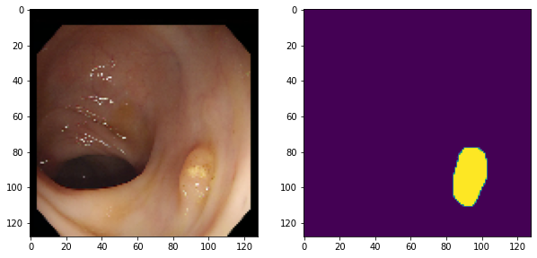

# 목차

1. 라이브러리 & 데이터 준비
2. 데이터 사전처리
3. 모델 구현 (Encoder-Decoder)
4. 모델 구현 (U Net)
5. 모델 구현 (추가항목)
6. Encoder-Decoder 실행
7. U-Net 실행
8. U-Net 개선
9. 모델 성능 비교
10. 회고

# Step 1. 라이브러리 & 데이터 준비

Step 1-1. 라이브러리 준비


```python
# 필요 라이브러리 로딩
from __future__ import absolute_import, division
from __future__ import print_function, unicode_literals

import os
import time
import shutil
import functools

import numpy as np
import matplotlib.pyplot as plt
%matplotlib inline
import matplotlib as mpl
mpl.rcParams['axes.grid'] = False
mpl.rcParams['figure.figsize'] = (12,12)

from sklearn.model_selection import train_test_split
from sklearn.metrics import confusion_matrix
import matplotlib.image as mpimg
import pandas as pd
from PIL import Image
from IPython.display import clear_output

import tensorflow as tf
import tensorflow_addons as tfa
print(tf.__version__)

from tensorflow.keras import layers
from tensorflow.keras import losses
from tensorflow.keras import models
```

    2.6.0


Step 1-2. 데이터 준비


```python
# Data Path
DATASET_PATH = os.path.join(os.getenv('HOME'), 'aiffel', 'medical')

img_dir = os.path.join(DATASET_PATH, "train")
label_dir = os.path.join(DATASET_PATH, "train_labels")

## 분할 작업에서는 입력 이미지와 해당하는 마스크(라벨) 이미지가 쌍을 이루어져야 함. 따라서 아래와 같은 작업 수행 
## 1) 각 디렉토리에서 파일 목록을 가져와 전체 경로를 포함한 리스트를 생성함
## 2) sort() 함수로 파일명을 정렬하는 하여 입력 이미지와 라벨 이미지의 순서를 일치시킴

x_train_filenames = [os.path.join(img_dir, filename) for filename in os.listdir(img_dir)]
x_train_filenames.sort()
y_train_filenames = [os.path.join(label_dir, filename) for filename in os.listdir(label_dir)]
y_train_filenames.sort()

# 사이킷런의 train_test_split을 이용해서 학습(train) 데이터와 테스트(test) 데이터를 분리
# 훈련과 테스트 파일을 8:2 의 비율로 함
x_train_filenames, x_test_filenames, y_train_filenames, y_test_filenames = \
                    train_test_split(x_train_filenames, y_train_filenames, test_size=0.2)

```


```python
# 데이터 준비 결과
num_train_examples = len(x_train_filenames)
num_test_examples = len(x_test_filenames)

print("Number of training examples: {}".format(num_train_examples))
print("Number of test examples: {}".format(num_test_examples))
```

    Number of training examples: 240
    Number of test examples: 60


Step 1-3. 데이터 시각화


```python
# 데이터 시각화
display_num = 5 ## 표시할 이미지 쌍의 개수

r_choices = np.random.choice(num_train_examples, display_num) ## 랜덤으로 이미지 인덱스 선택

plt.figure(figsize=(10, 15)) ## 전체 그래프의 크기를 가로 10, 세로 15로 설정
for i in range(0, display_num * 2, 2): ## 2씩 증가하는 이유는 원본과 마스크 이미지가 쌍으로 표시되기 때문
    img_num = r_choices[i // 2] ## 랜덤으로 선택된 이미지 번호
    x_pathname = x_train_filenames[img_num] ## 원본 이미지 경로
    y_pathname = y_train_filenames[img_num] ## 마스크 이미지 경로

    plt.subplot(display_num, 2, i + 1) ## display_num행 2열의 그리드에서 위치 지정
    plt.imshow(Image.open(x_pathname)) ## 원본 이미지 로드 및 표시
    plt.title("Original Image") ## 원본 이미지 로드 및 표시

    example_labels = Image.open(y_pathname) ## 마스크 이미지 로드
    label_vals = np.unique(example_labels) ## 마스크에 사용된 고유한 값들 확인 예) 0: 배경 (검은색) 1: 관심 영역/용종 (흰색)

    plt.subplot(display_num, 2, i + 2) ## 마스크 이미지를 위한 위치 지정
    plt.imshow(example_labels) ## 마스크 이미지 표시
    plt.title("Masked Image") ## 제목 설정
    
plt.suptitle("Examples of Images and their Masks") ## 전체 그래프의 제목 설정
plt.show() ## 그래프 표시
```


    

    


# Step 2. 데이터 사전처리

Step 2-1. 기본 하이퍼파라미터 정의


```python
# 이미지와 마스크 크기 확인
for img_path, mask_path in zip(x_train_filenames[:5], y_train_filenames[:5]):
    img = np.array(Image.open(img_path))
    mask = np.array(Image.open(mask_path))
    print(f"이미지 shape: {img.shape}, 마스크 shape: {mask.shape}")
```

    이미지 shape: (500, 574, 3), 마스크 shape: (500, 574)
    이미지 shape: (500, 574, 3), 마스크 shape: (500, 574)
    이미지 shape: (500, 574, 3), 마스크 shape: (500, 574)
    이미지 shape: (500, 574, 3), 마스크 shape: (500, 574)
    이미지 shape: (500, 574, 3), 마스크 shape: (500, 574)


```python
# Set hyperparameters
image_size = 128 ## size is changed from 256 to 128
img_shape = (image_size, image_size, 3)
batch_size = 4 ## size is changed from 8 to 4
max_epochs = 10
```

Step 2-2. 데이터 증강 함수


```python
# Processing pathname 함수
## byte 형태로 데이터를 로드하고, bmp로 디코딩함
## 디코딩이 완료된 image의 scale과 size를 조절

def _process_pathnames(fname, label_path):
    img_str = tf.io.read_file(fname)
    img = tf.image.decode_bmp(img_str, channels=3)

    label_img_str = tf.io.read_file(label_path)
    label_img = tf.image.decode_bmp(label_img_str, channels=3)
    label_img = tf.image.rgb_to_grayscale(label_img)

    resize = [image_size, image_size]
    img = tf.image.resize(img, resize)
    label_img = tf.image.resize(label_img, resize)

    scale = 1 / 255.
    img = tf.cast(img, dtype=tf.float32) * scale
    label_img = tf.cast(label_img, dtype=tf.float32) * scale

    return img, label_img
```


```python
# shift_image 함수
## This fn will perform the horizontal or vertical shift

def shift_img(output_img, label_img, width_shift_range, height_shift_range):## 입력 이미지, 라벨(마스크) 이미지, 수평 이동 범위, 수직 이동 범위
    if width_shift_range or height_shift_range: ## 수평 또는 수직 이동 범위가 지정되었는지 확인
        if width_shift_range:  ## 지정된 범위 내에서 무작위 이동 거리 생성
                width_shift_range = tf.random.uniform([],
                                                  -width_shift_range * img_shape[1],
                                                  width_shift_range * img_shape[1])
        if height_shift_range:
                height_shift_range = tf.random.uniform([],
                                                   -height_shift_range * img_shape[0],
                                                   height_shift_range * img_shape[0])
        output_img = tfa.image.translate(output_img,  ## TensorFlow Addons(tfa)의 translate 함수를 사용하여 이미지 이동
                                         [width_shift_range, height_shift_range])
        label_img = tfa.image.translate(label_img,   ## 입력 이미지와 라벨 이미지에 동일한 이동을 적용
                                        [width_shift_range, height_shift_range])
    return output_img, label_img 
```


```python
# flip_image 함수

def flip_img(horizontal_flip, tr_img, label_img): 
    if horizontal_flip:
        flip_prob = tf.random.uniform([], 0.0, 1.0)
        tr_img, label_img = tf.cond(tf.less(flip_prob, 0.5),## 50%의 확률로 좌우반전만 구현하였고, 상하반전은 적용하지 않음
                                lambda: (tf.image.flip_left_right(tr_img), tf.image.flip_left_right(label_img)),
                                lambda: (tr_img, label_img))
    return tr_img, label_img
```


```python
#Data augmentation Assembling 함수 
## 위에서 적용한 증강 함수 이외에 resize, hue_delta 도 적용함

def _augment(img,
             label_img,
             resize=None,  ## Resize the image to some size e.g. [256, 256]
             scale=1,  ## Scale image e.g. 1 / 255.
             hue_delta=0.,  ## Adjust the hue of an RGB image by random factor
             horizontal_flip=True,  ## Random left right flip,
             width_shift_range=0.05,  ## Randomly translate the image horizontally
             height_shift_range=0.05):  ## Randomly translate the image vertically 
    if resize is not None:
        ## Resize both images
        label_img = tf.image.resize(label_img, resize)
        img = tf.image.resize(img, resize)
  
    if hue_delta:
        img = tf.image.random_hue(img, hue_delta)
  
    img, label_img = flip_img(horizontal_flip, img, label_img)
    img, label_img = shift_img(img, label_img, width_shift_range, height_shift_range)
    label_img = tf.cast(label_img, dtype=tf.float32) * scale
    img = tf.cast(img, dtype=tf.float32) * scale
    return img, label_img
```

Step 2-3. 데이터 전처리를 적용한 데이터세트 만들기


```python
# get_baseline_dataset 함수
## tf.data.Dataset을 이용하여 데이터셋 배치구성, 셔플링 등을 구현
def get_baseline_dataset(filenames,
                         labels,
                         preproc_fn=functools.partial(_augment),
                         threads=4,
                         batch_size=batch_size,
                         is_train=True):
    num_x = len(filenames)
    # Create a dataset from the filenames and labels
    dataset = tf.data.Dataset.from_tensor_slices((filenames, labels))
    # Map our preprocessing function to every element in our dataset, taking
    # advantage of multithreading
    dataset = dataset.map(_process_pathnames, num_parallel_calls=threads)

    if is_train:# 학습을 진행할시에만 위에 augment를 진행합니다.
        #if preproc_fn.keywords is not None and 'resize' not in preproc_fn.keywords:
        #  assert batch_size == 1, "Batching images must be of the same size"
        dataset = dataset.map(preproc_fn, num_parallel_calls=threads)
        dataset = dataset.shuffle(num_x * 10)

    dataset = dataset.batch(batch_size)
    return dataset
```


```python
# 데이터세트 결과물
train_dataset = get_baseline_dataset(x_train_filenames, # 학습 데이터
                                     y_train_filenames) # 정답 데이터
train_dataset = train_dataset.repeat()
test_dataset = get_baseline_dataset(x_test_filenames,
                                    y_test_filenames,
                                    is_train=False)
train_dataset
```


    <RepeatDataset shapes: ((None, 128, 128, 3), (None, 128, 128, 1)), types: (tf.float32, tf.float32)>


Step 2-4. 전처리된 데이터 세트 확인


```python
for images, labels in train_dataset.take(2):
    plt.figure(figsize=(10, 10))
    img = images[0]

    plt.subplot(1, 2, 1)
    plt.imshow(img)

    plt.subplot(1, 2, 2)
    plt.imshow(labels[0, :, :, 0])
    plt.show()
```


    

    


    

    


# Step 4. 모델 구현 (U-Net)


```python
# Model subclassing을 활용한 구현
## Sequential 구조가 아닌 네트워크를 만들 때 쓸 수 있는 API 가 바로 tf.keras functional API

class Conv(tf.keras.Model):
    def __init__(self, num_filters, kernel_size):
        super(Conv, self).__init__()
        self.conv = layers.Conv2D(num_filters, kernel_size, padding='same')
        self.bn = layers.BatchNormalization()

    def call(self, inputs, training=True):
        x = self.conv(inputs)
        x = self.bn(x, training=training)
        x = layers.ReLU()(x)

        return x
```


```python
# ConvBlock / EncoderBlock / DecoderBlock 함수
class ConvBlock(tf.keras.Model):
    def __init__(self, num_filters):
        super(ConvBlock, self).__init__()
        self.conv1 = Conv(num_filters, 3)
        self.conv2 = Conv(num_filters * 2, 3)

    def call(self, inputs, training=True):
        encoder = self.conv1(inputs, training=training)
        encoder = self.conv2(encoder, training=training)

        return encoder

class ConvBlock_R(tf.keras.Model):
    def __init__(self, num_filters):
        super(ConvBlock_R, self).__init__()
        self.conv1 = Conv(num_filters, 3)
        self.conv2 = Conv(num_filters, 3)

    def call(self, inputs, training=True):
        decoder = self.conv1(inputs, training=training)
        decoder = self.conv2(decoder, training=training)

        return decoder


class EncoderBlock(tf.keras.Model):
    def __init__(self, num_filters):
        super(EncoderBlock, self).__init__()
        self.conv_block = ConvBlock(num_filters)
        self.encoder_pool = layers.MaxPool2D()

    def call(self, inputs, training=True):
        encoder = self.conv_block(inputs, training=training)
        encoder_pool = self.encoder_pool(encoder)

        return encoder_pool, encoder


class DecoderBlock(tf.keras.Model):
    def __init__(self, num_filters):
        super(DecoderBlock, self).__init__()
        self.convT = layers.Conv2DTranspose(num_filters, 3, strides=2, padding='same')
        self.bn = layers.BatchNormalization()
        self.conv_block_r = ConvBlock_R(num_filters)

    def call(self, input_tensor, concat_tensor, training=True):
        decoder = self.convT(input_tensor)            
        decoder = self.bn(decoder, training=training)
        decoder = layers.ReLU()(decoder)
        decoder = tf.concat([decoder, concat_tensor], axis=-1)
        decoder = self.conv_block_r(decoder, training=training)

        return decoder
```


```python
# UNet 함수
class UNet(tf.keras.Model):
    def __init__(self):
        super(UNet, self).__init__()
        self.encoder_block1 = EncoderBlock(64)
        self.encoder_block2 = EncoderBlock(128)
        self.encoder_block3 = EncoderBlock(256)
        self.encoder_block4 = EncoderBlock(512)

        self.center = ConvBlock(1024)

        self.decoder_block4 = DecoderBlock(512)
        self.decoder_block3 = DecoderBlock(256)
        self.decoder_block2 = DecoderBlock(128)
        self.decoder_block1 = DecoderBlock(64)

        self.output_conv = layers.Conv2D(1, 1, activation='sigmoid')

    def call(self, inputs, training=True):
        encoder1_pool, encoder1 = self.encoder_block1(inputs)
        encoder2_pool, encoder2 = self.encoder_block2(encoder1_pool)
        encoder3_pool, encoder3 = self.encoder_block3(encoder2_pool)
        encoder4_pool, encoder4 = self.encoder_block4(encoder3_pool)

        center = self.center(encoder4_pool)

        decoder4 = self.decoder_block4(center, encoder4)
        decoder3 = self.decoder_block3(decoder4, encoder3)
        decoder2 = self.decoder_block2(decoder3, encoder2)
        decoder1 = self.decoder_block1(decoder2, encoder1)

        outputs = self.output_conv(decoder1)

        return outputs
```


```python
# UNet 함수
unet_model = UNet()
```

# 5. 모델 구현 (추가항목)

Step 5-1 metrics과 loss functions 정의하기


```python
# Dice coefficient 함수
def dice_coeff(y_true, y_pred):
    smooth = 1e-10
    # Flatten
    y_true_f = tf.reshape(y_true, [-1])
    y_pred_f = tf.reshape(y_pred, [-1])
    intersection = tf.reduce_sum(y_true_f * y_pred_f)
    score = (2. * intersection + smooth) / (tf.reduce_sum(tf.square(y_true_f)) + \
                                            tf.reduce_sum(tf.square(y_pred_f)) + smooth)

    return score
```


```python
# Dice Loss 함수
def dice_loss(y_true, y_pred):
    loss = 1 - dice_coeff(y_true, y_pred)
    return loss
```


```python
# bce_dice_loss 함수
## 기존에 사용하였던 Binary crossentropy loss와 새로 구현한 Dice loss를 더하는 방식임
def bce_dice_loss(y_true, y_pred):
    loss = tf.reduce_mean(losses.binary_crossentropy(y_true, y_pred)) + \
          dice_loss(y_true, y_pred)
    return loss
```


```python
# 옵티마이저 선택
optimizer = tf.keras.optimizers.Adam() # 기본 Learning rate 사용
```

# Step 7. U-Net

Step 7-1. 모델 선택 및 사전 준비


```python
# U-Net 모델 선택

print('select the U-Net model')
model = unet_model
checkpoint_dir =os.path.join(DATASET_PATH,'train_ckpt/unet_model')
```

    select the U-Net model


```python
# U-Net 모델 컴파일
model.compile(optimizer=optimizer, loss=bce_dice_loss, metrics=[dice_loss])
predictions = model(tf.random.normal([batch_size, image_size, image_size, 3]))
print(predictions.shape)
```

    (4, 128, 128, 1)


```python
model.summary()
```

    Model: "u_net"
    _________________________________________________________________
    Layer (type)                 Output Shape              Param #   
    =================================================================
    encoder_block (EncoderBlock) multiple                  76416     
    _________________________________________________________________
    encoder_block_1 (EncoderBloc multiple                  444288    
    _________________________________________________________________
    encoder_block_2 (EncoderBloc multiple                  1773312   
    _________________________________________________________________
    encoder_block_3 (EncoderBloc multiple                  7085568   
    _________________________________________________________________
    conv_block_4 (ConvBlock)     multiple                  28326912  
    _________________________________________________________________
    decoder_block (DecoderBlock) multiple                  18882048  
    _________________________________________________________________
    decoder_block_1 (DecoderBloc multiple                  3542784   
    _________________________________________________________________
    decoder_block_2 (DecoderBloc multiple                  886656    
    _________________________________________________________________
    decoder_block_3 (DecoderBloc multiple                  222144    
    _________________________________________________________________
    conv2d_18 (Conv2D)           multiple                  65        
    =================================================================
    Total params: 61,240,193
    Trainable params: 61,222,529
    Non-trainable params: 17,664
    _________________________________________________________________


```python
# Call-back 
if not os.path.isdir(checkpoint_dir):
    os.makedirs(checkpoint_dir)

cp_callback = tf.keras.callbacks.ModelCheckpoint(checkpoint_dir,
                                                 save_weights_only=True,
                                                 monitor='val_loss',
                                                 mode='auto',
                                                 save_best_only=True,
                                                 verbose=0)
```


```python
# LearningRateScheduler callback 함수
cos_decay = tf.keras.experimental.CosineDecay(1e-3, 
                                              max_epochs)
lr_callback = tf.keras.callbacks.LearningRateScheduler(cos_decay, verbose=1)
```


```python
## Define print function
def print_images():
    for test_images, test_labels in test_dataset.take(2):
        predictions = model(test_images, training=False)

        plt.figure(figsize=(10, 20))
        plt.subplot(1, 3, 1)
        plt.imshow(test_images[0,: , :, :])
        plt.title("Input image")

        plt.subplot(1, 3, 2)
        plt.imshow(test_labels[0, :, :, 0])
        plt.title("Actual Mask")

        plt.subplot(1, 3, 3)
        plt.imshow(predictions[0, :, :, 0])
        plt.title("Predicted Mask")
        plt.show()
```

Step 7-2. 모델 훈련


```python
# 모델 학습시키기
history = model.fit(train_dataset,
                    epochs=max_epochs,    # 10
                    steps_per_epoch=num_train_examples//batch_size,
                    validation_data=test_dataset,
                    validation_steps=num_test_examples//batch_size,
                    callbacks=[cp_callback, lr_callback]
                    )
```

    Epoch 1/10
    
    Epoch 00001: LearningRateScheduler setting learning rate to tf.Tensor(0.001, shape=(), dtype=float32).
    60/60 [==============================] - 16s 175ms/step - loss: 1.0000 - dice_loss: 0.7118 - val_loss: 11.5328 - val_dice_loss: 0.9984
    Epoch 2/10
    
    Epoch 00002: LearningRateScheduler setting learning rate to tf.Tensor(0.00097552827, shape=(), dtype=float32).
    60/60 [==============================] - 11s 168ms/step - loss: 0.8933 - dice_loss: 0.6829 - val_loss: 1.0362 - val_dice_loss: 0.8080
    Epoch 3/10
    
    Epoch 00003: LearningRateScheduler setting learning rate to tf.Tensor(0.0009045085, shape=(), dtype=float32).
    60/60 [==============================] - 11s 171ms/step - loss: 0.8833 - dice_loss: 0.6812 - val_loss: 11.3236 - val_dice_loss: 1.0000
    Epoch 4/10
    
    Epoch 00004: LearningRateScheduler setting learning rate to tf.Tensor(0.00079389266, shape=(), dtype=float32).
    60/60 [==============================] - 11s 174ms/step - loss: 0.8124 - dice_loss: 0.6261 - val_loss: 7.5319 - val_dice_loss: 0.8629
    Epoch 5/10
    
    Epoch 00005: LearningRateScheduler setting learning rate to tf.Tensor(0.0006545085, shape=(), dtype=float32).
    60/60 [==============================] - 11s 175ms/step - loss: 0.7727 - dice_loss: 0.5977 - val_loss: 8.4274 - val_dice_loss: 0.8763
    Epoch 6/10
    
    Epoch 00006: LearningRateScheduler setting learning rate to tf.Tensor(0.00049999997, shape=(), dtype=float32).
    60/60 [==============================] - 11s 173ms/step - loss: 0.7580 - dice_loss: 0.5868 - val_loss: 3.5772 - val_dice_loss: 0.8347
    Epoch 7/10
    
    Epoch 00007: LearningRateScheduler setting learning rate to tf.Tensor(0.00034549143, shape=(), dtype=float32).
    60/60 [==============================] - 11s 172ms/step - loss: 0.6781 - dice_loss: 0.5209 - val_loss: 0.7679 - val_dice_loss: 0.5594
    Epoch 8/10
    
    Epoch 00008: LearningRateScheduler setting learning rate to tf.Tensor(0.00020610739, shape=(), dtype=float32).
    60/60 [==============================] - 11s 169ms/step - loss: 0.6213 - dice_loss: 0.4792 - val_loss: 0.7471 - val_dice_loss: 0.5556
    Epoch 9/10
    
    Epoch 00009: LearningRateScheduler setting learning rate to tf.Tensor(9.549147e-05, shape=(), dtype=float32).
    60/60 [==============================] - 11s 172ms/step - loss: 0.5843 - dice_loss: 0.4459 - val_loss: 0.6907 - val_dice_loss: 0.5379
    Epoch 10/10
    
    Epoch 00010: LearningRateScheduler setting learning rate to tf.Tensor(2.4471761e-05, shape=(), dtype=float32).
    60/60 [==============================] - 11s 175ms/step - loss: 0.5555 - dice_loss: 0.4246 - val_loss: 0.5978 - val_dice_loss: 0.4637


```python
# print sample image after training
print_images()
```


    

    


    

    


```python
# 학습진행과정 시각화
dice_loss = history.history['dice_loss']
loss = history.history['loss']
val_dice_loss = history.history['val_dice_loss']
val_loss = history.history['val_loss']

epochs_range = range(max_epochs)

plt.figure(figsize=(8, 8))
plt.subplot(1, 2, 1)
plt.plot(epochs_range, loss, label='Loss')
plt.plot(epochs_range, dice_loss, label='Dice Loss')
plt.legend(loc='upper right')
plt.title('Train Loss')

plt.subplot(1, 2, 2)
plt.plot(epochs_range, val_loss, label='Val Loss')
plt.plot(epochs_range, val_dice_loss, label='Val Dice Loss')
plt.legend(loc='upper right')
plt.title('Valid Loss')
plt.show()
```


    

    


```python
# 저장된 모델의 가중치 불러오기
checkpoint_dir = os.path.join(DATASET_PATH, 'unet_ckpt/unet_model')

# restoring the latest checkpoint in checkpoint_dir
model.load_weights(checkpoint_dir)
```


    <tensorflow.python.training.tracking.util.CheckpointLoadStatus at 0x79d115f10f10>


Step 7-3. 모델 평가


```python
# mean_iou metrics
def mean_iou(y_true, y_pred, num_classes=2): ## meanIoU란 각 이미지의 IoU 값을 평균 낸 값임. IoU = Area of Interst / Area of Union
    # Flatten  
    y_true_f = tf.reshape(y_true, [-1])
    y_pred_f = tf.reshape(y_pred, [-1])

    y_true_f = tf.cast(tf.round(y_true_f), dtype=tf.int32).numpy()
    y_pred_f = tf.cast(tf.round(y_pred_f), dtype=tf.int32).numpy()

    # calculate confusion matrix
    labels = list(range(num_classes))
    current = confusion_matrix(y_true_f, y_pred_f, labels=labels)

    # compute mean iou
    intersection = np.diag(current)
    ground_truth_set = current.sum(axis=1)
    predicted_set = current.sum(axis=0)
    union = ground_truth_set + predicted_set - intersection

    IoU = intersection / union.astype(np.float32)
    return np.mean(IoU)
```


```python
# Evaulation (by meam_IOU metrics)
mean = []

for images, labels in test_dataset:
    predictions = model(images, training=False)
    m = mean_iou(labels, predictions)
    mean.append(m)

mean = np.array(mean)
mean = np.mean(mean)
print("mean_iou: {}".format(mean))
```

    mean_iou: 0.6596004718512136


```python
## Define print function
def print_images():
    for test_images, test_labels in test_dataset.take(1):
        predictions = model(test_images, training=False)

        for i in range(batch_size):
            plt.figure(figsize=(10, 20))
            plt.subplot(1, 3, 1)
            plt.imshow(test_images[i,: , :, :])
            plt.title("Input image")

            plt.subplot(1, 3, 2)
            plt.imshow(test_labels[i, :, :, 0])
            plt.title("Actual Mask")

            plt.subplot(1, 3, 3)
            plt.imshow(predictions[i, :, :, 0])
            plt.title("Predicted Mask")
            plt.show()
```


```python
print_images()
```


    

    


    

    


    

    


    

    


    

    


    

    


    

    


    

    


# Step 8. U-Net 개선


```python
# 라이브러리 확인
import tensorflow
import sklearn
import numpy

print(tensorflow.__version__)
print(sklearn.__version__)
print(numpy.__version__)
```

    2.6.0
    1.0
    1.21.4


Step 8-1. Encoder를 pretrained 모델 VGG16) 로 변경


```python

```


```python
# VGG 모델 리뷰
vgg16 = tf.keras.applications.VGG16(input_shape=img_shape,
                                         include_top=False,
                                         weights='imagenet')
layer_outputs = [layer.output for layer in vgg16.layers]
layer_outputs
```


    [<KerasTensor: shape=(None, 128, 128, 3) dtype=float32 (created by layer 'input_11')>,
     <KerasTensor: shape=(None, 128, 128, 64) dtype=float32 (created by layer 'block1_conv1')>,
     <KerasTensor: shape=(None, 128, 128, 64) dtype=float32 (created by layer 'block1_conv2')>,
     <KerasTensor: shape=(None, 64, 64, 64) dtype=float32 (created by layer 'block1_pool')>,
     <KerasTensor: shape=(None, 64, 64, 128) dtype=float32 (created by layer 'block2_conv1')>,
     <KerasTensor: shape=(None, 64, 64, 128) dtype=float32 (created by layer 'block2_conv2')>,
     <KerasTensor: shape=(None, 32, 32, 128) dtype=float32 (created by layer 'block2_pool')>,
     <KerasTensor: shape=(None, 32, 32, 256) dtype=float32 (created by layer 'block3_conv1')>,
     <KerasTensor: shape=(None, 32, 32, 256) dtype=float32 (created by layer 'block3_conv2')>,
     <KerasTensor: shape=(None, 32, 32, 256) dtype=float32 (created by layer 'block3_conv3')>,
     <KerasTensor: shape=(None, 16, 16, 256) dtype=float32 (created by layer 'block3_pool')>,
     <KerasTensor: shape=(None, 16, 16, 512) dtype=float32 (created by layer 'block4_conv1')>,
     <KerasTensor: shape=(None, 16, 16, 512) dtype=float32 (created by layer 'block4_conv2')>,
     <KerasTensor: shape=(None, 16, 16, 512) dtype=float32 (created by layer 'block4_conv3')>,
     <KerasTensor: shape=(None, 8, 8, 512) dtype=float32 (created by layer 'block4_pool')>,
     <KerasTensor: shape=(None, 8, 8, 512) dtype=float32 (created by layer 'block5_conv1')>,
     <KerasTensor: shape=(None, 8, 8, 512) dtype=float32 (created by layer 'block5_conv2')>,
     <KerasTensor: shape=(None, 8, 8, 512) dtype=float32 (created by layer 'block5_conv3')>,
     <KerasTensor: shape=(None, 4, 4, 512) dtype=float32 (created by layer 'block5_pool')>]


```python
# VGG16을 Encoder로 활용하여 개선한 새로운 모델 클래스

## Set hyperparameters
max_epochs = 10
img_shape = (128, 128, 3)

class Vgg16UNet(tf.keras.Model):
    def __init__(self):
        super(Vgg16UNet, self).__init__()
        self.vgg16 = tf.keras.applications.VGG16(input_shape=img_shape,
                                         include_top=False,
                                         weights='imagenet')
        layer_outputs = [layer.output for layer in self.vgg16.layers]
        self.vgg16_act = models.Model(inputs=self.vgg16.input, 
                                      outputs=[layer_outputs[2], 
                                               layer_outputs[5], 
                                               layer_outputs[9], 
                                               layer_outputs[13], 
                                               layer_outputs[17]])


        self.center = ConvBlock(1024)

        self.decoder_block4 = DecoderBlock(512)
        self.decoder_block3 = DecoderBlock(256)
        self.decoder_block2 = DecoderBlock(128)
        self.decoder_block1 = DecoderBlock(64)

        self.output_conv = layers.Conv2D(1, 1, activation='sigmoid')

    def call(self, inputs, training=True):

        encoder1, encoder2, encoder3, encoder4, center = self.vgg16_act(inputs) 

        decoder4 = self.decoder_block4(center, encoder4)
        decoder3 = self.decoder_block3(decoder4, encoder3)
        decoder2 = self.decoder_block2(decoder3, encoder2)
        decoder1 = self.decoder_block1(decoder2, encoder1)
        
        outputs = self.output_conv(decoder1)

        return outputs
    
```


```python
# 모델 빌드를 위한 더미 입력
dummy_input = tf.zeros((1,) + img_shape)  # 배치 크기 1인 더미 입력
_ = model(dummy_input)  # 모델 빌드
```


```python
#Metrics and Loss definition

## Dice coefficient 함수
def dice_coeff(y_true, y_pred):
    smooth = 1e-10
    # Flatten
    y_true_f = tf.reshape(y_true, [-1])
    y_pred_f = tf.reshape(y_pred, [-1])
    intersection = tf.reduce_sum(y_true_f * y_pred_f)
    score = (2. * intersection + smooth) / (tf.reduce_sum(tf.square(y_true_f)) + \
                                            tf.reduce_sum(tf.square(y_pred_f)) + smooth)

    return score

# Dice Loss 함수
def dice_loss(y_true, y_pred):
    loss = 1 - dice_coeff(y_true, y_pred)
    return loss

# bce_dice_loss 함수
## 기존에 사용하였던 Binary crossentropy loss와 새로 구현한 Dice loss를 더하는 방식임
def bce_dice_loss(y_true, y_pred):
    loss = tf.reduce_mean(losses.binary_crossentropy(y_true, y_pred)) + \
          dice_loss(y_true, y_pred)
    return loss
```


```python
# VGG16_UNet 모델
vgg16unet_model = Vgg16UNet()
```


```python
model = vgg16unet_model
checkpoint_dir =os.path.join(DATASET_PATH,'train_ckpt/vgg16unet_model')
```


```python
# 모델 컴파일
model.compile(optimizer=optimizer, loss=bce_dice_loss, metrics=[dice_loss])
predictions = model(tf.random.normal([batch_size, image_size, image_size, 3]))
print(predictions.shape)
```

    (4, 128, 128, 1)


```python
model.summary()
```

    Model: "vgg16u_net_12"
    _________________________________________________________________
    Layer (type)                 Output Shape              Param #   
    =================================================================
    vgg16 (Functional)           (None, 4, 4, 512)         14714688  
    _________________________________________________________________
    model_12 (Functional)        [(None, 128, 128, 64), (N 14714688  
    _________________________________________________________________
    conv_block_17 (ConvBlock)    multiple                  0 (unused)
    _________________________________________________________________
    decoder_block_52 (DecoderBlo multiple                  9444864   
    _________________________________________________________________
    decoder_block_53 (DecoderBlo multiple                  2952960   
    _________________________________________________________________
    decoder_block_54 (DecoderBlo multiple                  739200    
    _________________________________________________________________
    decoder_block_55 (DecoderBlo multiple                  185280    
    _________________________________________________________________
    conv2d_161 (Conv2D)          multiple                  65        
    =================================================================
    Total params: 28,037,057
    Trainable params: 28,031,297
    Non-trainable params: 5,760
    _________________________________________________________________


Step 8-2. 모델 훈련


```python
# 모델 학습
history = model.fit(train_dataset,
                    epochs=max_epochs,    # 10
                    steps_per_epoch=num_train_examples//batch_size,
                    validation_data=test_dataset,
                    validation_steps=num_test_examples//batch_size,
                    callbacks=[cp_callback, lr_callback]
                    )
```

    Epoch 1/10
    
    Epoch 00001: LearningRateScheduler setting learning rate to tf.Tensor(0.001, shape=(), dtype=float32).
    60/60 [==============================] - 9s 103ms/step - loss: 0.9557 - dice_loss: 0.7165 - val_loss: 4.8412 - val_dice_loss: 1.0000
    Epoch 2/10
    
    Epoch 00002: LearningRateScheduler setting learning rate to tf.Tensor(0.00097552827, shape=(), dtype=float32).
    60/60 [==============================] - 6s 96ms/step - loss: 0.8733 - dice_loss: 0.6806 - val_loss: 1.0912 - val_dice_loss: 0.8776
    Epoch 3/10
    
    Epoch 00003: LearningRateScheduler setting learning rate to tf.Tensor(0.0009045085, shape=(), dtype=float32).
    60/60 [==============================] - 6s 96ms/step - loss: 0.8362 - dice_loss: 0.6497 - val_loss: 1.2142 - val_dice_loss: 0.9701
    Epoch 4/10
    
    Epoch 00004: LearningRateScheduler setting learning rate to tf.Tensor(0.00079389266, shape=(), dtype=float32).
    60/60 [==============================] - 7s 97ms/step - loss: 0.8102 - dice_loss: 0.6294 - val_loss: 0.9599 - val_dice_loss: 0.7418
    Epoch 5/10
    
    Epoch 00005: LearningRateScheduler setting learning rate to tf.Tensor(0.0006545085, shape=(), dtype=float32).
    60/60 [==============================] - 7s 98ms/step - loss: 0.7794 - dice_loss: 0.6072 - val_loss: 1.1253 - val_dice_loss: 0.9236
    Epoch 6/10
    
    Epoch 00006: LearningRateScheduler setting learning rate to tf.Tensor(0.00049999997, shape=(), dtype=float32).
    60/60 [==============================] - 7s 98ms/step - loss: 0.7331 - dice_loss: 0.5686 - val_loss: 1.2034 - val_dice_loss: 0.9705
    Epoch 7/10
    
    Epoch 00007: LearningRateScheduler setting learning rate to tf.Tensor(0.00034549143, shape=(), dtype=float32).
    60/60 [==============================] - 7s 98ms/step - loss: 0.6997 - dice_loss: 0.5425 - val_loss: 1.2018 - val_dice_loss: 0.9704
    Epoch 8/10
    
    Epoch 00008: LearningRateScheduler setting learning rate to tf.Tensor(0.00020610739, shape=(), dtype=float32).
    60/60 [==============================] - 7s 98ms/step - loss: 0.6613 - dice_loss: 0.5118 - val_loss: 1.1900 - val_dice_loss: 0.9628
    Epoch 9/10
    
    Epoch 00009: LearningRateScheduler setting learning rate to tf.Tensor(9.549147e-05, shape=(), dtype=float32).
    60/60 [==============================] - 7s 99ms/step - loss: 0.6236 - dice_loss: 0.4815 - val_loss: 1.1423 - val_dice_loss: 0.9315
    Epoch 10/10
    
    Epoch 00010: LearningRateScheduler setting learning rate to tf.Tensor(2.4471761e-05, shape=(), dtype=float32).
    60/60 [==============================] - 7s 99ms/step - loss: 0.6116 - dice_loss: 0.4740 - val_loss: 1.0533 - val_dice_loss: 0.8630


```python
# 학습진행과정 시각화
dice_loss = history.history['dice_loss']
loss = history.history['loss']
val_dice_loss = history.history['val_dice_loss']
val_loss = history.history['val_loss']

epochs_range = range(max_epochs)

plt.figure(figsize=(8, 8))
plt.subplot(1, 2, 1)
plt.plot(epochs_range, loss, label='Loss')
plt.plot(epochs_range, dice_loss, label='Dice Loss')
plt.legend(loc='upper right')
plt.title('Train Loss')

plt.subplot(1, 2, 2)
plt.plot(epochs_range, val_loss, label='Val Loss')
plt.plot(epochs_range, val_dice_loss, label='Val Dice Loss')
plt.legend(loc='upper right')
plt.title('Valid Loss')
plt.show()
```


    

    


Step 8-3. 모델 평가


```python
# mean_iou metrics
def mean_iou(y_true, y_pred, num_classes=2): ## meanIoU란 각 이미지의 IoU 값을 평균 낸 값임. IoU = Area of Interst / Area of Union
    # Flatten  
    y_true_f = tf.reshape(y_true, [-1])
    y_pred_f = tf.reshape(y_pred, [-1])

    y_true_f = tf.cast(tf.round(y_true_f), dtype=tf.int32).numpy()
    y_pred_f = tf.cast(tf.round(y_pred_f), dtype=tf.int32).numpy()

    # calculate confusion matrix
    labels = list(range(num_classes))
    current = confusion_matrix(y_true_f, y_pred_f, labels=labels)

    # compute mean iou
    intersection = np.diag(current)
    ground_truth_set = current.sum(axis=1)
    predicted_set = current.sum(axis=0)
    union = ground_truth_set + predicted_set - intersection

    IoU = intersection / union.astype(np.float32)
    return np.mean(IoU)
```


```python
# Evaulation (by meam_IOU metrics)
mean = []

for images, labels in test_dataset:
    predictions = model(images, training=False)
    m = mean_iou(labels, predictions)
    mean.append(m)

mean = np.array(mean)
mean = np.mean(mean)
print("mean_iou: {}".format(mean))
```

    mean_iou: 0.48055966251077636


```python
## Define print function
def print_images():
    for test_images, test_labels in test_dataset.take(1):
        predictions = model(test_images, training=False)

        for i in range(batch_size):
            plt.figure(figsize=(10, 20))
            plt.subplot(1, 3, 1)
            plt.imshow(test_images[i,: , :, :])
            plt.title("Input image")

            plt.subplot(1, 3, 2)
            plt.imshow(test_labels[i, :, :, 0])
            plt.title("Actual Mask")

            plt.subplot(1, 3, 3)
            plt.imshow(predictions[i, :, :, 0])
            plt.title("Predicted Mask")
            plt.show()
```


```python
print_images()
```


    

    


    

    


    

    


    

    


# Step 9. 모델 성능 비교

# Step 10. 회고
